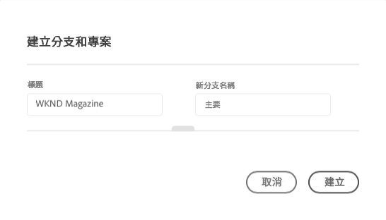
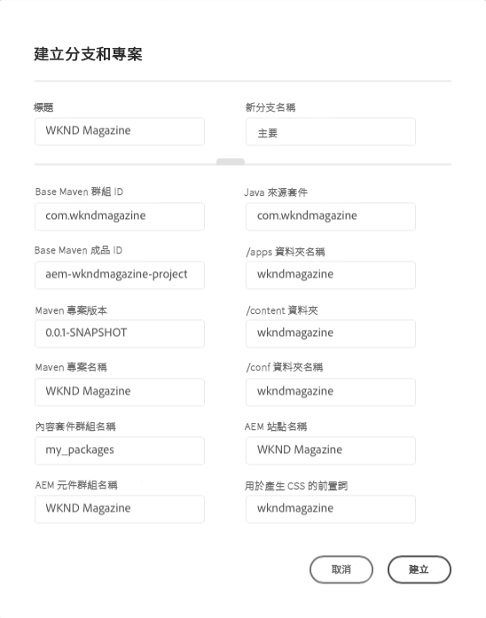
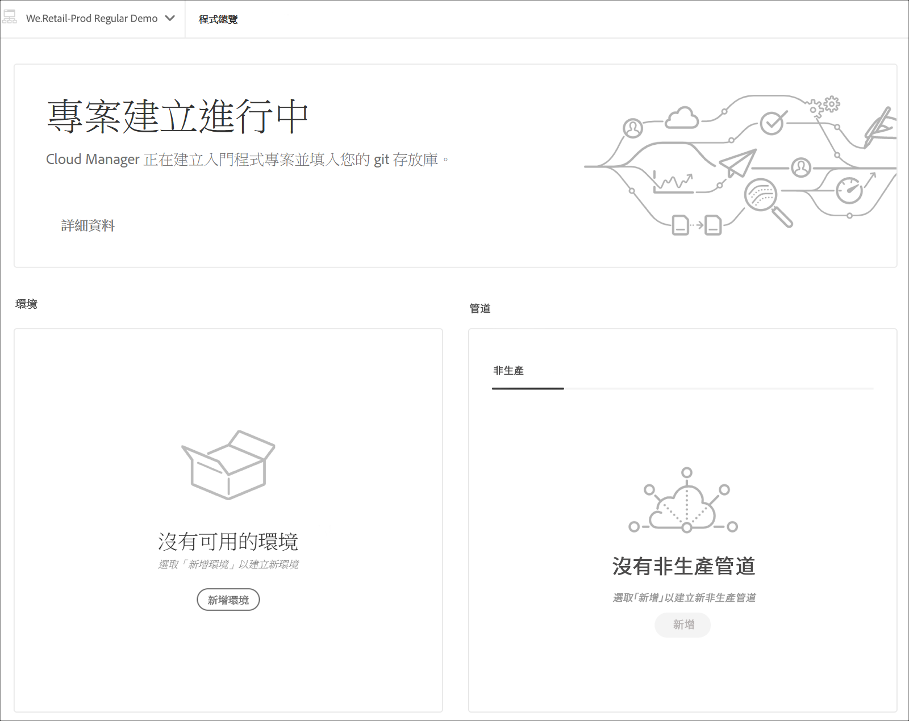
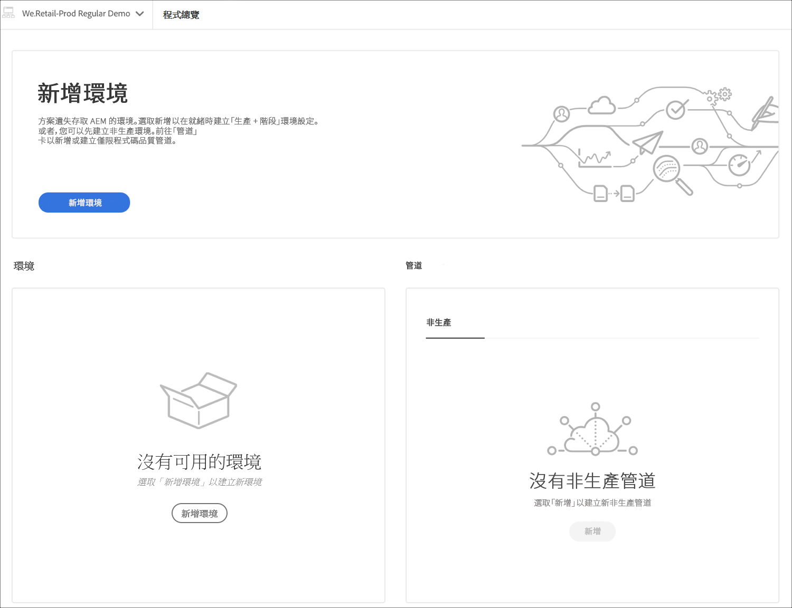

# 項目建立嚮導 {#project-creation-wizard}

建立生產方案後，Cloud Manager會提供精靈，以根據 [AEM專案原型](https://experienceleague.adobe.com/docs/experience-manager-core-components/using/developing/archetype/overview.html) 快速開始。

請依照下列步驟，使用精靈在Cloud Manager中建立AEM應用程式專案。

1. 按照文檔中的步驟建立生產程式 [建立生產計畫](creating-production-programs.md)

1. 程式設定完成後，請訪問 **概述** 程式的螢幕，並查看 **建立分支和專案** 頂端的「動作呼叫」卡片。

   

1. 按一下 **建立** 啟動嚮導並確認項目 **標題** 和 **新分支名稱** 在 **建立分支和專案** 窗口。

   

1. （可選）按一下分隔線以顯示專案的其他參數。 預設值由AEM專案原型提供，通常不需要變更。

   

1. 按一下 **建立** 以啟動項目建立過程。

A **正在建立項目** 卡片現已取代 **建立分支和專案** 動作呼叫卡為 **計畫概述** 螢幕。

程式建立完成後， **新增環境** 卡片取代 **正在建立項目** 卡片 **計畫概述** 螢幕。

您現在的Git存放庫新增了以AEM原型為基礎的AEM專案，可作為您專案開發的基礎。 接下來，您可以建立環境，在其中部署專案程式碼。

請參閱該文檔 [管理環境](/help/implementing/cloud-manager/manage-environments.md) 了解如何新增或管理環境。

>[!NOTE]
>
>嚮導僅適用於生產程式。 因為 [沙箱方案](introduction-sandbox-programs.md#auto-creation) 包括自動建立項目，不需要嚮導。