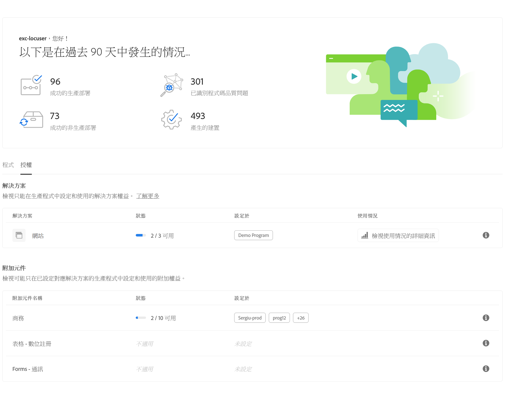

# 許可證儀表板 {#license-dashboard}

Cloud Manager提供了一個儀表板，可以輕鬆查看您的組織或租戶可用的AEMaaCS產品權利。

## 概觀 {#overview}

Cloud Manager許可證儀表板可方便地訪問以下資訊：

1. 所有程式（包括已使用的和可用的）都可為您提供的解決方案權利
1. 站點解決方案的內容請求消耗量指標按月趨勢

## 使用許可證儀表板 {#using-dashboard}

要訪問您的許可證儀表板，請執行以下步驟。

>[!NOTE]
>
>中的用戶 **業務所有者** 必須登錄角色才能查看許可證儀表板。

1. 登錄到Cloud Manager(位於 [my.cloudmanager.adobe.com](https://my.cloudmanager.adobe.com/) 並選擇相應的組織。

1. 在產品概述頁面上，切換到 **許可證** 頁籤。

儀表板分為三個部分，顯示您：

* **解決方案**  — 本節概括介紹了您已許可的解決方案，如站點或資產。
* **載入項**  — 本節概括介紹了您已提供的許可解決方案的哪些附加模組。
* **沙盒和開發環境**  — 本節概述您可用的環境。

每個部分都總結了可用的內容以及當前使用方式（如果有）。 當前，即使租戶中存在其他解決方案，也只顯示站點解決方案。

* 的 **狀態** 列顯示租戶的未使用權利與可用權利總數。
* 的 **配置於** 列指示已應用解決方案權利的程式。
   * 僅當建立了生產環境或已存在更新管道時，才會將權利視為使用。
* 的 **用法** 列將過去12個月中按一下的內容請求顯示為圖形。

>[!TIP]
>
>請參閱 [Admin Console概述](https://helpx.adobe.com/enterprise/using/admin-console.html) 瞭解如何從Adobe中管理整個組織的Admin Console權利。

## 常見問答 {#faq}

### 什麼是內容請求？ {#what-is-a-content-request}

內容請求是進入AEM Sites或任何客戶提供的快取系統（例如內容傳遞網路）以HTML格式作為頁面視圖或JSON格式作為API調用來傳遞內容或資料的請求。

在第一快取系統的入口處測量每個頁面視圖或每五個API調用的一個內容請求以接收內容請求。

內容請求排除由Adobe發起或代表其發起的僅用於提供產品和服務的請求或活動。 Adobe識別的來自與普通搜索引擎和社交媒體服務相關的機器人、爬蟲和蜘蛛的用戶代理通信也被排除。

### Adobe Experience Manager如何衡量內容請求？ {#how-are-content-requests-measured}

在Cloud Service中跟蹤內容請求。 CDN內置到as a Cloud ServiceAEM跟蹤有效HTML和JSON請求。 還AEM制定了排除知名bot的規則，包括定期訪問網站以更新搜索索引或服務的知名服務。

以下是排除的知名服務實例的非詳盡清單。

* AddSearchBot
* AhrefsBot
* 阿普爾博特
* 詢問Jeeves公司蜘蛛
* 賓博特
* 必應預覽
* 布萊克斯布
* 使用
* 白蜘蛛
* 爬蟲坑
* Facebookexternalhit
* GoogleAdsBot
* GoogleAdsBot移動

### 為什麼我的分析報告顯示的結果與內容請AEM求不同？ {#why-are-reports-different}

內容請求將與本表中匯總的組織的分析報告工具存在差異。

| 差異原因 | 解釋 |
|---|---|
| 標記 | 跟蹤為內容請求AEM的所有頁面都可能標籤分析跟蹤。 作為內容請求跟蹤的所AEM有API調用將不會由組織的分析工具進行標籤。 可以標籤頁面或API調用以跟蹤操作而不是視圖。 |
| Tag Management規則 | 標籤管理規則設定可能導致頁面上的各種資料收集配置，導致內容請求跟蹤與差異的某種組合。 |
| 機器人 | 未預先識別和刪除的未知Bot可能AEM導致跟蹤差異。 |
| 報表套裝 | 屬於同一實例和域的AEM頁面可能會將資料發送到不同的分析報告套件。 |
| 第三方監控和安全工具 | 監視和安全掃描工具可能生成分析報AEM告中未跟蹤的內容請求。 |
| 預回遷請求 | 使用預回遷服務預載入頁以提高速度可能會導致內容請求流量顯著增加。 |
| DDOS | 雖然Adobe會盡其所能自動檢測並過濾掉DDOS攻擊中的流量，但無法保證會檢測到所有可能的DDOS攻擊。 |

### 如果我使用自己的CDN怎麼辦？ {#using-own-cdn}

雲管理器中的內容請求儀表板不會顯示您自己的CDN的跟蹤。
