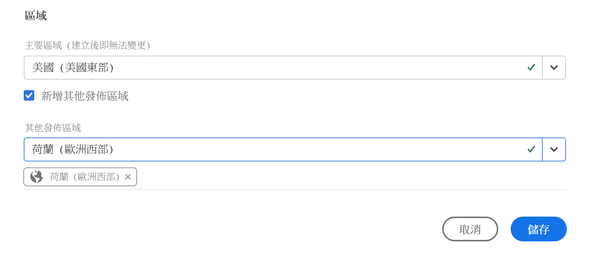
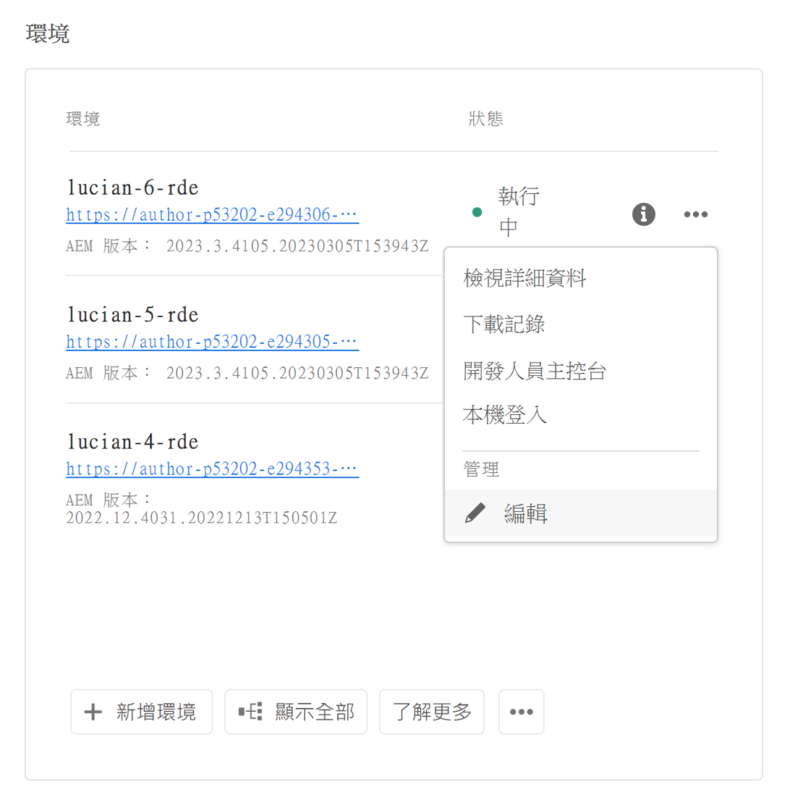
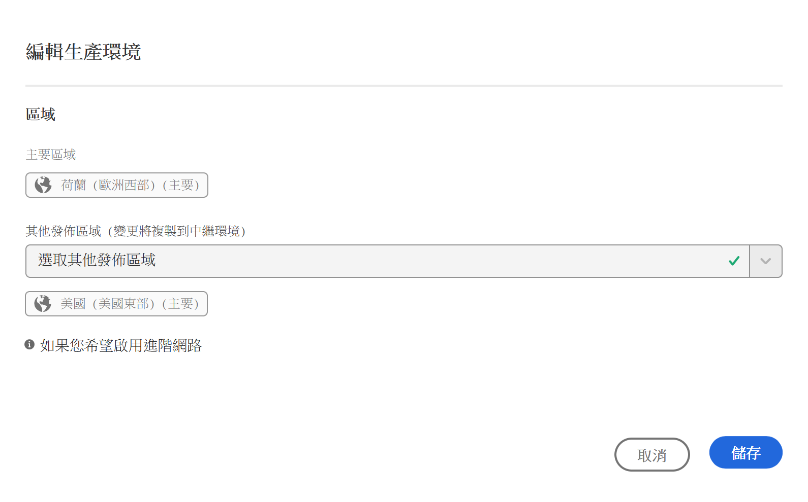
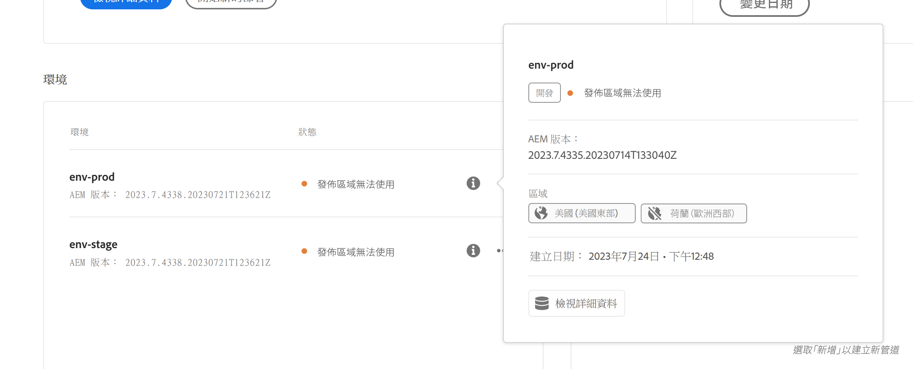
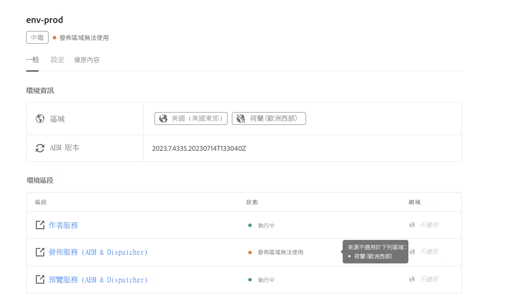

# 管理環境 {#managing-environments}

了解您可以建立的環境類型，以及如何為您的 Cloud Manager 專案建立環境類型。

## 環境型別 {#environment-types}

具有必要權限的使用者可以建立以下環境類型 (在特定租用戶可用的範圍內)。

| 環境類型 | 說明 |
| --- | --- |
| **生產+中繼** | 生產環境和測試環境組成一組使用，分別用於生產和測試目的。 在中繼環境中執行效能和安全測試。 它的規模與生產環境相同。 |
| **開發** | 您可以建立開發環境用於開發和測試目的，並且只能與非生產管道相關聯。 開發環境的大小與中繼環境和生產環境不同，且不應用於進行效能和安全測試。 |
| **快速開發** | 快速開發環境(RDE)可讓開發人員快速部署及檢閱變更。 此功能可縮短測試已在本機開發環境中驗證的功能所需的時間。 若要深入了解 RDE 的使用方法，請參閱[快速開發環境文件](/help/implementing/developing/introduction/rapid-development-environments.md)。 |
| **專業測試環境** | 專業測試環境提供專屬的空間，可在接近生產環境的情況下驗證功能，非常適合壓力測試和進階部署前檢查。 請參閱[新增專業測試環境](/help/implementing/cloud-manager/specialized-test-environment.md) |

>[!NOTE]
>
>**專業測試環境**&#x200B;功能目前只能透過早期採用計畫提供。 若要註冊為早期採用者，請參閱[專業測試環境](/help/implementing/cloud-manager/release-notes/current.md#specialized-test-environment)。

個別環境的功能取決於環境的[方案](/help/implementing/cloud-manager/getting-access-to-aem-in-cloud/program-types.md)中啟用的解決方案。

* [Sites](/help/overview/introduction.md)
* [Assets](/help/assets/overview.md)
* [Forms](/help/forms/home.md)
* [Screens](/help/screens-cloud/introduction/introduction.md)

>[!NOTE]
>
>生產和中繼環境都是以一組建立。您無法建立僅限生產或僅限預備的環境。

## 新增環境 {#adding-environments}

若要新增或編輯環境，使用者必須是&#x200B;**企業所有者**&#x200B;角色的成員。

**若要新增環境：**

1. 在 [my.cloudmanager.adobe.com](https://my.cloudmanager.adobe.com/) 登入 Cloud Manager 並選取適當的組織。

1. 在&#x200B;**[我的程式](/help/implementing/cloud-manager/navigation.md#my-programs)**&#x200B;主控台上，按一下您要新增環境的程式。

1. 執行下列任一項作業：

   如果&#x200B;**新增環境**&#x200B;選項變暗（已停用），可能是因為缺少許可權或依賴授權的資源。

   * 在&#x200B;**[我的程式](/help/implementing/cloud-manager/navigation.md#my-programs)**&#x200B;主控台的&#x200B;**環境**&#x200B;卡片上，按一下&#x200B;**新增環境**。

   

   * 在左側面板上，按一下 **環境**，然後在「環境」頁面右上角附近，按一下&#x200B;**新增環境**。

     

1. 在&#x200B;**新增環境**&#x200B;對話方塊中，執行下列動作：

   * 選取&#x200B;[**環境型別**](#environment-types)。 可用/已使用環境的數量會顯示在環境類型名稱後面的括號中。
   * 提供環境&#x200B;**名稱**。 建立環境後，便無法變更環境名稱。
   * 為環境提供選用的&#x200B;**描述**。
   * 如果要新增 **生產 + 中繼** 環境，則必須為生產環境和中繼環境提供環境名稱和說明。
   * 從下拉式清單中選取&#x200B;**主要區域**。 建立後無法變更主要區域。 此外，根據您可用的權益，您或許可以設定[多個區域](#multiple-regions)。

   

1. 按一下「**儲存**」。

**總覽**&#x200B;頁面現在會在&#x200B;**環境**&#x200B;卡中顯示您的新環境。 現在您可以設定新環境的管道。

## 多個發佈區域 {#multiple-regions}

具有&#x200B;**業務負責人**&#x200B;角色的使用者可設定生產和中繼環境，除了主要區域外，最多可包含三個額外的發佈區域。額外的發佈區域可提高可用性。如需詳細資訊，請參閱[「額外發佈區域」文件](/help/operations/additional-publish-regions.md)。

>[!TIP]
>
>您可以使用 [Cloud Manager API](https://developer.adobe.com/experience-cloud/cloud-manager/guides/api-usage/creating-programs-and-environments/#creating-aem-cloud-service-environments) 查詢可用區域的最新清單。

### 將多個發佈區域新增到新環境 {#add-regions}

新增環境時，除了主要區域外，您可以選擇設定額外區域。

1. 選取&#x200B;**主要區域**。
   * 主要區域在環境建立後即無法變更。
1. 選取「**新增額外發佈區域**」選項，一個新的「**額外發佈區域**」選項下拉式清單隨即出現。
1. 在「**額外發佈區域**」下拉式清單中，選取一個額外區域。
1. 選取區域會新增到下拉式清單下方以顯示其選取範圍。
   * 選取所選區域旁的`X`，以便您取消選取它。
1. 從「**額外發佈區域**」下拉式清單中選取另一個區域，以新增另一個區域。
1. 當您準備好建立您的環境時，選取「**儲存**」。

選取區域會同時套用至生產環境和中繼環境。

如果您未指定任何其他區域，[您可在環境建立後執行](#edit-regions)。

如果您想要針對計畫佈建[進階網路](/help/security/configuring-advanced-networking.md)，建議在使用 Cloud Manager API 將額外發佈區域新增至該環境之前完成佈建。否則，額外發佈區域的流量會通過主要區域的代理程式。

### 編輯多個發佈區域 {#edit-regions}

如果您一開始沒有指定任何附加區域，您可以在環境建立且您擁有必要的權利之後指定。

您也可以移除額外發佈區域。不過，您只能在一個交易中新增或移除區域。 如果您必須新增一個區域並移除一個區域，請先新增、儲存您的變更，然後再進行移除 (反之亦然)。

1. 從您程式的程式總覽主控台，按一下生產環境的，然後從功能表選取&#x200B;**編輯**。

   

1. 在「**編輯生產環境**」對話框中，對額外發佈區域進行必要的變更。
   * 使用「**額外發佈區域**」下拉式清單，以選取額外區域。
   * 按一下選取的額外發佈區域旁邊的 X，即可將其取消選取。

   

1. 選取&#x200B;**儲存**&#x200B;以儲存變更。

對生產環境所做的變更會同時套用至生產和中繼環境。只能在生產環境中編輯對多個發佈區域的變更。

如果您想要針對計畫佈建[進階網路](/help/security/configuring-advanced-networking.md)，建議在將額外發佈區域新增至該環境之前完成佈建。否則，額外發佈區域的流量會通過主要區域的代理程式。

## 存取環境詳細資訊 {#viewing-environment}

1. 若要存取環境詳細資訊，請執行下列任一項作業：

   * 從&#x200B;**總覽**&#x200B;頁面，在左側功能表中按一下 **環境**。

   

   * 從&#x200B;**環境**&#x200B;卡片，按一下 **全部顯示**。

     

   **環境**&#x200B;頁面會開啟並列出該計畫的所有環境。

   

1. 在環境頁面上，執行下列任一項作業：

   * 按一下清單中的環境以顯示其詳細資訊。

   

   * 按一下您想要的環境的，然後按一下&#x200B;**檢視詳細資料**。

   

>[!NOTE]
>
>新環境列在&#x200B;**環境**&#x200B;卡只會列出三個環境。按一下卡片中的[顯示全部&#x200B;**]以檢視程式的所有環境。**

### 存取預覽服務 {#access-preview-service}

Cloud Manager 為每個 AEM as a Cloud Service 環境提供預覽服務 (作為額外發佈服務提供)。

使用該服務，您可以在網站到達實際發佈環境並公開使用之前預覽網站的最終體驗。

建立後，預覽服務將套用預設的 IP 允許清單，標記為 `Preview Default [<envId>]`，其會封鎖所有流向預覽服務的流量。將預覽服務取消套用預設的 IP 允許清單才能啟用存取。

具有必要許可權的使用者必須在共用預覽服務URL之前完成以下步驟，以確儲存取它。

1. 建立適當的IP允許清單，將其套用至預覽服務，然後立即取消套用`Preview Default [<envId>]`允許清單。

   如需詳細資訊，請參閱[套用和取消套用IP允許清單](/help/implementing/cloud-manager/ip-allow-lists/apply-allow-list.md)。

1. 使用&#x200B;**IP允許清單**&#x200B;更新工作流程移除預設IP並新增必要的IP。 請參閱[管理IP允許清單](/help/implementing/cloud-manager/ip-allow-lists/managing-ip-allow-lists.md)以瞭解更多資訊。

解鎖預覽服務的存取權後，預覽服務名稱前面的鎖定圖示不再顯示。

啟動後，您可以使用AEM中的&#x200B;**`Manage Publication`**&#x200B;使用者介面將內容發佈到預覽服務。 如需詳細資訊，請參閱[預覽內容](/help/sites-cloud/authoring/sites-console/previewing-content.md)。

>[!NOTE]
>
>您的環境必須在 AEM 版本 `2021.05.5368.20210529T101701Z` 或更高版本才能使用預覽服務。確保更新管道已在您的環境中成功執行，如此即可使用預覽服務。

### 其他發佈區域的狀態 {#additional-region-status}

如果您啟用了其他發佈區域，就可以從「**環境**」卡片檢查這些區域的狀態。

1. 在「**概觀**」頁面上，找到「**環境**」卡片。

1. 在&#x200B;**環境**&#x200B;卡上，**狀態**&#x200B;欄反映設定的其他發佈區域是否有任何問題。 按一下「**資訊**」圖示可了解各地區的詳細資訊。

   

您也可以從「**環境**」標籤存取相同的資訊。

1. 在&#x200B;**總覽**&#x200B;頁面上，按一下 **環境**。

1. 在&#x200B;**環境**&#x200B;頁面上，在左側功能表中選取您要查詢的環境。

1. 選取環境後：

   * **環境資訊**&#x200B;表格顯示所選環境所設定的區域。
   * **環境區段**&#x200B;資料表的&#x200B;**狀態**&#x200B;資料行反映設定的其他發佈區域是否有任何問題。 將滑鼠指標停留在狀態上可了解任何問題的詳細資訊。

   

如果其他發佈區域回報有任何問題，請耐心等候。 Cloud Manager會不斷嘗試復原地區，但可能隨時都可使用。 如果問題在數小時後仍持續存在，您可以移除其他發佈區域，並重新新增該區域（相同區域或其他區域），以觸發完整部署。

在採取其他動作之前等待系統自行恢復的時間，取決於該區域的故障對您系統的影響。

無論如何一律會將[流量路由到最接近的線上區域](/help/operations/additional-publish-regions.md)。 如果您持續遇到問題，請聯絡Adobe客戶服務。

## 更新環境 {#updating-dev-environment}

作為雲端原生服務，Adobe會自動管理生產程式中開發、測試和生產環境的更新。

但是，對沙箱計畫中的環境的更新是在計畫中管理的。 當這類環境未執行最新的公開 AEM 版本時，計畫的&#x200B;**概觀**&#x200B;中&#x200B;**環境**&#x200B;卡上的狀態會顯示&#x200B;**可用更新**。

### 更新和管道 {#updates-pipelines}

管道是[將計畫碼部署到AEM as a Cloud Service](deploy-code.md)環境的唯一方法。 因此，每個管道都與特定的AEM版本相關聯。

當Cloud Manager偵測到比上次使用管道部署的AEM版本更新的版本時，它會顯示環境的&#x200B;**可用更新**&#x200B;狀態。

因此，更新流程分為兩個步驟：

1. 使用最新的 AEM 版本更新管道
1. 執行管道以將新版本的 AEM 部署到環境

### 更新您的環境 {#updating-your-environments}

>[!NOTE]
> 截至2024年，開發執行個體和某些沙箱計畫已自動更新，因此無需手動管理其更新。 由於此轉變，您的程式中的&#x200B;_部分_&#x200B;可能無法使用手動更新開發執行個體的環境的選項。

**更新**&#x200B;選項可在&#x200B;**環境**&#x200B;卡上用於特定開發和沙箱環境。 按一下環境旁的以存取&#x200B;**更新**。

也可以按一下程式的&#x200B;**環境**&#x200B;索引標籤，然後按一下環境的來使用此選項。

具有&#x200B;**部署管理員**&#x200B;或&#x200B;**企業所有者**&#x200B;角色的使用者可以使用此選項，將與此環境關聯的管道更新為最新的AEM版本。

管道版本更新到最新公開的 AEM 版本後，系統會提示使用者執行關聯的管道以將最新版本部署到環境中。

**更新**&#x200B;選項的行為取決於計畫的設定和目前狀態。

| 狀態 | 更新選項…… |
| --- | --- |
| 管道已更新 | 提示使用者執行管道。 |
| 管道已在更新中 | 通知使用者更新已在執行。 |
| 管道不存在 | 提示使用者建立一個。 |

## 刪除開發環境 {#deleting-environment}

具有&#x200B;**部署管理員**&#x200B;或&#x200B;**企業所有者**&#x200B;角色的使用者可以刪除開發環境。

在&#x200B;**環境**&#x200B;卡片上的程式&#x200B;**總覽**&#x200B;畫面中，按一下要刪除的開發環境的。

**刪除**&#x200B;選項也可從計畫的&#x200B;**總覽**&#x200B;視窗的&#x200B;**環境**&#x200B;索引標籤中使用。 按一下環境的，然後選取&#x200B;**刪除**。

>[!NOTE]
>
>* 不能刪除在生產計畫中建立的生產環境和中繼環境。
>* 不能刪除在沙箱計畫中的生產和中繼環境。

## 管理存取權 {#managing-access}

從&#x200B;**環境**&#x200B;卡上環境的省略符號選單中選擇&#x200B;**管理存取權**。您可以直接瀏覽到編寫執行個體，管理您環境的存取權。

>[!TIP]
>
>請參閱[AEM as a Cloud Service團隊和產品設定檔](/help/onboarding/aem-cs-team-product-profiles.md)，瞭解AEM as a Cloud Service團隊和產品設定檔如何能夠授與和限制您的授權Adobe解決方案的存取權。

## 存取開發人員主控台 {#accessing-developer-console}

1. 從&#x200B;**環境**&#x200B;卡片，按一下，然後按一下&#x200B;**Developer Console**。

已在您的瀏覽器中開啟新索引標籤，其登入頁面為&#x200B;**Developer Console**。

只有具有&#x200B;**開發人員**&#x200B;角色的使用者才能存取 **Developer Console**。但是，對於沙箱計畫，任何有權存取沙箱計畫的使用者都可以存取&#x200B;**Developer Console**。

如需更多詳細資訊，請參閱[休眠和去休眠沙箱環境](https://experienceleague.adobe.com/en/docs/experience-manager-cloud-service/content/implementing/using-cloud-manager/programs/introduction-sandbox-programs#hibernation)。

按一下個別環境的時，此選項也可從&#x200B;**總覽**&#x200B;視窗的&#x200B;**環境**&#x200B;索引標籤中使用。

## 本機登入 {#login-locally}

1. 執行下列任一項作業：

   * 從&#x200B;**環境**&#x200B;卡片，按一下，然後按一下&#x200B;**本機登入**。

     

   * 從左側面板，按一下 **環境**。 在&#x200B;**環境**&#x200B;頁面上，按一下，然後按一下&#x200B;**本機登入**。

     

## 管理自訂網域名稱 {#manage-cdn}

Sites計畫的Cloud Manager支援發佈和預覽服務的自訂網域名稱。

>[!TIP]
>
>如需詳細資訊，請參閱[自訂網域名稱簡介](/help/implementing/cloud-manager/custom-domain-names/introduction.md)。

## 管理 IP 允許清單 {#manage-ip-allow-lists}

Cloud Manager支援IP允許清單，用於Sites計畫的作者、發佈和預覽服務。

若要管理IP允許清單，請瀏覽至您程式的&#x200B;**總覽**&#x200B;頁面的 **環境**&#x200B;頁面。 按一下單個環境，以便您可以管理其詳細資訊。

### 套用IP允許清單 {#apply-ip-allow-list}

套用IP允許清單會將所有定義的IP範圍連結到環境中的作者或發佈服務。

>[!TIP]
>
>如需詳細資訊，請參閱[ IP允許清單簡介](/help/implementing/cloud-manager/ip-allow-lists/introduction.md)。
