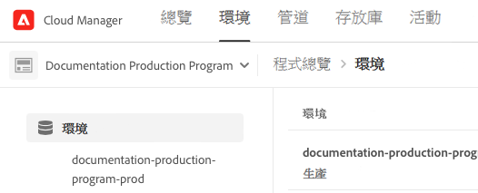
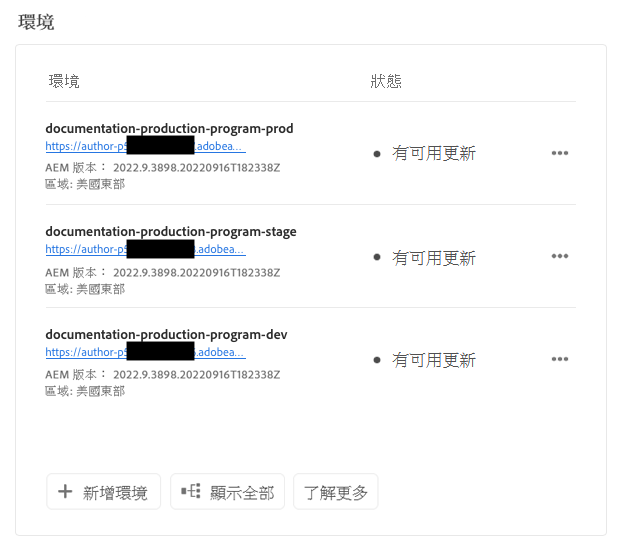
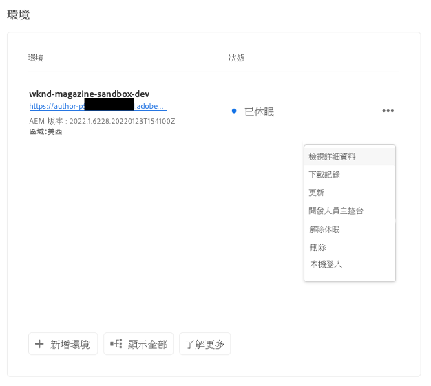
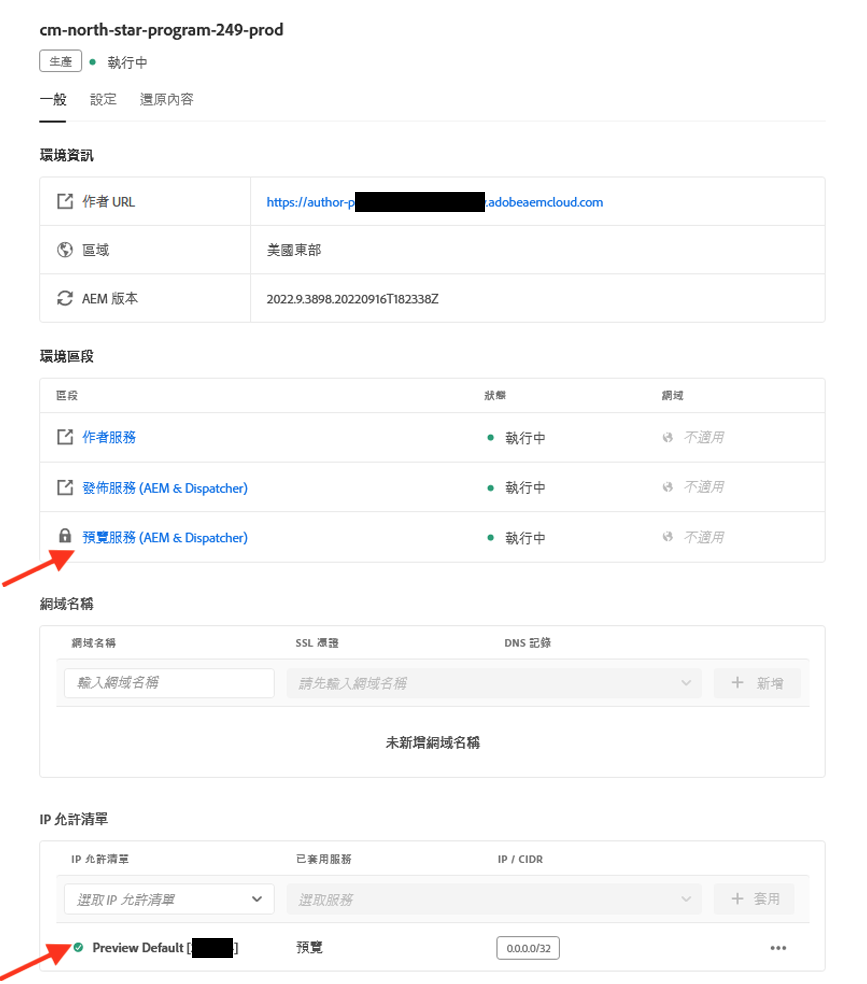
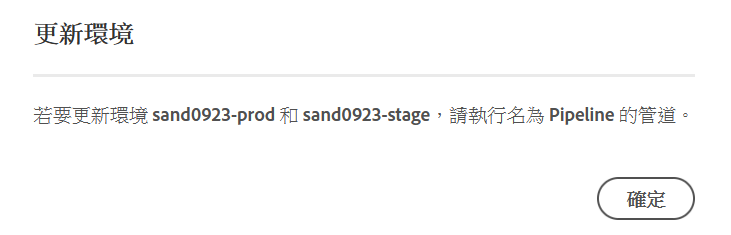
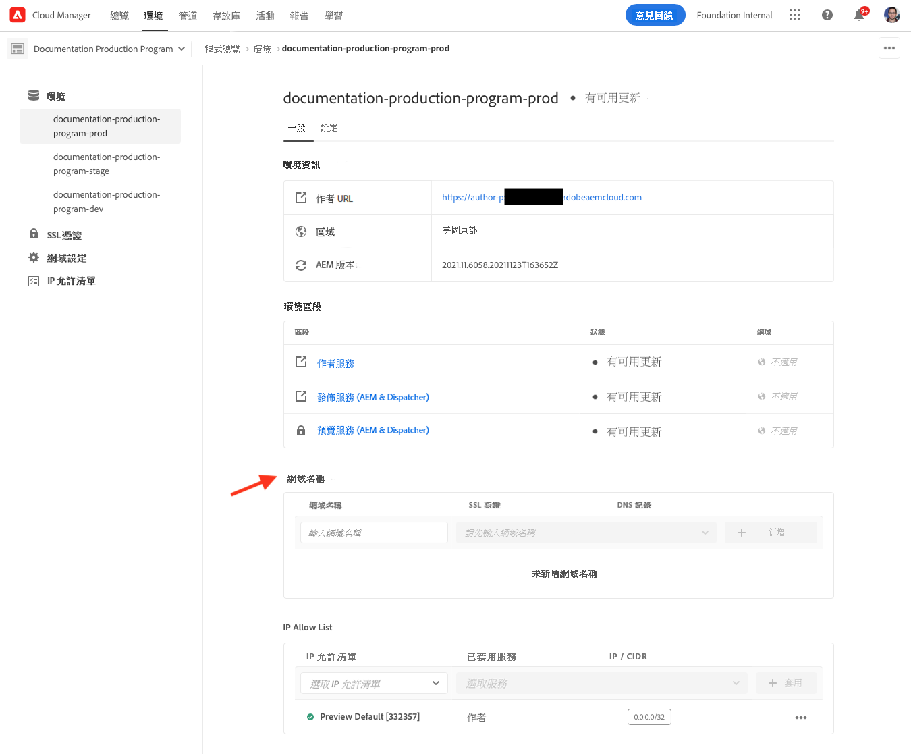

# 管理環境 {#managing-environments}

瞭解您可以建立的環境類型以及如何為Cloud Manager項目建立這些環境。

## 環境類型 {#environment-types}

具有所需權限的用戶可以建立以下環境類型（在特定租戶可用的範圍內）。

* **生產和階段**  — 生產環境和分段環境可作為一對使用，並分別用於生產和測試。

* **開發**  — 開發環境可以為開發和測試目的而建立，並且只能與非生產管道相關聯。

單個環境的功能取決於在包含 [的子菜單。](/help/implementing/cloud-manager/getting-access-to-aem-in-cloud/program-types.md)

* [網站](/help/sites-cloud/home.md)
* [資產](/help/assets/home.md)
* [Forms](/help/forms/home.md)
* [畫面](/help/screens-cloud/home.md)

>[!NOTE]
>
>生產環境和登台環境僅建立為對。 您不能僅建立暫存或生產環境。

## 添加環境 {#adding-environments}

1. 登錄到Cloud Manager(位於 [my.cloudmanager.adobe.com](https://my.cloudmanager.adobe.com/) 並選擇相應的組織。

1. 按一下要為其添加環境的程式。

1. 從 **計畫概述** ，按一下 **添加環境** 的 **環境** 卡以添加環境。

   

   * 的 **添加環境** 的上界 **環境** 頁籤。

      

   * 的 **添加環境** 選項可能由於權限不足或取決於許可的資源而被禁用。

1. 在 **添加環境** 對話框。

   * 選擇 **環境類型**。
      * 可用/已用環境的數量顯示在「開發」環境類型後面的括弧中。
   * 提供 **環境名稱**。
   * 提供 **環境描述**。
   * 選擇 **雲區**。

   

1. 按一下 **保存** 添加指定的環境。

的 **概述** 螢幕現在顯示您的新環境 **環境** 卡。 現在，您可以為新環境設定管道。

## 環境詳細資訊 {#viewing-environment}

您可以使用 **環境** 在「概述」頁面上打卡，以通過兩種方式訪問環境詳細資訊。

1. 從 **概述** 的 **環境** 按鈕。

   

   * 或者，按一下 **全部顯示** 按鈕 **環境** 直接跳到 **環境** 頁籤。

      

1. 的 **環境** 開啟並列出程式的所有環境。

   

1. 按一下清單中的環境以顯示其詳細資訊。

   

或者，按一下所需環境的省略號按鈕，然後選擇 **查看詳細資訊**。

>[!NOTE]
>
>的 **環境** 卡只列出三個環境。 按一下 **全部顯示** 按鈕，查看程式的所有環境。

### 訪問預覽服務 {#access-preview-service}

Cloud Manager向每個as a Cloud Service環境提供預覽服務(作為附加發佈服務提供AEM)。

使用該服務，您可以在網站到達實際發佈環境並公開提供之前預覽其最終體驗。

在建立時，預覽服務將有一個預設的IP允許清單，其標有 `Preview Default [<envId>]`，它阻止所有到預覽服務的通信。 必須主動取消應用預覽服務中的預設IP允許清單才能啟用訪問。

具有必要權限的用戶必須在與任何團隊共用預覽服務URL之前完成以下選項的步驟，以確保訪問預覽URL。

1. 建立相應的IP允許清單，將其應用於預覽服務，並立即取消應用 `Preview Default [<envId>]` 清單。

   * 請參閱 [取消應用IP允許清單](/help/implementing/cloud-manager/ip-allow-lists/unapply-ip-allow-list.md) 的子菜單。

1. 使用更新 **IP允許清單** 工作流，以刪除預設IP並根據需要添加IP。 請參閱 [查看和更新IP允許清單](/help/implementing/cloud-manager/ip-allow-lists/view-update-ip-allow-list.md) 來瞭解更多資訊。

一旦對預覽服務的訪問被解鎖，預覽服務名稱前面的鎖定表徵圖將不再顯示。

激活後，您可以使用內部的管理發布用戶介面將內容發佈到預覽AEM服務。 請參閱文檔 [預覽內容](/help/sites-cloud/authoring/fundamentals/previewing-content.md) 的子菜單。

>[!NOTE]
>
>您的環境必須處於版AEM本上 `2021.05.5368.20210529T101701Z` 或更新。 確保更新管道已在您的環境中成功運行以執行此操作。

## 更新環境 {#updating-dev-environment}

作為雲本機服務，生產程式中的轉移和生產環境的更新將由Adobe自動管理。

但是，對開發環境以及沙盒程式中環境的更新在程式內進行管理。 當此環境未運行最新的可公開AEM版本時， **環境** 卡 **概述** 節目螢幕將顯示 **可用更新**。

### 更新和管道 {#updates-pipelines}

管道是 [將代碼部署到AEMas a Cloud Service。](deploy-code.md) 因此，每個管道都與特定版本AEM關聯。

如果Cloud Manager檢測到有比上次隨管AEM道部署的版本更新的可用版本，則顯示 **可用更新** 環境的狀態。

因此，更新過程是一個兩步過程：

1. 使用最新版本更新管AEM道
1. 運行管道以將新版本的部AEM署到環境

### 更新環境 {#updating-your-environments}

的 **更新** 的 **環境** 按一下環境的省略號按鈕，即可為沙盒程式中的開發環境和環境打卡。

通過按一下 **環境** 頁籤，然後選擇環境的省略號按鈕。

具有 **部署管理器** 角色可以使用此選項將與此環境關聯的管道更新為最新AEM版本。

一旦管道版本更新為最新的公開可AEM用版本，系統將提示用戶運行關聯的管道以將最新版本部署到環境。

的 **更新** 選項的行為因程式的配置和當前狀態而異。

* 如果管道已更新， **更新** 選項提示用戶執行管線。
* 如果管道已更新， **更新** 選項通知用戶更新已在運行。
* 如果不存在適當的管道， **更新** 選項提示用戶建立一個。

## 刪除開發環境 {#deleting-environment}

具有所需權限的用戶將能夠刪除開發環境。

從 **概述** 螢幕 **環境** 卡，按一下要刪除的開發環境的省略號按鈕。

刪除選項也可從 **環境** 頁籤 **概述** 的子菜單。 按一下環境的省略號按鈕，然後選擇 **刪除**。

>[!NOTE]
>
>* 無法刪除在生產程式中建立的生產和轉移環境。
>* 可以刪除沙盒程式中的生產和暫存環境。

## 管理訪問 {#managing-access}

選擇 **管理訪問** 的 **環境** 卡。 您可以直接導航到作者實例，並管理環境的訪問權限。

## 訪問開發人員控制台 {#accessing-developer-console}

選擇 **開發人員控制台** 的 **環境** 卡。 這將在瀏覽器中開啟一個新頁籤，登錄頁將指向 **開發人員控制台**。

僅具有 **開發人員** 角色將具有訪問 **開發人員控制台**。 但是，對於沙盒程式，任何有權訪問沙盒程式的用戶都將有權訪問 **開發人員控制台**。

請參閱文檔 [冬眠和冬眠沙盒環境](https://experienceleague.adobe.com/docs/experience-manager-cloud-service/onboarding/getting-access/cloud-service-programs/sandbox-programs.html#hibernating-introduction) 的子菜單。

此選項也可從 **環境** 頁籤 **概述** 的子菜單。

## 本地登錄 {#login-locally}

選擇 **本地登錄** 從中的 **環境** 本地登錄卡到Adobe Experience Manager。

此外，您可以從 **環境** 頁籤 **概述** 的子菜單。

## 管理自定義域名 {#manage-cdn}

發佈和預覽服務的Cloud Manager for Sites程式支援自定義域名。 每個Cloud Manager環境最多可承載250個自定義域。

要配置自定義域名，請導航到 **環境** 頁籤，然後按一下某個環境以查看環境詳細資訊。

可以對環境的發佈服務執行以下操作。

* [添加自定義域名](/help/implementing/cloud-manager/custom-domain-names/add-custom-domain-name.md)

* [管理自定義域名](/help/implementing/cloud-manager/custom-domain-names/managing-custom-domain-names.md)

* [檢查自定義域名的狀態](/help/implementing/cloud-manager/custom-domain-names/check-domain-name-status.md#pre-existing-cdn) 或 [SSL證書](/help/implementing/cloud-manager/managing-ssl-certifications/managing-certificates.md#pre-existing-cdn)。

* [檢查IP允許清單的狀態](/help/implementing/cloud-manager/ip-allow-lists/check-ip-allow-list-status.md#pre-existing-cdn)

## 管理IP允許清單 {#manage-ip-allow-lists}

Cloud Manager支援IP允許清單，以用於網站程式的作者、發佈和預覽服務。

要管理IP允許清單，請導航至 **環境** 頁籤 **概述** 頁。 按一下單個環境以管理其詳細資訊。

### 應用IP允許清單 {#apply-ip-allow-list}

應用IP允許清單將允許清單定義中包括的所有IP範圍與環境中的作者或發佈服務相關聯。 中的用戶 **業務所有者** 或 **部署管理器** 必須登錄角色才能應用IP允許清單。

IP允許清單必須存在於雲管理器中，才能將其應用於環境。 要瞭解有關雲管理器中IP允許清單的詳細資訊，請參閱文檔[雲管理器中的IP允許清單簡介。](/help/implementing/cloud-manager/ip-allow-lists/introduction.md)

按照以下步驟應用IP允許清單。

1. 導航至 **環境** 頁籤 **概述** 螢幕並導航至 **IP允許清單** 的子菜單。
1. 使用IPallow清單表頂部的輸入欄位來選擇IPallow清單以及要應用它的作者或發佈服務。
1. 按一下 **應用** 並確認您的提交。

### 取消應用IP允許清單 {#unapply-ip-allow-list}

取消應用IP允許清單將允許清單定義中包括的所有IP範圍與環境中的作者或發佈者服務取消關聯。 中的用戶 **業務所有者** 或 **部署管理器** 必須登錄角色才能取消應用IP允許清單。

按照以下步驟取消應用IP允許清單。

1. 導航至 **環境** 頁籤 **概述** 螢幕並導航至 **IP允許清單** 的子菜單。
1. 標識要取消應用的IP允許清單規則所在的行。
1. 從行末選擇省略號按鈕。
1. 選擇 **取消應用** 並確認您的提交。
