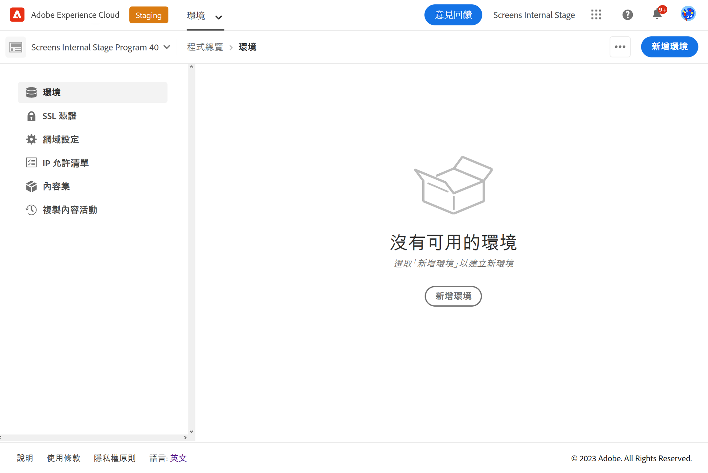
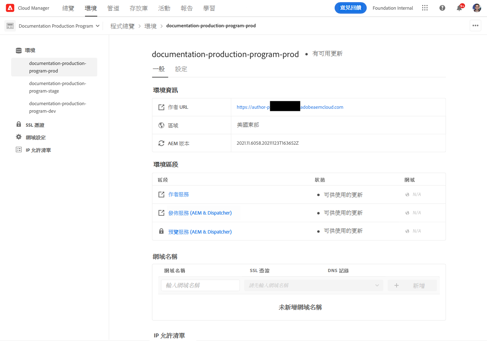
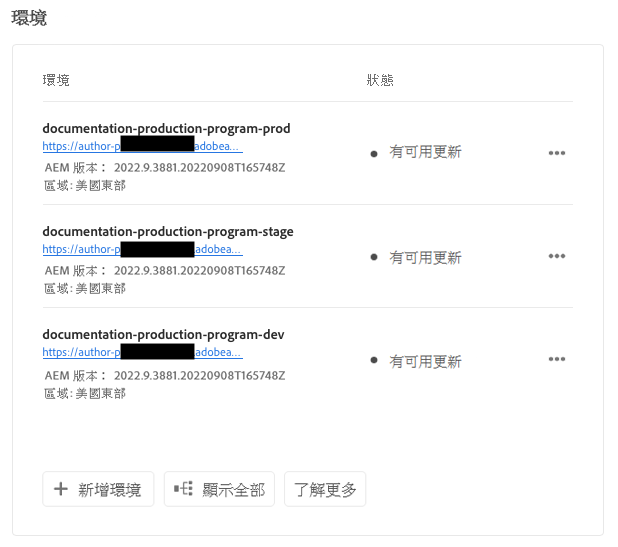
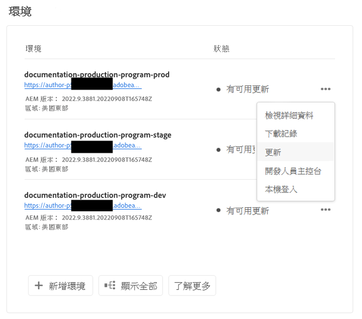
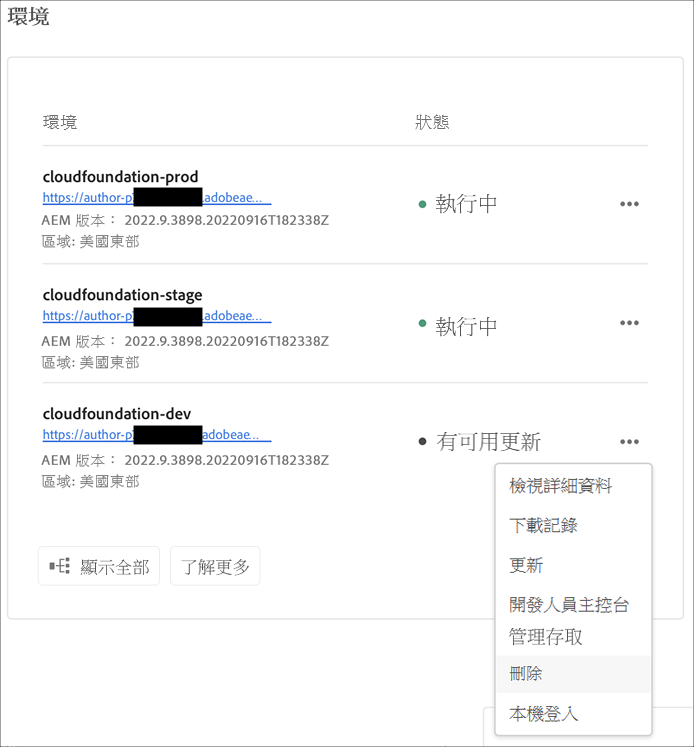
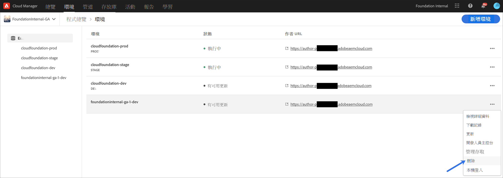
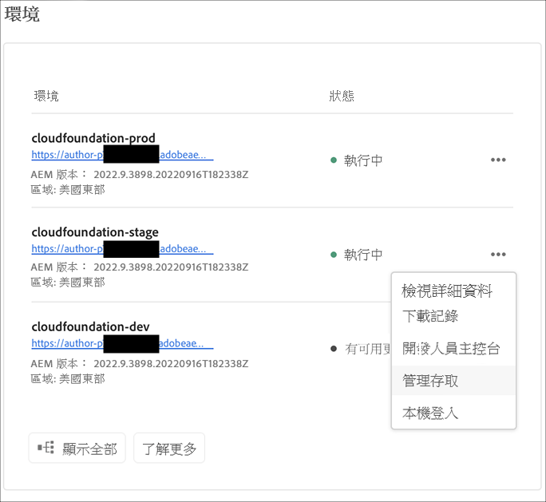
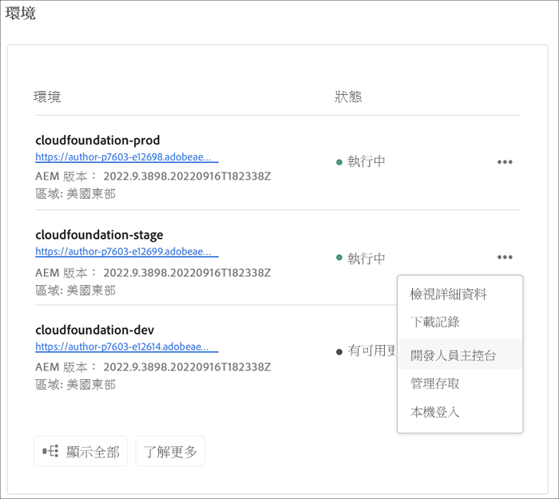
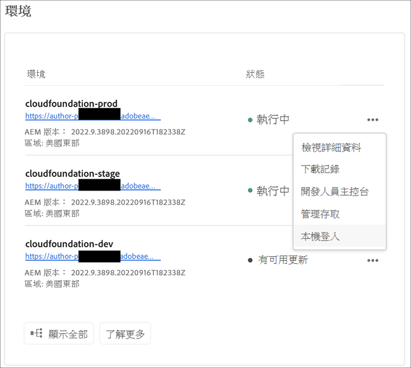
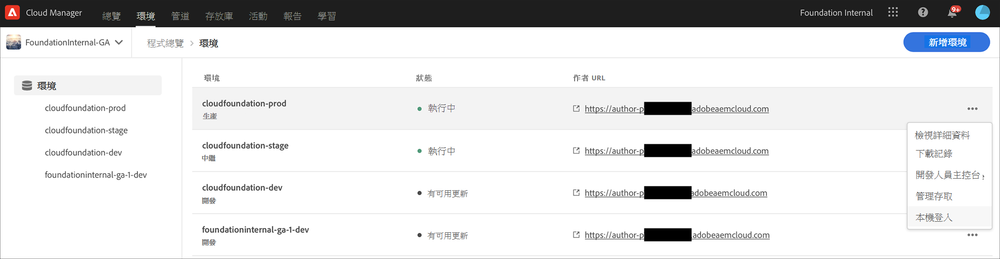

# 管理環境 {#manage-environments}

以下章節說明使用者可建立的環境類型，以及使用者可如何建立環境。

## 環境類型 {#environment-types}

具有必要權限的使用者可以建立下列環境類型（在特定租用戶可用內容的範圍內）。

* **生產與預備環境**:生產和預備作為雙核功能提供，並用於測試和生產用途。

* **開發**:您可以建立開發環境以用於開發和測試，且僅與非生產管道相關聯。

   >[!NOTE]
   >在沙箱方案中自動建立的開發環境，將會設定為包含Sites和Assets解決方案。

   下表匯總了環境類型及其屬性：

   | 名稱 | 作者階層 | 發佈層級 | 使用者可以建立 | 使用者可以刪除 | 可與環境相關聯的管道 |
   |--- |--- |--- |--- |---|---|
   | 生產 | 是 | 是（如果包含Sites） | 是 | 否 | 生產管道 |
   | 分段 | 是 | 是（如果包含Sites） | 是 | 否 | 生產管道 |
   | 開發 | 是 | 是（如果包含Sites） | 是 | 是 | 非生產管道 |

   >[!NOTE]
   >生產和預備作為雙核功能提供，並用於測試和生產用途。  使用者將無法僅建立預備或生產環境。

## 新增環境 {#adding-environments}

1. 按一下&#x200B;**新增環境**&#x200B;以新增環境。 此按鈕可從&#x200B;**Environments**螢幕訪問。
   

   當程式中沒有任何環境時， **新增環境**&#x200B;選項也可在&#x200B;**環境**&#x200B;卡上使用。

   

   >[!NOTE]
   >將會根據缺少權限或可能簽訂的合約停用&#x200B;**新增環境**&#x200B;選項。

1. 出現「 **Add environment** 」(添加環境 **)對話框。用戶需要提交諸如「Environment type** 」 (環境類型) 和「 **Environment name** 」 (環境名稱) 和「 **** Environment description」 (環境描述) 等詳細資訊 (取決於用戶在特定租用戶可用內容範圍內建立環境的目標)。

   

   >[!NOTE]
   >建立環境時，會以Adobe I/O建立一或多個&#x200B;*整合*。這些檔案會顯示給可存取Adobe I/O控制台的客戶使用者，且不得刪除。 這在Adobe I/O主控台的說明中會顯示。

   

1. 按一下&#x200B;**儲存**&#x200B;以新增包含填入條件的環境。  現在，*概述*&#x200B;畫面會顯示卡片，您可從其中設定管道。

   >[!NOTE]
   >如果您尚未設定非生產管道，*概述*&#x200B;畫面會顯示卡片，您可從此處建立非生產管道。

## 環境詳細資訊 {#viewing-environment}

「概述」頁面上的&#x200B;**Environments**&#x200B;卡片最多列出三個環境。

1. 選擇&#x200B;**全部顯示**&#x200B;按鈕以導航到&#x200B;**環境**&#x200B;摘要頁以查看包含完整環境清單的表。

   

1. **環境**&#x200B;頁面會顯示所有現有環境的清單。

   

1. 從清單中選取任何一個環境，以檢視環境詳細資訊。

   

### 存取預覽服務 {#access-preview-service}

「預覽服務」功能透過Cloud Manager為每個AEM提供額外的預覽（發佈）服務，作為Cloud Service環境。

在到達發佈環境且可供公開之前，先預覽網站的最終體驗。 在您看到並使用預覽服務之前，請提供幾個指針：

1. **AEM版本**:您的環境必須使用AEM版 `2021.05.5368.20210529T101701Z` 本或更新版本。請確定更新管道已在您的環境中成功執行，以完成此作業。

1. **預設IP允許清單鎖定**:建立預覽服務時，會套用預設的IP允許清單(標示為 `Preview Default [Env ID]`)。

   >[!NOTE]
   >首次建立時，您必須主動從環境中的預覽服務中取消套用預設的IP允許清單，才能啟用存取權。

   擁有必要權限的使用者必須執行下列其中一項操作，才能&#x200B;*解除鎖定*&#x200B;預覽服務的存取權，並提供所需的存取權：

   * 建立適當的IP允許清單，並將其套用至預覽服務。 請立即取消從預覽服務中應用`Preview Default [Env ID] IP Allow List`。 如需詳細資訊，請參閱[取消套用IP允許清單](/help/implementing/cloud-manager/ip-allow-lists/unapply-ip-allow-list.md) 。

      *或*,

   * 使用更新IP允許清單工作流程來移除預設IP，並視情況新增IP。 請參閱[檢視和更新IP允許清單](/help/implementing/cloud-manager/ip-allow-lists/view-update-ip-allow-list.md)以了解更多資訊。

      >[!NOTE]
      >您必須先完成上述步驟，才能與任何團隊共用預覽服務URL，以確保團隊的適當成員能夠存取預覽URL。

      一旦預覽服務的存取解除鎖定後，將不再顯示鎖定圖示（如下圖所示）。

      

1. **發佈內容以預覽**:您可以使用AEM內的「管理出版物UI」 ，將內容發佈至預覽服務。如需詳細資訊，請參閱[預覽內容](https://experienceleague.adobe.com/docs/experience-manager-cloud-service/sites/authoring/fundamentals/previewing-content.html?lang=en) 。

## 更新環境 {#updating-dev-environment}

預備和生產環境的更新由Adobe自動管理。

程式的使用者會管理開發環境的更新。 當環境未執行最新的公開可用AEM版本時，主畫面上的「環境卡」狀態會顯示&#x200B;**UPDATE AVAILABLE**。

**Update**&#x200B;選項可從&#x200B;**Environments**卡中使用。
如果按一下**Environments**&#x200B;卡中的&#x200B;**Details**，也可使用此選項。 開啟「**環境**」頁面，當您選取「開發」環境後，按一下「**」……**&#x200B;並選取&#x200B;**更新**，如下圖所示：

選擇此選項將允許部署管理器將與此環境關聯的管道更新為最新版本，然後執行該管道。

如果管道已更新，則提示用戶執行管道。

## 刪除環境 {#deleting-environment}

具有必要權限的使用者將能刪除開發環境。

**Delete**&#x200B;選項可從&#x200B;**Environments**&#x200B;卡片中的下拉式選單取得。 按一下&#x200B;**...**，針對您要刪除的開發環境。

如果按一下&#x200B;**Environments**&#x200B;卡中的&#x200B;**Details**，也可使用刪除選項。 開啟「**環境**」頁面，當您選取「開發」環境後，按一下「**」……**&#x200B;並選取&#x200B;**刪除**，如下圖所示：

>[!NOTE]
>此功能不適用於為生產目的而設定的生產程式中設定的生產/預備環境。 不過，此功能也適用於沙箱方案中的生產/預備環境。

## 管理存取 {#managing-access}

從&#x200B;**Environments**&#x200B;卡片的下拉菜單中選擇&#x200B;**管理訪問**。 您可以直接導覽至製作例項，並管理環境的存取權。

請參閱[管理對製作例項的存取](/help/onboarding/what-is-required/accessing-aem-instance.md)以深入了解。

## 存取開發人員控制台 {#accessing-developer-console}

從&#x200B;**Environments**&#x200B;卡片中的下拉式選單中選擇&#x200B;**Developer Console**。 這會在您的瀏覽器中開啟一個新索引標籤，其中登入頁面會顯示至&#x200B;**開發人員控制台**。

只有「開發人員」角色中的使用者才能存取&#x200B;**「開發人員控制台」**。 沙箱方案例外，任何有權存取Cloud Manager沙箱方案的使用者都可存取&#x200B;**開發人員控制台**。

如需詳細資訊，請參閱[休眠和解除休眠沙箱環境](https://experienceleague.adobe.com/docs/experience-manager-cloud-service/onboarding/getting-access/cloud-service-programs/sandbox-programs.html#hibernating-introduction) 。

如果按一下&#x200B;**Environments**&#x200B;卡中的&#x200B;**Details**，也可使用此選項。 「**環境**」頁開啟，選擇環境後，按一下&#x200B;**...**&#x200B;並選取&#x200B;**開發人員控制台**。

## 本機登入 {#login-locally}

從&#x200B;**Environments**&#x200B;卡片的下拉式選單中選取&#x200B;**本機登入** ，以便在本機登入Adobe Experience Manager。

此外，您也可以從&#x200B;**Environments**&#x200B;摘要頁面本機登入。

## 管理自訂網域名稱 {#manage-cdn}

從「環境摘要」頁面導覽至「**環境**&#x200B;詳細資訊」頁面。

>[!NOTE]
>Cloud Manager現在支援自訂網域名稱，適用於發佈和預覽服務的Sites程式。 每個Cloud Manager環境最多可托管每個環境250個自訂網域。

您可在環境的發佈服務上執行下列動作，如下所述：

1. [新增自訂網域名稱](/help/implementing/cloud-manager/custom-domain-names/add-custom-domain-name.md)

1. [查看和更新自定義域名](/help/implementing/cloud-manager/custom-domain-names/view-update-replace-custom-domain-name.md)

1. [刪除自訂網域名稱](/help/implementing/cloud-manager/custom-domain-names/delete-custom-domain-name.md)

1. [檢查自訂網域名稱](/help/implementing/cloud-manager/custom-domain-names/check-domain-name-status.md#pre-existing-cdn) 或SSL憑 [證的狀態](/help/implementing/cloud-manager/managing-ssl-certifications/check-status-ssl-certificate.md#pre-existing-cdn)。

1. [檢查IP允許清單的狀態](/help/implementing/cloud-manager/ip-allow-lists/check-ip-allow-list-status.md#pre-existing-cdn)

## 管理IP允許清單 {#manage-ip-allow-lists}

從「環境摘要」頁面導覽至「環境詳細資訊」頁面。 您可以在此處針對您的環境，對發佈和/或作者服務執行下列動作。

>[!NOTE]
>Cloud Manager現在支援「製作」、「發佈」和「預覽服務」的「IP允許清單」功能（可在Sites程式中取得）。

### 套用IP允許清單 {#apply-ip-allow-list}

「套用IP允許清單」是指「允許清單」定義中包含的所有IP範圍，都與環境中的「作者」或「發佈」服務相關聯的程式。 必須登錄業務所有者或部署管理員角色中的用戶，才能應用IP允許清單。

>[!NOTE]
>IP允許清單必須存在於Cloud Manager中，才能套用至環境服務。 若要進一步了解Cloud Manager中的IP允許清單，請導覽至[ Cloud Manager中的IP允許清單簡介](/help/implementing/cloud-manager/ip-allow-lists/introduction.md)。

請依照下列步驟，套用IP允許清單：

1. 從&#x200B;**Environments**&#x200B;詳細資訊頁面導覽至特定環境，並導覽至&#x200B;**IP允許清單**&#x200B;表格。
1. 使用「IP允許清單」表格頂端的輸入欄位，選取IP允許清單以及您要套用該清單的製作或發佈服務。
1. 按一下&#x200B;**Apply**&#x200B;並確認您的提交。

### 取消套用IP允許清單 {#unapply-ip-allow-list}

取消套用IP允許清單是環境中，允許清單定義中包含的所有IP範圍會與製作或發佈者服務取消關聯的程式。 必須登錄業務所有者或部署管理員角色中的用戶，才能取消應用IP允許清單。

請依照下列步驟，取消套用IP允許清單：

1. 從「環境」畫面導覽至特定的&#x200B;**Environments**&#x200B;詳細資訊頁面，並導覽至「**IP允許清單**」表格。
1. 識別您要取消套用的IP允許清單規則所列的列。
1. 選擇&#x200B;**...**&#x200B;功能表。
1. 選擇&#x200B;**取消應用**&#x200B;選項並確認提交。
