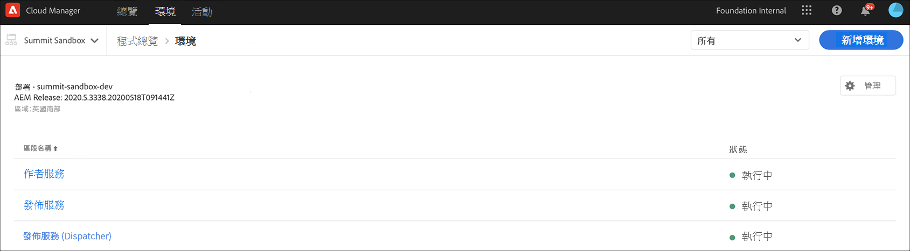
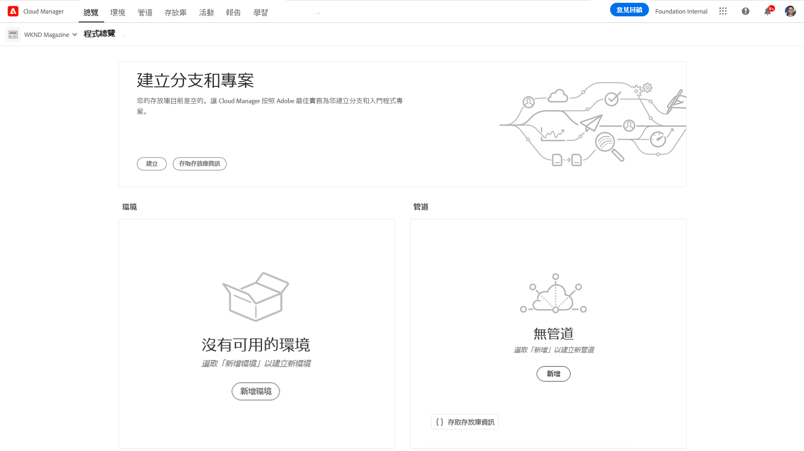
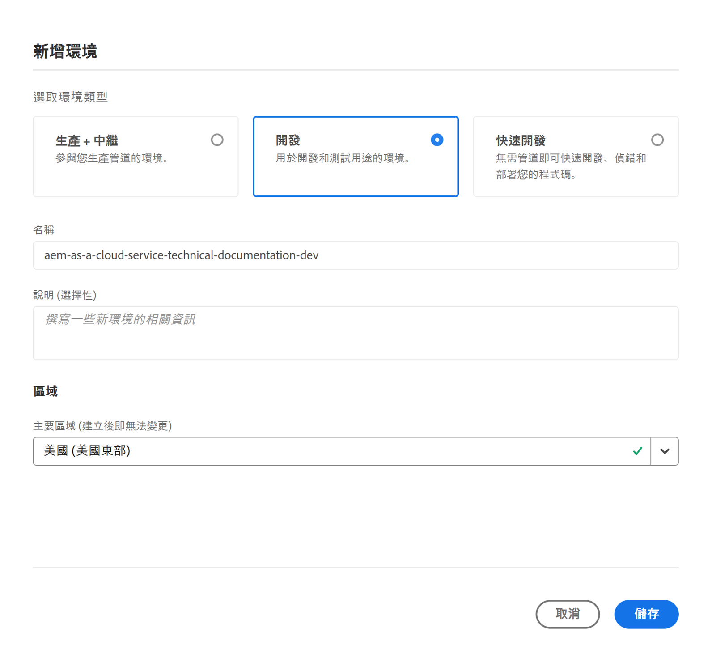
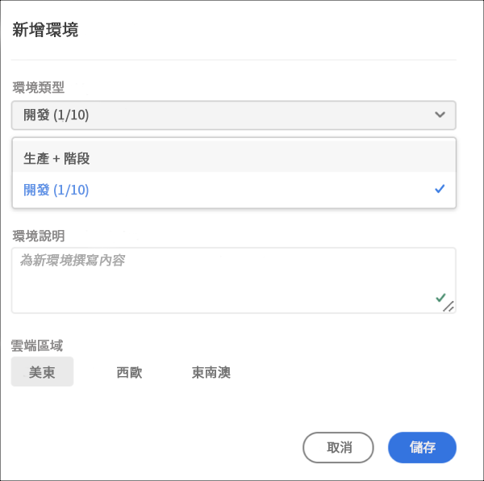
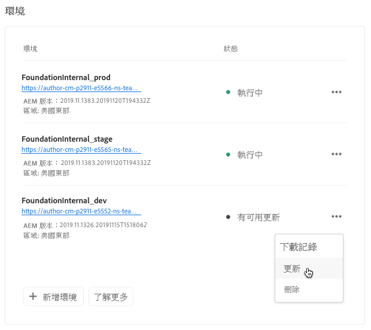
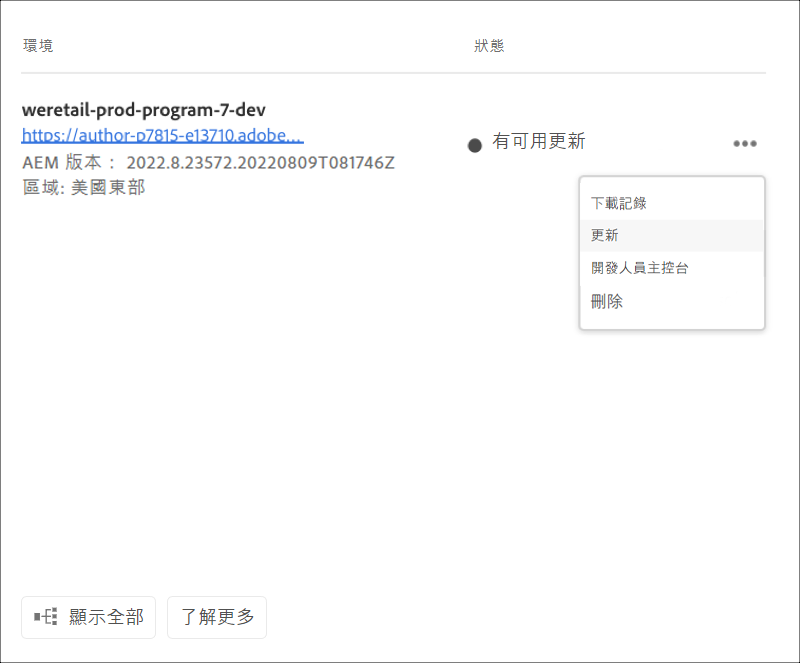

# 管理環境 {#manage-environments}

下節介紹用戶可建立的環境類型以及用戶可建立環境的方式。

## 環境類型 {#environment-types}

具備必要權限的使用者可以建立下列環境類型（在特定租用戶可用的範圍內）。

* **生產和階段環境**:
Production and Stage是雙核產品，用於測試和生產用途。

* **開發**: 開發環境可建立用於開發和測試，且僅與非生產管道相關。

   >[!NOTE]
   >在沙盒程式中自動建立的開發環境將會設定為包含網站和資產解決方案。

   下表匯總了環境類型及其屬性：

   | 名稱 | 作者層 | 發佈層 | 使用者可以建立 | 使用者可以刪除 | 可與環境關聯的管線 |
   |--- |--- |--- |--- |---|---|
   | 生產 | 是 | 是（如果包含網站） | 是 | 否 | 生產管道 |
   | 分段 | 是 | 是（如果包含網站） | 是 | 否 | 生產管道 |
   | 開發 | 是 | 是（如果包含網站） | 是 | 是 | 非生產管道 |

   >[!NOTE]
   >Production and Stage是雙核產品，用於測試和生產用途。  使用者將無法僅建立「舞台(Stage)」或僅建立「生產」環境。

## 添加環境 {#adding-environments}

1. 按一下「 **添加環境** 」(Add Environment)以添加環境。 此按鈕可從「環境」畫面 **存取** 。
   

   當程 **序中沒有環境** 時，「Environments **(環境** )」卡上也將提供「Add Environment（添加環境）」選項。

   

   >[!NOTE]
   >「添 **加環境** 」選項將基於缺少權限或可能簽訂的合同而禁用。

1. 出現「 **Add environment** 」(添加環境 **)對話框。用戶需要提交諸如「Environment type** 」 (環境類型) 和「 **Environment name** 」 (環境名稱) 和「 **** Environment description」 (環境描述) 等詳細資訊 (取決於用戶在特定租用戶可用內容範圍內建立環境的目標)。

   

   >[!NOTE]
   >在建立環境時，會在Adobe I/O *中建立一* 或多個整合。 這些內容對可存取Adobe I/O Console的客戶使用者可見，且不得刪除。 Adobe I/O Console的說明中會說明此點。

   

1. 按一下 **保存** ，以添加具有已填充標準的環境。  現在，「 *概述* 」畫面會顯示卡片，您可從其中設定管道。

   >[!NOTE]
   >如果您尚未設定非生產管道，「概述」畫面會顯示卡片，您可從中建立非生產管道。 **

## 更新環境 {#updating-dev-environment}

Adobe會自動管理Stage和生產環境的更新。

開發環境的更新由方案的使用者管理。 當環境未執行最新公開可用的AEM版本時，「首頁畫面」上「環境卡」的狀態會顯示「 **UPDATE AVAILABLE」**。

)

當顯示此狀態時，如果按一下「 **ENVIRONMENTS** 」卡的「Details **」 (詳細資訊)，則「Update** 」 (更新) 選項將可從「Environments Card」 (環境卡) 和「 **Manage****** 」 (管理) 菜單中使用。

從下拉菜單中選擇此選項將允許部署管理器將與此環境關聯的管線更新為最新版本，然後執行管線。

如果管線已更新，則提示用戶執行管線。

## 刪除環境 {#deleting-environment}

具備必要權限的使用者將可刪除開發環境。

Delete option will be available from the dropdown menu, both on the **Environments** Card and the **Manage** menu if you click on Details from the **ENVIRONMENTS** card.

>[!NOTE]
此功能不適用於為生產目的而在常規程式中設定的生產／階段環境。 不過，這項功能適用於沙盒程式中的「生產／階段」環境。

