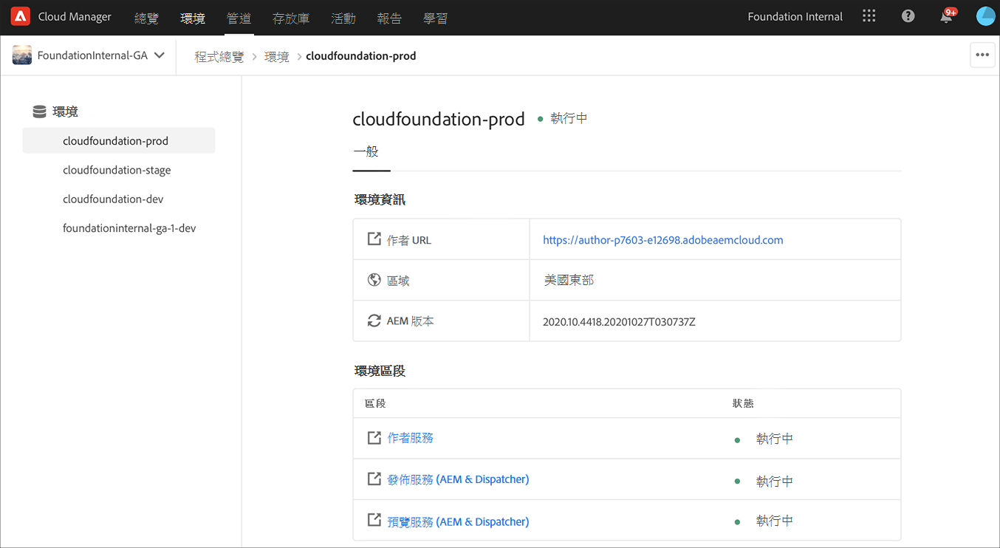

# 管理環境 {#manage-environments}

下節介紹用戶可建立的環境類型以及用戶可建立環境的方式。

## 環境類型{#environment-types}

具備必要權限的使用者可以建立下列環境類型（在特定租用戶可用的範圍內）。

* **生產和階段環境**:Production and Stage是雙核產品，用於測試和生產用途。

* **開發**:開發環境可建立用於開發和測試，且僅與非生產管道相關。

   >[!NOTE]
   >在沙盒程式中自動建立的開發環境將會設定為包含網站和資產解決方案。

   下表匯總了環境類型及其屬性：

   | 名稱 | 作者階層 | 發佈層 | 使用者可以建立 | 使用者可以刪除 | 可與環境關聯的管線 |
   |--- |--- |--- |--- |---|---|
   | 生產 | 是 | 是（如果包含網站） | 是 | 否 | 生產管道 |
   | 分段 | 是 | 是（如果包含網站） | 是 | 否 | 生產管道 |
   | 開發 | 是 | 是（如果包含網站） | 是 | 是 | 非生產管道 |

   >[!NOTE]
   >Production and Stage是雙核產品，用於測試和生產用途。  使用者將無法僅建立「舞台(Stage)」或僅建立「生產」環境。

## 添加環境{#adding-environments}

1. 按一下&#x200B;**添加環境**&#x200B;添加環境。 此按鈕可從&#x200B;**Environments**畫面存取。
   

   當程式中沒有環境時，**添加環境**&#x200B;選項也可在&#x200B;**環境**&#x200B;卡上使用。

   

   >[!NOTE]
   >**添加環境**&#x200B;選項將基於缺少權限或可能簽約的內容而禁用。

1. 出現「 **Add environment** 」(添加環境 **)對話框。用戶需要提交諸如「Environment type** 」 (環境類型) 和「 **Environment name** 」 (環境名稱) 和「 **** Environment description」 (環境描述) 等詳細資訊 (取決於用戶在特定租用戶可用內容範圍內建立環境的目標)。

   

   >[!NOTE]
   >建立環境時，會在Adobe I/O中建立一或多個&#x200B;*整合*。這些內容對可存取Adobe I/O Console的客戶使用者可見，且不得刪除。 Adobe I/O Console的說明中會說明此點。

   

1. 按一下&#x200B;**保存**&#x200B;以添加具有填入標準的環境。  現在，*概述*&#x200B;螢幕會顯示卡片，您可從其中設定管道。

   >[!NOTE]
   >如果您尚未設定非生產管道，*概述*&#x200B;畫面會顯示卡片，您可從其中建立非生產管道。

## 查看環境{#viewing-environment}

「概述」頁面上的&#x200B;**Environments**&#x200B;卡列出最多3個環境。

1. 選擇&#x200B;**顯示所有**&#x200B;按鈕，以導航到&#x200B;**環境**&#x200B;摘要頁以查看包含完整環境清單的表。

   

1. **Environments**&#x200B;頁面會顯示所有現有環境的清單。

   

1. 從清單中選擇任一環境以查看環境詳細資訊。

   

## 更新環境{#updating-dev-environment}

Adobe會自動管理Stage和生產環境的更新。

開發環境的更新由方案的使用者管理。 當環境未執行最新公開可用的AEM版本時，「首頁畫面」上「環境卡」的狀態會顯示&#x200B;**UPDATE AVAILABLE**。

**Update**&#x200B;選項可從&#x200B;**Environments**卡獲得。
如果按一下**Environments**&#x200B;卡上的&#x200B;**Details**，也可以使用此選項。 **Environments**&#x200B;頁面隨即開啟，當您選取「開發」環境後，按一下&#x200B;**...**&#x200B;並選擇&#x200B;**Update**，如下圖所示：

選擇此選項將允許部署管理器將與此環境關聯的管線更新為最新版本，然後執行管線。

如果管線已更新，則提示用戶執行管線。

## 刪除環境{#deleting-environment}

具備必要權限的使用者將可刪除開發環境。

**Delete**&#x200B;選項可從&#x200B;**Environments**&#x200B;卡的下拉菜單中使用。 按一下&#x200B;**...**，以取得您要刪除的開發環境。

如果按一下&#x200B;**Environments**&#x200B;卡中的&#x200B;**Details**，也可以使用刪除選項。 **Environments**&#x200B;頁面隨即開啟，當您選取「開發」環境後，按一下&#x200B;**...**&#x200B;並選擇&#x200B;**Delete**，如下圖所示：

>[!NOTE]
>
>此功能不適用於為生產目的而在常規程式中設定的生產／階段環境。 不過，這項功能適用於沙盒程式中的「生產／階段」環境。

## 管理訪問{#managing-access}

從&#x200B;**環境**&#x200B;卡的下拉菜單中選擇&#x200B;**管理訪問**。 您可以直接導覽至作者例項，並管理環境的存取權。

如需詳細資訊，請參閱[管理對作者例項的存取權。](/help/onboarding/getting-access-to-aem-in-cloud/navigation.md#manage-access-aem)

## 存取Developer Console {#accessing-developer-console}

從&#x200B;**環境**&#x200B;卡的下拉菜單中選擇&#x200B;**開發人員控制台**。 這會在您的瀏覽器中開啟一個新標籤，其中登入頁面會顯示至&#x200B;**Developer Console**。

只有「開發人員」角色的使用者才能存取「開發人員主控台」**。**「沙盒程式」例外，凡有權存取「雲端管理員沙盒程式」的使用者，皆可存取「開發人員控制台」**。**

如需詳細資訊，請參閱[冬眠和解除冬眠沙盒環境](https://docs.adobe.com/content/help/en/experience-manager-cloud-service/onboarding/getting-access/cloud-service-programs/sandbox-programs.html#hibernating-introduction)。

如果按一下&#x200B;**Environments**&#x200B;卡上的&#x200B;**Details**，也可以使用此選項。 **Environments**&#x200B;頁面隨即開啟，當您選取環境後，按一下&#x200B;**...**&#x200B;並選擇&#x200B;**開發人員主控台**。

## 本地登錄{#login-locally}

從&#x200B;**環境**&#x200B;資訊卡的下拉式選單選擇&#x200B;**本機登入**，以本機登入Adobe Experience Manager。

此外，您還可以從&#x200B;**Environments**&#x200B;摘要頁面本機登入。

## 管理自定義域名{#manage-cdn}

從「環境摘要」頁面導航至「環境&#x200B;****&#x200B;詳細資訊」頁面。

可對環境的「發佈」服務執行下列操作，如下所述：

1. [新增自訂網域名稱](/help/implementing/cloud-manager/custom-domain-names/add-custom-domain-name.md)

1. [查看和更新自定義域名](/help/implementing/cloud-manager/custom-domain-names/view-update-replace-custom-domain-name.md)

1. [刪除自訂網域名稱](/help/implementing/cloud-manager/custom-domain-names/delete-custom-domain-name.md)

## 管理IP允許清單{#manage-ip-allow-lists}

從「環境概要」頁導航到「環境詳細資訊」頁。 您可以在此處對您的環境的「發佈」和／或「作者」服務執行下列動作。

### 應用IP允許清單{#apply-ip-allow-list}

套用IP允許清單是「允許清單」定義中包含的所有IP範圍與環境中的「作者」或「發佈」服務相關聯的程式。 必須登錄「業務所有者」或「部署管理員」角色中的用戶，才能應用「IP允許清單」。

>[!NOTE]
>IP允許清單必須存在於Cloud Manager中，才能將其應用於環境服務。 若要進一步瞭解Cloud Manager中的「IP允許清單」，請導覽至[Cloud Manager中的「IP允許清單簡介」。](/help/implementing/cloud-manager/ip-allow-lists/introduction.md)

請依照下列步驟來套用IP允許清單：

1. 從&#x200B;**環境**&#x200B;詳細資訊頁導航到特定環境，並導航到&#x200B;**IP允許清單**&#x200B;表。
1. 使用「IP允許清單」(IP Allow List)表格頂部的輸入欄位來選擇「IP允許清單」(IP Allow List)以及要將其應用到的「作者」(Author)或「發佈」(Publish)服務。
1. 按一下&#x200B;**Apply**&#x200B;並確認提交。

### 取消應用IP允許清單{#unapply-ip-allow-list}

取消應用「允許清單」(IP Allow List)是一個過程，通過該過程，「允許清單」(Allow List)定義中包含的所有IP範圍都與環境中的「作者」或「發佈者」(Publisher)服務不相關聯。 必須登錄「業務所有者」或「部署管理員」角色中的用戶，才能取消應用IP允許清單。

請依照下列步驟取消套用IP允許清單：

1. 從「環境」螢幕導航到特定的&#x200B;**「環境**&#x200B;詳細資訊」頁，並導航到&#x200B;**IP允許清單**&#x200B;表。
1. 識別您要取消套用的「IP允許清單」規則列在哪一列。
1. 選擇&#x200B;**...**&#x200B;選單。
1. 選擇&#x200B;**取消應用**&#x200B;選項並確認您的提交。

