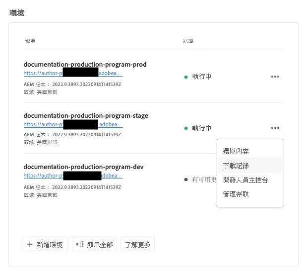
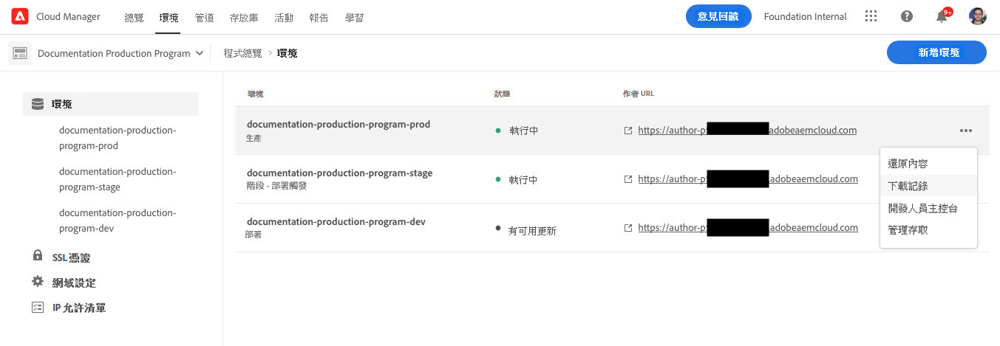
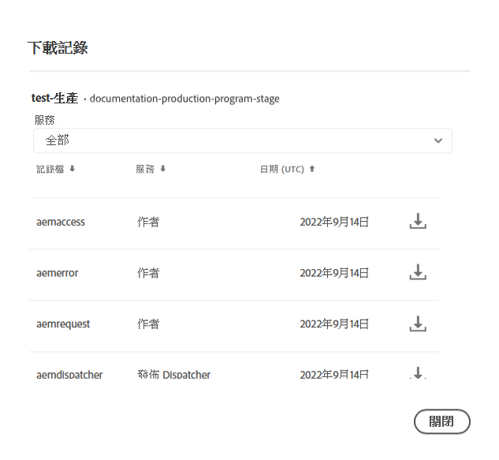

# 存取和管理記錄檔 {#manage-logs}

使用者可以使用&#x200B;**概述**&#x200B;頁面或環境詳細資訊頁面中的&#x200B;**環境**&#x200B;卡，存取所選環境的可用日誌檔案清單。

## 正在下載日誌 {#download-logs}

請依照下列步驟下載記錄檔。

1. 從&#x200B;**概述**&#x200B;頁面導覽至&#x200B;**環境**&#x200B;卡片。

1. 從&#x200B;**中選擇**&#x200B;下載日誌&#x200B;**...**&#x200B;功能表。

   

   *或*,

   從「環境詳細資訊」頁：

   

   >[!NOTE]
   >無論其開啟位置為何，都會顯示相同的對話方塊，並允許下載個別記錄檔。

1. 從&#x200B;**Service**&#x200B;下拉式選單中，選取&#x200B;**Preview**&#x200B;或&#x200B;**Preview Dispatcher**&#x200B;等選項，然後按一下下載圖示。

   


## 透過API記錄 {#logs-through-api}

除了透過UI下載記錄檔外，記錄檔也可透過API和命令列介面使用。

例如，要下載特定環境的日誌檔案，該命令將是

```java
$ aio cloudmanager:download-logs --programId 5 1884 author aemerror
```

以下命令允許跟蹤日誌：

```java
$ aio cloudmanager:tail-log --programId 5 1884 author aemerror
```

為了取得環境ID（在此例中為1884），以及您可以使用的可用服務或記錄名選項：

```java
$ aio cloudmanager:list-environments
Environment Id Name                     Type  Description                          
1884           FoundationInternal_dev   dev   Foundation Internal Dev environment  
1884           FoundationInternal_stage stage Foundation Internal STAGE environment
1884           FoundationInternal_prod  prod  Foundation Internal Prod environment
 
 
$ aio cloudmanager:list-available-log-options 1884
Environment Id Service    Name         
1884           author     aemerror     
1884           author     aemrequest   
1884           author     aemaccess    
1884           publish    aemerror     
1884           publish    aemrequest   
1884           publish    aemaccess    
1884           dispatcher httpderror   
1884           dispatcher aemdispatcher
1884           dispatcher httpdaccess
```

>[!NOTE]
>雖 **然「記錄下載** 」將可透過UI和API使用，但 **「記錄追蹤** 」僅限API/CLI。

### 其他資源 {#resources}

請參考下列其他資源，以進一步了解Cloud Manager API和Adobe I/OCLI:

* [Cloud Manager API檔案](https://www.adobe.io/apis/experiencecloud/cloud-manager/docs.html)
* [Adobe I/OCLI](https://github.com/adobe/aio-cli-plugin-cloudmanager)
