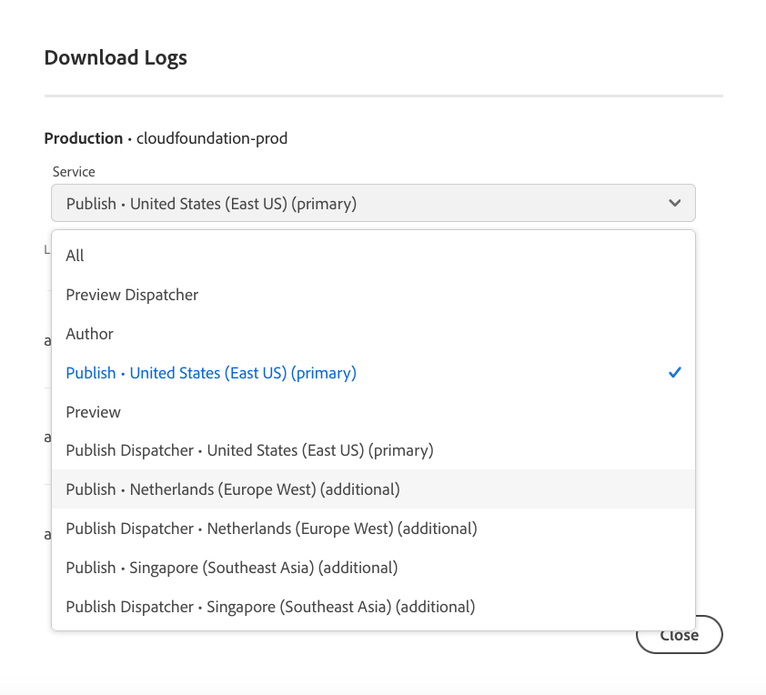

# 存取及管理記錄 {#manage-logs}

了解如何存取和管理記錄檔以協助進行 AEM as a Cloud Service 中的開發流程。

您可以從&#x200B;**概觀**&#x200B;頁面或環境詳細資訊頁面使用&#x200B;**環境**&#x200B;卡，存取所選環境的可用記錄檔清單。

記錄檔會保留七天。

## 下載記錄檔 {#download-logs}

1. 在 [my.cloudmanager.adobe.com](https://my.cloudmanager.adobe.com/) 登入 Cloud Manager 並選取適當的組織。

1. 在「**[我的程式](/help/implementing/cloud-manager/navigation.md#my-programs)**」控制台中，選取程式。

1. 從&#x200B;**概觀**&#x200B;頁面瀏覽到&#x200B;**環境**&#x200B;卡。

1. 從省略符號選單，選取&#x200B;**「下載記錄檔」**。

   

1. 在&#x200B;**下載記錄**&#x200B;對話框，從下拉式選單中選擇合適的&#x200B;**服務**

   

   如果您的環境已啟用[其他發佈區域](/help/operations/additional-publish-regions.md)，您可以選取每個區域並個別下載其記錄檔，如下所示：

   

1. 選取服務後，按一下您要擷取之記錄檔旁的下載圖示。

您也可以從&#x200B;**環境**&#x200B;頁面存取記錄檔。


## 透過API記錄 {#logs-through-api}

除了透過 UI 下載記錄檔外，還可以透過 API 和命令行介面取得記錄檔。

若要下載特定環境的記錄文件，該命令會類似於以下內容。

```shell
$ aio cloudmanager:download-logs --programId 5 1884 author aemerror
```

此外，您可以透過命令行介面追蹤記錄。

```shell
$ aio cloudmanager:tail-log --programId 5 1884 author aemerror
```

為了取得環境 ID (本例中為 1884) 和可用的服務或記錄名稱選項，您可以使用以下命令。

```shell
$ aio cloudmanager:list-environments
Environment Id Name                     Type  Description                          
1884           FoundationInternal_dev   dev   Foundation Internal Dev environment  
1884           FoundationInternal_stage stage Foundation Internal STAGE environment
1884           FoundationInternal_prod  prod  Foundation Internal Prod environment
 
 
$ aio cloudmanager:list-available-log-options 1884
Environment Id Service    Name         
1884           author     aemerror     
1884           author     aemrequest   
1884           author     aemaccess    
1884           publish    aemerror     
1884           publish    aemrequest   
1884           publish    aemaccess    
1884           dispatcher httpderror   
1884           dispatcher aemdispatcher
1884           dispatcher httpdaccess
```

### 其他資源 {#resources}

>[!TIP]
>
>請檢視[此視訊資源](https://app.frame.io/reviews/28cdf463-b7fc-443b-a54a-93cb7da6567e/dbf158f1-568b-4efc-8fbc-3b241561cbab)，深入瞭解偵錯AEM as a Cloud Service的相關資訊。

請參閱以下更多資源，以深入了解如何使用 Cloud Manager API 和 Adobe I/O CLI：

* [Cloud Manager API 文件](https://developer.adobe.com/experience-cloud/cloud-manager/)
* [Adobe I/O CLI](https://github.com/adobe/aio-cli-plugin-cloudmanager)

請參閱下列其他資源，以進一步瞭解AEM as a Cloud Service中的記錄檔：

* [Cloud 5 AEM記錄檔](https://experienceleague.adobe.com/en/docs/experience-manager-learn/cloud-service/expert-resources/cloud-5/cloud5-aem-log-files#)
* [使用記錄檔偵錯AEM as a Cloud Service](https://experienceleague.adobe.com/en/docs/experience-manager-learn/cloud-service/debugging/debugging-aem-as-a-cloud-service/logs#)
