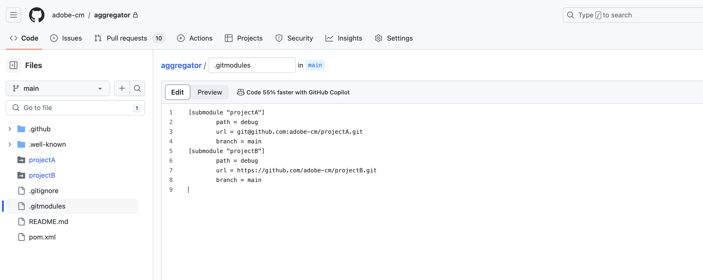

# Adobe 存放庫的 Git 子模組支援 {#git-submodule-support}

可使用 Git 子模組在建置期間將橫跨不同 Git 存放庫的多個分支內容合併。

Cloud Manager的建置流程執行時，會複製管道的存放庫並簽出分支。 如果分支的根目錄中存在`.gitmodules`檔案，則會執行對應的命令。

下列命令會將每個子模組簽出至適當的目錄中。

```
$ git submodule update --init
```

此技巧為[使用多個Source Git存放庫](/help/implementing/cloud-manager/managing-code/working-with-multiple-source-git-repositories.md)中所述的解決方案提供替代方案。 如果組織習慣使用Git子模組，且偏好不管理外部合併程式，這款應用程式是理想的選擇。

例如，假設有三個存放庫。 每個存放庫都包含一個名為`main`的分支。 在主要存放庫中（即在管道中設定的那個），`main`分支有一個`pom.xml`檔案，宣告包含在其他兩個存放庫中的專案：

```xml
<?xml version="1.0" encoding="UTF-8"?>
<project xmlns="https://maven.apache.org/POM/4.0.0" xmlns:xsi="https://www.w3.org/2001/XMLSchema-instance"
    xsi:schemaLocation="https://maven.apache.org/POM/4.0.0 https://maven.apache.org/maven-v4_0_0.xsd">
    <modelVersion>4.0.0</modelVersion>
   
    <groupId>customer.group.id</groupId>
    <artifactId>customer-reactor</artifactId>
    <version>0.0.1-SNAPSHOT</version>
    <packaging>pom</packaging>
   
    <modules>
        <module>project-a</module>
        <module>project-b</module>
    </modules>
   
</project>
```

然後，您將為其他兩個存放庫新增子模組：

```shell
$ git submodule add -b main https://git.cloudmanager.adobe.com/ProgramName/projectA/ project-a
$ git submodule add -b main https://git.cloudmanager.adobe.com/ProgramName/projectB/ project-b
```

結果會是類似於以下內容的`.gitmodules`檔案：

```text
[submodule "project-a"]
    path = project-a
    url = https://git.cloudmanager.adobe.com/ProgramName/projectA/
    branch = main
[submodule "project-b"]
    path = project-b
    url = https://git.cloudmanager.adobe.com/ProgramName/projectB/
    branch = main
```

另請參閱[Git參考手冊](https://git-scm.com/book/en/v2/Git-Tools-Submodules)，瞭解有關Git子模組的詳細資訊。

## Adobe存放庫的使用說明 {#usage-notes-recommendations-adobe-repos}

* Git URL必須完全符合上節所述語法。
* 僅支援分支根部的子模組。
* 基於安全考量，請勿在Git URL中嵌入憑證。
* 除非另有必要，否則Adobe建議您執行下列指令來使用淺子模組：
  每個子模組有`git config -f .gitmodules submodule.<submodule path>.shallow true`。
* Git 子模組參考資料會儲存至特定的 Git 認可。因此，若對子模組存放庫進行變更，必須更新參考的認可。
例如，使用下列專案：

  `git submodule update --remote`

## 私人存放庫的 Git 子模組支援 {#private-repositories}

[私人存放庫](private-repositories.md)中Git子模組的支援通常與其在Adobe存放庫中的使用類似。

不過，在設定`pom.xml`檔案並執行`git submodule`命令後，您必須將`.gitmodules`檔案新增至Cloud Manager彙總儲存庫的根目錄，以識別子模組組態。




### 使用說明 {#usage-notes-recommendations-private-repos}

* 子模組Git URL可以是HTTPS或SSH格式，但必須指向GitHub.com存放庫。 不支援將Adobe存放庫子模組新增至GitHub彙總存放庫或反向。
* GitHub子模組必須可由Adobe GitHub應用程式存取。
* [透過 Adobe 託管的存放庫使用 Git 子模組的限制](#usage-notes-recommendations-adobe-repos)也適用。
