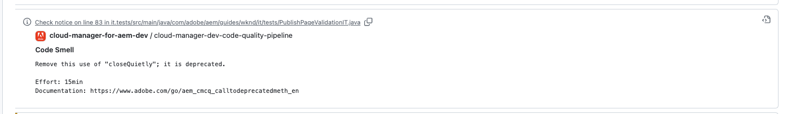

# GitHub 檢查附註 {#github-annotations}

了解 GitHub 檢查如何為您的私人存放庫加上 PR 附註，以便為您提供有用的意見回饋。

## 概觀 {#overview}

如果您的 Cloud Manager 方案目前正使用[私人存放庫](private-repositories.md)，每個提取請求會在 GitHub 中自動執行檢查。這些會附有用資訊的附註，可幫助您盡快了解程式碼的任何問題。

[SonarQube](/help/implementing/cloud-manager/custom-code-quality-rules.md) 檢測到的[程式碼品質](/help/implementing/cloud-manager/code-quality-testing.md)問題會清楚列出。

提供有問題的確切程式碼行，您可以按一下即會顯示相關程式碼。這些附註為了所有程式碼問題所提供，而不僅僅是在提取請求中更改的程式碼問題。

所有附註行都彙總在 GitHub 拉取請求的「**已更改檔案**」索引標籤上。提取請求中未更改的檔案附註會顯示在檔案所屬的部分中。

## 程式碼品質管道 {#code-quality-pipelines}

此[代碼品質](/help/implementing/cloud-manager/code-quality-testing.md)結果也會在管道中見到；該管道會在「**檢查**」索引標籤底部由 Cloud Manager 自動觸發。這也可以從提取請求的檢查「**詳情**」中存取。

您也可以在 CSV 表單中以視覺化呈現問題。這可以透過[查看 Cloud Manager 中的管道執行詳細資訊](/help/implementing/cloud-manager/configuring-pipelines/managing-pipelines.md#view-details)來擷取。
