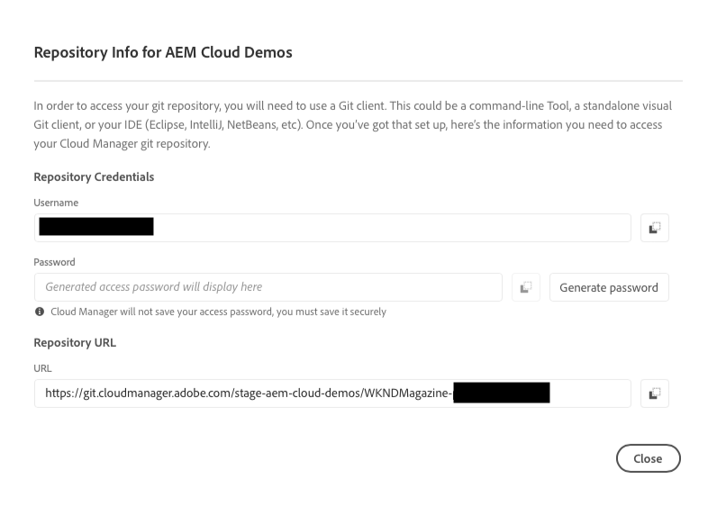

# 在Cloud Manager中管理存放庫 {#managing-repos}

了解如何在 Cloud Manager 中建立、檢視和刪除 Git 存放庫。

## 概觀 {#overview}

存放庫是用來透過Git儲存和管理您的專案計畫碼。 您在Cloud Manager中建立的每個計畫都有為其建立的Adobe管理的存放庫。

您可以選擇建立其他Adobe管理的存放庫，並新增您自己的專用存放庫。 您可在「 」中檢視與您的方案相關聯的所有存放庫 **存放庫** 視窗。

在新增或編輯管道時，您也可以選擇在 Cloud Manager 中建立的存放庫。如需更多資訊，請參閱 [CI-CD 管道](/help/implementing/cloud-manager/configuring-pipelines/introduction-ci-cd-pipelines.md)。

任何指定管道都有一個主要存放庫或一個分支。替換為 [Git子模組支援，](git-submodules.md) 建置時可以包含許多次要分支。

## 存放庫視窗 {#repositories-window}

1. 在 [my.cloudmanager.adobe.com](https://my.cloudmanager.adobe.com/) 登入 Cloud Manager 並選取適當的組織和方案。

1. 從 **計畫總覽** 頁面，選取 **存放庫** 標籤以切換至 **存放庫** 頁面。

1. 此 **存放庫** 視窗會顯示與您的方案相關聯的所有存放庫。

   

此 **存放庫** 視窗提供有關存放庫的詳細資訊：

* 存放庫型別
   * **Adobe** 表示Adobe管理的存放庫
   * **私人** 表示您管理的GitHub存放庫
* 建立時間
* 與存放庫關聯的管道

您可以在視窗中選取存放庫，然後按一下省略符號按鈕，對選取的存放庫執行動作。

* **[檢查分支/建立專案](#check-branches)** (僅適用於Adobe存放庫)
* **[複製存放庫URL](#copy-url)**
* **[檢視和更新](#view-update)**
* **[刪除](#delete)**

## 新增存放庫 {#adding-repositories}

點選或按一下 **新增存放庫** 中的按鈕 **存放庫** 視窗啟動 **新增存放庫** 精靈。

Cloud Manager支援兩個由Adobe(**Adobe存放庫**)以及您自己的自行管理存放庫(**私人存放庫**)。 視您選擇新增的存放庫型別而定，必填欄位會有所不同。 如需更多詳細資訊，請參閱下列檔案。

* [在Cloud Manager中新增Adobe存放庫](adobe-repositories.md)
* [在Cloud Manager中新增私有存放庫](private-repositories.md)

>[!NOTE]
>
>* 使用者必須具備&#x200B;**部署管理員**&#x200B;或&#x200B;**業務負責人**&#x200B;角色才能新增存放庫。
>* 任何指定公司或 IMS 組織中的所有計畫都存在 300 個存放庫的限制。

## 存取存放庫資訊 {#repo-info}

在中檢視您的存放庫時 **存放庫** 視窗中，您可以點選或按一下「 」，以程式設計方式檢視Adobe管理的存放庫的詳細資訊 **存取存放庫資訊** 按鈕。

此 **存放庫資訊** 視窗會開啟，其中包含詳細資訊。 如需有關存取存放庫資訊的詳細資訊，請參閱檔案 [存取存放庫資訊。](accessing-repos.md)

## 檢查分支 {#check-branches}

## 複製存放庫 URL {#copy-url}

此 **複製存放庫URL** 動作會複製所選存放庫的URL **存放庫** 視窗到剪貼簿以用於其他地方。

## 檢視和更新 {#view-update}

此 **檢視和更新** 動作開啟 **更新存放庫** 對話方塊。 使用它可以檢視 **名稱** 和 **存放庫URL預覽** 以及更新 **說明** 存放庫的。

## 刪除 {#delete}

此 **刪除** 動作會將存放庫從專案中移除。 如果存放庫與管道相關聯，則無法刪除存放庫。

刪除存放庫將：

* 使已刪除的存放庫名稱無法用於將來可能建立的新存放庫。
   * 在這種情況下會顯示錯誤訊息 `Repository name should be unique within organization.`。
* 讓已刪除的存放庫在 Cloud Manager 中無法使用，並且無法連結到管道。
