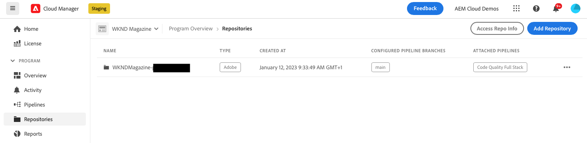
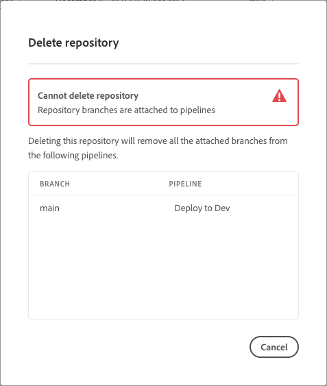

# 管理 Cloud Manager 中的存放庫 {#managing-repos}

瞭解如何在Cloud Manager中檢視、新增和刪除您的Git存放庫。

## 關於Cloud Manager中的存放庫 {#overview}

Cloud Manager 中的存放庫是用來使用 Git 儲存和管理專案的程式碼。對於您新增的每個&#x200B;*方案*，系統會自動建立一個 Adobe 託管的存放庫。

此外，您可以選擇建立更多 Adobe 託管的存放庫，或可以新增您自己的私人存放庫。所有連結至您方案的存放庫都可在&#x200B;**存放庫**&#x200B;頁面查看。

新增或編輯管道時，也可以選取在 Cloud Manager 中建立的存放庫。有關設定管道的更多資訊，請參閱 [CI-CD 管道](/help/implementing/cloud-manager/configuring-pipelines/introduction-ci-cd-pipelines.md)。

每個管道都連結到主存放庫或分支。但是，透過 [Git 子模組的支援](git-submodules.md)，可以在建置過程中包含多個次要分支。

## 檢視存放庫頁面 {#repositories-window}

在&#x200B;**存放庫**&#x200B;頁面上，您可以檢視有關所選存放庫的詳細資訊。此資訊包含使用中的存放庫類型。如果存放庫標記為 **Adobe**，表示這是 Adobe 託管的存放庫。如果標記為 **GitHub**，這是指您管理的私人 GitHub 存放庫。此外，該頁面還提供詳細資訊，例如建立存放庫的時間以及與其關聯的管道。

若要對選取的存放庫執行動作，您可以按一下存放庫並使用，即可開啟下拉式選單。關於 Adobe 託管的存放庫，您可「**[查看分支/建立專案](#check-branches)**」。

*「存放庫」頁面上的下拉式選單。*

下拉式選單上的其他適用動作包含&#x200B;**[複製存放庫 URL](#copy-url)**、**[檢視和更新](#view-update)**，以及&#x200B;**[刪除](#delete)**&#x200B;存放庫。

**若要檢視存放庫頁面：**

1. 在 [my.cloudmanager.adobe.com](https://my.cloudmanager.adobe.com/) 登入 Cloud Manager 並選取適當的組織和方案。

1. 在&#x200B;**方案概觀**&#x200B;頁面 (在側邊選單上)，按一下 「**存放庫**」。

1. 「**存放庫**」頁面會顯示與您所選方案有關聯的所有存放庫。

   
   *在 Cloud Manager 中的存放庫頁面。*

## 新增存放庫 {#adding-repositories}

使用者必須具備&#x200B;**部署管理員**&#x200B;或&#x200B;**企業所有者**&#x200B;角色才能新增存放庫。

在&#x200B;**存放庫**&#x200B;頁面 (位於右上角附近)，按一下「**新增存放庫**」。

*新增存放庫對話方塊。*

Cloud Manager 支援兩種存放庫：Adobe 託管的存放庫 (**Adobe 存放庫**) 及自己管理的存放庫 (**私人存放庫**)。設定的必填欄位會根據您選擇新增的存放庫類型而有所不同。如需詳細資訊，請參閱下列內容：

* [在 Cloud Manager 中新增 Adobe 存放庫](adobe-repositories.md)
* [在 Cloud Manager 中新增私人存放庫](private-repositories.md)

任何指定公司或 IMS 組織中的所有計畫都存在 300 個存放庫的限制。

## 存取存放庫資訊 {#repo-info}

在「**存放庫**」視窗中查看存放庫時，您可以按一下工作列的「**存取存放庫資訊**」按鈕，以檢視有關如何以程式設計方式存取 Adobe 託管的存放庫詳細資訊。

「**存放庫資訊**」視窗會開啟，並且內含詳細資訊。有關存取存放庫資訊的更多資訊，請參閱文件「[存取存放庫資訊](/help/implementing/cloud-manager/managing-code/accessing-repos.md)」。

## 檢查分支/建立專案 {#check-branches}

在 **AEM Cloud Manager** 中，**檢查分支/建立專案**&#x200B;動作有兩個用途，實際取決於存放庫目前的狀態。

* 如果是新建立的存放庫，則此動作將使用 [AEM 專案原型](https://experienceleague.adobe.com/zh-hant/docs/experience-manager-core-components/using/developing/archetype/overview)產生範例專案。
* 如果範例專案已建立在存放庫中，則該動作將檢查存放庫及其分支的狀態，提供有關範例專案是否已存在的意見回饋。

  

## 複製存放庫 URL {#copy-url}

「**複製存放庫 URL**」動作會將「**存放庫**」頁面中選取的存放庫 URL 複製到剪貼簿，以便在其他地方使用。

## 查看&amp;更新存放庫 {#view-update}

「**檢視與更新**」動作會開啟「**更新存放庫**」對話框，您可以在其中查看存放庫的&#x200B;**名稱**&#x200B;和&#x200B;**存放庫 URL 預覽**。此外，這還允許您更新存放庫的&#x200B;**說明**。

## 刪除存放庫 {#delete}

「**刪除**」動作會從您的專案中刪除存放庫。如果存放庫與管道有關聯，則無法刪除。

刪除存放庫會導致其名稱無法用於將來建立的任何新存放庫。 如果您嘗試使用與已刪除的存放庫相同名稱來新增存放庫，您會遇到以下錯誤訊息：

`Repository name should be unique within organization.`

此外，已刪除的存放庫在Cloud Manager中不再可用，並且無法連結到任何管道。

