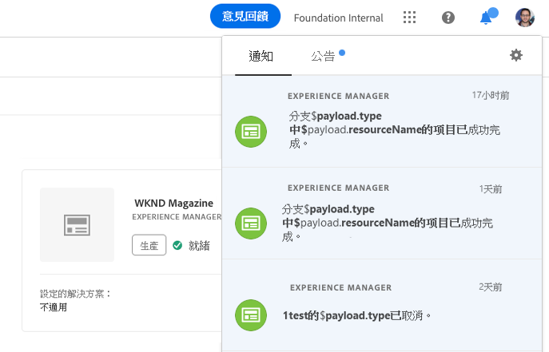

# 了解通知 {#notifications}

[!UICONTROL Cloud Manager] 允許用戶在生產部署開始時，在生產管道啟動並完成（成功或失敗）時接收通知。 這些通知會透過Adobe [!UICONTROL Experience Cloud] Notification系統傳送。

>[!NOTE]
>
>批准和計畫通知僅發送給業務所有者、程式管理員和部署管理員角色中的用戶。

通知會出現在 [!UICONTROL Cloud Manager] UI（使用者介面）和整個Adobe [!UICONTROL Experience Cloud的側欄中]。

按一下標題中的鈴鐺圖示以開啟邊欄並檢視通知，如下圖所示：

邊欄會列出最新的通知。

## 電子郵件通知 {#email-notifications}

依預設，Adobe [!UICONTROL Experience Cloud解決方案的網頁使用者介面中會提供通] 知。 個別使用者也可以選擇立即或摘要方式透過電子郵件傳送這些通知。

這會將使用者帶往Adobe [!UICONTROL Experience Cloud的「通知偏好設定」畫面]。

使用者可以開啟電子郵件通知，並（選擇性）選擇想透過電子郵件接收的通知類型。

>[!NOTE]
>
>您也可以啟用Adobe [!UICONTROL Experience Cloud的消化功能]，如下所示：
