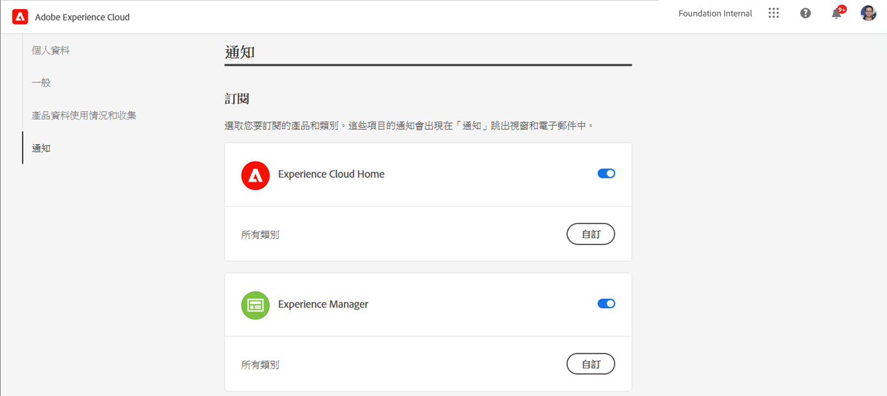
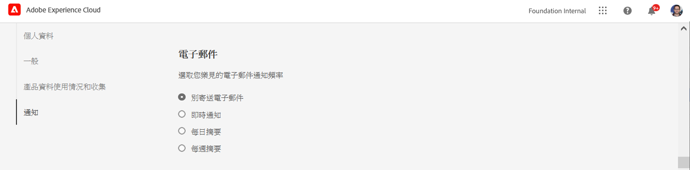

# 通知 {#notifications}

[!UICONTROL Cloud Manager] 可讓使用者在生產部署期間，於生產管道開始並完成（成功或未成功）時收到通知。

這些通知會透過Adobe傳送 [!UICONTROL Experience Cloud] 通知系統給具有角色的用戶 **業務負責人**, **計畫經理**，和 **部署管理員**.

通知會顯示在 [!UICONTROL Cloud Manager] UI和整個Adobe [!UICONTROL Experience Cloud].

有新通知時，鈴聲表徵圖被標籤。 按一下它以開啟面板以檢視通知。

面板只會列出最新的通知。 按一下 **查看全部** ，查看所有通知。

## 電子郵件通知 {#email-notifications}

依預設，通知可在使用者介面中跨Adobe使用 [!UICONTROL Experience Cloud] 解決方案。 個別使用者也可以依照下列步驟，選擇透過電子郵件傳送這些通知。

1. 按一下鈴聲圖示以顯示通知。
1. 按一下 **編輯偏好設定** 圖示（形狀像齒輪）。
1. 在開啟的視窗中，按一下 **通知** 的下一頁。
   
1. 向下捲動至 **電子郵件** 標題。
   
1. 選取您要如何接收電子郵件。
   * 不傳送電子郵件（預設）
   * 即時通知
   * 每日摘要
   * 每週摘要

選取後，您的選擇會自動儲存，而無需按一下儲存或套用按鈕。
