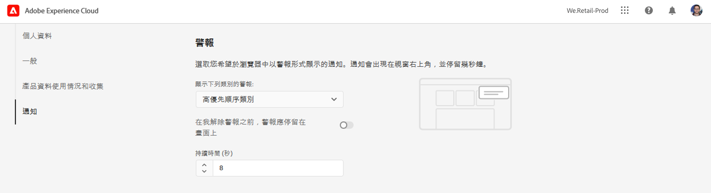

# 通知 {#notifications}

了解 Cloud Manager 如何通知您重要事件。

## Cloud Manager 中的通知 {#cloud-manager-notifications}

[!UICONTROL Cloud Manager] 生產管道在生產部署開始時開始並完成（成功或未成功）時，會傳送通知給您。

這些通知會透過 [!UICONTROL Experience Cloud] 通知系統 **業務負責人**, **計畫經理**，和 **部署管理員** 角色。

通知會出現在 [!UICONTROL Cloud Manager] 和整個Adobe [!UICONTROL Experience Cloud]. 當您有新通知時，標題中的鈴鐺圖示會出現標記。

按一下該鈴鐺圖示，即可開啟側邊欄並檢視通知。此 **通知** 邊欄中的索引標籤會列出最新通知，例如部署確認。 通知與您的環境有關。

此 **公告** 索引標籤包含Adobe產品公告。 公告與產品有關。

按一下通知或公告以檢視其詳細資訊。 連結至活動（如管道部署）的通知會帶您查看該活動的詳細資訊，例如管道執行視窗。

按一下 **查看全部** 選項，查看收件匣中的所有公告。

按一下 **將所有標籤為已讀** 選項，將所有未讀通知標籤為已讀，並清除鈴聲表徵表徵圖簽。

## 通知配置 {#configuration}

您可以自訂接收通知的方式，以及接收哪些通知。

按一下通知側欄頂端的齒輪圖示。

這會開啟 **Experience Cloud偏好設定** 視窗中，您可以在此定義通知訂閱及接收通知的方式。

### 訂閱 {#subscriptions}

訂閱會定義您接收通知的產品，以及哪些通知。

依預設，您會收到所有產品的所有通知。 按一下 **自訂** ，定義您為該產品接收的通知類型。

### 優先順序 {#priority}

優先順序警報會標示為 **高** 標籤，且可設定為僅接收作為警報。 在 **優先順序** 區段中，您可以定義哪些類別符合優先順序通知的資格。

使用下拉式清單，將符合優先順序的類別新增至清單。 按一下類別名稱旁的X以移除它們。

### 警報 {#alerts}

警報會在視窗的右上角出現幾秒鐘。 使用 **警報** 區段，定義您接收警報的通知。

您可以定義警報的行為。

* **顯示**  — 定義觸發警報的通知類型
* **警報應會一直顯示在螢幕上，直到我關閉警報為止**  — 控制應持續存在的警報，除非您主動解除警報
* **持續時間**  — 定義如果您未選擇警報應保留在畫面上，則警報應保留在畫面上的時間。

### 電子郵件 {#emails}

Web用戶介面中提供各種Adobe的通知 [!UICONTROL Experience Cloud] 解決方案。 您也可以選擇透過 **電子郵件** 區段。

預設不會傳送任何電子郵件。 您可以選擇以下方式接收電子郵件：

* 立即
* 每日
* 每週

當 **即時通知** 若選取，則會立即傳送每則通知的電子郵件。 針對 **每日摘要** 和 **每週摘要** 您可以選擇每日摘要的傳送時間，以及每週摘要的傳送日期和時間。