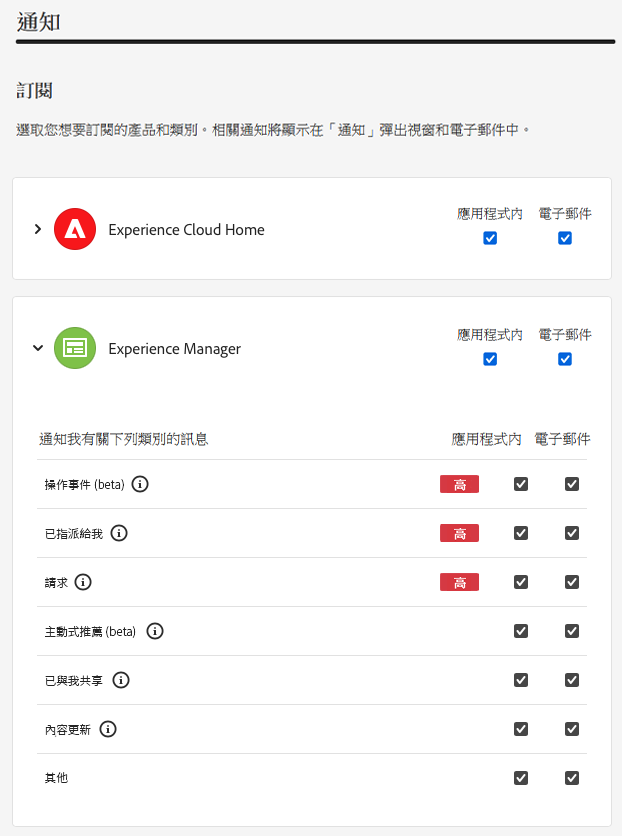

# 通知 {#notifications}

了解 Cloud Manager 如何通知您重要事件。

## Cloud Manager 中的通知 {#cloud-manager-notifications}

[!UICONTROL Cloud Manager] 會在生產部署開始時在生產管道啟動和完成 (成功或不成功) 時傳送通知給您。

這些通知會透過 [!UICONTROL Experience Cloud] 通知系統傳送給具有&#x200B;**企業所有者**、**計畫管理員**&#x200B;和&#x200B;**部署管理員**&#x200B;角色的使用者。

通知會顯示在 [!UICONTROL Cloud Manager] 內的側邊欄中並遍及整個 Adobe [!UICONTROL Experience Cloud]。 當您有新通知時，標題中的鈴鐺圖示會出現標記。

按一下該鈴鐺圖示，即可開啟側邊欄並檢視通知。該側邊欄中的&#x200B;**通知**&#x200B;索引標籤即會顯示最新通知的清單，例如部署確認。通知內容和您的環境有關。

**公告**&#x200B;索引標籤會包括 Adobe 產品的公告。公告內容和產品有關。

按一下任一通知或公告即可檢視其詳細內容。連結至管道部署等活動的通知將帶您了解該活動的詳細資訊，例如管道執行視窗。

按一下面板底部的&#x200B;**檢視全部**&#x200B;選項，即可檢視收件匣中的所有公告。

按一下面板底部的&#x200B;**全部標記為已讀**&#x200B;選項，即可將所有未讀通知標示為已讀取並清除鈴鐺圖示標記。

## 通知設定 {#configuration}

您可以自訂接收通知的方式以及接收哪些通知。

請按一下通知側邊欄頂端的齒輪圖示。

這將開啟 **Experience Cloud 偏好設定**&#x200B;視窗，您可以在此定義通知訂閱內容以及接收通知的方式。

### 訂閱 {#subscriptions}

訂閱會定義您要接收哪些產品的通知和哪些通知。

預設情況下，您將接收所有產品的所有通知。按一下產品旁的&#x200B;**自訂**，即可定義對該產品要接收的通知類型。

### 優先順序 {#priority}

優先警示將標示&#x200B;**高**&#x200B;標記，並可設定為僅接收警示。在&#x200B;**優先順序**&#x200B;區段中，您可以定義哪些類別符合優先通知的條件。

使用下拉式選單，以新增到符合優先條件類別的清單中。按一下類別名稱旁的 X 即可將其刪除。

### 警示 {#alerts}

警示會出現在視窗右上角幾秒鐘。 使用&#x200B;**警示**&#x200B;區段來定義您接收警示的通知。

您可以定義警示的行為。

* **顯示警示** - 定義會觸發警示的通知類型
* **警示應該在畫面上持續顯示，直到我將其關閉為止** - 管控警示是否應該持續顯示 (除非您主動將其關閉)
* **持續時間** - 定義警示應該留在畫面上多久時間 (如果您尚未選擇警示應在畫面上持續顯示)。

### 電子郵件 {#emails}

在所有 Adobe [!UICONTROL Experience Cloud] 解決方案的 Web 使用者介面中都可看到通知。您還能選擇透過&#x200B;**電子郵件**&#x200B;區段中的電子郵件傳送這些通知。

預設情況下並不會傳送電子郵件。您可以選擇按以下週期接收電子郵件：

* 即時
* 每日
* 每週

若選擇&#x200B;**即時通知**，則對於每個通知都會即刻傳送電子郵件。對於&#x200B;**每日摘要**&#x200B;和&#x200B;**每週摘要**，您可以選擇傳送每日摘要的時間以及在星期幾與何時傳送每週摘要。