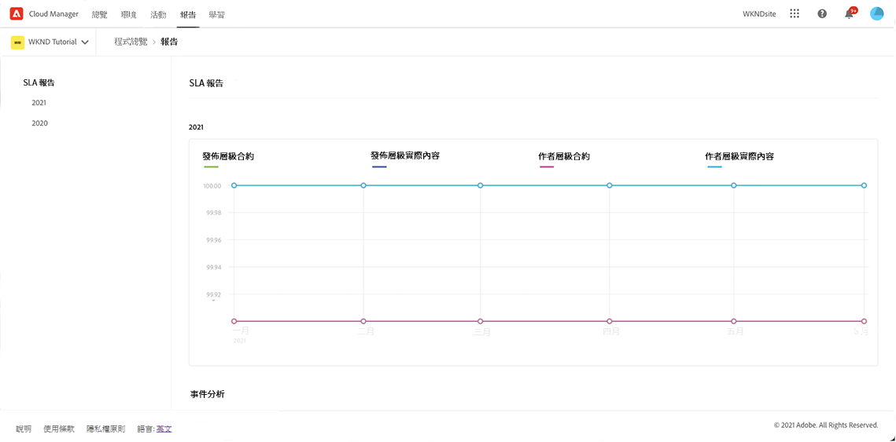
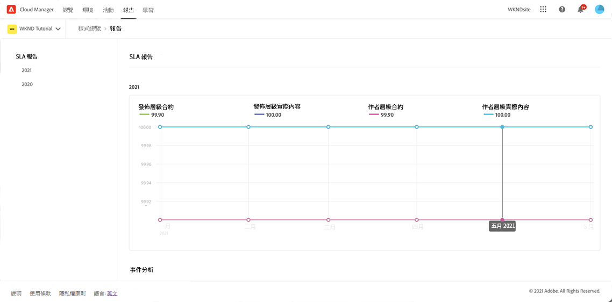
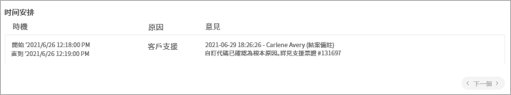

# SLA 報告 {#sla-reporting}

了解如何查看生產 AEM 環境相對於簽訂的服務水平協議 (SLA) 的效能。

## 簡介 {#introduction}

SLA 報告數據可透過&#x200B;**報告**&#x200B;標籤。請依照下列步驟進行存取。

1. 在 [my.cloudmanager.adobe.com](https://my.cloudmanager.adobe.com/) 登入 Cloud Manager 並選取適當的組織和方案。

1. 從&#x200B;**總覽**&#x200B;頁面瀏覽到&#x200B;**報告**&#x200B;索引標籤。

1. 單擊所需的年份以查看繪製的 SLA 數據。

將滑鼠捲動到資料點上以顯示該點的特定值。

## SLA 量度 {#sla-metrics}

所選年份的圖表包括許多資料集。

* **發布層級合約** - 這是您和 Adobe 的合約中為發佈層級定義的 SLA。

* **發布層級實際** - 這是對於由 Adobe 或 Adobe 的廠商引起的生產發佈層級分解事故測量到的運作時間。

* **作者層級合約**：這是您和 Adobe 的合約中為作者層級定義的 SLA。

* **作者層級實際** - 這是對於由 Adobe 或 Adobe 的廠商引起的生產作者層級分解事故測量到的運作時間。

## 事件分析 {#event-analysis}

在此圖表下的&#x200B;**事件分析**&#x200B;區段會顯示在選定年度期間該方案發生的事故組合。

每個事故都有一個時間範圍、一個原因和一連串評論。

