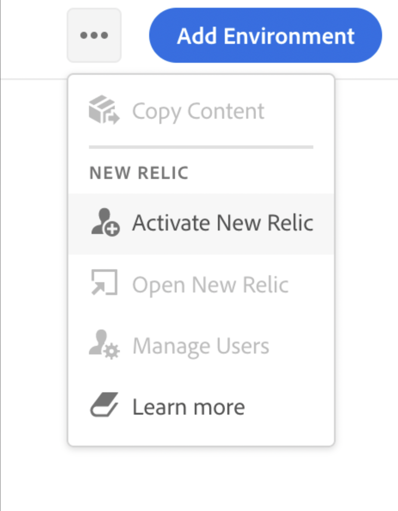

# New Relic One {#user-access}

了解適用於 AEM as a Cloud Service 的 New Relic One 應用程式效能監控 (APM) 服務以及如何存取它。

## 關於New Relic One {#introduction}

Adobe 非常重視應用程式的監控、可用性和效能。AEM as a Cloud Service包括存取New Relic One監控，讓團隊在標準產品方案中可全面掌握系統和環境效能量度。

本檔案概述如何在AEM as a Cloud Service環境中管理對New Relic One應用程式效能監控(APM)功能的存取。 有效管理這些功能可支援最佳效能，並將AEM as a Cloud Service的優點最大化。

建立新的生產計畫時，會自動建立與您的AEM as a Cloud Service計畫關聯的New Relic One子帳戶。 [必須啟動此子帳戶](#activate-sub-account)才能開始擷取資料。

## 功能 {#transaction-monitoring}

用於 AEM as a Cloud Service 的 New Relic One APM 具有許多功能。

* 直接存取專用的 New Relic One 帳戶

* 檢測的 New Relic One 一個 APM 代理，顯示帶有行號的準確方法調用，包括外部依賴項和資料庫

* 透過結合來自基礎設施級監控和應用程式 (Adobe Experience Manager) 監控的關鍵指標來優化整體效能

* AEM as a Cloud Service直接在New Relic Insights中公開Java Management Extensions (JMX) MBean和執行狀況檢查，從而可以深入檢查應用程式效能和執行狀況量度。

## 啟用您的New Relic One子帳戶 {#activate-sub-account}

若是新建立的方案，系統會為您建立New Relic One子帳戶。 不過，您必須啟動它才能擷取資料。 此啟用不是自動的。 請依照下列步驟啟動您的子帳戶。

>[!NOTE]
>
>具有&#x200B;**業務負責人**&#x200B;角色的使用者必須登入才能管理New Relic One子帳戶。

1. 在 [my.cloudmanager.adobe.com](https://my.cloudmanager.adobe.com/) 登入 Cloud Manager 並選取適當的組織。

1. 在&#x200B;**[我的程式](/help/implementing/cloud-manager/navigation.md#my-programs)**&#x200B;主控台上，按一下您要管理New Relic One使用者的程式。

1. 在計畫總覽頁面的&#x200B;**環境**&#x200B;卡片底部，按一下並選取&#x200B;**啟用New Relic**。

   

   * 您也可以存取&#x200B;**管理使用者**&#x200B;選項。 在程式的&#x200B;**環境**&#x200B;畫面頂端，按一下。

1. [對相同的環境執行管道](/help/implementing/cloud-manager/configuring-pipelines/managing-pipelines.md#running-pipelines)以成功完成，以完成子帳戶啟用。

停用子帳戶時，不會擷取任何資料。

## 管理New Relic One使用者 {#manage-users}

按照以下步驟定義與您的 AEM as a Cloud Service 計畫關聯的 New Relic One 子帳戶的使用者。

>[!NOTE]
>
>具有&#x200B;**業務負責人**&#x200B;或&#x200B;**部署管理員**&#x200B;角色的使用者必須登入才能管理New Relic One使用者。

1. 在 [my.cloudmanager.adobe.com](https://my.cloudmanager.adobe.com/) 登入 Cloud Manager 並選取適當的組織。

1. 按一下您要為其管理New Relic One使用者的計畫。

1. 在計畫總覽頁面的&#x200B;**環境**&#x200B;卡片底部，按一下並選取&#x200B;**管理使用者**。

   

   * 您也可以存取&#x200B;**管理使用者**&#x200B;選項。 在程式的&#x200B;**環境**&#x200B;畫面頂端，按一下。

1. 在&#x200B;**管理New Relic使用者**&#x200B;對話方塊中，輸入您要新增的使用者的名字和姓氏，然後按一下&#x200B;**新增**&#x200B;按鈕。 對您要新增的所有使用者重複此步驟。

   

1. 要刪除 New Relic One 使用者，請按一下代表該使用者的行右端的刪除按鈕。

1. 按一下&#x200B;**儲存**&#x200B;以建立收藏集。

定義使用者後，New Relic 會向您授予存取權限的每個使用者發送一封確認電子郵件，以便使用者完成設定過程並登入。

>[!NOTE]
>
>如果您正在管理New Relic One使用者，您也必須將自己新增為使用者，才能自行存取許可權。 作為&#x200B;**業務負責人**&#x200B;或者&#x200B;**部署管理員**&#x200B;不足以存取 New Relic One。您也必須將自己建立為使用者。

## 啟用您的New Relic One使用者帳戶 {#activate-user-account}

一旦按照預覽部分中的說明建立了 New Relic One 使用者帳戶[管理 New Relic One 使用者](#manage-users), New Relic 向這些使用者發送一封確認電子郵件到提供的地址。要使用這些帳戶，使用者必須首先透過重置密碼來激活他們的 New Relic 帳戶。

**啟用您的New Relic One使用者帳戶：**

1. 按一下New Relic電子郵件中提供的連結。

1. 在New Relic登入頁面上，按一下&#x200B;**忘記密碼？**

   

1. 輸入您收到確認電子郵件的電子郵件地址，然後選擇&#x200B;**傳送我的重設連結**。

   

1. New Relic傳送一封電子郵件給您，其中包含確認帳戶的連結。

如果您沒有收到來自New Relic的確認電子郵件，請參閱[疑難排解小節](#troubshooting)。

## 存取New Relic One {#accessing-new-relic}

在您[啟動您的New Relic帳戶](#activate-account)後，您可以透過Cloud Manager或直接存取New Relic One。

**透過Cloud Manager存取New Relic One：**

1. 在 [my.cloudmanager.adobe.com](https://my.cloudmanager.adobe.com/) 登入 Cloud Manager 並選取適當的組織。

1. 按一下您要存取New Relic One的方案。

1. 在計畫總覽頁面的&#x200B;**環境**&#x200B;卡片底部，按一下並選取&#x200B;**開啟New Relic**。

   

   * 您也可以存取New Relic。 在程式的&#x200B;**環境**&#x200B;畫面頂端，按一下。

1. 在打開的新瀏覽器索引標籤中，登入到 New Relic One。

**若要直接存取New Relic One：**

1. 瀏覽 New Relic 至 [`https://login.newrelic.com/login`](https://login.newrelic.com/login) 登入頁面的概覽頁面。

1. 登入 New Relic One。

### 驗證您的電子郵件 {#verify-email}

如果您在登入New Relic One時被要求驗證您的電子郵件，這表示您的電子郵件與多個帳戶相關聯。 您可以選擇要存取的帳戶。

如果您不驗證您的電子郵件地址，New Relic 會嘗試使用與您的電子郵件地址關聯的最近建立的使用者記錄來登入。為避免在每次登入時驗證您的電子郵件，請按一下&#x200B;**記得我**&#x200B;登入畫面中的複選框。

如需更多幫助，請透過 [AEM 支援入口網站](https://helpx.adobe.com/tw/enterprise/using/support-for-experience-cloud.html)開啟支援票證。

## 疑難排解New Relic One使用者存取 {#troubleshooting}

如果您被新增為New Relic One使用者(如[管理New Relic One使用者](#manage-users)中所述)，並且找不到原始帳戶確認電子郵件，您可以執行以下疑難排解步驟。

**若要疑難排解New Relic One使用者存取權：**

1. 瀏覽 New Relic 至 [`login.newrelic.com/login`](https://login.newrelic.com/login) 登入頁面的概覽頁面。

1. 按一下&#x200B;**[!UICONTROL 忘記密碼？]**。

   

1. 輸入用於建立帳戶的電子郵件地址，然後選擇&#x200B;**發送我的重置鏈接**.

   

1. New Relic傳送一封電子郵件給您，其中包含確認帳戶的連結。

如果您完成註冊程式，但由於電子郵件或密碼錯誤訊息而無法登入您的帳戶，請透過[Admin Console](https://adminconsole.adobe.com/)登入支援票證。

如果您沒有收到來自New Relic的電子郵件，請執行以下操作：

* 檢查您的[垃圾郵件過濾器](https://docs.newrelic.com/docs/accounts/accounts-billing/account-setup/create-your-new-relic-account/)。
* 如果適用，[將New Relic新增至您的電子郵件允許清單](https://docs.newrelic.com/docs/accounts/accounts/account-maintenance/account-email-settings/#email-whitelist)。
* 如果這兩個建議都沒有幫助，請提供有關支援票證的反饋。

## 使用說明 {#usage-notes}

* 最多可以新增 30 個使用者。如果已達到最大使用者數，請刪除使用者以便能夠新增新使用者。
* 新增至New Relic的使用者為&#x200B;**Basic**&#x200B;型別。 請參閱[New Relic檔案以取得詳細資料](https://docs.newrelic.com/docs/accounts/accounts-billing/new-relic-one-user-management/user-type/)。
* AEM as a Cloud Service 僅提供 New Relic One APM 解決方案，不支援警報、記錄或 API 整合。

>[!NOTE]
>
>如果在您的New Relic One子帳戶中偵測不到30天或更久的&#x200B;**使用者登入**&#x200B;活動，APM代理程式就會停止。 資料不會從AEM雲端服務傳送至New Relic。 *在重新啟動您的子帳戶之前，不會再次傳送資料。*
>
>請依照本檔案中[啟用您的New Relic One子帳戶](#activate-sub-account)一節中的相同步驟，重新啟用您的New Relic One子帳戶。

如需有關您AEM as a Cloud Service計畫之New Relic One產品的更多說明或其他指引，請透過[AEM支援入口網站](https://helpx.adobe.com/tw/enterprise/using/support-for-experience-cloud.html)開啟支援票證。

## 常見問題 {#faqs}

+++**Adobe使用New Relic One監控什麼？**

Adobe 透過 New Relic One 的 Java 外掛程式監視 AEM as a Cloud Service 創作、發佈和預覽 (如果可用) 服務。Adobe 支援跨非生產和生產 AEM as a Cloud Service 環境的自訂 New Relic One APM 遙測和監控。

您的New Relic One帳戶附加至Adobe維護的主要帳戶，並有多個應用程式向其中報告；每個AEM as a Cloud Service環境三個。

* 每個環境一個作者服務應用程式
* 每個環境一個`Publish`服務應用程式（包括Golden Publish）
* 每個環境一個預覽服務應用程式

注意：

* 每個應用程式使用一個授權密鑰。
* AEM as a Cloud Service環境僅向一個 New Relic One 帳戶報告。
* New Relic One的完整監控量度和事件會保留三個月。

+++

+++**Adobe是否從New Relic One傳送警示通知？**

Adobe僅出於可觀察性目的提供New Relic One存取權，不會將其用於客戶警報或內部營運警報。 使用[使用者通知設定檔](/help/journey-onboarding/notification-profiles.md)傳送任何事件的通知。
+++

+++**誰可以存取New Relic One雲端服務資料？**

會授予您團隊中最多 30 名成員的完全讀取權限。讀取許可權包含New Relic One代理程式收集的所有APM測量結果。
+++

+++**是否支援自訂SSO組態？**

Adobe 提供的 New Relic One 帳戶不支援自訂 SSO 配置。
+++

+++**如果我已經有內部部署New Relic訂閱怎麼辦？**

New Relic One 是 New Relic 的新可觀察性平台，它使 Adobe 支援人員和您的團隊能夠在一個地方觀察、監控和查看指標和事件。

New Relic One 使使用者能夠搜索他們有權存取的所有帳戶，並在一個視圖中可視化來自所有服務和主機的資料。

Adobe支援使用New Relic One和其他工具監視AEM as a Cloud Service，而您的團隊仍然可以使用New Relic提供內部部署服務和基礎架構。 他們能夠可視化來自 Adobe New Relic One 帳戶和客戶管理的 New Relic 帳戶的資料。

>[!NOTE]
>
>要在 New Relic One 中查看這兩個資料集，使用者必須擁有正確的權限並為兩個帳戶 (Adobe New Relic One 和客戶管理的 New Relic 帳戶) 使用相同的登入方法。

+++

+++**我的New Relic One帳戶的APM代理程式已停止。 發生什麼事？**

如果 30 天或更久沒有偵測到任何活動，[APM 代理會停止](#limitations)。請依照本檔案中[啟用您的New Relic One子帳戶](#activate-sub-account)一節中的相同步驟，重新啟用您的New Relic One子帳戶。
+++
