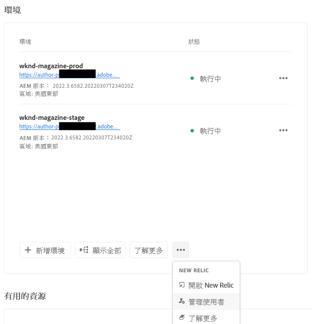
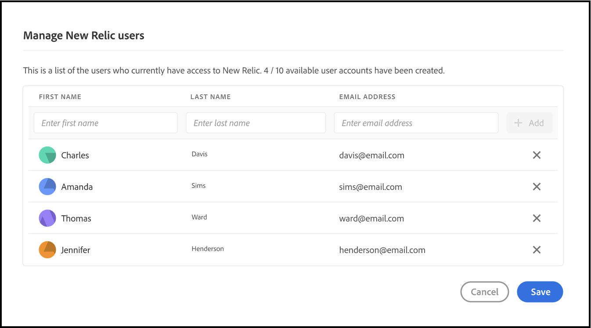
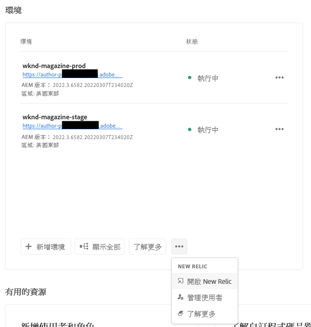

# 新遺跡一號 {#user-access}

了解適用於 AEM as a Cloud Service的 New Relic One 應用程序性能監控 (APM) 服務以及如何存取它。

## 簡介 {#introduction}

Adobe 非常重視應用程序的監控、可用性和性能。AEM as a Cloud Service提供對作為標準產品的一部分的自訂 New Relic One 監控套件的存取，以確保您的團隊最大程度地了解您的 AEM as a Cloud Service 系統和環境性能指標。

本文件介紹瞭如何管理對在 AEM as a Cloud Service環境中啟用的 New Relic One 應用程序性能監控 (APM) 功能的存取，以幫助支援性能並讓您充分利用 AEM as a Cloud Service。

建立新的生產程序時，會自動建立與您的 AEM as a Cloud Service Program 關聯的 New Relic One 子帳戶。

## 功能 {#transaction-monitoring}

用於 AEM as a Cloud Service的 New Relic One APM 具有許多功能。

* 直接存取專屬New Relic One帳戶

* 檢測的 New Relic 一個 APM 代理，顯示帶有行號的準確方法調用，包括外部依賴項和數據庫

* 透過結合來自基礎設施級監控和應用程序 (Adobe Experience Manager) 監控的關鍵指標來優化整體性能

* 直接在 New Relic Insights 指標中公開 AEM as a Cloud Service JMX Mbean 和執行狀況檢查，從而可以深入檢查應用程序堆棧性能和執行狀況指標。

## 管理 New Relic One使用者 {#manage-users}

按照以下步驟定義與您的 AEM as a Cloud Service 計畫關聯的 New Relic One 子帳戶的使用者。

>[!NOTE]
>
>擁有&#x200B;**企業所有者**&#x200B;或&#x200B;**部署管理員**&#x200B;角色的使用者必須登入才能管理 New Relic One 使用者。

1. 在 [my.cloudmanager.adobe.com](https://my.cloudmanager.adobe.com/) 登入 Cloud Manager 並選取適當的組織。

1. 單擊您要為其管理 New Relic One 使用者的程序。

1. 在底部&#x200B;**環境**&#x200B;程序概覽頁面上的卡片，單擊省略符號按鈕並選擇&#x200B;**管理使用者**.

   

   * 您還可以存取&#x200B;**管理使用者**&#x200B;透過頂部的省略符號按鈕選擇&#x200B;**環境**&#x200B;程序的畫面。

1. 在裡面&#x200B;**管理 New Relic 使用者**&#x200B;對話框中，輸入您要新增的使用者的名字和姓氏，然後單擊&#x200B;**新增**&#x200B;按鈕。對您要新增的所有使用者重複此步驟。

   

1. 要刪除 New Relic One 使用者，請單擊代表該使用者的行右端的刪除按鈕。

1. 按一下&#x200B;**儲存**&#x200B;以建立收藏集。

定義使用者後，New Relic 會向您授予存取權限的每個使用者發送一封確認電子郵件，以便使用者完成設定過程並登入。

>[!NOTE]
>
>如果您正在管理 New Relic One 使用者，您還必須將自己新增為使用者才能獲得存取權限。作為&#x200B;**業主**&#x200B;或者&#x200B;**部署管理器**&#x200B;不足以存取 New Relic One。您還必須將自己建立為使用者。

## 激活您 New Relic One 使用者帳戶 {#activate-account}

一旦按照預覽部分中的說明建立了 New Relic One 使用者帳戶[管理 New Relic One 使用者](#manage-users), New Relic 向這些使用者發送一封確認電子郵件到提供的地址。要使用這些帳戶，使用者必須首先透過重置密碼來激活他們的 New Relic 帳戶。

按照以下步驟將您的帳戶激活為 New Relic 使用者。

1. 單擊 New Relic 的電子郵件中提供的鏈接。這會將您的瀏覽器打開到 New Relic 登入頁面。

1. 在 New Relic 登入頁面上，選擇&#x200B;**忘記密碼了嗎？**。

   

1. 輸入您收到確認電子郵件的電子郵件地址，然後選擇&#x200B;**發送我的重置鏈接**.

   

1. New Relic 將向您發送一封電子郵件，其中包含確認帳戶的鏈接。

如果您沒有收到來自 New Relic 的確認電子郵件，請參閱[故障排除部分。](#troubshooting)

## 正在存取 New Relic One {#accessing-new-relic}

一旦你[啟用了您的 New Relic 帳戶，](#activate-account)您可以透過 Cloud Manager 或直接存取 New Relic One。

透過 Cloud Manager 存取 New Relic One：

1. 在 [my.cloudmanager.adobe.com](https://my.cloudmanager.adobe.com/) 登入 Cloud Manager 並選取適當的組織。

1. 存取您要為其管理 New Relic One 使用者的程序。

1. 在底部&#x200B;**環境**&#x200B;程序概覽頁面上的卡片，單擊省略符號按鈕並選擇&#x200B;**打開 New Relic**。

   

   * 您還可以存取 New Relic 透過頂部的省略符號按鈕選擇&#x200B;**環境**&#x200B;程序的畫面。

1. 在打開的新瀏覽器索引標籤中，登入到 New Relic One。

要直接存取 New Relic One：

1. 瀏覽 New Relic 至 [`https://login.newrelic.com/login`](https://login.newrelic.com/login) 登入頁面的概覽頁面。

1. 登入 New Relic One。

### 驗證您的電子郵件 {#verify-email}

如果您在登入 New Relic One 時被要求驗證您的電子郵件，這意味著您的電子郵件與多個帳戶相關聯。這使您可以選擇要存取的帳戶。

如果您不驗證您的電子郵件地址，New Relic 將嘗試使用與您的電子郵件地址關聯的最近建立的使用者記錄來登入。為避免在每次登入時驗證您的電子郵件，請單擊&#x200B;**記得我**&#x200B;登入畫面中的複選框。

如需更多幫助，請透過以下方式打開支援票證 [AEM 支援門戶](https://helpx.adobe.com/tw/enterprise/using/support-for-experience-cloud.html)。

## 偵錯 New Relic One Access {#troubleshooting}

如果您被新增為 New Relic One 使用者，如章節中所述[管理 New Relic One 使用者](#manage-users)並且找不到原始帳戶確認電子郵件，請按照以下步驟操作。

1. 瀏覽 New Relic 至 [`login.newrelic.com/login`](https://login.newrelic.com/login) 登入頁面的概覽頁面。

1. 選取「**忘記密碼**」。

   

1. 輸入用於建立帳戶的電子郵件地址，然後選擇&#x200B;**發送我的重置鏈接**.

   

1. New Relic 將向您發送一封電子郵件，其中包含確認帳戶的鏈接。

如果您完成註冊過程但由於電子郵件或密碼錯誤消息而無法登入您的帳戶，請透過 [Admin Console](https://adminconsole.adobe.com/) 登入支援票證。

如果您沒有收到來自 New Relic 的電子郵件：

* 檢查你的[垃圾郵件過濾器](https://docs.newrelic.com/docs/accounts/accounts-billing/account-setup/create-your-new-relic-account/)。
* 如果適用，[將 New Relic 新增到您的電子郵件允許清單](https://docs.newrelic.com/docs/accounts/accounts/account-maintenance/account-email-settings/#email-whitelist)。
* 如果這些建議都沒有幫助，請提供有關支援票證的反饋，Adobe 支援團隊將進一步幫助您。

## 限制 {#limitations}

以下限制適用於將使用者新增到 New Relic One：

* 最多可以新增 25 個使用者。如果已達到最大使用者數，請刪除使用者以便能夠新增新使用者。
* 新增到 New Relic 的使用者將屬於以下類型&#x200B;**受限制的**&#x200B;參考[有關詳細資訊，請參閱 New Relic 文件。](https://docs.newrelic.com/docs/accounts/original-accounts-billing/original-users-roles/users-roles-original-user-model/#:~:text=在%20general%2C%20Admins%20take%20responsibility, Restricted%20Users%20can%20use%20them.&amp;text=One%20or%20more%20individuals%20who,change)%20any%20New%20Relic%20features.)
* AEM as a Cloud Service僅提供 New Relic One APM 解決方案，不支援警報、記錄或 API 整合。

有關 AEM as a Cloud Service計劃的 New Relic One 產品的更多幫助或其他指導，請透過以下方式打開支援票證[AEM 支援門戶](https://helpx.adobe.com/enterprise/using/support-for-experience-cloud.html)。

## 與 New Relic One 有關的常見問答 {#faqs}

### Adobe 使用 New Relic One 監控什麼？ {#adobe-monitor}

Adobe 透過 New Relic One 的 Java 外掛程式監視 AEM as a Cloud Service 創作、發佈和預覽 (如果可用) 服務。Adobe 支援跨非生產和生產 AEM as a Cloud Service 環境的自訂 New Relic One APM 遙測和監控。

您的 New Relic One 帳戶附加到 Adobe 維護的主帳戶，並有多個應用程序向其中報告：每個 AEM as a Cloud Service環境三個。

* 每個環境一個作者服務應用程序
* 每個環境一個發布服務應用程序（包括 Golden Publish）
* 每個環境一個預覽服務應用程序

請注意:

* 每個應用程序使用一個授權密鑰。
* AEM as a Cloud Service環境僅向一個 New Relic One 帳戶報告。
* New Relic One 的完整監控指標和事件將保留 7 天。

### 誰可以存取 New Relic One cloud 服務數據？ {#access-new-relic-cloud}

將授予您團隊中最多 10 名成員的完全讀取權限。讀取權限將包括 New Relic One 代理收集的所有 APM 指標。

### 是否支援自訂 SSO 配置？ {#custom-sso}

Adobe 提供的 New Relic One 帳戶不支援自訂 SSO 配置。

### 如果我已經有本機 New Relic 訂閱怎麼辦？ {#new-relic-subscription}

New Relic One 是 New Relic 的新可觀察性平台，它使 Adobe 支援人員和您的團隊能夠在一個地方觀察、監控和查看指標和事件。

New Relic One 使使用者能夠搜索他們有權存取的所有帳戶，並在一個視圖中可視化來自所有服務和主機的數據。

雖然 Adobe 支援將使用 New Relic One 和其他內部工具作為您服務的一部分來監控 AEM as a Cloud Service 應用程序，但您的團隊可以繼續將 New Relic 用於本機託管服務和基礎架構。他們將能夠可視化來自 Adobe New Relic One 帳戶和客戶管理的 New Relic 帳戶的數據。

>[!NOTE]
>
>要在 New Relic One 中查看這兩個數據集，使用者必須擁有正確的權限並為兩個帳戶（Adobe New Relic One 和客戶管理的 New Relic 帳戶）使用相同的登入方法。
