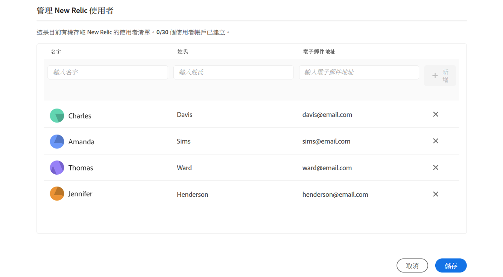

# 新遺跡一號 {#user-access}

了解適用於AEMas a Cloud Service的New Relic One應用程式效能監控(APM)服務，以及您如何存取該服務。

## 簡介 {#introduction}

Adobe非常重視應用程式的監控、可用性和效能。 AEM as a Cloud Service提供對自訂New Relic One監控套裝的存取，此為標準產品產品的一部分，可確保您的團隊能最充分地掌握AEMas a Cloud Service系統和環境效能量度。

本檔案說明如何管理對在AEMas a Cloud Service環境上啟用的New Relic One應用程式效能監控(APM)功能的存取，以協助支援效能，並讓您充份運用AEMas a Cloud Service。

建立新生產程式時，會自動建立與您的AEMas a Cloud Service程式相關聯的New Relic One子帳戶。

## 功能 {#transaction-monitoring}

適用於AEMas a Cloud Service的New Relic One APM有許多功能。

* 直接存取專用的New Relic One帳戶(由Adobe支援管理的存取權)

* 檢測的New Relic One APM代理，用行號顯示精確的方法調用，包括外部依賴項和資料庫

* 結合基礎架構級監控和應用程式(Adobe Experience Manager)監控的關鍵指標，實現整體效能最佳化

* 直接在New Relic Insights量度中暴露AEMas a Cloud ServiceJMX Mbeans和運行狀況檢查，以便對應用程式堆棧效能和運行狀況量度進行深入檢查。

## 管理New Relic One用戶 {#manage-users}

請依照下列步驟來定義與AEMas a Cloud Service計畫相關聯的New Relic One子帳戶的使用者。

>[!NOTE]
>
>中的使用者 **業務負責人** 或 **部署管理員** 角色必須登入才能管理New Relic One使用者。

1. 登入Cloud Manager，網址為 [my.cloudmanager.adobe.com](https://my.cloudmanager.adobe.com/) 並選取適當的組織。

1. 按一下您要為其管理New Relic One用戶的程式。

1. 在 **環境** 程式概述頁面上的資訊卡，按一下省略號按鈕，然後選取 **管理使用者**.

   

   * 您也可以存取 **管理使用者** 選項 **環境** 螢幕上顯示。

1. 在 **管理新舊用戶** 對話框，輸入要添加的用戶的名字和姓氏，然後按一下 **新增** 按鈕。 對您要新增的所有使用者重複此步驟。

   

1. 若要移除New Relic One使用者，請按一下代表使用者之列右端的刪除按鈕。

1. 按一下 **儲存** 來建立使用者。

定義使用者後，New Relic會傳送確認電子郵件給您有權存取的每個使用者，讓使用者完成設定程式並登入。

>[!NOTE]
>
>如果您管理New Relic One使用者，您也必須將自己新增為使用者，才能擁有存取權。 是 **業務負責人** 或 **部署管理員** 不足以存取New Relic One。 您也必須將自己建立為使用者。

## 啟動您的新Relic One使用者帳戶 {#activate-account}

如預覽區段所述，建立New Relic One使用者帳戶後 [管理New Relic One用戶](#manage-users),New Relic會向這些使用者傳送確認電子郵件至所提供的地址。 若要使用這些帳戶，使用者必須先透過重設密碼，透過New Relic啟動其帳戶。

請依照下列步驟，以New Relic使用者身分啟用您的帳戶。

1. 按一下New Relic寄送的電子郵件中提供的連結。 這會開啟您的瀏覽器，前往「新舊」登入頁面。

1. 在「新建文物」登入頁面上，選取 **忘記密碼了？**.

   

1. 輸入您收到確認電子郵件的電子郵件地址，然後選取 **傳送我的重設連結**.

   

1. New Relic會傳送電子郵件給您，內含確認帳戶的連結。

若您未收到New Relic寄來的確認電子郵件，請參閱 [疑難排解一節。](#troubshooting)

## 訪問New Relic One {#accessing-new-relic}

一旦您 [啟用了新舊帳戶，](#activate-account) 您可以透過Cloud Manager或直接存取New Relic One。

若要透過Cloud Manager存取New Relic One:

1. 登入Cloud Manager，網址為 [my.cloudmanager.adobe.com](https://my.cloudmanager.adobe.com/) 並選取適當的組織。

1. 按一下要訪問New Relic One的程式。

1. 在 **環境** 程式概述頁面上的資訊卡，按一下省略號按鈕，然後選取 **開啟新文物**.

   

   * 您也可以透過 **環境** 螢幕上顯示。

1. 在開啟的新瀏覽器標籤中，登入New Relic One。

要直接訪問New Relic One:

1. 導覽至New Relic的登入頁面，網址為 [`https://login.newrelic.com/login`](https://login.newrelic.com/login)

1. 登入New Relic One。

### 驗證您的電子郵件 {#verify-email}

如果您在登入New Relic One期間被要求驗證電子郵件，表示您的電子郵件與多個帳戶相關聯。 這可讓您選擇要存取的帳戶。

如果您未驗證電子郵件地址，New Relic會嘗試將您與您電子郵件地址相關聯的最近建立的使用者記錄登入。 若要避免在每次登入時驗證您的電子郵件，請按一下 **記住我** 「登入」畫面中的核取方塊。

如需更多協助，請透過 [AEM支援入口網站](https://helpx.adobe.com/tw/enterprise/using/support-for-experience-cloud.html).

## 疑難排解New Relic One存取 {#troubleshooting}

如果您新增為New Relic One使用者，如 [管理New Relic One用戶](#manage-users) 而且無法依照下列步驟找到原始帳戶確認電子郵件。

1. 導覽至New Relic的登入頁面，網址為 [`login.newrelic.com/login`](https://login.newrelic.com/login).

1. 選擇 **忘記密碼了？**.

   

1. 輸入用來建立帳戶的電子郵件地址，然後選取 **傳送我的重設連結**.

   

1. New Relic會傳送電子郵件給您，內含確認帳戶的連結。

如果您完成註冊過程，並且由於電子郵件或密碼錯誤消息而無法登錄您的帳戶，請通過 [Admin Console。](https://adminconsole.adobe.com/)

如果您未收到New Relic寄來的電子郵件：

* 檢查 [垃圾郵件篩選器](https://docs.newrelic.com/docs/accounts/accounts-billing/account-setup/create-your-new-relic-account/).
* 若適用， [將New Relic新增至您的電子郵件允許清單](https://docs.newrelic.com/docs/accounts/accounts/account-maintenance/account-email-settings/#email-whitelist).
* 如果建議都不有幫助，請提供有關支援票證的反饋，Adobe支援團隊將進一步幫助您。

## 限制 {#limitations}

新增使用者至New Relic One時，會套用下列限制：

* 最多可新增25個使用者。 如果已達到最大用戶數，請刪除用戶，以便能夠添加新用戶。
* 新增至New Relic的使用者將屬於 **受限** 請參閱 [如需詳細資訊，請參閱New Relic檔案。](https://docs.newrelic.com/docs/accounts/original-accounts-billing/original-users-roles/users-roles-original-user-model/#:~:text=In%20general%2C%20Admins%20take%20responsibility,Restricted%20Users%20can%20use%20them.&amp;text=One%20或%20more%20pendiols%20who，更改)%20any%20New%20Relic%20features。)
* AEM as a Cloud Service僅提供New Relic One APM解決方案，不提供警報、記錄或API整合的支援。

如需AEMas a Cloud Service計畫New Relic One產品的更多說明或其他指引，請透過 [AEM支援入口網站](https://helpx.adobe.com/enterprise/using/support-for-experience-cloud.html).

## 關於New Relic One的常見問題 {#faqs}

### Adobe用New Relic One監視什麼？ {#adobe-monitor}

Adobe會透過New Relic One的Java外掛程式監控AEMas a Cloud Service作者、發佈及預覽（若有）服務。 Adobe可跨非生產和生產AEMas a Cloud Service環境啟用自訂New Relic One APM遙測和監控。

您的New Relic One帳戶已附加至Adobe維護的主要帳戶，且有多個應用程式向其報告：每個AEMas a Cloud Service環境3個。

* 針對每個環境製作服務的一個應用程式
* 每個環境（包括Golden Publish）適用於發佈服務的一個應用程式
* 針對每個環境預覽服務的一個應用程式

請注意:

* 每個應用程式使用一個許可證密鑰。
* AEMas a Cloud Service環境只會向一個New Relic One帳戶報告。
* New Relic One的完整監控量度和事件都會保留7天。

### 誰可以存取New Relic One雲端服務資料？ {#access-new-relic-cloud}

最多可授予團隊10名成員的完整讀取存取權。 讀取存取權將包含New Relic One代理程式收集的所有APM量度。

### 是否支援自訂SSO設定？ {#custom-sso}

由Adobe布建的New Relic One帳戶不支援自訂SSO設定。

### 如果我已有內部New Relic訂購，該怎麼辦？ {#new-relic-subscription}

New Relic One是New Relic推出的可觀察性新平台，可讓Adobe支援和您的團隊在單一位置觀察、監控和檢視量度與事件。

New Relic One讓使用者能夠在有存取權的所有帳戶中進行搜尋，並以單一檢視將來自所有服務和主機的資料視覺化。

雖然Adobe支援將使用New Relic One和其他內部工具監控AEMas a Cloud Service應用程式，但您的團隊仍可繼續利用New Relic進行內部托管服務和基礎架構。 他們將能夠直觀地顯示AdobeNew Relic One帳戶和客戶管理的New Relic帳戶的資料。

>[!NOTE]
>
>若要在New Relic One中查看兩個資料集，用戶必須擁有正確的權限，並且對兩個帳戶(AdobeNew Relic One和客戶管理的New Relic帳戶)使用相同的登錄方法。
