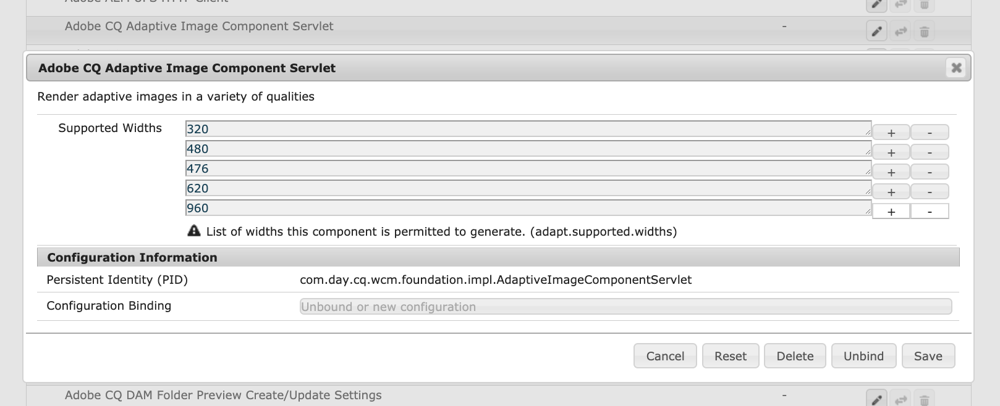

# 為Adobe Experience Manager as a Cloud Service配置OSGi {#configuring-osgi-for-aem-as-a-cloud-service}

>[!NOTE]
>
>已AEM經引入了使用Cloud Manager用戶介面配置2021.12.0版標準環境變數的功能。 有關詳細資訊，請參閱文檔 [這裡](/help/implementing/cloud-manager/environment-variables.md)。

[OSGi](https://www.osgi.org/) 是Adobe Experience Manager(M)技術中的一個基本AEM要素。 它用於控制複合材料束AEM及其構型。

OSGi提供了標準化原語，允許應用程式由小型、可重用和協作的元件構建。 這些元件可以組合成應用程式並部署。 這允許輕鬆管理OSGi捆綁包，因為它們可以單獨停止、安裝和啟動。 互依關係將自動處理。 每個OSGi元件都包含在各種束中的一個。 有關詳細資訊，請參見 [OSGi規範](https://www.osgi.org/Specifications/HomePage)。

您可以通過代碼項目的一部分配置檔案來管理OSGi元件的配AEM置設定。

## OSGi配置檔案 {#osgi-configuration-files}

配置更改在項AEM目的代碼包中定義(`ui.apps`)作為配置檔案(`.cfg.json`)在運行模式特定的配置資料夾下：

`/apps/example/config.<runmode>`

OSGi配置檔案的格式基於JSON，使用 `.cfg.json` 格式。

OSGi配置通過其持久標識(PID)來目標OSGi元件，該標識預設為OSGi元件的Java™類名。 例如，為通過以下方式實現的OSGi服務提供OSGi配置：

`com.example.workflow.impl.ApprovalWorkflow.java`

OSGi配置檔案的定義位置：

`/apps/example/config/com.example.workflow.impl.ApprovalWorkflow.cfg.json`

以 `cfg.json` OSGi配置格式。

>[!NOTE]
>
>使用不同文AEM件格式(如 `.cfg`。 `.config` 和XML `sling:OsgiConfig` 資源定義。 這些格式由 `.cfg.json` OSGi配置格式。

## 運行模式解析 {#runmode-resolution}

>[!TIP]
>
>AEM 6.x支援自定義運行模式，AEM但as a Cloud Service不支援。 AEMas a Cloud Service [精確的運行模式集](./overview.md#runmodes)。 必須使用以下方法處理AEMas a Cloud Service環境之間OSGi配置的任何變化 [OSGi配置環境變數](#environment-specific-configuration-values)。

通過使用運行模式，特定OSGiAEM配置可以針對特定實例。 要使用運行模式，請在 `/apps/example` （其中示例為項目名稱），格式為：

`/apps/example/config.<author|publish>.<dev|stage|prod>/`

如果配置資料夾名稱中定義的運行模式與使用的運行模式匹配，則使用此類資料夾中的任何OSGi配AEM置。

例如，如果使AEM用運行模式作者和開發，則中的配置節點 `/apps/example/config.author/` 和 `/apps/example/config.author.dev/` 應用時，配置節點 `/apps/example/config.publish/` 和 `/apps/example/config.author.stage/` 的子菜單。

如果同一PID的多個配置可用，則應用具有最大數量匹配運行模式的配置。

此規則的粒度處於PID級別。 這表示您無法為中的同一PID定義某些屬性 `/apps/example/config.author/` 更具體的 `/apps/example/config.author.dev/` 同一PID。 匹配運行模式數最多的配置對整個PID有效。

>[!NOTE]
>
>A `config.preview` OSGi配置資料夾 **不能** 以與 `config.publish` 可以聲明資料夾。 相反，預覽層從發佈層的值繼承其OSGi配置。

本地開發時，運行模式啟動參數， `-r`，用於指定運行模式OSGI配置。

```shell
$ java -jar aem-sdk-quickstart-xxxx.x.xxx.xxxx-xxxx.jar -r publish,dev
```

### 驗證運行模式

AEM根據環境類型和服務定義了as a Cloud Service的運行模式。 查看 [可用as a Cloud Service運行模AEM式的完整清單](./overview.md#runmodes)。

運行模式指定的OSGi配置值可通過以下方式驗證：

1. 開啟AEM為Cloud Services環境 [開發人員控制台](https://experienceleague.adobe.com/docs/experience-manager-learn/cloud-service/debugging/debugging-aem-as-a-cloud-service/developer-console.html)
1. 使用 __莢__ 下拉清單
1. 選擇 __狀態__ 頁籤
1. 選擇 __配置__ 從 __狀態轉儲__ 下拉清單
1. 選擇 __獲取狀態__ 按鈕

結果視圖顯示所選層的所有OSGi元件配置及其適用的OSGi配置值。 這些值可以與項目原始碼中的OSGi配置值AEM交叉引用，該代碼位於 `/apps/example/osgiconfig/config.<runmode(s)>`。


要驗證是否應用了相應的OSGi配置值：

1. 在開發人員控制台的配置輸出中
1. 查找 `pid` 表示要驗證的OSGi配置；這是項目原始碼中OSGi配AEM置檔案的名稱。
1. Inspect `properties` 清單 `pid` 並驗證要驗證的運行模式的項目原始碼中AEM的OSGi配置檔案與密鑰和值是否匹配。=


## OSGi配置值的類型 {#types-of-osgi-configuration-values}

OSGi的組態值有三種，可與Adobe Experience Manager as a Cloud Service一起使用。

1. **內聯值**，這些值被硬編碼到OSGi配置中並儲存在Git中。 例如：

   ```json
   {
      "connection.timeout": 1000
   }
   ```

1. **秘密值**，這些值出於安全原因不能儲存在Git中。 例如：

   ```json
   {
   "api-key": "$[secret:server-api-key]"
   } 
   ```

1. **特定於環境的值**，這些值在開發環境中不同，因此無法按運行模式準確確定目標(因為有單個 `dev` 在Adobe Experience Manager as a Cloud Service)。 例如：

   ```json
   {
    "url": "$[env:server-url]"
   }
   ```

   請注意，單個OSGi配置檔案可以結合使用這些配置值類型的任意組合。 例如：

   ```json
   {
   "connection.timeout": 1000,
   "api-key": "$[secret:server-api-key]",
   "url": "$[env:server-url]"
   }
   ```

## 如何選擇適當的OSGi配置值類型 {#how-to-choose-the-appropriate-osgi-configuration-value-type}

OSGi的常見事例使用內聯OSGi配置值。 特定於環境的配置僅用於開發環境之間值不同的特定使用情形。


特定於環境的配置擴展了包含內聯值的傳統靜態定義的OSGi配置，從而提供了通過Cloud Manager API從外部管理OSGi配置值的能力。 瞭解何時應使用定義內嵌值並將其儲存在Git中的常用和傳統方法，而不是將這些值抽象為特定於環境的配置，這一點非常重要。

以下指導說明何時使用非機密和機密環境特定配置：

### 何時使用內聯配置值 {#when-to-use-inline-configuration-values}

內聯配置值被視為標準方法，並應盡可能使用。 內聯配置提供以下優點：

* 它們被維護，管理和版本歷史以Git為單位
* 值與代碼部署隱式關聯
* 它們不需要任何額外的部署考慮或協調

無論何時定義OSGi配置值，都以內聯值開始，並且只在必要時為使用案例選擇機密或特定於環境的配置。

### 何時使用非機密環境特定的配置值 {#when-to-use-non-secret-environment-specific-configuration-values}

僅使用特定於環境的配置(`$[env:ENV_VAR_NAME]`)中的非機密配置值。 這包括地方開發實例和Adobe Experience Manager as a Cloud Service任何開發環境。 除了為預覽層設定唯一值外，請避免為Adobe Experience Manager as a Cloud Service舞台或生產環境使用非機密環境特定的配置。

* 僅對發佈層和預覽層之間不同的配置值，或開發環境之間不同的值（包括本地開發實例）使用非機密環境特定的配置。
* 除了預覽層需要與發佈層不同的方案外，請使用OSGi配置中的標準內聯值來指定階段和生產非機密值。 因此，建議不要使用特定於環境的配置來方便在運行時對舞台和生產環境進行配置更改；這些更改應通過原始碼管理引入。

### 何時使用機密環境特定的配置值 {#when-to-use-secret-environment-specific-configuration-values}

Adobe Experience Manager as a Cloud Service要求使用特定於環境的配置(`$[secret:SECRET_VAR_NAME]`)，例如密碼、專用API密鑰或出於安全原因無法儲存在Git中的任何其他值。

使用特定於機密環境的配置在所有Adobe Experience Manager as a Cloud Service環境（包括舞台和生產）上儲存機密的價值。

## 建立OSGi配置 {#creating-sogi-configurations}

有兩種建立OSGi配置的方法，如下所述。 前一種方法通常用於配置由開發者具有眾所周知的OSGi屬性和值的定製OSGi元件，而後一種方法用於提供AEM的OSGi元件。

### 編寫OSGi配置 {#writing-osgi-configurations}

JSON格式的OSGi配置檔案可以直接在項目中手工AEM寫入。 這通常是為知名OSGi元件建立OSGi配置的最快方法，特別是為由定義這些配置的同一開發人員設計和開發的定製OSGi元件。 此方法還可用於跨各種運行模式資料夾複製/貼上和更新同一OSGi元件的配置。

1. 在IDE中，開啟 `ui.apps` 項目、查找或建立配置資料夾(`/apps/.../config.<runmode>`)針對新OSGi配置需要執行的運行模式
1. 在此配置資料夾中，建立新 `<PID>.cfg.json` 的子菜單。 PID是OSGi元件的持久標識。 通常是OSGi元件實現的全類名。 例如：
   `/apps/.../config/com.example.workflow.impl.ApprovalWorkflow.cfg.json`
請注意，OSGi配置工廠檔案名使用 `<factoryPID>-<name>.cfg.json` 命名約定
1. 開啟新 `.cfg.json` ，並在 [JSON OSGi配置格式](https://sling.apache.org/documentation/bundles/configuration-installer-factory.html#configuration-files-cfgjson-1)。
1. 將更改保存到新 `.cfg.json` 檔案
1. 將新OSGi配置檔案添加並提交到Git

### 使用SDK快速啟動生成AEMOSGi配置 {#generating-osgi-configurations-using-the-aem-sdk-quickstart}

SDK快AEM速啟動Jar的AEMWeb控制台可用於配置OSGi元件，並將OSGi配置導出為JSON。 這對於配置提供AEM的OSGi元件非常有用，其OSGi屬性及其值格式可能未被定義項目中OSGi配置的開發人員充分理AEM解。

>[!NOTE]
>
>Web控AEM制台的配置UI會寫入 `.cfg.json` 檔案到儲存庫。 因此，當項目定義的OSGi配置可能與生成的配置不同時，要注意這一點，以避免在AEM本地開發過程中出現潛在的意外行為。

1. 以管理員用AEM戶身份登錄到SDK Quickstart Jar的AEMWeb控制台
1. 導航到OSGi >配置
1. 要配置，請找到OSGi元件並點擊其標題進行編輯
   
1. 根據需要通過Web UI編輯OSGi配置屬性值
1. 將永久標識(PID)記錄到安全位置。 稍後用於生成OSGi配置JSON
1. 點擊「保存」
1. 導航到OSGi > OSGi安裝程式配置打印機
1. 在步驟5中複製的PID中貼上，確保序列化格式設定為「OSGi配置器JSON」
1. 點擊打印
1. JSON格式的OSGi配置將顯示在「序列化配置屬性」部分
   
1. 在IDE中，開啟 `ui.apps` 項目、查找或建立配置資料夾(`/apps/.../config.<runmode>`)針對新OSGi配置所需的運行模式。
1. 在此配置資料夾中，建立新 `<PID>.cfg.json` 的子菜單。 PID與步驟5中的值相同。
1. 將序列化配置屬性從步驟10貼上到 `.cfg.json` 的子菜單。
1. 將更改保存到新 `.cfg.json` 的子菜單。
1. 將新OSGi配置檔案添加並提交到Git。


## OSGi配置屬性格式 {#osgi-configuration-property-formats}

### 內聯值 {#inline-values}

內聯值按照標準JSON語法格式化為標準名稱 — 值對。 例如：

```json
{
   "my_var1": "val",
   "my_var2": [ "abc", "def" ],
   "my_var3": 500
}
```

### 特定於環境的配置值 {#environment-specific-configuration-values}

OSGi配置應為要按環境定義的變數分配佔位符：

```
use $[env:ENV_VAR_NAME]
```

客戶只應將此技術用於與其自定義代碼相關的OSGi配置屬性；它不能用於覆蓋Adobe定義的OSGi配置。

>[!NOTE]
>
>佔位符不能用於 [重點語句](/help/implementing/deploying/overview.md#repoinit)。

### 機密配置值 {#secret-configuration-values}

OSGi配置應為要根據環境定義的機密指定佔位符：

```
use $[secret:SECRET_VAR_NAME]
```

### 變數命名 {#variable-naming}

以下內容適用於特定環境的配置值和機密配置值。

變數名稱必須遵循以下規則：

* 最小長度：2
* 最大長度：100
* 必須匹配regex: `[a-zA-Z_][a-zA-Z_0-9]*`

變數的值不能超過2048個字元。

>[!CAUTION]
>
>對於變數名稱，有與使用某些前置詞相關的規則：
>
>1. 變數名稱前置詞為 `INTERNAL_`。 `ADOBE_`或 `CONST_` 由Adobe保留。 將忽略以這些前置詞開頭的任何客戶集變數。
>
>1. 客戶不得引用前置詞為的變數 `INTERNAL_` 或 `ADOBE_` 或者。
>
>1. 帶前置詞的環境變數 `AEM_` 由產品定義為由客戶使用和設定的公共API。
   >   客戶可以使用並設定以前置詞開頭的環境變數 `AEM_` 他們不應使用此前置詞定義自己的變數。


### 預設值 {#default-values}

以下內容適用於特定環境的配置值和機密配置值。

如果未設定每個環境的值，則在運行時不替換佔位符，並保留佔位符，因為未發生插值。 為避免這種情況，可以使用以下語法作為佔位符的一部分提供預設值：

```
$[env:ENV_VAR_NAME;default=<value>]
```

如果提供了預設值，則佔位符將替換為每個環境的值（如果提供）或提供的預設值。

### 地方發展 {#local-development}

以下內容適用於特定環境的配置值和機密配置值。

可以在本地環境中定義變數，以便在運行時由本地環境AEM拾取變數。 例如，在Linux®上：

```bash
export ENV_VAR_NAME=my_value
```

建議編寫一個簡單的bash指令碼，用於設定配置中使用的環境變數並在啟動之前執行該腳AEM本。 工具，如 [https://direnv.net/](https://direnv.net/) 幫助簡化此方法。 根據值的類型，如果可以在每個人之間共用，則可能會將它們簽入原始碼管理。

從檔案中讀取機密值。 因此，對於使用機密的每個佔位符，必須建立包含機密值的文本檔案。

例如， `$[secret:server_password]` 使用，名為 **伺服器密碼** 必須建立。 所有這些機密檔案必須儲存在同一目錄和framework屬性中 `org.apache.felix.configadmin.plugin.interpolation.secretsdir` 必須使用該本地目錄進行配置。

### 作者與發佈配置 {#author-vs-publish-configuration}

如果OSGi屬性需要不同的作者值和發佈值：

* 獨立 `config.author` 和 `config.publish` 必須使用OSGi資料夾，如 [「運行模式解析度」部分](#runmode-resolution)。
* 建立應使用的獨立變數名稱有兩個選項：
   * 第一個選項，建議：在所有OSGi資料夾中(如 `config.author` 和 `config.publish`)聲明以定義不同的值，請使用相同的變數名。 例如
      `$[env:ENV_VAR_NAME;default=<value>]`，其中預設值與該層（作者或發佈）的預設值相對應。 當通過 [雲管理器API](#cloud-manager-api-format-for-setting-properties) 或通過客戶端，使用本中所述的「service」參數區分層 [API參考文檔](https://www.adobe.io/apis/experiencecloud/cloud-manager/api-reference.html#/Variables/patchEnvironmentVariables)。 「service」參數將變數的值綁定到相應的OSGi層。 它可以是「作者」、「發佈」或「預覽」。
   * 第二個選項，即使用前置詞(如 `author_<samevariablename>` 和 `publish_<samevariablename>`

### 配置示例 {#configuration-examples}

在下面的示例中，假定除了階段和生產環境外還有三個開發環境。

**示例1**

目的是為OSGi屬性的值 `my_var1` 對於階段和prod相同，但對於三個dev環境中的每個環境不同。

<table>
<tr>
<td>
<b>資料夾</b>
</td>
<td>
<b>myfile.cfg.json的內容</b>
</td>
</tr>
<tr>
<td>
config
</td>
<td>
<pre>
{ "my var1":"val"、"myvar2":"abc"、"my_var3":500 }
</pre>
</td>
</tr>
<tr>
<td>
config.dev
</td>
<td>
<pre>
{ "my_var1" :"$[env:my_var1]" "my_var2":"abc"、"my_var3":500 }
</pre>
</td>
</tr>
</table>

**示例2**

目的是為OSGi屬性的值 `my_var1` 對於階段、prod和三個dev環境中的每個環境都不同。 因此，必須調用Cloud Manager API以設定 `my_var1` 每個dev環境。

<table>
<tr>
<td>
<b>資料夾</b>
</td>
<td>
<b>myfile.cfg.json的內容</b>
</td>
</tr>
<tr>
<td>
config.stage
</td>
<td>
<pre>
{ "my var1":"val1"、"myvar2":"abc"、"my_var3":500 }
</pre>
</td>
</tr>
<tr>
<td>
config.prod
</td>
<td>
<pre>
{ "my var1":"val2"、"myvar2":"abc"、"my_var3":500 }
</pre>
</td>
</tr>
<tr>
<td>
config.dev
</td>
<td>
<pre>
{ "my_var1" :"$[env:my_var1]" "my_var2":"abc"、"my_var3":500 }
</pre>
</td>
</tr>
</table>

**示例3**

目的是為OSGi屬性的值 `my_var1` 對於階段、生產環境和開發環境中的一個環境，則相同，但對於其他兩個開發環境，則不同。 在這種情況下，必須調用Cloud Manager API以設定 `my_var1` 適用於每個dev環境，包括應具有與階段和生產相同值的dev環境。 它不會繼承資料夾中設定的值 **配置**。

<table>
<tr>
<td>
<b>資料夾</b>
</td>
<td>
<b>myfile.cfg.json的內容</b>
</td>
</tr>
<tr>
<td>
配置
</td>
<td>
<pre>
{ "my var1":"val1"、"myvar2":"abc"、"my_var3":500 }
</pre>
</td>
</tr>
<tr>
<td>
config.dev
</td>
<td>
<pre>
{ "my_var1" :"$[env:my_var1]" "my_var2":"abc"、"my_var3":500 }
</pre>
</td>
</tr>
</table>

要實現此目的，另一種方法是在config.dev資料夾中為替換令牌設定預設值，使其與 **配置** 的子菜單。

<table>
<tr>
<td>
<b>資料夾</b>
</td>
<td>
<b>myfile.cfg.json的內容</b>
</td>
</tr>
<tr>
<td>
配置
</td>
<td>
<pre>
{ "my var1":"val1"、"myvar2":"abc"、"my_var3":500 }
</pre>
</td>
</tr>
<tr>
<td>
config.dev
</td>
<td>
<pre>
{ "my var1":"$[env:my_var1;default=val1]" "my_var2":"abc"、"my_var3":500 }
</pre>
</td>
</tr>
</table>

## 用於設定屬性的Cloud Manager API格式 {#cloud-manager-api-format-for-setting-properties}

請參閱 [此頁](https://www.adobe.io/apis/experiencecloud/cloud-manager/docs.html#!AdobeDocs/cloudmanager-api-docs/master/create-api-integration.md) 如何配置API。
>[!NOTE]
>
>確保使用的雲管理器API已分配角色「部署管理器 — Cloud Service」。 其他角色無法執行下面的所有命令。

### 通過API設定值 {#setting-values-via-api}

調用API會將新變數和值部署到雲環境，類似於典型的客戶代碼部署管道。 作者和發佈服務將重新啟動並引用新值，通常需要幾分鐘時間。

```
PATCH /program/{programId}/environment/{environmentId}/variables
```

```
]
        {
                "name" : "MY_VAR1",
                "value" : "plaintext value",
                "type" : "string"  <---default
        },
        {
                "name" : "MY_VAR2",
                "value" : "<secret value>",
                "type" : "secretString"
        }
]
```

>[!NOTE]
>預設變數不是通過API設定的，而是在OSGi屬性本身中設定的。
>
>請參閱 [此頁](https://www.adobe.io/apis/experiencecloud/cloud-manager/api-reference.html#/Environment_Variables/patchEnvironmentVariables) 的子菜單。

### 通過API獲取值 {#getting-values-via-api}

```
GET /program/{programId}/environment/{environmentId}/variables
```

請參閱 [此頁](https://www.adobe.io/apis/experiencecloud/cloud-manager/api-reference.html#/Environment_Variables/getEnvironmentVariables) 的子菜單。

### 通過API刪除值 {#deleting-values-via-api}

```
PATCH /program/{programId}/environment/{environmentId}/variables
```

要刪除變數，請將其包含為空值。

請參閱 [此頁](https://www.adobe.io/apis/experiencecloud/cloud-manager/api-reference.html#/Environment_Variables/patchEnvironmentVariables) 的子菜單。

### 通過命令行獲取值 {#getting-values-via-cli}

```bash
$ aio cloudmanager:list-environment-variables ENVIRONMENT_ID
Name     Type         Value
MY_VAR1  string       plaintext value 
MY_VAR2  secretString ****
```


### 通過命令行設定值 {#setting-values-via-cli}

```bash
$ aio cloudmanager:set-environment-variables ENVIRONMENT_ID --variable MY_VAR1 "plaintext value" --secret MY_VAR2 "some secret value"
```

### 通過命令行刪除值 {#deleting-values-via-cli}

```bash
$ aio cloudmanager:set-environment-variables ENVIRONMENT_ID --delete MY_VAR1 MY_VAR2
```

>[!NOTE]
>
>請參閱 [此頁](https://github.com/adobe/aio-cli-plugin-cloudmanager#aio-cloudmanagerset-environment-variables-environmentid) 有關如何使用Cloud Manager插件配置值以進行Adobe I/OCLI的詳細資訊。

### 變數數 {#number-of-variables}

每個環境最多可聲明200個變數。

## 機密和特定於環境的配置值的部署注意事項 {#deployment-considerations-for-secret-and-environment-specific-configuration-values}

由於機密和特定於環境的配置值位於Git之外，因此不是正式的Adobe Experience Manager as a Cloud Service部署機制的一部分，因此客戶應管理、管理並整合到Adobe Experience Manager as a Cloud Service部署流程中。

如上所述，調用API會將新變數和值部署到雲環境，類似於典型的客戶代碼部署管道。 作者和發佈服務將重新啟動並引用新值，通常需要幾分鐘時間。 請注意，在定期代碼部署期間，Cloud Manager執行的質量門和test在此過程中不會執行。

通常，客戶在部署依賴於他們的代碼之前會調用API來設定環境變數。 在某些情況下，可能希望在部署代碼後修改現有變數。

>[!NOTE]
>
>當管道正在使用時， API可能不會成功AEM，這取決於當時正在執行端到端管道的哪個部分。 錯誤響應將指示請求未成功，但不會指明具體原因。

可能存在計畫客戶代碼部署依賴現有變數來具有新值的情形，這與當前代碼不相適。 如果這是一個問題，建議以附加方式進行可變修改。 為此，請建立新變數名稱，而不只是更改舊變數的值，這樣舊代碼就不會引用新值。 然後，當新客戶版本看起來穩定時，可以選擇刪除舊值。

同樣，由於變數的值未進行版本控制，因此代碼的回滾可能會導致它引用導致問題的較新值。 前面提到的可加變數策略也會對此有所幫助。

此附加變數策略還適用於災難恢復情形，如果需要重新部署前幾天的代碼，則其引用的變數名稱和值仍將保持不變。 這依賴於一種策略，即客戶在刪除這些較舊的變數之前等待幾天，否則較舊的代碼將沒有適當的變數可供參考。
