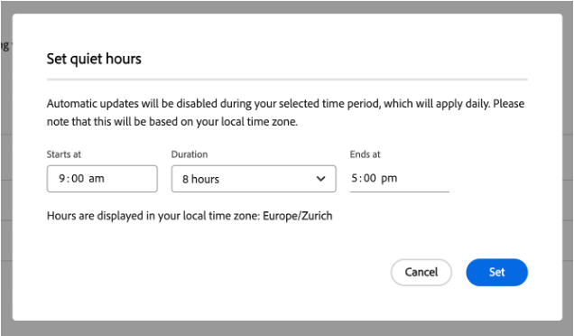

# 無訊息時數與更新可用期間 {#quiet-hours-update-free-periods}

>[!NOTE]
>此功能將從9月25日起以&#x200B;**有限可用性**&#x200B;功能提供。 請傳送電子郵件給[aemcs-update-free@adobe.com](mailto:aemcs-update-free@adobe.com)，讓功能在您的程式中啟動。

AEM as a Cloud Service [自動維護更新](/help/implementing/deploying/aem-version-updates.md)可確保您的執行個體安全無虞，並隨時更新最新維護版本。 也就是說，在某些情況下（例如上線活動），您可能需要「保護」這些關鍵的工作時間免受任何潛在干擾。 因此，AEM as a Cloud Service提供設定時間範圍的選項，讓您的進行中計畫不會發生自動更新。

您可以使用兩個排程選項來設定這些時間範圍：

* **無訊息時數** — 您可以定義不會發生更新的每日時間間隔（最多8小時）。
* **更新可用期間** — 您可以定義不會發生更新的7天期間。 在12個月的時間範圍內，您最多可以有三個更新可用期間。

更新可用期間和無訊息時數功能是以「每個程式」為基礎進行設定。

此外，如需有關已排程的AEM as a Cloud Service自動維護期的資訊，請參閱[Experience Manager發行藍圖](https://experienceleague.adobe.com/zh-hant/docs/experience-manager-release-information/aem-release-updates/update-releases-roadmap)頁面。

## 無訊息時數 {#quiet-hours}

使用「無訊息時數」功能，您可以定義白天的時間範圍，而不需要任何自動更新。 所有維護更新都會轉移，在設定的時間範圍以外進行。 例如，如果在您指定的無訊息小時間隔內排程更新，則該更新會在無訊息小時間隔結束後自動啟動。 設定的時間間隔不能超過8小時，因此仍然可以每天進行更新。

您可以使用您的當地時區，為每個程式&#x200B;**定義這些無訊息時數**。

### 如何設定無訊息小時間隔 {#configure-quiet-hours}

可以使用AEM Cloud Manager介面設定無訊息小時間隔，如下所示：

移至&#x200B;**活動>自動更新>更新選項**。

1. 請確定&#x200B;**防止在特定時間自動更新**&#x200B;選項已切換。
2. 按一下「**編輯**」。
3. 在設定視窗中設定無訊息小時間隔。

設定後，您指定的開始和結束時數將套用至之後的每個行事曆日。 您可以視需要停用或重新設定無訊息時數時間值。

## 更新可用期間 {#update-free-periods}

使用更新自由期間功能，您可以定義不會發生更新的7天時間範圍。 設定後，所有維護更新都會自動轉換，在定義的時間範圍以外進行。 在12個月的間隔內，您最多可以有三個更新可用期間。 此外，您最多可以提前一年指定更新自由期間。

請記得在設定此選項時，為了方便自動更新，（至少）週期之間必須有一週的時間間隔。 因此，這個一週的時間間隔會自動強制執行，並會在您設定的更新可用期間之間新增至行事曆。 這可能會導致某些日曆日無法供選擇。

您可以定義每個程式&#x200B;**的更新可用期間**。

### 如何設定更新可用期間 {#configure-update-free-periods}

您可以使用AEM Cloud Manager介面來設定更新自由期間功能，如下所示：

移至&#x200B;**活動>自動更新>更新選項**。

1. 前往更新可用期間區段。
2. 按一下&#x200B;**新增更新可用期間**。
3. 從行事曆選取一週的更新可用期間。

目前作用中的更新可用期間附近會顯示&#x200B;**作用中**&#x200B;圖示，而已完成更新可用期間附近會顯示&#x200B;**完成**&#x200B;圖示。
