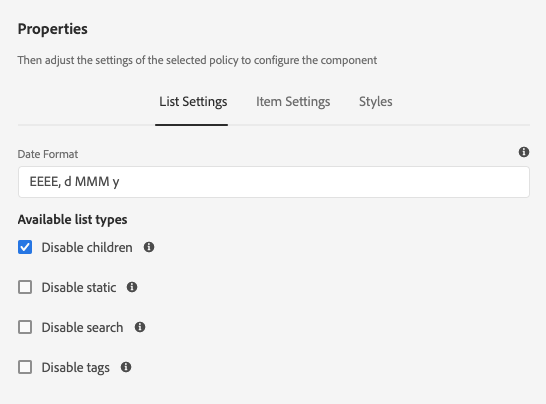

# 使用隱藏條件 {#using-hide-conditions}

隱藏條件可用於確定是否渲染元件資源。 範本作者在範本編輯器中設定核心元件 [清單元件](https://docs.adobe.com/content/help/en/experience-manager-core-components/using/components/list.html)[](/help/sites-cloud/authoring/features/templates.md) ，並決定停用以子頁面為基礎建立清單的選項時，就會是這個例子。 在設計對話框中禁用此選項會設定屬性，以便在顯示清單元件時，將評估隱藏條件，並且不顯示顯示顯示子頁的選項。

## 概覽 {#overview}

對話方塊會變得十分複雜，使用者可能只使用其可用選項的一小部分。 這可為使用者帶來龐大的使用者介面體驗。

管理員、開發人員和超級使用者可以使用隱藏條件，根據一組規則來隱藏資源。 這項功能可讓他們決定當作者編輯內容時應顯示哪些資源。

>[!NOTE]
>
>根據表達式隱藏資源不會替換ACL權限。 內容仍可編輯，但不會顯示。

## 實作與使用詳細資訊 {#implementation-and-usage-details}

`com.adobe.granite.ui.components.FilteringResourceWrapper` 負責根據屬性的存在性和值來篩選資 `granite:hide` 源，該屬性位於要篩選的欄位上。 實作包 `/libs/cq/gui/components/authoring/dialog/dialog.jsp` 括 `FilteringResourceWrapper.`

實作會使用Granite [ELResolver API](https://helpx.adobe.com/experience-manager/6-5/sites/developing/using/reference-materials/granite-ui/api/jcr_root/libs/granite/ui/docs/server/el.html) ，並透過ExpressionCustomizer新增 `cqDesign` 自訂變數。

以下是設計節點上隱藏條件的幾個範例，該節點位於「內容 `etc/design` 原則」之下或作為「內容原則」。

```
${cqDesign.myProperty}
${!cqDesign.myProperty}
${cqDesign.myProperty == 'someText'}
${cqDesign.myProperty != 'someText'}
${cqDesign.myProperty == true}
${cqDesign.myProperty == true}
${cqDesign.property1 == 'someText' && cqDesign.property2 || cqDesign.property3 != 1 || header.myHeader}
```

定義隱藏運算式時，請記住：

* 若要有效，應表示找到屬性的範圍(例如 `cqDesign.myProperty`)。
* 值為只讀。
* 函式（如有需要）應限於服務提供的指定集。

## 範例 {#example}

您可在AEM中找到隱藏條件的範例，尤其 [是核心元](https://docs.adobe.com/content/help/zh-Hant/experience-manager-core-components/using/introduction.html) 件。 例如，請考慮列 [表核心元件](https://docs.adobe.com/content/help/en/experience-manager-core-components/using/components/list.html) ，如 [WKND教程中實現。](/help/implementing/developing/introduction/develop-wknd-tutorial.md)

[使用範本編輯器](/help/sites-cloud/authoring/features/templates.md)，範本作者可在設計對話方塊中定義頁面作者可使用的清單元件選項。 例如是否允許清單為靜態清單、子頁清單、標籤頁清單等。 可以啟用或停用。

如果範本作者選擇停用子頁面選項，則會設定設計屬性並評估隱藏條件，這會導致選項無法為頁面作者呈現。

1. 依預設，頁面作者可使用清單核心元件，選擇「子頁面」選項，以建立使用子頁面的 **清單**。

   

1. 在清單核心元件的設計對話方塊中，範本作者可選擇「停用子項 **** 」選項，以防止根據子頁面產生清單的選項顯示給頁面作者。

   

1. 策略節點在下建立， `/conf/wknd/settings/wcm/policies/wknd/components/list` 其屬 `disableChildren` 性設定為 `true`。

   

1. hide條件定義為對話屬性節點 `granite:hide` 上屬性的值 `/libs/core/wcm/components/list/v2/list/cq:dialog/content/items/tabs/items/listSettings/items/columns/items/column/items/listFrom/items/children`

   

1. 從設計配 `disableChildren` 置中提取值，表達式的計 `${cdDesign.disableChildren}` 算結果 `false`為，這表示該選項不會作為元件的一部分呈現。

1. 當使用 **清單元件** 時，頁面作者不會再呈現「子頁面」選項。

   
