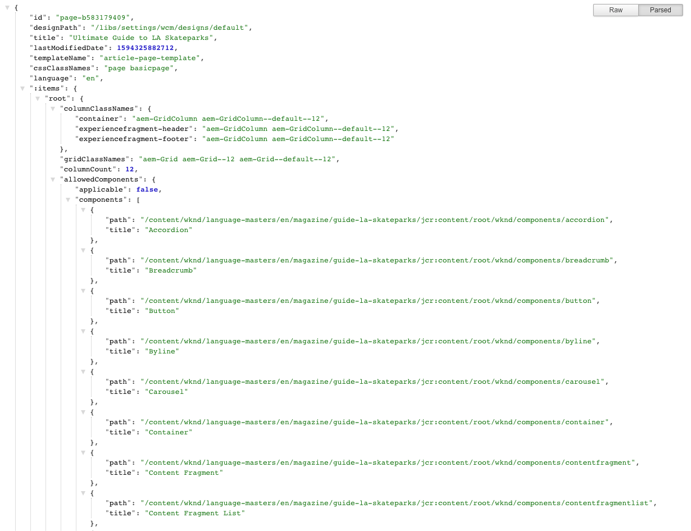

# 內容服務的JSON匯出工具{#json-exporter-for-content-services}

AEM Content Services的設計目的，是將AEM中/來自的內容的說明和傳送，歸納為網頁焦點以外的內容。

它們使用可供任何用戶端使用的標準化方法，將內容傳遞至非傳統AEM網頁的頻道。 這些管道可包括：

* 單頁應用程式
* 原生行動應用程式
* AEM外部的其他管道和接觸點

透過使用結構化內容的內容片段，您可以使用JSON匯出工具以JSON資料模型格式傳送(y)AEM頁面的內容，以提供內容服務。 然後，您自己的應用程式就可以使用此功能。

## 內容片段核心元件{#json-exporter-with-content-fragment-core-components}的JSON匯出工具

使用AEM JSON匯出工具，您可以以JSON資料模型格式傳送(y)AEM頁面的內容。 然後，您自己的應用程式就可以使用此功能。

在AEM內，使用選取器`model`和`.json`擴充功能來達成傳送。

`.model.json`

1. 例如，URL，例如：

   ```shell
   http://localhost:4502/content/wknd/language-masters/en/magazine/guide-la-skateparks.model.json
   ```

1. 將提供以下內容：

   

或者，您可以明確鎖定結構化內容片段，以傳送其內容。

這是使用片段的整個路徑完成（透過`jcr:content`）;例如尾碼為，例如。

`.../jcr:content/root/container/container/contentfragment.model.json`

您的頁面可以包含單一內容片段或多種類型的元件。 您也可以使用清單元件等機制來自動搜尋相關內容。

* 例如，URL，例如：

   ```shell
   http://localhost:4502/content/wknd/language-masters/en/magazine/guide-la-skateparks/jcr:content/root/container/container/contentfragment.model.json
   ```

* 將提供以下內容：

   

   >[!NOTE]
   >
   >您可以[調整自己的元件](enabling-json-exporter.md)以存取和使用此資料。

   >[!NOTE]
   >
   >雖然不是標準實作，但支援多個選取器，](enabling-json-exporter.md#multiple-selectors)但`model`必須是第一個。[

### 更多資訊 {#further-information}

另請參閱:

* Assets HTTP API
   * [Assets HTTP API](/help/assets/developer-reference-material-apis.md)
* Sling 模型:
   * [Sling模型 — 將模型類與自130年以來的資源類型關聯](https://sling.apache.org/documentation/bundles/models.html#associating-a-model-class-with-a-resource-type-since-130)
* AEM與JSON:
   * [為元件啟用JSON匯出](enabling-json-exporter.md)

## 相關檔案{#related-documentation}

如需詳細資訊，請參閱：

* [資產使用手冊中的內容片段](/help/assets/content-fragments/content-fragments.md)
* [內容片段模型](/help/assets/content-fragments/content-fragments-models.md)
* [使用內容片段製作](/help/sites-cloud/authoring/fundamentals/content-fragments.md)
* [核心](https://experienceleague.adobe.com/docs/experience-manager-core-components/using/introduction.html?lang=zh-Hant) 元件和內 [容片段元件](https://experienceleague.adobe.com/docs/experience-manager-core-components/using/components/content-fragment-component.html)
