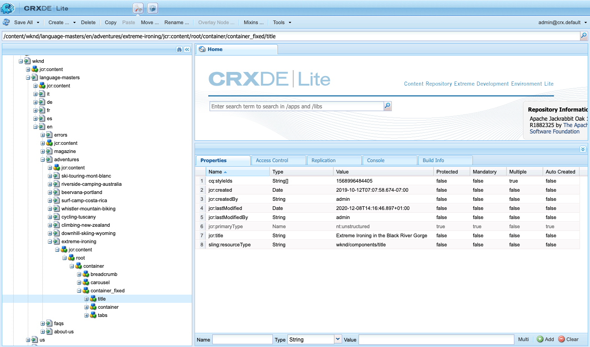

# 元件參考指南 {#components-reference-guide}

構件是構建體驗的核AEM心。 的 [核心元件](https://experienceleague.adobe.com/docs/experience-manager-core-components/using/introduction.html?lang=zh-Hant) 和 [項AEM目原型](https://experienceleague.adobe.com/docs/experience-manager-core-components/using/developing/archetype/overview.html) 使您能夠輕鬆地開始使用一組現成的、強健的元件。 的 [WKND教程](/help/implementing/developing/introduction/develop-wknd-tutorial.md) 指導開發人員如何使用這些工具以及如何構建自定義元件以建立新站AEM點。

>[!TIP]
>
>在引用此文檔之前，請確保您已完成 [WKND教程](/help/implementing/developing/introduction/develop-wknd-tutorial.md) 因此熟悉 [核心元件](https://experienceleague.adobe.com/docs/experience-manager-core-components/using/introduction.html) 和 [原型AEM計畫。](https://experienceleague.adobe.com/docs/experience-manager-core-components/using/developing/archetype/overview.html)

由於WKND教程涵蓋了大多數使用案例，因此本文檔僅作為這些資源的補充。 它提供了有關元件在中的結構和配置方式的詳細AEM技術說明，並且不打算作為入門指南。

## 概觀 {#overview}

本節介紹開發您自己的元件時所需的詳細資訊。

### 規劃 {#planning}

在開始實際配置或編碼元件之前，您應詢問：

* 您到底需要新元件做什麼？
* 您是需要從頭開始建立元件，還是可以從現有元件繼承基礎知識？
* 您的元件是否需要邏輯來選擇/操作內容？
   * 邏輯應與用戶介面層保持分離。 HTL旨在幫助確保此情況發生。
* 您的元件是否需要CSS格式？
   * CSS格式應與元件定義分開。 定義用於命名HTML元素的約定，以便您可以通過外部CSS檔案修改這些元素。
* 您的新元件可能會引入哪些安全影響？

### 重新使用現有元件 {#reusing-components}

在將時間投入到建立新元件之前，請考慮自定義或擴展現有元件。 [核心元件](https://experienceleague.adobe.com/docs/experience-manager-core-components/using/introduction.html) 提供一套靈活、強大且經過良好測試的生產就緒型元件。

#### 擴展核心元件 {#extending-core-components}

核心元件還提供 [清除自定義模式](https://experienceleague.adobe.com/docs/experience-manager-core-components/using/developing/customizing.html) 你可以用它來適應你自己項目的需要。

#### 覆蓋元件 {#overlying-components}

元件也可用 [覆蓋](/help/implementing/developing/introduction/overlays.md) 基於搜索路徑邏輯。 然而，在此情況下， [Sling資源合併](/help/implementing/developing/introduction/sling-resource-merger.md) 不會觸發 `/apps` 必須定義整個覆蓋。

#### 擴展元件對話框 {#extending-component-dialogs}

也可以使用Sling資源合併並定義屬性來覆蓋元件對話框 `sling:resourceSuperType`。

這意味著您只需重定義所需的差異，而不需要重定義整個對話框。

### 內容邏輯和呈現標籤  {#content-logic-and-rendering-markup}

將使用 [HTML。](https://www.w3schools.com/htmL/html_intro.asp) 您的元件需要定義獲取所需內容所需的HTML，然後根據需要在作者和發佈環境中呈現它。

建議將負責標籤和呈現的代碼與控制用於選擇元件內容的邏輯的代碼分開。

這一哲學得到 [HTL](https://experienceleague.adobe.com/docs/experience-manager-htl/using/overview.html?lang=zh-Hant)，特意限定為確保使用真實寫程式語言來定義底層業務邏輯的模板化語言。 此機制將突出顯示為給定視圖調用的代碼，如果需要，還允許針對同一元件的不同視圖使用特定邏輯。

此（可選）邏輯可以以不同方式實現，並可通過以下特定命令從HTL調用：

* 使用Java - [HTL Java Use-API](https://helpx.adobe.com/experience-manager/htl/using/use-api-java.html) 使HTL檔案能夠訪問自定義Java類中的helper方法。 這允許您使用Java代碼來實現用於選擇和配置元件內容的邏輯。
* 使用JavaScript - [HTL JavaScript Use-API](https://experienceleague.adobe.com/docs/experience-manager-htl/using/htl/use-api-javascript.html) 使HTL檔案能夠訪問以JavaScript編寫的幫助程式碼。 這允許您使用JavaScript代碼來實現用於選擇和配置元件內容的邏輯。
* 使用客戶端庫 — 現代網站嚴重依賴由複雜的JavaScript和CSS代碼驅動的客戶端處理。 查看文檔 [在as a Cloud Service上使用客戶端庫AEM](/help/implementing/developing/introduction/clientlibs.md) 的子菜單。

## 元件結構 {#structure}

元件結構AEM強大靈活。 主要包括：

* [資源類型](#resource-type)
* [元件定義](#component-definition)
* [元件的屬性和子節點](#properties-and-child-nodes-of-a-component)
* [對話方塊](#dialogs)
* [設計對話框](#design-dialogs)

### 資源類型 {#resource-type}

結構的關鍵元素是資源類型。

* 內容結構聲明意圖。
* 資源類型實現它們。

這是一個抽象概念，有助於確保即使外觀和感覺隨著時間而改變，意圖也會隨時間而改變。

### 元件定義 {#component-definition}

元件的定義可按如下方式分解：

* 組AEM件基於 [吊帶。](https://sling.apache.org/documentation.html)
* 元AEM件位於 `/libs/core/wcm/components`。
* 項目/地點特定元件位於 `/apps/<myApp>/components`。
* AEM標準元件定義為 `cq:Component` 並有關鍵要素：
   * jcr屬性 — jcr屬性的清單。 這些是變數，而且某些可能是可選的，因為元件節點的基本結構、屬性和子節點由 `cq:Component` 定義。
   * 資源 — 這些資源定義元件使用的靜態元素。
   * 指令碼 — 這些指令碼用於實現元件的結果實例的行為。

#### 重要屬性 {#vital-properties}

* **根節點**:
   * `<mycomponent> (cq:Component)`  — 元件的層次結構節點。
* **重要屬性**:
   * `jcr:title`  — 元件標題；例如，當元件列在 [元件瀏覽器](/help/sites-cloud/authoring/fundamentals/environment-tools.md#components-browser) 和 [元件控制台](/help/sites-cloud/authoring/features/components-console.md)
   * `jcr:description`  — 元件說明；用作元件瀏覽器和元件控制台中的滑鼠切換提示
   * 請參閱一節 [元件表徵圖](#component-icon) 詳細資訊
* **重要子節點**:
   * `cq:editConfig (cq:EditConfig)`  — 定義元件的編輯屬性，並使元件顯示在「元件瀏覽器」中
      * 如果元件具有對話框，則即使cq:editConfig不存在，它也會自動顯示在「元件」瀏覽器或「側腳」中。
   * `cq:childEditConfig (cq:EditConfig)`  — 控制未定義其自身的子元件的作者UI方面 `cq:editConfig`。
   * `cq:dialog (nt:unstructured)`  — 此元件的對話框。 定義允許用戶配置元件和/或編輯內容的介面。
   * `cq:design_dialog (nt:unstructured)`  — 此元件的設計編輯

#### 元件表徵圖 {#component-icon}

元件的表徵圖或縮寫是在開發人員建立元件時通過元件的JCR屬性定義的。 這些屬性按以下順序計算，並使用找到的第一個有效屬性。

1. `cq:icon`  — 指向標準表徵圖的字串屬性 [Coral UI庫](https://opensource.adobe.com/coral-spectrum/examples/#icon) 在元件瀏覽器中顯示
   * 使用「珊瑚」表徵圖的HTML屬性值。
1. `abbreviation`  — 字串屬性，用於自定義元件瀏覽器中元件名稱的縮寫
   * 縮寫應限制為兩個字元。
   * 提供空字串將從的 `jcr:title` 屬性。
      * 例如，&quot;Image&quot;的&quot;Im&quot;
      * 本地化標題將用於生成縮寫。
   * 僅當元件具有 `abbreviation_commentI18n` 屬性，然後用作翻譯提示。
1. `cq:icon.png` 或 `cq:icon.svg`  — 此元件的表徵圖，顯示在元件瀏覽器中
   * 20 x 20像素是標準元件的表徵圖大小。
      * 較大的表徵圖將縮小（客戶端）。
   * 建議的顏色是rgb(112、112、112)> #707070
   * 標準元件表徵圖的背景是透明的。
   * 僅 `.png` 和 `.svg` 支援檔案。
   * 如果通過Eclipse插件從檔案系統導入，則檔案名需要轉義為 `_cq_icon.png` 或 `_cq_icon.svg` 例如。
   * `.png` 先例 `.svg` 如果兩者都存在。

如果上述屬性均不存在(`cq:icon`。 `abbreviation`。 `cq:icon.png` 或 `cq:icon.svg`)。

* 系統將在超元件上搜索與 `sling:resourceSuperType` 屬性。
* 如果在超級元件級別未找到任何縮寫或找到空縮寫，則系統將根據 `jcr:title` 當前元件的屬性。

要取消從超級元件繼承表徵圖，請設定空 `abbreviation` 元件上的屬性將恢復為預設行為。

的 [元件控制台](/help/sites-cloud/authoring/features/components-console.md#component-details) 顯示如何定義特定元件的表徵圖。

#### SVG表徵圖示例 {#svg-icon-example}

```xml
<?xml version="1.0" encoding="utf-8"?>
<!DOCTYPE svg PUBLIC "-//W3C//DTD SVG 1.1//EN" "https://www.w3.org/Graphics/SVG/1.1/DTD/svg11.dtd">
<svg version="1.1" id="Layer_1" xmlns="https://www.w3.org/2000/svg" xmlns:xlink="https://www.w3.org/1999/xlink" x="0px" y="0px"
     width="20px" height="20px" viewBox="0 0 20 20" enable-background="new 0 0 20 20" xml:space="preserve">
    <ellipse cx="5" cy="5" rx="3" ry="3" fill="#707070"/>
    <ellipse cx="15" cy="5" rx="4" ry="4" fill="#707070"/>
    <ellipse cx="5" cy="15" rx="5" ry="5" fill="#707070"/>
    <ellipse cx="15" cy="15" rx="4" ry="4" fill="#707070"/>
</svg>
```

### 元件的屬性和子節點 {#properties-and-child-nodes-of-a-component}

定義元件所需的許多節點/屬性是兩個UI的共同點，差異仍然獨立，因此元件可以在兩個環境中工作。

元件是類型的節點 `cq:Component` 具有以下屬性和子節點：

| 名稱 | 類型 | 說明 |
|---|---|---|
| `.` | `cq:Component` | 這表示當前元件。 元件為節點類型 `cq:Component`。 |
| `componentGroup` | `String` | 這表示在中可選擇元件的組 [元件瀏覽器。](/help/sites-cloud/authoring/fundamentals/environment-tools.md#components-browser) 以開頭的值 `.` 用於無法從UI中選擇的元件，如從其他元件繼承的基本元件。 |
| `cq:isContainer` | `Boolean` | 這表示元件是否是容器元件，因此可以包含其他元件，如段落系統。 |
| `cq:dialog` | `nt:unstructured` | 這是元件的編輯對話框的定義。 |
| `cq:design_dialog` | `nt:unstructured` | 這是元件設計對話框的定義。 |
| `cq:editConfig` | `cq:EditConfig` | 這定義了 [編輯元件的配置。](#edit-behavior) |
| `cq:htmlTag` | `nt:unstructured` | 這將返回添加到周圍HTML標籤的附加標籤屬性。 允許將屬性添加到自動生成的視圖。 |
| `cq:noDecoration` | `Boolean` | 如果為true，則不使用自動生成的div和css類呈現元件。 |
| `cq:template` | `nt:unstructured` | 如果找到，則當從元件瀏覽器添加元件時，此節點將用作內容模板。 |
| `jcr:created` | `Date` | 這是元件的建立日期。 |
| `jcr:description` | `String` | 這是元件的說明。 |
| `jcr:title` | `String` | 這是元件的標題。 |
| `sling:resourceSuperType` | `String` | 設定後，元件將繼承自此元件。 |
| `component.html` | `nt:file` | 這是元件的HTL指令碼檔案。 |
| `cq:icon` | `String` | 此值指向 [表徵圖](#component-icon) 並出現在「元件瀏覽器」中。 |

如果我們看看 **文本** 元件，我們可以看到以下幾個元素：


特定權益物業包括：

* `jcr:title`  — 這是用於標識元件瀏覽器中元件的元件的標題。
* `jcr:description`  — 這是元件的說明。
* `sling:resourceSuperType`  — 這表示擴展元件（通過覆蓋定義）時的繼承路徑。

特定感興趣的子節點包括：

* `cq:editConfig`  — 這可在編輯時控制元件的可視方面。
* `cq:dialog`  — 這定義了編輯此元件內容的對話框。
* `cq:design_dialog`  — 指定此元件的設計編輯選項。

### 對話方塊 {#dialogs}

對話框是元件的關鍵元素，因為它們為作者提供了在內容頁面上配置元件並提供該元件輸入的介面。 查看 [創作文檔](/help/sites-cloud/authoring/fundamentals/editing-content.md) 有關內容作者如何與元件交互的詳細資訊。

根據元件的複雜性，您的對話框可能需要一個或多個頁籤。

元件對AEM話框：

* 是 `cq:dialog` 類型節點 `nt:unstructured`。
* 位於 `cq:Component` 節點和其元件定義旁。
* 定義編輯此元件內容的對話框。
* 使用花崗岩UI元件定義。
* 根據其內容結構和 `sling:resourceType` 屬性。
* 包含描述對話框中欄位的節點結構
   * 這些節點是 `nt:unstructured` 需要 `sling:resourceType` 屬性。


在對話框中，定義了各個欄位：


### 設計對話框 {#design-dialogs}

設計對話框與用於編輯和配置內容的對話框類似，但它們為模板作者提供了介面以在頁面模板上預配置和提供該元件的設計詳細資訊。 然後，內容作者使用頁面模板來建立內容頁面。 查看 [模板文檔](/help/sites-cloud/authoring/features/templates.md) 的子菜單。

[編輯頁面模板時使用設計對話框](/help/sites-cloud/authoring/features/templates.md)，但並非所有元件都需要它們。 例如 **標題** 和 **影像元件** 都有設計對話，而 **社交媒體共用元件** 不會。

### 珊瑚界和花崗岩界 {#coral-and-granite}

珊瑚介面和花崗岩介面定義外觀AEM。

* [珊瑚UI](https://opensource.adobe.com/coral-spectrum/documentation/) 跨所有雲解決方案提供一致的UI。
* [花崗岩UI](https://helpx.adobe.com/experience-manager/6-5/sites/developing/using/reference-materials/granite-ui/api/jcr_root/libs/granite/ui/index.html) 提供封裝到Sling元件中的Coral UI標籤，用於構建UI控制台和對話框。

Granite UI提供了在創作環境中建立對話框所需的大量基本小部件。 必要時，您可以擴展此選擇並建立自己的小部件。

有關其他詳細資訊，請參閱以下資源：

* [UI的結AEM構](/help/implementing/developing/introduction/ui-structure.md)

### 自定義對話框欄位 {#customizing-dialog-fields}

<!--
Content not found

>[!TIP]
>
>See the [AEM Gems session](https://docs.adobe.com/content/ddc/en/gems/customizing-dialog-fields-in-touch-ui.html) on customizing dialog fields.
-->

要建立新小部件以在元件對話框中使用，需要建立新的花崗岩UI欄位元件。

如果您將對話框視為表單元素的簡單容器，則還可以將對話框內容的主要內容視為表單域。 建立新表單域需要建立資源類型；這相當於建立新元件。 為幫助您完成該任務，Granite UI提供了要繼承的通用欄位元件(使用 `sling:resourceSuperType`):

`/libs/granite/ui/components/coral/foundation/form/field`

更具體地說，Granite UI提供了一系列適用於對話的場元件，或更一般地說， [的下界。](https://helpx.adobe.com/experience-manager/6-5/sites/developing/using/reference-materials/granite-ui/api/jcr_root/libs/granite/ui/components/foundation/form/index.html)

建立資源類型後，可以通過在對話框中添加新節點，並使用屬性來實例化欄位 `sling:resourceType` 指您剛介紹的資源類型。

#### 訪問對話框欄位 {#access-to-dialog-fields}

也可以使用渲染條件(`rendercondition`)控制誰有權訪問對話框中的特定頁籤/欄位；例如：

```text
+ mybutton
  - sling:resourceType = granite/ui/components/coral/foundation/button
  + rendercondition
    - sling:resourceType = myapp/components/renderconditions/group
    - groups = ["administrators"]
```

## 使用元件 {#using-components}

建立元件後，需要啟用該元件才能使用它。 使用它可顯示元件結構如何與儲存庫中生成內容的結構相關。

### 將元件添加到模板 {#adding-your-component-to-the-template}

定義了元件後，必須使其可用。 要使元件在模板中可用，必須在模板佈局容器的策略中啟用該元件。

查看 [模板文檔](/help/sites-cloud/authoring/features/templates.md) 的子菜單。

### 元件及其建立的內容 {#components-and-the-content-they-create}

如果建立和配置 **標題** 元件： `/content/wknd/language-masters/en/adventures/extreme-ironing.html`


然後，我們可以看到在儲存庫中建立的內容的結構：



特別是，如果你看到 **標題元件**:

* 內容包含 `jcr:title` 屬性，該屬性保存作者輸入的標題的實際文本。
* 它還包含 `sling:resourceType` 參照元件定義。

定義的屬性取決於各個定義。 雖然可能比上面複雜，但也遵循同樣的基本原則。

## 元件層次和繼承 {#component-hierarchy-and-inheritance}

中的組AEM件受 **資源類型層次結構**。 這用於使用屬性擴展元件 `sling:resourceSuperType`。 這樣，元件就可以從另一個元件繼承。

請參閱一節 [重新使用元件](#reusing-components) 的子菜單。

## 編輯行為 {#edit-behavior}

本節介紹如何配置元件的編輯行為。 這包括可用於元件的操作、in.place編輯器的特性以及與元件上的事件相關的監聽器等屬性。

通過添加 `cq:editConfig` 類型節點 `cq:EditConfig` 元件節點下(類型 `cq:Component`)和添加特定屬性和子節點。 以下屬性和子節點可用：

* `cq:editConfig` 節點屬性
* [`cq:editConfig` 子節點](#configuring-with-cq-editconfig-child-nodes):
   * `cq:dropTargets` （節點類型） `nt:unstructured`):定義可接受內容查找器資產刪除的刪除目標清單（允許單個刪除目標）
   * `cq:inplaceEditing` （節點類型） `cq:InplaceEditingConfig`):定義元件的就地編輯配置
   * `cq:listeners` （節點類型） `cq:EditListenersConfig`):定義在元件上執行操作之前或之後發生的操作

中有許多現有配AEM置。 使用中的「查詢」工具，可以輕鬆搜索特定屬性或子節點 **CRXDE Lite**。

### 元件佔位符 {#component-placeholders}

元件必須始終呈現作者可見的某些HTML，即使元件沒有內容。 否則，它可能會從編輯器介面的視覺上消失，從而使其在技術上存在，但在頁面和編輯器中不可見。 在這種情況下，作者將無法選擇空元件並與其進行交互。

因此，在頁面編輯器中呈現頁面時(當WCM模式為 `edit` 或 `preview`)。
佔位符的典型HTML標籤如下：

```HTML
<div class="cq-placeholder" data-emptytext="Component Name"></div>
```

呈現上述佔位符HTML的典型HTL指令碼如下：

```HTML
<div class="cq-placeholder" data-emptytext="${component.properties.jcr:title}"
     data-sly-test="${(wcmmode.edit || wcmmode.preview) && isEmpty}"></div>
```

在上一個示例中， `isEmpty` 是一個變數，僅當元件沒有內容且作者不可見時，該變數才為true。

為避免重複，Adobe建議元件的實施者為這些佔位符使用HTL模板， [就像核心元件提供的。](https://github.com/adobe/aem-core-wcm-components/blob/master/content/src/content/jcr_root/apps/core/wcm/components/commons/v1/templates.html)

然後，使用以下HTL行完成模板在上一個連結中的使用：

```HTML
<sly data-sly-use.template="core/wcm/components/commons/v1/templates.html"
     data-sly-call="${template.placeholder @ isEmpty=!model.text}"></sly>
```

在上一個示例中， `model.text` 是僅當內容具有內容且可見時才為true的變數。

在「核心元件」中，可以看到此模板的使用示例。 [如標題元件中。](https://github.com/adobe/aem-core-wcm-components/blob/master/content/src/content/jcr_root/apps/core/wcm/components/title/v2/title/title.html#L27)

### 使用cq:EditConfig子節點配置 {#configuring-with-cq-editconfig-child-nodes}

#### 將資產刪除到對話框 — cq:dropTargets {#cq-droptargets}

的 `cq:dropTargets` 節點（節點類型） `nt:unstructured`)定義可接受從內容查找器中拖動的資產中刪除的刪除目標。 它是類型的節點 `cq:DropTargetConfig`。

類型的子節點 `cq:DropTargetConfig` 在元件中定義放置目標。

### 就地編輯 — cq：就地編輯 {#cq-inplaceediting}

就地編輯器允許用戶直接編輯內容流中的內容，而無需開啟對話框。 例如， **文本** 和 **標題** 兩個元件都具有插入編輯器。

對於每個元件類型，就地編輯器不是必需的/有意義的。

的 `cq:inplaceEditing` 節點（節點類型） `cq:InplaceEditingConfig`)定義元件的就地編輯配置。 它可以具有以下屬性：

| 屬性名稱 | 屬性類型 | 屬性值 |
|---|---|---|
| `active` | `Boolean` | `true` 啟用元件的就地編輯。 |
| `configPath` | `String` | 編輯器配置的路徑，可由配置節點指定 |
| `editorType` | `String` | 可用類型包括： `plaintext` 對於非HTML內容， `title` 在開始編輯之前將圖形標題轉換為純文字檔案， `text` 使用RTF編輯器 |

以下配置啟用元件的插入編輯並定義 `plaintext` 編輯器類型：

```text
    <cq:inplaceEditing
        jcr:primaryType="cq:InplaceEditingConfig"
        active="{Boolean}true"
        editorType="plaintext"/>
```

### 處理欄位事件 — cq：偵聽器 {#cq-listeners}

處理對話框欄位中事件的方法是使用自定義的偵聽器完成的 [客戶端庫。](/help/implementing/developing/introduction/clientlibs.md)

要將邏輯插入您的欄位，您應：

* 使用給定CSS類（掛接）標籤欄位。
* 在客戶端庫中定義一個掛接到該CSS類名的JS偵聽器（這可確保您的自定義邏輯僅限於您的欄位，並且不會影響同一類型的其他欄位）。

要實現此目標，您需要瞭解要與之交互的底層構件庫。 [請參閱Coral UI文檔](https://opensource.adobe.com/coral-spectrum/documentation/) 確定要對哪個事件做出反應。

的 `cq:listeners` 節點（節點類型） `cq:EditListenersConfig`)定義在元件上執行操作之前或之後發生的操作。 下表定義了其可能的屬性。

| 屬性名稱 | 屬性值 |
|---|---|
| `beforedelete` | 在刪除元件之前觸發處理程式。 |
| `beforeedit` | 在編輯元件之前觸發處理程式。 |
| `beforecopy` | 在複製元件之前觸發處理程式。 |
| `beforeremove` | 在移動元件之前觸發處理程式。 |
| `beforeinsert` | 在插入元件之前觸發處理程式。 |
| `beforechildinsert` | 在將元件插入另一個元件（僅限容器）之前，會觸發處理程式。 |
| `afterdelete` | 刪除元件後將觸發處理程式。 |
| `afteredit` | 編輯元件後將觸發處理程式。 |
| `aftercopy` | 在複製元件後觸發處理程式。 |
| `afterinsert` | 在插入元件後觸發處理程式。 |
| `aftermove` | 在移動元件後觸發處理程式。 |
| `afterchildinsert` | 在將元件插入另一個元件（僅限容器）後，將觸發處理程式。 |

>[!NOTE]
>
>在嵌套元件的情況下，對定義為上的屬性的操作有某些限制 `cq:listeners` 的下界。 對於嵌套元件，以下屬性的值 **必須** 是 `REFRESH_PAGE`:
>
>* `aftermove`
>* `aftercopy`


事件處理程式可以使用自定義實現來實現。 例如(其中 `project.customerAction` 是靜態方法):

`afteredit = "project.customerAction"`

下面的示例等效於 `REFRESH_INSERTED` 配置：

`afterinsert="function(path, definition) { this.refreshCreated(path, definition); }"`

使用以下配置，在刪除、編輯、插入或移動元件後刷新頁面：

```text
    <cq:listeners
        jcr:primaryType="cq:EditListenersConfig"
        afterdelete="REFRESH_PAGE"
        afteredit="REFRESH_PAGE"
        afterinsert="REFRESH_PAGE"
        afterMove="REFRESH_PAGE"/>
```

### 欄位驗證 {#field-validation}

在Granite UI和Granite UI小部件中使用 `foundation-validation` API。 查看 [`foundation-valdiation` 花崗岩文獻](https://helpx.adobe.com/experience-manager/6-5/sites/developing/using/reference-materials/granite-ui/api/jcr_root/libs/granite/ui/components/coral/foundation/clientlibs/foundation/js/validation/index.html) 的雙曲餘切值。

### 檢測對話框的可用性 {#dialog-ready}

如果您有一個自定義JavaScript，該自定義JavaScript只需在對話框可用且準備就緒時才需要執行，則您應該偵聽 `dialog-ready` 的子菜單。

只要對話框載入（或重新載入）並準備使用，即會觸發此事件，這意味著只要對話框的DOM中有更改（建立/更新）。

`dialog-ready` 可用於掛接JavaScript自定義代碼，該代碼對對話框或類似任務中的欄位執行自定義。

## 預覽行為 {#preview-behavior}

的 [WCM模式](https://www.adobe.io/experience-manager/reference-materials/cloud-service/javadoc/com/day/cq/wcm/api/WCMMode.html) 在切換到「預覽」模式時，即使頁面未刷新，也會設定cookie。

對於具有對WCM模式敏感的渲染的元件，需要定義這些元件以具體地刷新自身，然後依賴cookie的值。

## 記錄元件 {#documenting-components}

作為開發人員，您希望輕鬆訪問元件文檔，以便快速瞭解元件：

* 說明
* 預期用途
* 內容結構和屬性
* 暴露的API和擴展點
* 等等

因此，很容易將元件本身中現有的任何文檔標籤為可用。

你只需要把 `README.md` 的子菜單。


此標籤將顯示在 [元件控制台。](/help/sites-cloud/authoring/features/components-console.md)


支援的標籤與 [內容片段](/help/sites-cloud/administering/content-fragments/content-fragments.md)。
