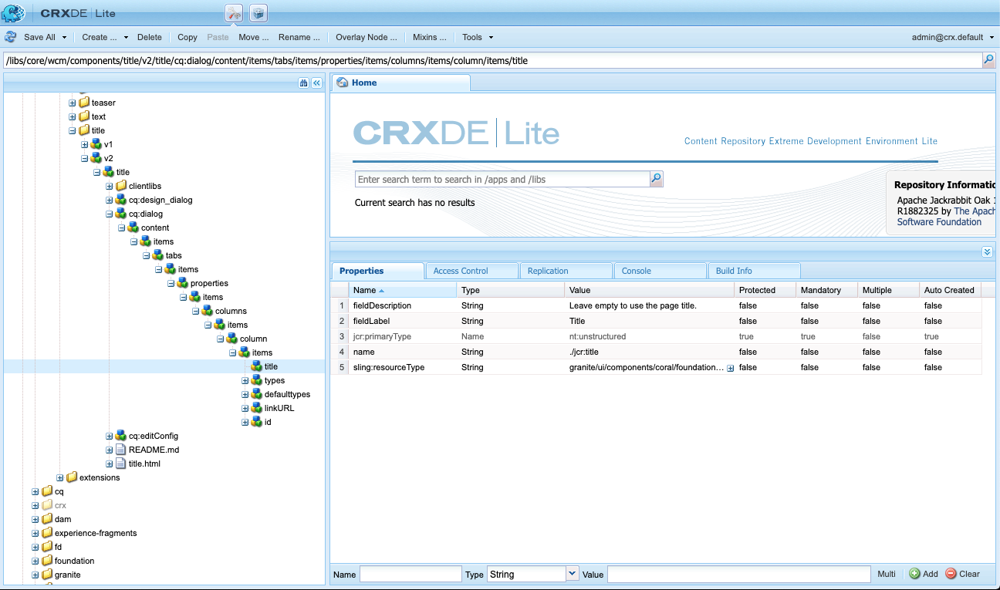

# 元件參考指南 {#components-reference-guide}

元件是在AEM中建立體驗的核心。 [核心元件](https://experienceleague.adobe.com/docs/experience-manager-core-components/using/introduction.html)和[AEM專案原型](https://experienceleague.adobe.com/docs/experience-manager-core-components/using/developing/archetype/overview.html?lang=zh-Hant)可讓您輕鬆開始使用一組現成且強大的元件。 [WKND教學課程](/help/implementing/developing/introduction/develop-wknd-tutorial.md)會帶領開發人員瞭解如何使用這些工具，以及如何建置自訂元件以建立AEM網站。

>[!TIP]
>
>在參考此檔案之前，請確定您已完成[WKND教學課程](/help/implementing/developing/introduction/develop-wknd-tutorial.md)，因此熟悉[核心元件](https://experienceleague.adobe.com/docs/experience-manager-core-components/using/introduction.html)和[AEM專案原型](https://experienceleague.adobe.com/docs/experience-manager-core-components/using/developing/archetype/overview.html?lang=zh-Hant)。

由於WKND教學課程涵蓋大部分的使用案例，本檔案旨在補充這些資源。 它提供了有關如何在AEM中建構和設定元件的深入技術細節，並非旨在作為快速入門手冊。

## 概觀 {#overview}

本節說明開發您自己的元件時，所需詳細資訊的主要概念和問題。

### 規劃 {#planning}

開始實際設定元件或為元件編寫程式碼之前，您應該先詢問：

* 您到底需要新元件做什麼？
* 您是否需要從頭開始建立元件，或可從現有元件繼承基本知識？
* 您的元件需要邏輯才能選取/操控內容嗎？
   * 邏輯應與使用者介面層分開。 HTL的設計目的是協助確保做到這一點。
* 您的元件是否需要CSS格式？
   * CSS格式應與元件定義分開。 定義命名HTML元素的慣例，以便透過外部CSS檔案進行修改。
* 您的新元件可能會引入哪些安全性影響？

### 重複使用現有元件 {#reusing-components}

在您花時間建立全新元件之前，請考慮自訂或擴充現有元件。 [核心元件](https://experienceleague.adobe.com/docs/experience-manager-core-components/using/introduction.html)提供一套彈性、強大且經過充分測試的生產就緒元件。

#### 擴充核心元件 {#extending-core-components}

核心元件也提供[清晰的自訂模式](https://experienceleague.adobe.com/docs/experience-manager-core-components/using/developing/customizing.html)，您可將其調整為您自己的專案需求。

#### 覆蓋元件 {#overlying-components}

元件也可以根據搜尋路徑邏輯，以[覆蓋](/help/implementing/developing/introduction/overlays.md)重新定義。 但在此情況下，將不會觸發[Sling資源合併](/help/implementing/developing/introduction/sling-resource-merger.md)，且`/apps`必須定義整個覆蓋。

#### 延伸元件對話方塊 {#extending-component-dialogs}

也可以使用Sling Resource Merger並定義屬性`sling:resourceSuperType`來覆寫元件對話方塊。

這表示您只需要重新定義所需的差異，而不必重新定義整個對話方塊。

### 內容邏輯和轉譯標籤  {#content-logic-and-rendering-markup}

您的元件已使用[HTML](https://www.w3schools.com/htmL/html_intro.asp)轉譯。 您的元件必須定義所需的HTML才能取得所需內容，然後視需要在製作和發佈環境中轉譯。

建議將負責標示和轉譯的程式碼，與控制用來選取元件內容的邏輯的程式碼分開。

[HTL](https://experienceleague.adobe.com/docs/experience-manager-htl/content/overview.html)支援此理念，這是一種範本化語言，刻意加以限制，以確保使用真正的程式語言來定義基礎商業邏輯。 此機制會醒目顯示呼叫特定檢視的程式碼，並在必要時允許同一元件的不同檢視使用特定邏輯。

此（選用）邏輯可透過不同方式實作，並使用特定命令從HTL叫用：

* 使用Java - [&#x200B; HTL Java Use-API](https://experienceleague.adobe.com/docs/experience-manager-htl/content/java-use-api.html)可讓HTL檔案存取自訂Java類別中的Helper方法。 這可讓您使用Java程式碼來實作選取和設定元件內容的邏輯。
* 使用JavaScript - [HTL JavaScript Use-API](https://experienceleague.adobe.com/docs/experience-manager-htl/using/htl/use-api-javascript.html)可讓HTL檔案存取以JavaScript撰寫的Helper程式碼。 這可讓您使用JavaScript程式碼來實作選取和設定元件內容的邏輯。
* 使用使用者端資料庫 — 現代網站非常依賴由複雜的JavaScript和CSS程式碼驅動的使用者端處理。 如需詳細資訊，請參閱檔案[在AEM as a Cloud Service](/help/implementing/developing/introduction/clientlibs.md)上使用使用者端資料庫。

## 元件結構 {#structure}

AEM元件的結構既強大又靈活。 主要部分為：

* [資源類型](#resource-type)
* [元件定義](#component-definition)
* [元件的屬性和子節點](#properties-and-child-nodes-of-a-component)
* [對話框](#dialogs)
* [設計對話方塊](#design-dialogs)

### 資源類型 {#resource-type}

結構的一個關鍵元素是資源型別。

* 內容結構會宣告意圖。
* 資源型別會實作它們。

這是一項抽象，有助於確保即使表觀和感覺隨著時間而改變，意圖仍會維持在時間上。

### 元件定義 {#component-definition}

元件的定義可劃分如下：

* AEM元件是以[Sling](https://sling.apache.org/documentation.html)為基礎。
* AEM元件位於`/libs/core/wcm/components`下方。
* 專案/網站特定元件位於`/apps/<myApp>/components`下方。
* AEM標準元件已定義為`cq:Component`，並具有關鍵元素：
   * jcr屬性 — jcr屬性的清單。 這些是變數，有些可能是選擇性的，但元件節點的基本結構、其屬性和子節點是由`cq:Component`定義所定義。
   * 資源 — 這些會定義元件使用的靜態元素。
   * 指令碼 — 這些用於實作元件結果例項的行為。

#### 重要屬性 {#vital-properties}

* **根節點**：
   * `<mycomponent> (cq:Component)` — 元件的階層節點。
* **重要屬性**：
   * `jcr:title` — 元件標題；例如，當元件列在[元件瀏覽器](/help/sites-cloud/authoring/page-editor/editor-side-panel.md#components-browser)和[元件主控台](/help/sites-cloud/authoring/components-console.md)中時，做為標籤。
   * `jcr:description` — 元件的說明；在元件瀏覽器和元件主控台中做為滑鼠移過提示。
   * 如需詳細資訊，請參閱[元件圖示](#component-icon)一節。
* **重要的子節點**：
   * `cq:editConfig (cq:EditConfig)` — 定義元件的編輯屬性，並讓元件出現在元件瀏覽器中。
      * 如果元件有對話方塊，即使cq:editConfig不存在，它也會自動出現在元件瀏覽器或Sidekick中。
   * `cq:childEditConfig (cq:EditConfig)` — 控制未定義自己`cq:editConfig`之子元件的作者UI方面。
   * `cq:dialog (nt:unstructured)` — 此元件的對話方塊。 定義允許使用者設定元件及/或編輯內容的介面。
   * `cq:design_dialog (nt:unstructured)` — 為此元件設計編輯。

#### 元件圖示 {#component-icon}

元件的圖示或縮寫可在開發人員建立元件時，透過元件的JCR屬性來定義。 系統會依下列順序評估這些屬性，並使用找到的第一個有效屬性。

1. `cq:icon` — 字串屬性，指向[Coral UI程式庫](https://opensource.adobe.com/coral-spectrum/examples/#icon)中要顯示在元件瀏覽器中的標準圖示。
   * 使用Coral圖示的HTML屬性值。
1. `abbreviation` — 字串屬性，用於自訂元件瀏覽器中元件名稱的縮寫。
   * 縮寫應限製為兩個字元。
   * 提供空字串將會從`jcr:title`屬性的前兩個字元建立縮寫。
      * 例如，「Im」代表「影像」。
      * 使用當地語系化的標題來建置縮寫。
   * 只有當元件具有`abbreviation_commentI18n`屬性（然後用作轉譯提示）時，才會轉譯縮寫。
1. `cq:icon.png`或`cq:icon.svg` — 此元件的圖示，會顯示在元件瀏覽器中。
   * 20 x 20畫素是標準元件的圖示大小。
      * 較大的圖示會縮小（使用者端）。
   * 建議的色彩為rgb(112， 112， 112) > #707070。
   * 標準元件圖示的背景是透明的。
   * 僅支援`.png`和`.svg`個檔案。
   * 如果透過Eclipse外掛程式從檔案系統匯入，檔案名稱需要以`_cq_icon.png`或`_cq_icon.svg`逸出。
   * 如果同時存在`.png`和`.svg`，則前導優先順序會優先於。

如果在元件上找不到上述屬性（`cq:icon`、`abbreviation`、`cq:icon.png`或`cq:icon.svg`）：

* 系統會在`sling:resourceSuperType`屬性之後的超級元件上搜尋相同的屬性。
* 如果在超級元件層級找不到任何專案或空白縮寫，系統會從目前元件的`jcr:title`屬性的第一個字母建置縮寫。

若要取消從超級元件繼承圖示，在元件上設定空的`abbreviation`屬性將恢復為預設行為。

[元件主控台](/help/sites-cloud/authoring/components-console.md#component-details)會顯示特定元件的圖示定義方式。

#### SVG圖示範例 {#svg-icon-example}

```xml
<?xml version="1.0" encoding="utf-8"?>
<!DOCTYPE svg PUBLIC "-//W3C//DTD SVG 1.1//EN" "https://www.w3.org/Graphics/SVG/1.1/DTD/svg11.dtd">
<svg version="1.1" id="Layer_1" xmlns="https://www.w3.org/2000/svg" xmlns:xlink="https://www.w3.org/1999/xlink" x="0px" y="0px"
     width="20px" height="20px" viewBox="0 0 20 20" enable-background="new 0 0 20 20" xml:space="preserve">
    <ellipse cx="5" cy="5" rx="3" ry="3" fill="#707070"/>
    <ellipse cx="15" cy="5" rx="4" ry="4" fill="#707070"/>
    <ellipse cx="5" cy="15" rx="5" ry="5" fill="#707070"/>
    <ellipse cx="15" cy="15" rx="4" ry="4" fill="#707070"/>
</svg>
```

### 元件的屬性和子節點 {#properties-and-child-nodes-of-a-component}

定義元件所需的許多節點/屬性對這兩個UI都是通用的，差異保持獨立，以便您的元件可以在兩個環境中運作。

元件是型別`cq:Component`的節點，具有下列屬性和子節點：

| 名稱 | 類型 | 說明 |
|---|---|---|
| `.` | `cq:Component` | 這表示目前的元件。 元件屬於節點型別`cq:Component`。 |
| `componentGroup` | `String` | 這表示可在[元件瀏覽器](/help/sites-cloud/authoring/page-editor/editor-side-panel.md#components-browser)中選取元件的群組。 以`.`開頭的值用於無法從UI選取的元件，例如其他元件繼承的基底元件。 |
| `cq:isContainer` | `Boolean` | 這表示元件是否為容器元件，因此可包含其他元件，例如段落系統。 |
| `cq:dialog` | `nt:unstructured` | 這是元件之「編輯」對話方塊的定義。 |
| `cq:design_dialog` | `nt:unstructured` | 這是元件之「設計」對話方塊的定義。 |
| `cq:editConfig` | `cq:EditConfig` | 這會定義元件[的](#edit-behavior)編輯組態。 |
| `cq:htmlTag` | `nt:unstructured` | 這會傳回新增至周圍HTML標籤的其他標籤屬性。 啟用向自動產生的div新增屬性。 |
| `cq:noDecoration` | `Boolean` | 如果為true，則元件不會使用自動產生的div和css類別轉譯。 |
| `cq:template` | `nt:unstructured` | 如果找到，從元件瀏覽器新增元件時，會將此節點作為內容範本使用。 |
| `jcr:created` | `Date` | 這是建立元件的日期。 |
| `jcr:description` | `String` | 這是元件的說明。 |
| `jcr:title` | `String` | 這是元件的標題。 |
| `sling:resourceSuperType` | `String` | 設定後，元件會繼承自此元件。 |
| `component.html` | `nt:file` | 這是元件的HTL指令碼檔案。 |
| `cq:icon` | `String` | 此值指向元件[的](#component-icon)圖示，並出現在「元件瀏覽器」中。 |

如果檢視&#x200B;**Text**&#x200B;元件，您可以看到幾個元素：


特別感興趣的屬性包括：

* `jcr:title` — 這是用來識別元件瀏覽器中元件的元件標題。
* `jcr:description` — 這是元件的說明。
* `sling:resourceSuperType` — 這表示擴充元件時的繼承路徑（藉由覆寫定義）。

特別感興趣的子節點包括：

* `cq:editConfig` — 這控制了編輯時元件的視覺方面。
* `cq:dialog` — 這定義了用於編輯此元件內容的對話方塊。
* `cq:design_dialog` — 這會指定此元件的設計編輯選項。

### 對話框 {#dialogs}

對話方塊是元件的關鍵元素，因為對話方塊為作者提供介面，讓作者可在內容頁面上設定元件，並提供該元件的輸入。 如需內容作者如何與元件互動的詳細資訊，請參閱[撰寫檔案](/help/sites-cloud/authoring/page-editor/edit-content.md)。

根據元件的複雜性，您的對話方塊可能需要一或多個標籤。

AEM元件的對話方塊：

* 是`cq:dialog`型別的`nt:unstructured`節點。
* 位於其`cq:Component`節點下及其元件定義旁邊。
* 定義用於編輯此元件內容的對話方塊。
* 是使用Granite UI元件來定義。
* 根據其內容結構和`sling:resourceType`屬性，在伺服器端轉譯（作為Sling元件）。
* 包含描述對話方塊內欄位的節點結構
   * 這些節點為`nt:unstructured`，具有必要的`sling:resourceType`屬性。


在對話方塊中，會定義個別欄位：



### 設計對話方塊 {#design-dialogs}

「設計」對話方塊類似於用來編輯和設定內容的對話方塊，但它們為範本作者提供了介面，讓他們可以預先設定，並為頁面範本上的該元件提供設計詳細資訊。 然後，內容作者會使用頁面範本來建立內容頁面。 如需如何建立範本的詳細資訊，請參閱[範本檔案](/help/sites-cloud/authoring/page-editor/templates.md)。

編輯頁面範本[時會使用](/help/sites-cloud/authoring/page-editor/templates.md)設計對話方塊，不過並非所有元件都需要。 例如，**Title**&#x200B;和&#x200B;**影像元件**&#x200B;都有設計對話方塊，而&#x200B;**社群媒體共用元件**&#x200B;則沒有。

### Coral UI和Granite UI {#coral-and-granite}

Coral UI和Granite UI定義了AEM的外觀和風格。

* [Coral UI](https://opensource.adobe.com/coral-spectrum/documentation/)在所有雲端解決方案中提供一致的UI。
* [Granite UI](https://helpx.adobe.com/experience-manager/6-5/sites/developing/using/reference-materials/granite-ui/api/jcr_root/libs/granite/ui/index.html)提供包在Sling元件中的Coral UI標籤，用於建置UI主控台和對話方塊。

Granite UI提供在製作環境中建立對話方塊所需的大量基本Widget。 必要時，您可以擴充此選取範圍並建立您自己的Widget。

如需其他詳細資訊，請參閱下列資源：

* [AEM UI 的結構](/help/implementing/developing/introduction/ui-structure.md)

### 自訂對話方塊欄位 {#customizing-dialog-fields}

<!--
Content not found

>[!TIP]
>
>See the [AEM Gems session](https://docs.adobe.com/content/ddc/en/gems/customizing-dialog-fields-in-touch-ui.html) on customizing dialog fields.
-->

若要建立Widget以用於元件對話方塊，需要您建立Granite UI欄位元件。

如果您將對話方塊視為表單元素的簡單容器，則也可以將對話方塊內容的主要內容視為表單欄位。 建立新表單欄位需要您建立資源型別；這等同於建立元件。 為協助您完成該工作，Granite UI提供可繼承的通用欄位元件（使用`sling:resourceSuperType`）：

`/libs/granite/ui/components/coral/foundation/form/field`

更具體來說，Granite UI提供一系列適合用於對話方塊的欄位元件，或更一般地說就是[表單](https://helpx.adobe.com/experience-manager/6-5/sites/developing/using/reference-materials/granite-ui/api/jcr_root/libs/granite/ui/components/foundation/form/index.html)。

建立資源型別後，您可以在對話方塊中新增節點，讓屬性`sling:resourceType`參照您剛才介紹的資源型別，將欄位具現化。

#### 對話方塊欄位的存取權 {#access-to-dialog-fields}

您也可以使用轉譯條件(`rendercondition`)來控制誰可以存取對話方塊中的特定索引標籤/欄位；例如：

```text
+ mybutton
  - sling:resourceType = granite/ui/components/coral/foundation/button
  + rendercondition
    - sling:resourceType = myapp/components/renderconditions/group
    - groups = ["administrators"]
```

## 使用元件 {#using-components}

建立元件後，必須啟用它才能使用。 使用它會顯示元件結構如何與存放庫中結果內容的結構相關聯。

### 將元件新增至範本 {#adding-your-component-to-the-template}

定義元件後，該元件必須可供使用。 若要讓元件可在範本中使用，您必須在範本的版面配置容器原則中啟用該元件。

如需如何建立範本的詳細資訊，請參閱[範本檔案](/help/sites-cloud/authoring/page-editor/templates.md)。

### 元件及其建立的內容 {#components-and-the-content-they-create}

如果我們在頁面上建立並設定&#x200B;**Title**&#x200B;元件的執行個體： `/content/wknd/language-masters/en/adventures/extreme-ironing.html`


接著，我們就能檢視存放庫中建立的內容結構：


特別是，如果您檢視&#x200B;**標題元件**&#x200B;的實際文字：

* 內容包含`jcr:title`屬性，其中包含作者輸入的標題實際文字。
* 它也包含元件定義的`sling:resourceType`參考。

定義的屬性取決於個別定義。 雖然這些規則可能比上述規則更複雜，但仍遵循相同的基本原則。

## 元件階層與繼承 {#component-hierarchy-and-inheritance}

AEM中的元件須遵循&#x200B;**資源型別階層**。 這是用來使用屬性`sling:resourceSuperType`擴充元件。 這可讓元件繼承自其他元件。

如需詳細資訊，請參閱[重複使用元件](#reusing-components)一節。

## 編輯行為 {#edit-behavior}

本節說明如何設定元件的編輯行為。 這包括元件可用的動作、in.place編輯器的特性，以及與元件事件相關的接聽程式等屬性。

元件的編輯行為是透過在元件節點（型別為`cq:editConfig`）下方新增型別為`cq:EditConfig`的`cq:Component`節點以及新增特定屬性和子節點來設定。 下列屬性和子節點可供使用：

* `cq:editConfig`節點屬性
* [`cq:editConfig`子節點](#configuring-with-cq-editconfig-child-nodes)：
   * `cq:dropTargets` （節點型別`nt:unstructured`）：定義可以從內容尋找器的資產接受放置的放置目標清單（允許單一放置目標）
   * `cq:inplaceEditing` （節點型別`cq:InplaceEditingConfig`）：定義元件的就地編輯設定
   * `cq:listeners` （節點型別`cq:EditListenersConfig`）：定義在元件上發生動作之前或之後所發生的事件

AEM中有許多現有設定。 您可以使用&#x200B;**CRXDE Lite**&#x200B;中的查詢工具，輕鬆搜尋特定屬性或子節點。

### 元件預留位置 {#component-placeholders}

元件必須一律呈現作者可見的某些HTML，即使元件沒有內容亦然。 否則，編輯器介面中可能會看不到它，從技術上講它會出現，但不會顯示在頁面和編輯器中。 在這種情況下，作者將無法選取空白元件並與之互動。

因此，只要元件在頁面編輯器中轉譯頁面時（當WCM模式為`edit`或`preview`時）沒有轉譯任何可見輸出，就應該轉譯預留位置。
預留位置的一般HTML標籤如下：

```HTML
<div class="cq-placeholder" data-emptytext="Component Name"></div>
```

轉譯上述預留位置HTML的一般HTL指令碼如下：

```HTML
<div class="cq-placeholder" data-emptytext="${component.properties.jcr:title}"
     data-sly-test="${(wcmmode.edit || wcmmode.preview) && isEmpty}"></div>
```

在上一個範例中，`isEmpty`是變數，只有在元件沒有內容且作者無法看到時，才會成立。

為避免重複，Adobe建議元件的實作者對這些預留位置使用HTL範本，[就像核心元件](https://github.com/adobe/aem-core-wcm-components/blob/master/content/src/content/jcr_root/apps/core/wcm/components/commons/v1/templates.html)提供的範本。

接著，使用先前連結中的範本並使用下列HTL行：

```HTML
<sly data-sly-use.template="core/wcm/components/commons/v1/templates.html"
     data-sly-call="${template.placeholder @ isEmpty=!model.text}"></sly>
```

在上一個範例中，`model.text`是變數，只有在內容具有內容且可見時才為真。

此範本的範例使用可在核心元件[中看到，例如在標題元件](https://github.com/adobe/aem-core-wcm-components/blob/master/content/src/content/jcr_root/apps/core/wcm/components/title/v2/title/title.html#L27)中。

### 使用cq:EditConfig子節點進行設定 {#configuring-with-cq-editconfig-child-nodes}

#### 將Assets拖曳到對話方塊中 — cq:dropTargets {#cq-droptargets}

`cq:dropTargets`節點（節點型別`nt:unstructured`）定義可以接受從內容尋找器拖曳之資產的放置目標。 它是型別`cq:DropTargetConfig`的節點。

型別`cq:DropTargetConfig`的子節點定義元件中的放置目標。

### 就地編輯 — cq:inplaceEditing {#cq-inplaceediting}

就地編輯器可讓使用者直接在內容流程中編輯內容，而不需要開啟對話方塊。 例如，標準&#x200B;**Text**&#x200B;和&#x200B;**Title**&#x200B;元件都有就地編輯器。

就地編輯器並非每個元件型別的必要/有意義。

`cq:inplaceEditing`節點（節點型別`cq:InplaceEditingConfig`）定義了元件的就地編輯設定。 它可以有以下屬性：

| 屬性名稱 | 屬性型別 | 屬性值 |
|---|---|---|
| `active` | `Boolean` | `true`以啟用就地編輯元件。 |
| `configPath` | `String` | 編輯器設定的路徑，可由設定節點指定 |
| `editorType` | `String` | 可用的型別包括： `plaintext`適用於非HTML內容，`title`在編輯開始之前將圖形標題轉換為純文字，以及`text`使用RTF編輯器 |

下列設定可啟用就地編輯元件，並將`plaintext`定義為編輯器型別：

```text
    <cq:inplaceEditing
        jcr:primaryType="cq:InplaceEditingConfig"
        active="{Boolean}true"
        editorType="plaintext"/>
```

### 處理欄位事件 — cq:listeners {#cq-listeners}

處理對話方塊欄位上的事件的方法是在自訂[使用者端資料庫](/help/implementing/developing/introduction/clientlibs.md)中的接聽程式中完成。

若要將邏輯插入欄位，您應該：

* 讓您的欄位標示為指定的CSS類別（勾點）。
* 在您的使用者端程式庫中定義連結至該CSS類別名稱的JS接聽程式（這可確保您的自訂邏輯僅限定在欄位範圍內，不會影響相同型別的其他欄位）。

若要完成此操作，您需要瞭解您要與之互動的基礎Widget程式庫。 [請參閱Coral UI檔案](https://opensource.adobe.com/coral-spectrum/documentation/)，以識別您要回應的事件。

`cq:listeners`節點（節點型別`cq:EditListenersConfig`）會定義元件動作之前或之後所發生的事件。 下表定義其可能的屬性。

| 屬性名稱 | 屬性值 |
|---|---|
| `beforedelete` | 處理常式會在移除元件之前觸發。 |
| `beforeedit` | 處理常式會在編輯元件之前觸發。 |
| `beforecopy` | 處理常式會在複製元件之前觸發。 |
| `beforeremove` | 處理常式會在移動元件之前觸發。 |
| `beforeinsert` | 處理常式會在插入元件之前觸發。 |
| `beforechildinsert` | 處理常式會在元件插入另一個元件（僅限容器）之前觸發。 |
| `afterdelete` | 處理常式會在移除元件後觸發。 |
| `afteredit` | 處理常式會在編輯元件後觸發。 |
| `aftercopy` | 處理常式會在元件複製後觸發。 |
| `afterinsert` | 處理常式會在插入元件後觸發。 |
| `aftermove` | 處理常式會在元件移動後觸發。 |
| `afterchildinsert` | 將元件插入另一個元件（僅限容器）後，就會觸發處理常式。 |

>[!NOTE]
>
>在巢狀元件的情況下，定義為`cq:listeners`節點上的屬性的動作會有某些限制。 對於巢狀元件，下列屬性&#x200B;**的值必須**&#x200B;為`REFRESH_PAGE`：
>
>* `aftermove`
>* `aftercopy`

事件處理常式可使用自訂實施來實施。 例如，（其中`project.customerAction`是靜態方法）：

`afteredit = "project.customerAction"`

下列範例等同於`REFRESH_INSERTED`設定：

`afterinsert="function(path, definition) { this.refreshCreated(path, definition); }"`

使用下列設定時，頁面會在刪除、編輯、插入或移動元件後重新整理：

```text
    <cq:listeners
        jcr:primaryType="cq:EditListenersConfig"
        afterdelete="REFRESH_PAGE"
        afteredit="REFRESH_PAGE"
        afterinsert="REFRESH_PAGE"
        afterMove="REFRESH_PAGE"/>
```

### 欄位驗證 {#field-validation}

Granite UI和Granite UI Widget中的欄位驗證已使用`foundation-validation` API完成。 如需詳細資訊，請參閱[`foundation-valdiation` Granite檔案](https://helpx.adobe.com/experience-manager/6-5/sites/developing/using/reference-materials/granite-ui/api/jcr_root/libs/granite/ui/components/coral/foundation/clientlibs/foundation/js/validation/index.html)。

### 偵測對話方塊的可用性 {#dialog-ready}

如果您有自訂JavaScript，而且必須只在對話方塊可用且準備就緒時執行，則您應該接聽`dialog-ready`事件。

每當對話方塊載入（或重新載入）並準備就緒可供使用時，即代表每當對話方塊的DOM中有變更（建立/更新）時，就會觸發此事件。

`dialog-ready`可用於在JavaScript自訂程式碼中連結，以在對話方塊或類似工作內的欄位上執行自訂。

## 預覽行為 {#preview-behavior}

即使頁面未重新整理，切換至預覽模式時也會設定[WCM模式](https://www.adobe.io/experience-manager/reference-materials/cloud-service/javadoc/com/day/cq/wcm/api/WCMMode.html) Cookie。

對於具有對WCM模式敏感的轉譯之元件，需要定義它們以專門重新整理自身，然後依賴Cookie的值。

## 記錄元件 {#documenting-components}

身為開發人員，您想要輕鬆存取元件檔案，以便快速瞭解元件的以下內容：

* 說明
* 預期用途
* 內容結構和屬性
* 公開的API和擴充功能點
* 等等

因此，很容易讓元件本身隨附任何現有的檔案Markdown 。

您只需在元件結構中放置`README.md`檔案即可。

元件結構中的

然後，此Markdown會顯示在[元件主控台](/help/sites-cloud/authoring/components-console.md)中。

中

支援的Markdown與[內容片段](/help/sites-cloud/administering/content-fragments/overview.md)相同。
