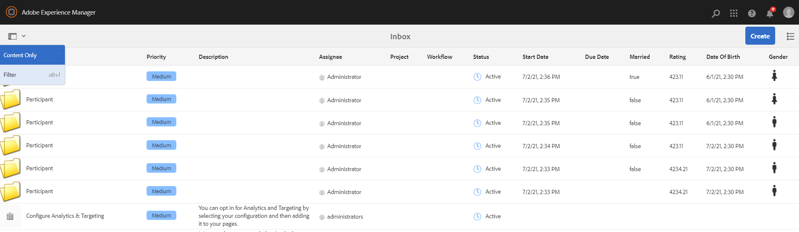

# 配置收件箱的搜索篩選器 {#configure-search-filters-inbox}

您可以配置收件箱項的搜索篩選器。 將搜索條件建立在特定收件箱列上，以篩選結果。

例如，要根據「出生收件匣日期」欄範圍來篩選「收件匣」項目，您可以使用「日期範圍」述詞來定義日期範圍。

以下是「收件箱」的可用謂詞類型：

* 範圍述詞

* 文字述詞

* 日期範圍述詞

* 選項屬性述詞

>[!NOTE]
>
>確保您是`workflow-administrators`組的成員，以配置收件箱的搜索篩選器。

## 建立或開啟自訂設定 {#creating-opening-customized-configuration}

1. 導覽至&#x200B;**[!UICONTROL 工具]**、**[!UICONTROL 一般]**、**[!UICONTROL 搜尋Forms]**。

1. 選取「收件匣搜尋邊欄&#x200B;]**」設定，然後點選「**[!UICONTROL &#x200B;編輯」]**。**[!UICONTROL 
1. 使用&#x200B;**[!UICONTROL 編輯搜尋Forms]**&#x200B;併入述片語態變更。
1. 選擇&#x200B;**[!UICONTROL Done]**&#x200B;以保存配置。

## 刪除自訂的設定 {#delete-customized-configuration}

要刪除自定義配置：

1. 導覽至&#x200B;**[!UICONTROL 工具]**、**[!UICONTROL 一般]**、**[!UICONTROL 搜尋Forms]**。

1. 選取「收件匣搜尋邊欄&#x200B;]**」設定，然後點選「**[!UICONTROL &#x200B;刪除&#x200B;]**」。**[!UICONTROL 

## 設定範圍述詞 {#range-predicate}

您可以使用「範圍述詞」篩選「收件匣」項目，以在「收件匣」欄內搜尋數字範圍。 您也可以選擇包含數字的小數值。

要配置範圍謂語：

1. 開啟[表單以用於配置](#creating-opening-customized-configuration)。
1. 點選「**[!UICONTROL Select Predicate]**」標籤，並將「**[!UICONTROL Range Predicate]**」拖曳至表單。
1. 在&#x200B;**[!UICONTROL 設定]**&#x200B;頁簽中，從&#x200B;**[!UICONTROL 列名]**&#x200B;欄位中選擇收件箱列名以作為搜索的基礎。
1. 在&#x200B;**[!UICONTROL 篩選標籤]**&#x200B;欄位中指定篩選的標籤。 選取「**[!UICONTROL 啟用小數值]**」核取方塊，在定義範圍時接受數字的小數值。
1. 指定設定的可選說明，然後點選&#x200B;**[!UICONTROL Done]**&#x200B;以儲存。

開啟「篩選器」頁面時，設定變更會反映。 您在步驟4中指定的篩選標籤會顯示為標籤，並提供定義最大值和最小值的選項。 按Enter鍵時， [!DNL Experience Manager]將搜索標準應用於步驟3中指定的列名並返回收件箱項。

>[!NOTE]
>
>文章列出最新的使用者介面選項。 選項名稱將在即將發行的使用者介面上更新。

## 設定文字述詞 {#text-predicate}

篩選收件匣項目，以使用「文字述詞」在收件匣欄內搜尋文字字串。

要配置文本謂語：

1. 開啟[表單以用於配置](#creating-opening-customized-configuration)。
1. 點選「**[!UICONTROL Select Predicate]**」標籤，並將「**[!UICONTROL Text Predicate]**」拖曳至表單。
1. 在&#x200B;**[!UICONTROL 設定]**&#x200B;頁簽中，從&#x200B;**[!UICONTROL 列名]**&#x200B;欄位中選擇收件箱列名以作為搜索的基礎。
1. 指定在「搜索」文本框中顯示為&#x200B;**[!UICONTROL 「搜索文本框佔位符」欄位中的佔位符文本的文本。]**
1. 指定設定的可選說明，然後點選&#x200B;**[!UICONTROL Done]**&#x200B;以儲存。

開啟「篩選器」頁面時，設定變更會反映。 按Enter鍵時， [!DNL Experience Manager]將步驟4中指定的搜索文本應用於步驟3中指定的列名並返回收件箱項。

## 設定日期範圍述詞 {#date-range-predicate}

您可以使用「日期範圍述詞」篩選「收件匣」項目，以在「收件匣」欄內搜尋日期範圍。

若要設定日期範圍述詞：

1. 開啟[表單以用於配置](#creating-opening-customized-configuration)。
1. 點選「**[!UICONTROL Select Predicate]**」標籤，並將「**[!UICONTROL Date Range Predicate]**」拖曳至表單。
1. 在&#x200B;**[!UICONTROL 設定]**&#x200B;頁簽中，從&#x200B;**[!UICONTROL 列名]**&#x200B;欄位中選擇收件箱列名以作為搜索的基礎。
1. 在&#x200B;**[!UICONTROL 篩選標籤]**&#x200B;欄位中指定日期範圍篩選的標籤。
1. 指定篩選器的開始日期和結束日期標籤。
1. 指定設定的可選說明，然後點選&#x200B;**[!UICONTROL Done]**&#x200B;以儲存。

開啟「篩選器」頁面時，設定變更會反映。 您在步驟4中指定的篩選標籤會顯示為日期範圍篩選的標籤，以及步驟5中指定的開始日期和結束日期標籤。 [!DNL Experience Manager] 對步驟3中指定的列名應用搜索標準並返回收件箱項。

## 配置自定義列選項謂詞 {#custom-column-options-predicate}

您可以使用「自訂欄選項述詞」篩選「收件匣」項目，以在「收件匣」欄內搜尋自訂選項。

要配置自定義列選項謂語：

1. 開啟[表單以用於配置](#creating-opening-customized-configuration)。
1. 點選「**[!UICONTROL Select Predicate]**」標籤，並將「**[!UICONTROL Custom Column Options Predicate]**」拖曳至表單。
1. 在&#x200B;**[!UICONTROL 設定]**&#x200B;頁簽中，從&#x200B;**[!UICONTROL 列名]**&#x200B;欄位中選擇收件箱列名以作為搜索的基礎。
1. 在&#x200B;**[!UICONTROL 篩選標籤]**&#x200B;欄位中指定自訂欄選項篩選的標籤。
1. 選中「**[!UICONTROL 單選]**」複選框，以在「收件箱」列上應用篩選器時僅啟用一個選項的選擇。
1. 在&#x200B;**[!UICONTROL 新增選項]**&#x200B;區段中：
   1. 選擇&#x200B;**[!UICONTROL 手動]**&#x200B;以手動定義篩選器搜索選項。 點選&#x200B;**[!UICONTROL 新增篩選選項]**&#x200B;以定義第一個選項。 為要搜索的列選項和選項值文本指定標籤。 例如，如果要在「收件箱」列中搜索&#x200B;**Femole**&#x200B;作為值，可以指定&#x200B;**F**&#x200B;作為列選項的標籤，並添加&#x200B;**Femole**&#x200B;作為選項值文本。 同樣地，您也可以新增更多篩選選項。
   1. 選取&#x200B;**[!UICONTROL JSON路徑]**&#x200B;以使用JSON檔案路徑定義選項。 以下是定義篩選選項的範例JSON檔案：

      ```JSON
          {
         "options":[
            {
            "text":"Female",
            "value":"F"
            },
            {
            "text":"Male",
            "value":"M"
            }
          ]
        }
      ```

   1. 選擇&#x200B;**[!UICONTROL CRX選項路徑]**&#x200B;以使用CRX儲存庫路徑定義選項。 點選&#x200B;**[!UICONTROL 新增選項路徑]**&#x200B;以新增多個路徑。 以下是定義`Male`和`Female`篩選選項的範例：

      ```JSON
         <gender jcr:primaryType="sling:OrderedFolder">
                        <male
                            jcr:primaryType="nt:unstructured"
                            jcr:title="Male"
                            value="M"/>
                        <female
                            jcr:primaryType="nt:unstructured"
                            jcr:title="Female"
                            value="F"/>
                    </gender>
      ```

1. 指定設定的可選說明，然後點選&#x200B;**[!UICONTROL Done]**&#x200B;以儲存。

開啟「篩選器」頁面時，設定變更會反映。 您在步驟4中指定的篩選標籤會顯示為「自訂欄選項述詞」的標籤。 [!DNL Experience Manager] 對步驟3中指定的列名應用步驟6中定義的搜索標準並返回收件箱項。

以下影片說明根據`true`和`false`選項值篩選欄的步驟。

>[!VIDEO](https://video.tv.adobe.com/v/335679)

## 根據謂語查看搜索篩選器 {#view-search-filters-for-predicates}

您可以根據謂語檢視搜尋篩選器。 在「收件箱」頁面上選擇&#x200B;**[!UICONTROL Filter]**。 篩選器會顯示在左窗格中。 然後，您可以指定搜索條件以篩選收件箱項。



如需管理述詞設定的詳細資訊，請參閱[設定搜尋Forms](search-forms.md)。


