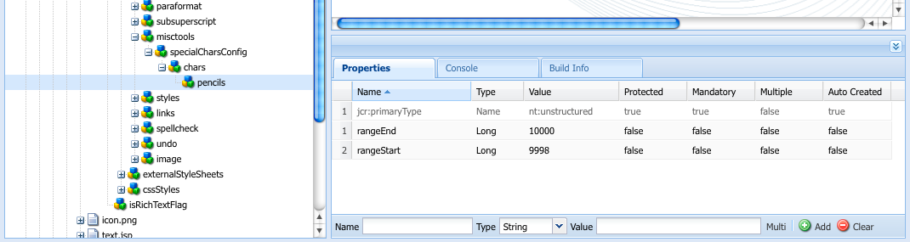

# 設定Rich Text Editor外掛程式 {#configure-the-rich-text-editor-plug-ins}

RTE功能可透過一系列外掛程式提供，每個外掛程式都包含features屬性。 您可以配置features屬性以啟用或禁用一個或多個RTE功能。 本文說明如何具體配置RTE插件。

有關其他RTE配置的詳細資訊，請參 [見配置Rich Text Editor](/help/implementing/developing/extending/rich-text-editor.md)。

>[!NOTE]
>
>使用CRXDE Lite時，建議使用「全部儲存」選項定期儲 [!UICONTROL 存變更] 。

## 啟動外掛程式並設定features屬性 {#activateplugin}

若要啟動外掛程式，請依照下列步驟進行。 只有在您第一次設定外掛程式時，才需要一些步驟，因為對應的節點不存在。

依預設， `format`、、 `link`、和外掛程 `list``justify``control` 式及其所有功能都會在RTE中啟用。

>[!NOTE]
>
>本文 `rtePlugins` 中各節點的 `<rtePlugins-node>` 定義是避免重複。

1. 使用CRXDE Lite，找出專案的文字元件。
1. 在配置任何RTE插 `<rtePlugins-node>` 件之前，建立父節點（如果它不存在）:

   * 根據您的元件，父節點包括：

      * `config: .../text/cq:editConfig/cq:inplaceEditing/config`
      * 替代配置節點： `.../text/cq:editConfig/cq:inplaceEditing/inplaceEditingTextConfig`
      * `text: .../text/dialog/items/tab1/items/text`
   * 類型： **jcr:primaryType** `cq:Widget`
   * 兩者皆具有下列屬性：

      * **名稱** `name`
      * **類型** `String`
      * **值** `./text`


1. 根據您為配置的介面，建立節點(如果 `<rtePlugins-node>`節點不存在):

   * **名稱** `rtePlugins`
   * **類型** `nt:unstructured`

1. 在此下，為要激活的每個插件建立一個節點：

   * **類型** `nt:unstructured`
   * **命名** 所需外掛程式的外掛程式ID

啟動外掛程式後，請依照下列准則來設定 `features` 屬性。

|  | 啟用所有功能 | 啟用一些特定功能 | 停用所有功能 |
|---|---|---|---|
| 名稱 | 功能 | 功能 | 功能 |
| 類型 | 字串 | 字串[] (多字串； 在CRXDE Lite中將「類型」設為「字串」，然後按一下「多重」) | 字串 |
| 值 | `*` （星號） | 設為一或多個功能值 | - |

## 瞭解findreplace增效模組 {#findreplace}

外 `findreplace` 掛程式不需要任何設定。 它是現成可用的。

使用替換功能時，應與查找字串同時輸入要替換的替換字串。 不過，您仍可以按一下「尋找」，在取代字串之前先搜尋字串。 如果在按一下「查找」後輸入了替換字串，則搜索將重置為文本的開頭。

當點按尋找時，尋找和取代對話方塊會變為透明，當點按取代時，對話方塊會變成不透明。 這可讓作者檢閱作者將要取代的文字。 如果用戶按一下「全部替換」(replace all)，則對話框將關閉並顯示已替換的數量。

## 設定貼上模式 {#pastemodes}

使用RTE時，作者可以在以下三種模式之一中貼上內容：

* **瀏覽器模式**: 使用瀏覽器的預設貼上實作來貼上文字。 它不是建議的方法，因為它可能會引入不想要的標籤。

* **純文字檔案模式**: 將剪貼簿內容貼為純文字。 在AEM元件中插入之前，會先從複製的內容移除所有樣式和格式元素。

* **MS Word模式**: 從MS Word複製時，使用格式化貼上文字（包括表格）。 不支援從其他來源（例如網頁或MS Excel）複製和貼上文字，並僅保留部分格式。

### 在RTE工具欄上配置可用的「貼上」選項  {#configure-paste-options-available-on-the-rte-toolbar}

您可以在RTE工具列中為作者提供以下三個表徵圖：

* **[!UICONTROL 貼上(Ctrl+V)]**: 可預先設定，以對應上述三種「貼上」模式之一。

* **[!UICONTROL 貼上為文字]**: 提供純文字檔案模式功能。

* **[!UICONTROL 從Word貼上]**: 提供MS Word模式功能。

要配置RTE以顯示所需的表徵圖，請遵循以下步驟。

1. 例如，導覽至您的元件 `/apps/<myProject>/components/text`。
1. 導航到節點 `rtePlugins/edit`。 如 [果節點不存在](#activateplugin) ，請參閱激活插件。
1. 在節點 `features` 上建立屬 `edit` 性並添加一個或多個功能。 儲存所有變更。

### 設定「貼上」(Ctrl+V)圖示和捷徑的行為 {#configure-the-behavior-of-the-paste-ctrl-v-icon-and-shortcut}

您可以使用下列步驟，預先設 **[!UICONTROL 定「貼上(Ctrl+V)]** 」圖示的行為。 此設定也定義作者用來貼上內容的鍵盤快速鍵Ctrl+V的行為。

此配置允許以下三種類型的使用案例：

* 使用瀏覽器的預設貼上實作來貼上文字。 它不是建議的方法，因為它可能會引入不想要的標籤。 使用下面 `browser` 配置。

* 將剪貼簿內容貼為純文字。 在AEM元件中插入之前，會先從複製的內容移除所有樣式和格式元素。 使用下面 `plaintext` 配置。

* 從MS Word複製時，使用格式化貼上文字（包括表格）。 不支援從其他來源（例如網頁或MS Excel）複製和貼上文字，並僅保留部分格式。 使用下面 `wordhtml` 配置。

1. 在元件中，導航到節 `<rtePlugins-node>/edit` 點。 如果節點不存在，則建立這些節點。 如需詳細資訊，請 [參閱啟動外掛程式](#activateplugin)。
1. 在節點 `edit` 中，使用以下詳細資訊建立屬性：

   * **名稱** `defaultPasteMode`
   * **類型** `String`
   * **值** ：需要的貼上模式 `browser`之 `plaintext`一、或 `wordhtml`。

### 設定貼上內容時允許的格式 {#pasteformats}

您可進一步設定「貼上為Microsoft-Word(`paste-wordhtml`)」模式，以便您明確定義從其他程式（例如Microsoft Word）在AEM中貼上時允許使用哪些樣式。

例如，如果在AEM中貼上時僅允許使用粗體格式和清單，您可以篩選掉其他格式。 這稱為可設定的貼上篩選，可針對下列兩種方式執行：

* [文字](#pastemodes)
* [連結](#linkstyles)

對於連結，您也可以定義自動接受的通訊協定。

若要設定從其他程式將文字貼到AEM時允許的格式：

1. 在元件中，導航到節點 `<rtePlugins-node>/edit`。 如果節點不存在，則建立這些節點。 如需詳細資訊，請 [參閱啟動外掛程式](#activateplugin)。
1. 在節點下建立節 `edit` 點以保存HTML貼上規則：

   * **名稱** `htmlPasteRules`
   * **類型** `nt:unstructured`

1. 在下面建立節 `htmlPasteRules`點，以保存允許的基本格式的詳細資訊：

   * **名稱** `allowBasics`
   * **類型** `nt:unstructured`

1. 要控制接受的各種格式，請在節點上建立以下一個或多個屬 `allowBasics` 性：

   * **名稱** `bold`
   * **名稱** `italic`
   * **名稱** `underline`
   * **名稱** ( `anchor` 同時適用於連結和命名定位點)
   * **名稱** `image`

   所有屬性均為 **Type** ，因此，在適當的 `Boolean`Value **** 中，您可以選擇或移除複選標籤以啟用或停用功能。

   >[!NOTE]
   >
   >如果未明確定義，則使用預設值true並接受格式。

1. 其他格式也可以使用一系列其他屬性或節點來定義，這些屬性或節點也應用於 `htmlPasteRules` 節點：

<table>
 <tbody>
  <tr>
   <td><strong>屬性</strong></td>
   <td><strong>類型</strong></td>
   <td><strong>說明</strong></td>
  </tr>
  <tr>
   <td>allowBlockTags</td>
   <td>String[]</td>
   <td><p>定義允許的塊標籤清單。</p> <p>幾個可能的區塊標籤包括：</p>
    <ul>
     <li>標題(h1、h2、h3)</li>
     <li>第(p)段</li>
     <li>清單(ol、ul)</li>
     <li>表（表）</li>
    </ul> </td>
  </tr>
  <tr>
   <td>fallbackBlockTag</td>
   <td>字串</td>
   <td><p>定義塊標籤，用於任何包含塊標籤的塊標籤，該塊標籤未包含在allowBlockTags中。</p> <p> p在大多數情況下都足夠。</p> </td>
  </tr>
  <tr>
   <td>表</td>
   <td>nt:unstructured</td>
   <td><p>定義貼上表時的行為。<br /> </p> <p>此節點必須具有屬性 <code>allow</code> (類型 <code>Boolean</code>)才能定義是否允許貼上表。</p> <p>如果 <code>allow</code> 設為 <code>false</code>，您必須指定屬性 <code>ignoreMode</code> (類型<code> String</code>)，以定義貼上表格內容的處理方式。 有效值 <code>ignoreMode</code> 為：</p>
    <ul>
     <li><code>remove</code>: 移除表格內容。</li>
     <li><code>paragraph</code>: 將表格儲存格轉換為段落。</li>
    </ul> </td>
  </tr>
  <tr>
   <td>清單</td>
   <td>nt:unstructured</td>
   <td><p>定義貼上清單時的行為。<br /> </p> <p>必須具有屬 <code>allow</code> 性(類 <code>Boolean</code>型)才能定義是否允許貼上清單。</p> <p>如果 <code>allow</code> 設為 <code>false</code>，您必須指定屬性( <code>ignoreMode</code><code>String</code>類型)以定義如何處理貼上的任何清單內容。 有效值 <code>ignoreMode</code> 為：</p>
    <ul>
     <li><code>remove</code>: 移除清單內容。</li>
     <li><code>paragraph</code>: 將清單項目轉換為段落。</li>
    </ul> </td>
  </tr>
 </tbody>
</table>

有效結構的示 `htmlPasteRules` 例：

```xml
"htmlPasteRules": {
    "allowBasics": {
        "italic": true,
        "link": true
    },
    "allowBlockTags": [
        "p", "h1", "h2", "h3"
    ],
    "list": {
        "allow": false,
        "ignoreMode": "paragraph"
    },
    "table": {
        "allow": true,
        "ignoreMode": "paragraph"
    }
}
```

1. 儲存所有變更。

## 設定文字樣式 {#textstyles}

作者可以套用「樣式」來變更部分文字的外觀。 這些樣式是以您在CSS樣式表中預先定義的CSS類別為基礎。 使用屬性引用CSS `span` 類別，將 `class` 樣式化內容封閉在標籤中。 例如：

`<span class=monospaced>Monospaced Text Here</span>`

當第一次啟用「樣式」外掛程式時，就不提供預設的「樣式」。 快顯清單是空的。 若要為作者提供樣式，請執行下列動作：

* 啟用「樣式」下拉式選取器。
* 指定樣式表的位置。
* 指定可從「樣式」下拉式清單中選取的個別樣式。

對於稍後（重新）的配置，例如要添加更多樣式，請只按照說明參考新樣式表並指定其他樣式。

>[!NOTE]
>
>您也可以為表格或表格儲 [存格定義樣式](configure-rich-text-editor-plug-ins.md#tablestyles)。 這些配置需要單獨的過程。

### 啟用「樣式」下拉式選取器清單 {#styleselectorlist}

若要這麼做，請啟用樣式外掛程式。

1. 在元件中，導航到節點 `<rtePlugins-node>/styles`。 如果節點不存在，則建立這些節點。 如需詳細資訊，請 [參閱啟動外掛程式](#activateplugin)。
1. 在節點 `features` 上建立屬 `styles` 性：

   * **名稱** `features`
   * **類型** `String`
   * **值** ( `*` 星號)

1. 儲存所有變更。

>[!NOTE]
>
>啟用「樣式」外掛程式後，「樣式」下拉式清單就會顯示在編輯對話方塊中。 不過，清單是空的，因為未設定任何樣式。

### 指定樣式表位置 {#locationofstylesheet}

然後，指定要參照的樣式表的位置：

1. 例如，導航到文本元件的根節點 `/apps/<myProject>/components/text`。
1. 將屬性添 `externalStyleSheets` 加到以下的父節點 `<rtePlugins-node>`:

   * **名稱** `externalStyleSheets`
   * **Type** ( `String[]` multi-string; 在CRXDE中 **按一下** 「多」(Multi))
   * **值要包括的** 每個樣式表的路徑和檔案名。 使用儲存庫路徑。

   >[!NOTE]
   >
   >您可以隨後將參照添加到其他樣式表。

1. 儲存所有變更。

>[!NOTE]
>
>在對話框(Classic UI)中使用RTE時，您可能需要指定針對富格文本編輯而優化的樣式表。 由於技術限制，CSS內容會在編輯器中遺失，因此您可能想要模擬此內容以改善WYSIWYG體驗。
>
>Rich Text Editor使用ID為的容器DOM元素， `CQrte` 可用來提供不同的檢視和編輯樣式：
>
>
```
>#CQ td {
> // defines the style for viewing
> }
>```
>
>
```
>#CQrte td {
> // defines the style for editing
> }
>```

### 在快顯清單中指定可用的樣式 {#stylesindropdown}

1. 在元件定義中，導航到節點 `<rtePlugins-node>/styles`，如啟用樣 [式下拉選擇器中建立的](#styleselectorlist)。
1. 在節點下 `styles`，建立一個新節點(也稱 `styles`為)以保存清單：

   * **名稱** `styles`
   * **類型** `cq:WidgetCollection`

1. 在節點下建立新節 `styles` 點以表示單個樣式：

   * **名稱**，您可以指定名稱，但應適合樣式
   * **類型** `nt:unstructured`

1. 將屬性新 `cssName` 增至此節點以參考CSS類別：

   * **名稱** `cssName`
   * **類型** `String`
   * **值** :CSS類別的名稱（不含前面的&#39;.&#39;）; for example, `cssClass` instead of `.cssClass`)

1. 將屬性 `text` 添加到同一節點； 這定義了選擇框中顯示的文本：

   * **名稱** `text`
   * **類型** `String`
   * **值** ：樣式描述； 顯示在「樣式」下拉式選擇框中。

1. 儲存變更。

   對每個所需樣式重複上述步驟。

### 配置RTE，以使用日文進行最佳單字分隔 {#jpwordwrap}

使用AEM來製作日文語言內容的作者可以將樣式套用至字元，以避免在不需要分行符的情況下出現分行符號。 這可讓作者讓句子在所要的位置中斷。 此功能的樣式是以CSS樣式表中預先定義的CSS類別為基礎。

>[!NOTE]
>
>此功能至少需要AEM 6.5 Service Pack 1。

若要建立作者可套用至日文文字的樣式，請遵循下列步驟：

1. 在樣式節點下建立新節點。 請參 [閱指定新樣式](#stylesindropdown)。
   * 名稱: `jpn-word-wrap`
   * 類型： &#39;nt&#39;:unstructure

1. 將屬性新 `cssName` 增至節點以參考CSS類別。 此類別名稱是日文繞字功能的保留名稱。
   * 名稱: `cssName`
   * 類型: `String`
   * 值： `jpn-word-wrap` (不含前 `.`文)

1. 將屬性文本添加到同一節點。 該值是作者在選擇樣式時看到的樣式名稱。
   * 名稱： `text`
*類型： `String`
值: `Japanese word-wrap`
   * 建立樣式表並指定其路徑。 請參 [閱指定樣式表的位置](#locationofstylesheet)。 將下列內容新增至樣式表。 視需要變更背景顏色。

1. 

   ```css
   .text span.jpn-word-wrap {
       display:inline-block;
   }
   .is-edited span.jpn-word-wrap {
       background-color: #ffddff;
   }
   ```

   設定段落格式 {#paraformats}](assets/rte_jpwordwrap_stylesheet.jpg)

## 在RTE中編寫的任何文本都放在塊標籤中，預設值為 `<p>`。 啟用外掛 `paraformat` 程式後，您可使用下拉式選取清單，指定可指派給段落的其他區塊標籤。 段落格式通過指定正確的塊標籤來確定段落類型。 作者可以使用「格式」選擇器來選取並指派它們。 範例區塊標籤包括標準段落&lt;p>和標題&lt;h1>、&lt;h2>等。

[!CAUTION]`paraformat`

>[!CAUTION]此外掛程式不適用於結構複雜的內容，例如清單或表格。
>
>[!NOTE]

>[!NOTE]如果無法將區塊標籤（例如&lt;hr>標籤）指派給段落，則它不是paraformat外掛程式的有效使用案例。
>
>首次啟用「段落格式」外掛程式時，不提供預設的「段落格式」。 快顯清單是空的。 要向作者提供段落格式，請執行以下操作：

啟用「格式」下拉式選取器清單。

* 指定可從下拉式清單中選取為段落格式的區塊標籤。
* 對於以後的（重新）配置，例如要添加更多格式，請只遵循說明的相關部分。

啟用「格式」下拉式選取器 {#formatselectorlist}

### 首先啟用paraformat外掛程式：{#formatselectorlist}

在元件中，導航到節點 `<rtePlugins-node>/paraformat`。 如果節點不存在，則建立這些節點。 如需詳細資訊，請 [參閱啟動外掛程式](#activateplugin)。

1. 在節點 `features` 上建立屬 `paraformat` 性：](#activateplugin)
1. **名稱** `features`

   * **類型** `String`
   * **值** ( `*` 星號)
   * [!NOTE]**`*`

>[!NOTE]如果外掛程式未進一步設定，則會啟用下列預設格式：
段落 ( `<p>`)
* 標題 1 ( `<h1>`)
* 標題 2 ( `<h2>`)
* 標題 3 ( `<h3>`)
* [!CAUTION]


>在配置RTE的段落格式時，不要將段落標籤&lt;p>作為格式選項刪除。 如果標 `<p>` 記被移除，則內容作者即使已設定其他格式，也無法選取 **「段落格式** 」選項。
指定可用的段落格式 {#paraformatsindropdown}****

### 段落格式可供下列人士選擇：{#paraformatsindropdown}

在元件定義中，導航到節點 `<rtePlugins-node>/paraformat`，如啟用格 [式下拉選擇器中建立的](#styleselectorlist)。

1. 在節 `paraformat` 點下建立新節點，以保存格式清單：[](#styleselectorlist)
1. **名稱** `formats`

   * **類型** `cq:WidgetCollection`
   * 在節點下建立新節 `formats` 點，這將保存單個格式的詳細資訊：**`cq:WidgetCollection`

1. **名稱**，您可以指定名稱，但它應適合格式（例如myparagraph、myheading1）。

   * **類型** `nt:unstructured`
   * **要使用此節點，請添加屬性以定義使用的塊標籤：**`nt:unstructured`

1. **名稱** `tag`

   * **類型** `String`
   * **值** ：格式的塊標籤； 例如： p、h1、h2等。`String`
   * **您不需要輸入定界角括弧。**

      對於同一節點，添加另一個屬性，以便說明性文本顯示在下拉清單中：

1. **名稱** `description`

   * **類型** `String`
   * **值** ：此格式的描述性文字； 例如，段落、標題1、標題2等。 此文本顯示在「格式」(Format)選擇清單中。`String`
   * **儲存變更。**

1. 對每種必要格式重複步驟。

   [!CAUTION]

>如果您定義自訂格式，則會移`<p>`除預 `<h1>`設 `<h2>`格式( `<h3>`、和)。 重新建立 `<p>` 預設格式的格式。
設定特殊字元 {#spchar}`<h1>``<h2>``<h3>``<p>`

## 在標準AEM安裝中，當外掛程 `misctools` 式為特殊字元啟用時(`specialchars`)預設選項會立即可供使用； 例如，著作權和商標符號。

您可以配置RTE，使自己選擇的字元可供使用； 定義不同的字元或整個序列。`misctools``specialchars`

[!CAUTION]

>[!CAUTION]新增您自己的特殊字元會覆寫預設選取範圍。 如果需要，（重新）在您自己的選擇中定義這些字元。
定義單一字元 {#definesinglechar}

### 在元件中，導航到節點 `<rtePlugins-node>/misctools`。 如果節點不存在，則建立這些節點。 如需詳細資訊，請 [參閱啟動外掛程式](#activateplugin)。

1. 在節點 `features` 上建立屬 `misctools` 性：](#activateplugin)
1. **名稱** `features`

   * **類型** `String[]`
   * **值** `specialchars`
   *     (或 `String / *` 如果套用此外掛程式的所有功能)**`specialchars`

      在創 `misctools` 建節點下，保存特殊字元配置：

1. **名稱** `specialCharsConfig`

   * **類型** `nt:unstructured`
   * 在創 `specialCharsConfig` 建另一個節點下，保存字元清單：**`nt:unstructured`

1. **名稱** `chars`

   * **類型** `nt:unstructured`
   * 在「 `chars` 添加新節點」下，保存單個字元定義：**`nt:unstructured`

1. **名稱** ，您可以指定名稱，但應反映字元； 例如，一半。

   * **類型** `nt:unstructured`
   * **要添加到此節點，請添加以下屬性：**`nt:unstructured`

1. **名稱** `entity`

   * **類型** `String`
   * **為所需字元** (HTML)的表示方式提供值； 例如，對 `&189;` 於一半的分數。
   * **儲存變更。**`&189;`

1. 在CRXDE中，保存屬性後，將顯示所表示的字元。 請參閱下方的一半範例。 重複上述步驟，讓作者可使用更多特殊字元。


定義字元範圍 {#definerangechar}](assets/chlimage_1-106.png "")

### 使用定義單一字元 [的步驟1到3](#definingasinglecharacter)。

1. 在 `chars` 添加新節點時，保存字元範圍的定義：](#definingasinglecharacter)
1. **名稱** ，您可以指定名稱，但應反映字元範圍； 比如鉛筆。

   * **類型** `nt:unstructured`
   * **在此節點下（根據您的特殊字元範圍命名）新增下列兩個屬性：**`nt:unstructured`

1. **名稱** `rangeStart`


   * **類型** `Long`
      **值**[[#$tu253] 範圍中第一個字元的Unicode表示法（小數）      

   * **類型** `Long`
      **值**[[#$tu257] 範圍中最後一個字元的Unicode表示法（小數）      

1. 例如，定義範圍為9998 - 10000，提供下列字元。

   

   *圖： 在CRXDE中，定義要在RTE中提供的字元範圍*

   

   設定表格樣式 {#tablestyles}](assets/rtepencil.png "")

## 樣式通常套用在文字上，但也可套用在表格或數個表格儲存格上的個別樣式集。 作者可從「儲存格屬性」或「表格屬性」對話方塊的「樣式選取器」方塊中，使用此類樣式。 在文本元件（或衍生元件）中編輯表時，這些樣式是可用的，在標準表元件中不可用。{#tablestyles}

[!NOTE]

>[!NOTE]您只能為Classic UI定義表格和儲存格的樣式。
[!NOTE]

>[!NOTE]在RTE元件中或從RTE元件中複製和貼上表取決於瀏覽器。 並非所有瀏覽器都可立即使用。 根據表格結構和瀏覽器，您可能會得到不同的結果。 例如，當您在Mozilla Firefox的Classic UI和Touch UI中複製並貼上RTE元件中的表格時，表格的版面不會保留。
在元件中導航到節點 `<rtePlugins-node>/table`。 如果節點不存在，則建立這些節點。 如需詳細資訊，請 [參閱啟動外掛程式](#activateplugin)。

1. 在節點 `features` 上建立屬 `table` 性：](#activateplugin)
1. **名稱** `features`

   * **類型** `String`
   * **值** `*`
   * [!NOTE]**`*`

   >如果不想啟用所有表功能，可以將屬性創 `features` 建為：
   **類型** `String[]`
   * **視需要**，為下列其中一項或兩項設定值：`String[]`

   * `table` 允許編輯表屬性； 包括樣式。**
      * `cellprops` 以允許編輯儲存格屬性，包括樣式。
      * 定義CSS樣式表的位置以參照這些樣式表。 請參 [閱指定樣式表的位置](#locationofstylesheet) ，這與定義文本樣式時 [的位置相同](#textstyles)。 如果定義了其他樣式，則可定義該位置。


1. 在節點 `table` 下建立以下新節點（根據需要）:](#locationofstylesheet)[](#textstyles)
1. 要定義整個表的樣式(可在「表」( **Table)屬性下使用**):

   * **名稱** `tableStyles`

      * **類型** `cq:WidgetCollection`
      * 要定義單個單元格的樣式(可在「單元格屬性」 **下使用**):`cq:WidgetCollection`
   * **名稱** `cellStyles`

      * **類型** `cq:WidgetCollection`
      * 建立新節點(在相應 `tableStyles` 的或 `cellStyles` 節點下)以表示單個樣式：`cq:WidgetCollection`


1. **名稱** ，您可以指定名稱，但應反映樣式。

   * **類型** `nt:unstructured`
   * **在此節點上建立以下屬性：**`nt:unstructured`

1. 要定義要引用的CSS樣式

   * **名稱** `cssName`

      * **類型** `String`
      * **值** CSS類別的名稱(例如，不含 `.`前面的 `cssClass` 名稱，而非 `.cssClass`)
      * **要定義要在下拉式選擇器中顯示的描述性文本，請執行以下操作：**`.``cssClass``.cssClass`
   * **名稱** `text`

      * **類型** `String`
      * **將要出現在** 「選擇」清單中的文本值`String`
      * **儲存所有變更。**


1. 對每個所需樣式重複上述步驟。

在表格中設定隱藏的標題以供協助工具使用 {#hiddenheader}

### 有時，您可能會在欄標題中建立不含視覺文字的資料表格，並假設標題的用途是由欄與其他欄的視覺關係所隱含。 在這種情況下，必須在標題儲存格的儲存格內提供隱藏的內文，讓螢幕閱讀程式和其他輔助技術協助有不同需求的讀者瞭解欄目的用途。{#hiddenheader}

為了增強此類場景中的輔助功能，RTE支援隱藏的標題單元格。 此外，它還提供與表格中隱藏標題相關的配置設定。 這些設定可讓您在編輯和預覽模式中，將CSS樣式套用至隱藏的標題。 若要協助作者在編輯模式中識別隱藏的標題，請在程式碼中加入下列參數：

`hiddenHeaderEditingCSS`: 指定編輯RTE時，在隱藏標題單元格上應用的CSS類的名稱。

* `hiddenHeaderEditingStyle`: 指定在編輯RTE時應用於隱藏標題單元格的樣式字串。
* `hiddenHeaderEditingStyle`如果您在程式碼中同時指定CSS和Style字串，CSS類別會優先於樣式字串，而且可能會覆寫Style字串所做的任何設定變更。

若要協助作者在預覽模式中將CSS套用在隱藏的標題上，您可在程式碼中加入下列參數：

`hiddenHeaderClassName`: 指定在預覽模式中套用在隱藏標題儲存格上的CSS類別名稱。

* `hiddenHeaderStyle`: 指定在預覽模式下應用於隱藏標題單元格的樣式字串。
* `hiddenHeaderStyle`如果您在程式碼中同時指定CSS和Style字串，CSS類別會優先於樣式字串，而且可能會覆寫Style字串所做的任何設定變更。

為拼字檢查程式新增字典 {#adddict}

## 當spellcheck外掛程式啟動時，RTE會針對每個適當的語言使用字典。 然後根據網站的語言選擇，分別從子樹中抽取語言屬性或從URL中抽取語言； 例如。 分支 `/en/` 被選中為英語，分支被選 `/de/` 中為德語。

[!NOTE]`/de/`

>[!NOTE]訊息「拼字檢查失敗」。 is seen if a check is treed for a language that is not installed.
標準AEM安裝包含下列字典：

美國英文(en_us)

* 英文(en_gb)
* [!NOTE]

>標準字典位於 `/libs/cq/spellchecker/dictionaries`，以及適當的讀我檔案。 請勿修改檔案。
若要新增更多字典，請依照下列步驟進行。`/libs/cq/spellchecker/dictionaries`

導覽至https://extensions.openoffice.org/ [頁面[#$tu323]。

1. 
1. [!CAUTION]

   >僅支援 `MySpell` OpenOffice.org v2.0.1或更早版本的字典。 由於字典現在是封存檔案，因此建議您在下載後確認封存。
   找到。aff和。dic檔案。 將檔案名稱保留為小寫。 例如， `de_de.aff` 和 `de_de.dic`。

1. 將。aff和。dic檔案載入到儲存庫中，位於 `/apps/cq/spellchecker/dictionaries`。`de_de.dic`
1. [!NOTE]

>[!NOTE]RTE拼字檢查器是隨選的。 當您開始輸入文字時，它不會自動執行。
若要執行拼字檢查程式，請點選／按一下工具列上的「拼字檢查程式」按鈕。 RTE會檢查單字的拼字，並反白顯示拼字錯誤的單字。
如果您加入拼字檢查程式所建議的任何變更，文字變更和拼字錯誤的字詞狀態將不再反白顯示。 要運行拼字檢查器，請再次點選／按一下「拼字檢查器」按鈕。
設定還原和重做動作的步驟記錄大小 {#undohistory}

## RTE允許作者還原或重做最後幾次編輯。 依預設，50個編輯會儲存在歷史記錄中。 您可以視需要設定此值。{#undohistory}

在元件中導航到節點 `<rtePlugins-node>/undo`。 如果節點不存在，請建立這些節點。 如需詳細資訊，請 [參閱啟動外掛程式](#activateplugin)。

1. 在節點 `undo` 上建立屬性：[](#activateplugin)
1. **名稱** `maxUndoSteps`

   * **類型** `Long`
   * **值** ，您要在歷史記錄中保存的撤消步驟數。 預設值為50。 使用 `0` 以完全停用還原／重做。
   * **儲存變更。**`0`

1. 設定標籤大小 {#tabsize}

## 當在任何文本中按下Tab字元時，將插入預定數量的空格； 預設情況下，這是三個非斷開空格和一個空格。{#tabsize}

要定義標籤大小，請執行以下操作：

在元件中，導航到節點 `<rtePlugins-node>/keys`。 如果節點不存在，則建立這些節點。 如需詳細資訊，請 [參閱啟動外掛程式](#activateplugin)。

1. 在節點 `keys` 上建立屬性：[](#activateplugin)
1. **名稱** `tabSize`

   * **類型** `String`
   * **值** ，表格使用的空格字元數。`String`
   * **儲存變更。**

1. 設定縮進邊界 {#indentmargin}

## 啟用縮進（預設）時，可以定義縮進大小：{#indentmargin}

[!NOTE]

>[!NOTE]此縮進大小僅應用於文本的段落（塊）; 它不會影響實際清單的縮進。
在元件中導航到節點 `<rtePlugins-node>/lists`。 如果節點不存在，請建立這些節點。 如需詳細資訊，請 [參閱啟動外掛程式](#activateplugin)。

1. 在節點 `lists` 上建立 `identSize` 參數：](#activateplugin)
1. **名稱**: `identSize`

   * **類型**: `Long`
   * **值**: 縮進邊界所需的像素數。`Long`
   * 配置可編輯空間的高度 {#editablespace}**

## [!NOTE]

>[!NOTE]只有在對話框中使用RTE（在傳統UI中不是就地編輯）時，才適用此選項。
您可以定義元件對話框中顯示的可編輯空間的高度：

在元件的 `../items/text` 對話框定義中的節點上，建立一個新屬性：

1. **名稱** `height`

   * **類型** `Long`
   * **以像素** 為單位，將編輯畫布的高度值。`Long`
   * [!NOTE]**

   >[!NOTE]這不會更改對話框窗口的高度。
   儲存變更。

1. 設定連結的樣式和通訊協定 {#linkstyles}

## 在AEM中新增連結時，您可以定義：{#linkstyles}

要使用的CSS樣式

* 自動接受協定
* 若要設定如何從其他程式在AEM中新增連結，請定義HTML規則。

使用CRXDE Lite，找出專案的文字元件。

1. 在與以下節點相同的級別創 `<rtePlugins-node>`建新節點，即在父節點下建立節點 `<rtePlugins-node>`:
1. **名稱** `htmlRules`

   * **類型** `nt:unstructured`
   * [!NOTE]**`nt:unstructured`

   >節 `../items/text` 點具有以下屬性：
   **名稱** `xtype`
   * **類型** `String`
   * **值** `richtext`
   * 節點的位 `../items/text` 置會因對話的結構而異； 兩個範例包括：**`richtext`

   `/apps/myProject>/components/text/dialog/items/text`
   * `/apps/<myProject>/components/text/dialog/items/panel/items/text`
   * 在下 `htmlRules`面，建立新節點。


1. **名稱** `links`

   * **類型** `nt:unstructured`
   * 在節點 `links` 下，根據需要定義屬性：**`nt:unstructured`

1. 內部連結的CSS樣式：`links`

   * **名稱** `cssInternal`

      * **類型** `String`
      * **值** CSS類的名稱（不帶前面的&#39;.&#39;）; for example, `cssClass` instead of `.cssClass`)
      * **外部連結的CSS樣式**`cssClass``.cssClass`
   * **名稱** `cssExternal`

      * **類型** `String`
      * **值** CSS類的名稱（不帶前面的&#39;.&#39;）; for example, `cssClass` instead of `.cssClass`)
      * 有效通訊 **協定的陣列** (包括https://、https:// file://、mailto：等等)`cssClass``.cssClass`
   * **名稱** `protocols`

      * **類型** `String[]`
      * **值**，一個或多個協定`String[]`
      * **defaultProtocol** (類型為 **String**&#x200B;的屬性): 當用戶未明確指定協定時使用的協定。
   * **名稱** `defaultProtocol`**

      * **類型** `String`
      * **值**，一個或多個預設協定`String`
      * **如何處理連結的目標屬性的定義。 建立新節點：**
   * **名稱** `targetConfig`

      * **類型** `nt:unstructured`
      * 在節點上 `targetConfig`: 定義所需屬性：**`nt:unstructured`

      指定目標模式：`targetConfig`

      * **名稱** `mode`

         * **類型**`String`)
         * **值**:`String`
         * `auto`: 意指自動選取目標**

            * (由外部連 `targetExternal` 結或內部連結的屬 `targetInternal` 性指定)。

               `manual`: 不適用於此上下文`targetInternal`

            * `blank`: 不適用於此上下文
            * `blank`內部連結的目標：
      * **名稱** `targetInternal`

         * **類型** `String`
         * **為內部** 連結的目標值(僅在「模式」為時使用 `auto`)
         * **外部連結的目標：**`auto`
      * **名稱** `targetExternal`

         * **類型** `String`
         * **為外部連結** （僅在模式為時使用）設定目標 `auto`值。
         * **儲存所有變更。**`auto`


1. Save all changes.
