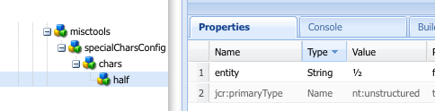

# 設定RTF編輯器外掛程式 {#configure-the-rich-text-editor-plug-ins}

RTE功能可透過一系列外掛程式使用，每個外掛程式都具備功能屬性。 您可以設定功能屬性來啟用或停用一或多個RTE功能。 本文會說明如何特別設定RTE外掛程式。

如需其他RTE設定的詳細資訊，請參閱 [設定RTF編輯器](/help/implementing/developing/extending/rich-text-editor.md).

>[!NOTE]
>
>使用CRXDE Lite時，建議使用定期儲存變更 [!UICONTROL 全部儲存] 選項。

## 啟動外掛程式並設定功能屬性 {#activateplugin}

若要啟用外掛程式，請依照下列步驟操作。 只有在您首次設定外掛程式時才需要執行某些步驟，因為對應的節點不存在。

根據預設， `format`， `link`， `list`， `justify`、和 `control` 外掛程式及其所有功能皆會在RTE中啟用。

>[!NOTE]
>
>個別 `rtePlugins` 節點稱為 `<rtePlugins-node>` 以避免本文中的重複。

1. 使用CRXDE Lite，找出專案的文字元件。
1. 建立以下專案的父節點： `<rtePlugins-node>` 如果不存在，在設定任何RTE外掛程式之前：

   * 根據您的元件，父節點為：

      * `config: .../text/cq:editConfig/cq:inplaceEditing/config`
      * 替代設定節點： `.../text/cq:editConfig/cq:inplaceEditing/inplaceEditingTextConfig`
      * `text: .../text/dialog/items/tab1/items/text`

   * 屬於以下型別： **jcr：primaryType** `cq:Widget`
   * 兩者都有以下屬性：

      * **名稱** `name`
      * **型別** `String`
      * **值** `./text`

1. 根據您設定的介面，建立節點 `<rtePlugins-node>`，如果它不存在：

   * **名稱** `rtePlugins`
   * **型別** `nt:unstructured`

1. 在此節點底下，針對您要啟用的每個外掛程式建立一個節點：

   * **型別** `nt:unstructured`
   * **名稱** 需要外掛程式的外掛程式ID

啟用外掛程式後，請依照下列准則設定 `features` 屬性。

| | 啟用所有功能 | 啟用幾項特定功能。 | 停用所有功能。 |
|---|---|---|---|
| 名稱 | 功能 | 功能 | 功能 |
| 類型 | 字串 | `String` (多字串；將Type設為 `String` 並按一下 `Multi` 在CRXDE Lite) | 字串 |
| 值 | `*` （星號） | 設定為一個或多個特徵值。 | - |

## 瞭解findreplace外掛程式 {#findreplace}

此 `findreplace` 外掛程式不需要任何設定。 開箱即用。

使用取代功能時，要取代的取代字串應與尋找字串同時輸入。 不過，您仍然可以按一下「尋找」來搜尋字串，然後再取代它。 如果在按一下「尋找」之後輸入取代字串，則搜尋會重設為文字的開頭。

按一下「尋找」時，「尋找和取代」對話方塊會變成透明，按一下「取代」時，對話方塊會變成不透明。 行為可讓作者檢閱要取代的文字。 如果使用者按一下全部取代，對話方塊會關閉並顯示所做的取代數目。

## 設定貼上模式 {#pastemodes}

使用RTE時，作者可以下列三種模式之一貼上內容：

* **瀏覽器模式**：使用瀏覽器的預設貼上實作來貼上文字。 不建議使用此方法，因為它可能會引入不想要的標籤。

* **純文字模式**：將剪貼簿內容貼上為純文字。 它會在插入之前，從複製的內容中移除所有樣式和格式的元素 [!DNL Experience Manager] 元件。

* **MS Word模式**：從MS Word複製時，貼上含有格式設定的文字（包括表格）。 不支援從其他來源（例如網頁或MS Excel）複製和貼上文字，且僅保留部分格式設定。

### 設定RTE工具列上的貼上選項  {#configure-paste-options-available-on-the-rte-toolbar}

您可以在RTE工具列中向作者提供以下三個圖示的部份、全部或都不提供：

* **[!UICONTROL 貼上(Ctrl+V)]**：可預先設定為對應至上述三種貼上模式之一。

* **[!UICONTROL 貼上成文字]**：提供純文字模式功能。

* **[!UICONTROL 從Word貼上]**：提供MS Word模式功能。

若要設定RTE以顯示必要的圖示，請按照下列步驟操作。

1. 導覽至您的元件，例如 `/apps/<myProject>/components/text`.
1. 導覽至節點 `rtePlugins/edit`. 另請參閱 [啟動外掛程式](#activateplugin) 如果節點不存在。
1. 建立 `features` 上的屬性 `edit` 節點並新增一或多個功能。 儲存所有變更。

### 設定貼上(Ctrl+V)圖示和捷徑的行為 {#configure-the-behavior-of-the-paste-ctrl-v-icon-and-shortcut}

您可以預先設定 **[!UICONTROL 貼上(Ctrl+V)]** 圖示，使用下列步驟。 此設定也會定義「作者」用來貼上內容的鍵盤快速鍵Ctrl+V的行為。

此設定允許以下三種型別的使用案例：

* 使用瀏覽器的預設貼上實作來貼上文字。 不建議使用此方法，因為它可能會引入不想要的標籤。 使用進行設定 `browser` 底下。

* 以純文字形式貼上剪貼簿內容。 它會在插入之前，從複製的內容中移除所有樣式和格式的元素 [!DNL Experience Manager] 元件。 使用進行設定 `plaintext` 底下。

* 從MS Word複製時，貼上包含格式設定的文字（包括表格）。 不支援從其他來源（例如網頁或MS Excel）複製和貼上文字，且僅保留部分格式設定。 使用進行設定 `wordhtml` 底下。

1. 在您的元件中，導覽至 `<rtePlugins-node>/edit` 節點。 如果節點不存在，則建立節點。 如需詳細資訊，請參閱 [啟動外掛程式](#activateplugin).
1. 在 `edit` 節點會使用下列詳細資料建立屬性：

   * **名稱** `defaultPasteMode`
   * **型別** `String`
   * **值** 是其中一個必要的貼上模式 `browser`， `plaintext`，或 `wordhtml` 模式。

### 設定貼上內容時允許的格式 {#pasteformats}

貼上Microsoft文字(`paste-wordhtml`)模式，以方便您在貼入時明確允許一些樣式 [!DNL Experience Manager] 從另一個計畫，例如 [!DNL Microsoft Word].

例如，如果貼入時只允許粗體格式和清單 [!DNL Experience Manager]，您可以篩選掉其他格式。 這稱為可設定的貼上篩選，可同時針對下列兩項執行：

* [文字](#pastemodes)
* [連結](#linkstyles)

對於連結，您也可以定義自動接受的通訊協定。

若要設定貼上文字時允許哪些格式 [!DNL Experience Manager] 從另一個計畫：

1. 在您的元件中，導覽至節點 `<rtePlugins-node>/edit`. 如果節點不存在，則建立節點。 如需詳細資訊，請參閱 [啟動外掛程式](#activateplugin).
1. 在下建立節點 `edit` 節點以儲存HTML貼上規則：

   * **名稱** `htmlPasteRules`
   * **型別** `nt:unstructured`

1. 在下建立節點 `htmlPasteRules`，以保留允許的基本格式的詳細資料：

   * **名稱** `allowBasics`
   * **型別** `nt:unstructured`

1. 若要控制所接受的個別格式，請在 `allowBasics` 節點：

   * **名稱** `bold`
   * **名稱** `italic`
   * **名稱** `underline`
   * **名稱** `anchor` （適用於連結和已命名的錨點）
   * **名稱** `image`

   所有屬性都是 **型別** `Boolean`，因此在適當的中 **值** 您可以選取或移除核取記號來啟用或停用該功能。

   >[!NOTE]
   >
   >如果未明確定義，則使用預設值true並接受格式。

1. 其他格式也可以使用其他屬性或節點範圍來定義，這些屬性或節點也會套用至 `htmlPasteRules` 節點：

| 屬性 | 類型 | 說明 |
|--- |--- |--- |
| `allowBlockTags` | `String` | 定義允許的區塊標籤清單。 幾個可能的區塊標籤包括標題(h1、h2、h3)、段落(p)、清單(ol、ul)、表格(table)。 |
| `fallbackBlockTag` | `String` | 定義區塊標籤，此標籤用於具有未包含在中的區塊標籤的任何區塊。 `allowBlockTags`. 通常 `p` 已足夠。 |
| `table` | `nt:unstructured` | 定義貼上表格時的行為。 此節點必須具備屬性allow (type Boolean)才能定義是否允許貼上表格。 如果allow設為false，您必須指定ignoreMode屬性（型別String）以定義如何處理貼上的表格內容。 ignoreMode的有效值為 `remove` 移除表格內容和 `paragraph` 將表格儲存格轉換為段落。 |
| `list` | `nt:unstructured` | 定義貼上清單時的行為。 必須具有屬性 `allow` （輸入布林值）以定義是否允許貼上清單。 如果 `allow` 設為 `false`，指定屬性 `ignoreMode` (型別 `String`)以定義如何處理貼上的任何清單內容。 ignoreMode的有效值為 `remove` 會移除清單內容和 `paragraph` 這會將清單專案變成段落。 |

有效的範例 `htmlPasteRules` 結構如下：

```xml
"htmlPasteRules": {
    "allowBasics": {
        "italic": true,
        "link": true
    },
    "allowBlockTags": [
        "p", "h1", "h2", "h3"
    ],
    "list": {
        "allow": false,
        "ignoreMode": "paragraph"
    },
    "table": {
        "allow": true,
        "ignoreMode": "paragraph"
    }
}
```

1. 儲存所有變更。

## 設定文字樣式 {#textstyles}

作者可以套用樣式來變更部分文字的外觀。 樣式是以您在CSS樣式表中預先定義的CSS類別為基礎。 風格化的內容包含在 `span` 標籤使用 `class` 屬性以參照CSS類別。 例如：

`<span class=monospaced>Monospaced Text Here</span>`

第一次啟用樣式外掛程式時，沒有可用的預設樣式。 快顯清單是空的。 若要為作者提供樣式，請執行下列動作：

* 啟用樣式下拉式選取器。
* 指定樣式表的一或多個位置。
* 指定可從樣式彈出式清單中選取的個別樣式。

對於之後的重新配置，如要新增更多樣式，請僅依照指示參考新的樣式表並指定其他樣式。

>[!NOTE]
>
>樣式也可定義給 [表格或表格儲存格](configure-rich-text-editor-plug-ins.md#tablestyles). 這些設定需要單獨的程式。

### 啟用樣式下拉式選取器清單 {#styleselectorlist}

若要這麼做，請啟用樣式外掛程式。

1. 在您的元件中，導覽至節點 `<rtePlugins-node>/styles`. 如果節點不存在，則建立節點。 如需詳細資訊，請參閱 [啟動外掛程式](#activateplugin).
1. 建立 `features` 上的屬性 `styles` 節點：

   * **名稱** `features`
   * **型別** `String`
   * **值** `*` （星號）

1. 儲存所有變更。

>[!NOTE]
>
>啟用樣式外掛程式後，「樣式」下拉式清單會顯示在編輯對話方塊中。 不過，清單是空的，因為沒有設定任何樣式。

### 指定樣式表位置 {#locationofstylesheet}

然後，指定要參照的樣式表位置：

1. 導覽至文字元件的根節點，例如 `/apps/<myProject>/components/text`.
1. 新增屬性 `externalStyleSheets` 至的父節點 `<rtePlugins-node>`：

   * **名稱** `externalStyleSheets`
   * **型別** `String[]` (多字串；按一下 **多個** 在CRXDE中)
   * **值** 每個要包含的樣式表的路徑和檔案名稱。 使用存放庫路徑。

   >[!NOTE]
   >
   >您稍後可隨時新增參照至其他樣式表。

1. 儲存所有變更。

在對話方塊（傳統UI）中使用RTE時，您可以指定針對RTF編輯最佳化的樣式表。 由於技術限制，編輯器中的CSS上下文會遺失，因此您可以模擬此上下文以改善WYSIWYG體驗。

RTF編輯器使用容器DOM元素，其ID為 `CQrte` 提供不同的樣式來檢視和編輯：

```css
#CQ td {
// defines the style for viewing
 }
```

```css
#CQrte td {
 // defines the style for editing
 }
```

### 在快顯清單中指定可用的樣式 {#stylesindropdown}

1. 在元件定義中，導覽至節點 `<rtePlugins-node>/styles`，在中建立 [啟用樣式下拉式選取器](#styleselectorlist).
1. 在節點下 `styles`，建立節點(也稱為 `styles`)以保留可供使用的清單：

   * **名稱** `styles`
   * **型別** `cq:WidgetCollection`

1. 在下建立節點 `styles` 代表個別樣式的節點：

   * **名稱**，您可以指定名稱，但名稱應適合樣式
   * **型別** `nt:unstructured`

1. 新增屬性 `cssName` 至此節點以參照CSS類別：

   * **名稱** `cssName`
   * **型別** `String`
   * **值** CSS類別的名稱(沒有前置詞&#39;.&#39;；例如， `cssClass` 而非 `.cssClass`)

1. 新增屬性 `text` 至相同節點，這會定義選取方塊中顯示的文字：

   * **名稱** `text`
   * **型別** `String`
   * **值** 樣式的說明；顯示在「樣式」下拉式選取方塊中。

1. 儲存變更。

   對每個所需樣式重複上述步驟。

### 設定RTE以取得日文的最佳斷字 {#jpwordwrap}

作者使用 [!DNL Experience Manager] 若要撰寫日文語言內容，可將樣式套用至字元，以避免不需要分行符號的字元中斷。 這可讓作者在所需位置斷句。 此功能的樣式是以CSS樣式表中預先定義的CSS類別為基礎。

若要建立作者可套用至日文字的樣式，請遵循下列步驟：

1. 在styles節點下建立節點。 另請參閱 [指定樣式](#stylesindropdown).
   * 名稱：`jpn-word-wrap`
   * 類型：`nt:unstructure`

1. 新增屬性 `cssName` 到節點以參照CSS類別。 此類別名稱是日文自動換行功能的保留名稱。
   * 名稱：`cssName`
   * 類型：`String`
   * 值： `jpn-word-wrap` (無前置詞 `.`)

1. 將屬性文字新增至相同的節點。 值是作者在選取樣式時看到的樣式名稱。
   * 名稱： `text`
*型別： `String`
   * 值: `Japanese word-wrap`

1. 建立樣式表並指定其路徑。 另請參閱 [指定樣式表的位置](#locationofstylesheet). 將下列內容加入樣式表。 視需要變更背景顏色。

   ```css
   .text span.jpn-word-wrap {
       display:inline-block;
   }
   .is-edited span.jpn-word-wrap {
       background-color: #ffddff;
   }
   ```

   

## 設定段落格式 {#paraformats}

以RTE編寫的任何文字都會放置在區塊標籤中，預設為 `<p>`. 藉由啟用 `paraformat` 外掛程式，您可以使用下拉式選取清單來指定可指派給段落的其他區塊標籤。 段落格式會指定正確的區塊標籤來決定段落型別。 作者可使用格式選取器來選取及指派這些變數。 區塊標籤範例包含標準段落 &lt;p> 和標題 &lt;h1>， &lt;h2>、等等。

>[!CAUTION]
>
>此外掛程式不適用於具有複雜結構的內容，例如清單或表格。

>[!NOTE]
>
>如果區塊標籤，例如 `<hr>` 標籤，無法指派給段落，這不是有效的使用案例 `paraformat` 外掛程式。

第一次啟用「段落格式」外掛程式時，沒有可用的預設段落格式。 快顯清單是空的。 若要為作者提供段落格式，請執行下列動作：

* 啟用 [!UICONTROL 格式] 彈出式選取器清單。
* 指定可從躍現式選單中選取作為段落格式的區塊標籤。

對於之後的重新設定，例如要新增更多格式，請僅遵循指示的相關部分。

### 啟用格式下拉式選取器 {#formatselectorlist}

若要啟用 `paraformat` 外掛程式，請遵循下列步驟：

1. 在您的元件中，導覽至節點 `<rtePlugins-node>/paraformat`. 如果節點不存在，則建立節點。 如需詳細資訊，請參閱 [啟動外掛程式](#activateplugin).
1. 建立 `features` 上的屬性 `paraformat` 節點：

   * **名稱** `features`
   * **型別** `String`
   * **值** `*` （星號）

>[!NOTE]
>
>如果尚未進一步設定外掛程式，則啟用的預設格式為段落( `<p>`)，標題1 ( `<h1>`)，標題2 ( `<h2>`)，標題3 ( `<h3>`)。

>[!CAUTION]
>
>設定RTE的段落格式時，請勿移除段落標籤 &lt;p> 作為格式選項。 如果 `<p>` 標籤已移除，則內容作者無法選取 [!UICONTROL 段落格式] 選項，即使已設定其他格式亦然。

### 指定可用的段落格式 {#paraformatsindropdown}

段落格式可透過以下方式選取：

1. 在元件定義中，導覽至節點 `<rtePlugins-node>/paraformat`，在中建立 [啟用格式下拉式選取器](#styleselectorlist).
1. 在 `paraformat` 節點建立節點，以儲存格式清單：

   * **名稱** `formats`
   * **型別** `cq:WidgetCollection`

1. 在下建立節點 `formats` 節點，這會保留個別格式的詳細資料：

   * **名稱**，您可以指定名稱，但應適合該格式（例如myparagraph、myheading1）。
   * **型別** `nt:unstructured`

1. 將屬性新增至此節點，以定義使用的區塊標籤：

   * **名稱** `tag`
   * **型別** `String`
   * **值** 格式的區塊標籤；例如：p、h1、h2等。

     您不需要輸入分隔的角括弧。

1. 若要讓描述文字出現在下拉式清單中，請新增屬性至相同節點：

   * **名稱** `description`
   * **型別** `String`
   * **值** 此格式的描述文字；例如，段落、標題1、標題2等。 此文字會顯示在「格式」選取項清單中。

1. 儲存變更。

   針對每種所需的格式重複這些步驟。

>[!CAUTION]
>
如果您定義自訂格式，預設格式(`<p>`， `<h1>`， `<h2>`、和 `<h3>`)已移除。 重新建立 `<p>` 格式化，因為這是預設格式。

## 設定特殊字元 {#spchar}

在標準中 [!DNL Experience Manager] 安裝，當 `misctools` 外掛程式已啟用特殊字元(`specialchars`)預設選項可立即使用；例如，版權和商標符號。

您可以設定RTE來讓您選取可用的字元；藉由定義不同的字元或整個序列來進行。

>[!CAUTION]
>
新增特殊字元會覆寫預設選取範圍。 如有需要，請在選取範圍中重新定義這些字元。

### 定義單一字元 {#definesinglechar}

1. 在您的元件中，導覽至節點 `<rtePlugins-node>/misctools`. 如果節點不存在，則建立節點。 如需詳細資訊，請參閱 [啟動外掛程式](#activateplugin).
1. 建立 `features` 上的屬性 `misctools` 節點：

   * **名稱** `features`
   * **型別** `String[]`
   * **值** `specialchars`

         (或 `String / *` 如果套用此外掛程式的所有功能)

1. 在 `misctools` 建立節點以儲存特殊字元設定：

   * **名稱** `specialCharsConfig`
   * **型別** `nt:unstructured`

1. 在 `specialCharsConfig` 建立另一個節點來儲存字元清單：

   * **名稱** `chars`
   * **型別** `nt:unstructured`

1. 在 `chars` 新增節點以保留個別字元定義：

   * **名稱** 您可以指定名稱，但應反映字元；例如，一半。
   * **型別** `nt:unstructured`

1. 將下列屬性新增至此節點：

   * **名稱** `entity`
   * **型別** `String`
   * **值** 所需字元的HTML表示；例如， `&189;` 分數的一半。

1. 儲存變更。

在CRXDE中，儲存屬性後，會顯示所表示的字元。 請參閱下方一半的範例。 重複上述步驟，讓作者可以使用更多特殊字元。



### 定義字元範圍 {#definerangechar}

1. 使用中的步驟1到3 [定義單一字元](#definesinglechar).
1. 在 `chars` 新增節點以保留字元範圍的定義：

   * **名稱** 您可以指定名稱，但應反映字元範圍；例如，鉛筆。
   * **型別** `nt:unstructured`

1. 在此節點下（根據特殊字元範圍命名）新增以下兩個屬性：

   * **名稱** `rangeStart`
     **型別** `Long`
     **值** 此 [Unicode](https://unicode.org/) 表示範圍（十進位）中第一個字元

   * **名稱** `rangeEnd`
     **型別** `Long`
     **值** 此 [Unicode](https://unicode.org/) 表示範圍（十進位）中最後一個字元

1. 儲存變更。

   例如，定義從9998到10000的範圍，可提供下列字元。

   

   *圖：在CRXDE中，定義在RTE中可用的字元範圍*

   

## 設定表格樣式 {#tablestyles}

樣式通常會套用至文字，但個別的樣式集合也可以套用至表格或一些表格儲存格。 作者可在「儲存格屬性」或「表格屬性」對話方塊的「樣式選取器」方塊中使用這類樣式。 在文字元件（或衍生專案）中編輯表格時，樣式而非在標準「表格」元件中可供使用。

>[!NOTE]
>
您只能為Classic UI定義表格和儲存格的樣式。

>[!NOTE]
>
在RTE元件中或從RTE元件複製和貼上表格是瀏覽器相依的。 並非所有瀏覽器都支援此功能。 根據表格結構和瀏覽器，您可能會獲得不同的結果。 例如，當您在傳統UI和觸控式UI中，於Mozilla Firefox複製並貼上RTE元件中的表格時，不會保留表格的版面。

1. 在您的元件內導覽至節點 `<rtePlugins-node>/table`. 如果節點不存在，則建立節點。 如需詳細資訊，請參閱 [啟動外掛程式](#activateplugin).
1. 建立 `features` 上的屬性 `table` 節點：

   * **名稱** `features`
   * **型別** `String`
   * **值** `*`

   >[!NOTE]
   >
   如果您不想啟用所有表格功能，您可以建立 `features` 屬性為：
   >
   * **型別** `String[]`
   >
   * **值**(s)視需要執行下列其中一項或兩項作業：
   * `table` 允許編輯表格屬性；包括樣式。
   * `cellprops` 允許編輯儲存格屬性，包括樣式。

1. 定義CSS樣式表的位置以參照這些樣式表。 另請參閱 [指定樣式表的位置](#locationofstylesheet) 因為這與定義 [文字樣式](#textstyles). 如果您定義了其他樣式，則可定義位置。
1. 在 `table` 節點會視需要建立下列節點：

   * 定義整個表格的樣式(可在 **[!UICONTROL 表格屬性]**)：

      * **名稱** `tableStyles`
      * **型別** `cq:WidgetCollection`

   * 定義個別儲存格的樣式(可在 **[!UICONTROL 儲存格屬性]**)，

      * **名稱** `cellStyles`
      * **型別** `cq:WidgetCollection`

1. 建立節點(在 `tableStyles` 或 `cellStyles` 節點)，以代表個別樣式，

   * **名稱** 您可以指定名稱，但應反映樣式。
   * **型別** `nt:unstructured`

1. 在此節點上建立屬性：

   * 若要定義參考的CSS樣式，

      * **名稱** `cssName`
      * **型別** `String`
      * **值** CSS類別的名稱（不含前置詞） `.`例如， `cssClass` 而非 `.cssClass`)

   * 若要定義要在彈出式選取器中顯示的描述文字，

      * **名稱** `text`
      * **型別** `String`
      * **值** 要顯示在選取專案清單中的文字

1. 儲存所有變更。

對每個所需樣式重複上述步驟。

### 設定表格中的隱藏標題以取得協助工具 {#hiddenheader}

有時候，假設欄與其他欄的視覺關係隱含了欄標題的用途，您就可以在欄標題中建立沒有視覺文字的資料表。 在此情況下，必須在標題儲存格的儲存格中提供隱藏的內部文字，以允許熒幕朗讀程式和其他輔助技術協助有各種需求的朗讀程式瞭解欄的用途。

為了增強在這類情況下的協助工具，RTE支援隱藏的標題儲存格。 此外，它提供與表格中隱藏標題相關的組態設定。 這些設定可讓您在編輯和預覽模式中，將CSS樣式套用至隱藏的標頭。 為協助作者在編輯模式中識別隱藏的標題，請在程式碼中包含下列引數：

* `hiddenHeaderEditingCSS`：指定在編輯RTE時套用至hidden-header儲存格的CSS類別名稱。
* `hiddenHeaderEditingStyle`：指定在編輯RTE時套用至hidden-header儲存格的Style字串。

如果您在程式碼中同時指定CSS和Style字串，則CSS類別會優先於樣式字串，並可能覆寫Style字串所做的任何設定變更。

若要協助作者在預覽模式下對隱藏的標題套用CSS，您可以在程式碼中包含下列引數：

* `hiddenHeaderClassName`：指定在預覽模式下套用至隱藏標題儲存格的CSS類別名稱。
* `hiddenHeaderStyle`：指定在預覽模式下套用至hidden-header儲存格的Style字串。

如果您在程式碼中同時指定CSS和Style字串，則CSS類別會優先於樣式字串，並可能覆寫Style字串所做的任何設定變更。

## 新增拼字檢查器的字典 {#adddict}

當啟用拼字檢查外掛程式時，RTE會使用字典來表示每種適當的語言。 接著，您會根據網站的語言來選取這些標籤，例如採用子樹狀結構的language屬性或從URL擷取語言。 此 `/en/` 分支會勾選為英文、 `/de/` 分支為德文。

>[!NOTE]
>
「拼字檢查失敗」訊息。 如果嘗試檢查未安裝的語言，則會顯示。

標準Experience Manager安裝包含下列專案的字典：

* 美式英文(en_us)
* 英式英文(en_gb)

>[!NOTE]
>
標準字典位於 `/libs/cq/spellchecker/dictionaries`，以及適當的ReadMe檔案。 請勿修改檔案。

如有需要，請依照下列步驟新增更多字典。

1. 導覽至頁面 [https://extensions.openoffice.org/](https://extensions.openoffice.org/).
1. 選取所需的語言並下載含有拼字定義的ZIP檔案。 擷取檔案系統上封存的內容。

   >[!CAUTION]
   >
   僅字典在 `MySpell` 支援OpenOffice.org v2.0.1或更舊版本的格式。 由於字典現在是封存檔案，建議您下載後驗證封存。

1. 找到.aff和.dic檔案。 將檔案名稱保留為小寫。 例如， `de_de.aff` 和 `de_de.dic`.
1. 將.aff和.dic檔案載入存放庫的 `/apps/cq/spellchecker/dictionaries`.

>[!NOTE]
>
RTE拼字檢查器可隨選使用。 當您開始輸入文字時，它不會自動執行。
>
若要執行拼字檢查程式，請點選/按一下工具列中的「拼字檢查程式」按鈕。 RTE會檢查單字的拼字，並反白拼錯的單字。
>
如果您合併拼字檢查程式所建議的任何變更，文字的狀態會變更，且拼字錯誤的單字不會再反白顯示。 若要執行拼字檢查程式，請再次點選/按一下「拼字檢查程式」按鈕。

## 設定復原和重做動作的歷史記錄大小 {#undohistory}

RTE可讓作者還原或重做幾項最後的編輯。 依預設，50項編輯內容會儲存在記錄中。 您可以視需要設定此值。

1. 在您的元件內導覽至節點 `<rtePlugins-node>/undo`. 如果節點不存在，請建立這些節點。 如需詳細資訊，請參閱 [啟動外掛程式](#activateplugin).
1. 在 `undo` 節點建立屬性：

   * **名稱** `maxUndoSteps`
   * **型別** `Long`
   * **值** 您想要儲存在記錄中的復原步驟數。 預設值為50。 使用 `0` 以完全停用還原/重做。

1. 儲存變更。

## 設定索引標籤大小 {#tabsize}

當在任何文字中按下Tab字元時，會插入預先定義的空格數；依預設，這是三個不間斷的空格和一個空格。

若要定義定位點大小，請執行下列動作：

1. 在您的元件中，導覽至節點 `<rtePlugins-node>/keys`. 如果節點不存在，則建立節點。 如需詳細資訊，請參閱 [啟動外掛程式](#activateplugin).
1. 在 `keys` 節點建立屬性：

   * **名稱** `tabSize`
   * **型別** `String`
   * **值** 用於製表器的空格字元數。

1. 儲存變更。

## 設定縮排邊界 {#indentmargin}

啟用縮排時（預設），您可以定義縮排的大小：

>[!NOTE]
>
此縮排大小僅適用於文字的段落（區塊），不會影響實際清單的縮排。

1. 在您的元件內導覽至節點 `<rtePlugins-node>/lists`. 如果節點不存在，請建立這些節點。 如需詳細資訊，請參閱 [啟動外掛程式](#activateplugin).
1. 在 `lists` 節點建立 `identSize` 引數：

   * **名稱**：`identSize`
   * **類型**：`Long`
   * **值**：縮排邊界所需的畫素數。

## 設定可編輯空間的高度 {#editablespace}

您可以定義元件對話方塊中顯示的可編輯空間的高度。 只有在對話方塊中使用RTE時，此設定才適用。 組態不會變更對話方塊視窗的高度。

1. 在 `../items/text` 節點，在元件的對話方塊定義中，建立屬性：

   * **名稱** `height`
   * **型別** `Long`
   * **值** 編輯畫布的高度（畫素）。

1. 儲存變更。

## 設定連結的樣式和通訊協定 {#linkstyles}

在中新增連結時 [!DNL Experience Manager]，您可以定義要使用的CSS樣式以及要自動接受的通訊協定。 若要設定連結在中新增的方式 [!DNL Experience Manager] 從另一個程式，定義HTML規則。

1. 使用CRXDE Lite，找出專案的文字元件。
1. 在與相同的層級建立節點 `<rtePlugins-node>`，也就是在的父項節點底下建立節點 `<rtePlugins-node>`：

   * **名稱** `htmlRules`
   * **型別** `nt:unstructured`

   >[!NOTE]
   >
   此 `../items/text` 節點具有屬性：
   >
   * **名稱** `xtype`
   * **型別** `String`
   * **值** `richtext`
   >
   的位置 `../items/text` 節點會依對話方塊的結構而有所不同。 兩個範例為 `/apps/myProject>/components/text/dialog/items/text` 和 `/apps/<myProject>/components/text/dialog/items/panel/items/text`.

1. 在 `htmlRules`，建立節點。

   * **名稱** `links`
   * **型別** `nt:unstructured`

1. 在 `links` 節點會視需要定義屬性：

   * 內部連結的CSS樣式：

      * **名稱** `cssInternal`
      * **型別** `String`
      * **值** CSS類別的名稱(沒有前置詞&#39;.&#39;；例如， `cssClass` 而非 `.cssClass`)

   * 外部連結的CSS樣式

      * **名稱** `cssExternal`
      * **型別** `String`
      * **值** CSS類別的名稱(沒有前置詞&#39;.&#39;；例如， `cssClass` 而非 `.cssClass`)

   * 有效陣列 **[!UICONTROL 通訊協定]** 包含 `https://`， `https://`， `file://`， `mailto:`和其他，

      * **名稱** `protocols`
      * **型別** `String[]`
      * **值**(s)一或多個通訊協定

   * **defaultprotocol** (型別的屬性 **字串**)：使用者未明確指定時所要使用的通訊協定。

      * **名稱** `defaultProtocol`
      * **型別** `String`
      * **值**(s)一或多個預設通訊協定

   * 如何處理連結目標屬性的定義。 建立節點：

      * **名稱** `targetConfig`
      * **型別** `nt:unstructured`

     在節點上 `targetConfig`：定義必要的屬性：

      * 指定目標模式：

         * **名稱** `mode`
         * **型別** `String`)
         * **值**(s) ：

            * `auto`：表示選擇自動目標

              (由 `targetExternal` 外部連結或的屬性 `targetInternal` 內部連結使用)。

            * `manual`：不適用於此內容
            * `blank`：不適用於此內容

      * 內部連結的目標：

         * **名稱** `targetInternal`
         * **型別** `String`
         * **值** 內部連結的目標(僅在模式為 `auto`)

      * 外部連結的目標：

         * **名稱** `targetExternal`
         * **型別** `String`
         * **值** 外部連結的目標（僅在模式為下列專案時使用） `auto`)。

1. 儲存所有變更。
