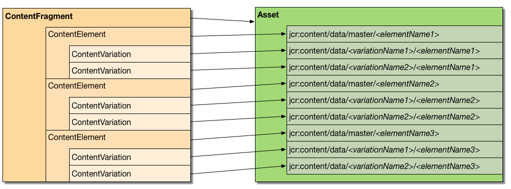

# 自訂和擴充內容片段{#customizing-and-extending-content-fragments}

在Adobe Experience Manager as a Cloud Service，內容片段擴展了標準資產；請參閱：

* [建立和管理內容片段](/help/assets/content-fragments/content-fragments.md) 和 [帶內容片段的頁面創作](/help/sites-cloud/authoring/fundamentals/content-fragments.md) 的子菜單。

* [管理資產](/help/assets/manage-digital-assets.md) 以獲取有關標準資產的更多資訊。

## 架構 {#architecture}

基本 [組成部分](/help/assets/content-fragments/content-fragments.md#constituent-parts-of-a-content-fragment) 內容片段的值為：

* A *內容片段*。
* 由一個或多個 *內容元素*。
* 可以有一個或多個 *內容變體*。

單個內容片段基於內容片段模型：

* 內容片段模型定義內容片段建立時的結構。
* 片段引用模型；因此，對模型的更改可能會/會影響任何相關片段。
* 模型是資料類型的集合。
* 添加新變體等的函式必須相應地更新片段。

   >[!NOTE]
   >
   >要顯示/呈現內容片段，您的帳戶必須 `read` 模型的權限。

   >[!CAUTION]
   >
   >對現有內容片段模型的任何更改都會影響相關片段；這會導致這些片段中的孤立屬性。

### 將站點與資產整合 {#integration-of-sites-with-assets}

內容片段管理(CFM)是AEM Assets的一部分，具體為：

* 內容片段是資產。
* 它們使用現有資產功能。
* They are fully integrated with Assets (admin consoles, etc.).

內容片段被視為「站點」功能：

* 在創作頁面時使用它們。

#### Mapping Content Fragments to Assets {#mapping-content-fragments-to-assets}



基於內容片段模型的內容片段被映射到單個資產：

* 所有內容都儲存在 `jcr:content/data` 節點：

   * 元素資料儲存在主子節點下：
      `jcr:content/data/master`

   * 變體儲存在子節點下，該子節點包含變體名稱：例如 `jcr:content/data/myvariation`

   * 每個元素的資料作為具有元素名稱的屬性儲存在相應的子節點中：例如元素的內容 `text` 儲存為屬性 `text` 上 `jcr:content/data/master`

* 元資料和相關內容儲存在下面 `jcr:content/metadata`
除標題和說明外，這些標題和說明不被視為傳統元資料並儲存在 
`jcr:content`

#### 資產位置 {#asset-location}

As with standard assets, a content fragment is held under:

`/content/dam`

#### 資產權限 {#asset-permissions}

For further details see [Content Fragment - Delete Considerations](/help/assets/content-fragments/content-fragments-delete.md).

#### Feature Integration {#feature-integration}

要與資產核心整合：

* 內容片段管理(CFM)功能構建在「資產」核心上。

* CFM provides its own implementations for items in the card/column/list views; these plug into the existing Assets content rendering implementations.

* 已擴展了若干Assets元件，以滿足內容片段的需要。

### Using Content Fragments in Pages {#using-content-fragments-in-pages}

>[!CAUTION]
>
>的 [內容片段元件是核心元件的一部分](https://experienceleague.adobe.com/docs/experience-manager-core-components/using/components/content-fragment-component.html)。 請參閱 [開發核心元件](https://experienceleague.adobe.com/docs/experience-manager-core-components/using/developing/developing.html) 的子菜單。

內容片段可以從頁面AEM中引用，就像其他任何資產類型一樣。 提AEM供 **[內容片段核心元件](https://experienceleague.adobe.com/docs/experience-manager-core-components/using/components/content-fragment-component.html)** - [允許您在頁面上包含內容片段的元件](/help/sites-cloud/authoring/fundamentals/content-fragments.md#adding-a-content-fragment-to-your-page)。 也可以擴展 **[內容片段](https://experienceleague.adobe.com/docs/experience-manager-core-components/using/developing/developing.html)** 核心元件。

* 元件使用 `fragmentPath` 引用實際內容片段的屬性。 的 `fragmentPath` 與其他資產類型的同類財產處理相同；例如，當內容片段移動到其他位置時。

* 元件允許您選擇要顯示的變體。

* Additionally, a range of paragraphs can be selected to restrict the output; for example, this can be used for multi-column output.

* 該元件允許在以下內容之間插入：

   * Here the component allows you to place other assets (images, etc.) in between the paragraphs of the referenced fragment.

   * 對於中間內容，您需要：

      * 注意不穩定的參考資料的可能性；在內容之間（在創作頁面時添加）與它位於旁邊的段落沒有固定關係，在插入內容的位置丟失相對位置之前插入新段落（在內容片段編輯器中）

      * 考慮附加參數（如變體和段落篩選器）以配置在頁面上呈現的內容

>[!NOTE]
>
>**內容片段模型:**
>
>當在頁面上使用內容片段時，引用它所基於的內容片段模型。
>
>這意味著，如果在發佈頁面時尚未發佈模型，則會標籤該模型，並將模型添加到要隨頁面一起發佈的資源中。

### 與其他框架整合 {#integration-with-other-frameworks}

內容片段可與以下內容整合：

* **翻譯**

   內容片段與 [AEM翻譯工作流](/help/sites-cloud/administering/translation/overview.md)。 在建築層面，這意味著：

   * 內容片段的個別翻譯實際上是分開的片段；例如：

      * 它們位於不同的語言根系下；但在相關語言根下卻有完全相同的相對路徑：

         `/content/dam/<path>/en/<to>/<fragment>`

         vs.

         `/content/dam/<path>/de/<to>/<fragment>`
   * 除了基於規則的路徑外，內容片段的不同語言版本之間沒有進一步的連接；它們被處理為兩個單獨的片段，儘管UI提供了在語言變體之間導航的方法。
   >[!NOTE]
   >
   >翻AEM譯工作流 `/content`:
   >
   >* 由於內容片段模型位於 `/conf`，這些內容不包括在此類翻譯中。 您可以將UI字串國際化。


* **元資料架構**

   * 內容片段（重新）使用 [元資料架構](/help/assets/metadata-schemas.md)，可用標準資產定義。

   * CFM提供其自己的特定架構：

      `/libs/dam/content/schemaeditors/forms/contentfragment`

      如果需要，可以擴展此範圍。

   * 各個模式形式與片段編輯器整合。

## 內容片段管理API — 伺服器端 {#the-content-fragment-management-api-server-side}

您可以使用伺服器端API訪問您的內容片段；請參閱：

[com.adobe.cq.dam.cfm](https://www.adobe.io/experience-manager/reference-materials/cloud-service/javadoc/com/adobe/cq/dam/cfm/package-summary.html#package.description)

>[!CAUTION]
>
>強烈建議使用伺服器端API，而不是直接訪問內容結構。

### 關鍵介面 {#key-interfaces}

以下三個介面可用作入口點：

* **內容片段** ([內容片段](https://www.adobe.io/experience-manager/reference-materials/cloud-service/javadoc/com/adobe/cq/dam/cfm/ContentFragment.html))

   此介面允許您以抽象方式處理內容片段。

   The interface provides you with the means to:

   * 管理基本資料(如獲取名稱；獲取/設定標題/說明
   * Access meta data
   * Access elements:

      * 清單元素
      * 按名稱獲取元素
      * 建立新元素(請參閱 [警告](#caveats))

      * 訪問元素資料(請參見 `ContentElement`)
   * 列出為片段定義的變體
   * 全局建立新變體
   * 管理關聯內容：

      * 清單集合
      * 添加集合
      * 刪除集合
   * 訪問片段的模型

   表示片段主元素的介面包括：

   * **內容元素** ([內容元素](https://www.adobe.io/experience-manager/reference-materials/cloud-service/javadoc/com/adobe/cq/dam/cfm/ContentElement.html))

      * 獲取基本資料（名稱、標題、說明）
      * Get/Set content
      * Access variations of an element:

         * 清單變體
         * 按名稱獲取變體
         * 建立新變體(請參閱 [警告](#caveats))
         * 刪除變體(請參見 [警告](#caveats))
         * 訪問變體資料(請參見 `ContentVariation`)
      * 解析變體的快捷方式（如果指定的變體不適用於元素，則應用某些附加的特定於實現的回退邏輯）
   * **內容變體** ([內容變體](https://www.adobe.io/experience-manager/reference-materials/cloud-service/javadoc/com/adobe/cq/dam/cfm/ContentVariation.html))

      * Get basic data (name, title, description)
      * 獲取/設定內容
      * 基於上次修改的資訊的簡單同步

   所有三個介面( `ContentFragment`。 `ContentElement`。 `ContentVariation`)擴展 `Versionable` 介面，添加內容片段所需的版本控制功能：

   * Create new version of the element
   * 列出元素的版本
   * Get the content of a specific version of the versioned element


### 適配 — 使用適配對象() {#adapting-using-adaptto}

The following can be adapted:

* `ContentFragment` 可適用於：

   * `Resource`  — 基礎Sling資源；更新基礎 `Resource` 直接需要重建 `ContentFragment` 的雙曲餘切值。

   * `Asset`  — 水壩 `Asset` 表示內容片段的抽象；更新 `Asset` 直接需要重建 `ContentFragment` 的雙曲餘切值。

* `ContentElement` 可適用於：

   * [`ElementTemplate`](https://www.adobe.io/experience-manager/reference-materials/cloud-service/javadoc/com/adobe/cq/dam/cfm/ElementTemplate.html)  — 用於訪問元素的結構資訊。

* [`FragmentTemplate`](https://www.adobe.io/experience-manager/reference-materials/cloud-service/javadoc/com/adobe/cq/dam/cfm/FragmentTemplate.html)

* `Resource` 可適用於：

   * `ContentFragment`

### 警告 {#caveats}

It should be noted that:

* 整個API的設計 **不** 自動保留更改（除非API JavaDoc中另有說明）。 因此，您必須始終提交相應請求（或您實際使用的解析程式）的資源解析程式。

* 可能需要額外工作的任務：

   * 強烈建議從 `ContentFragment`。 這確保所有元素將共用此變體，並確保將根據需要更新適當的全局資料結構以反映內容結構中新建立的變體。

   * 通過元素刪除現有變體，使用 `ContentElement.removeVariation()`，將不更新分配給變體的全局資料結構。 要確保這些資料結構保持同步，請使用 `ContentFragment.removeVariation()` 的雙曲餘切值。

## 內容片段管理API — 客戶端 {#the-content-fragment-management-api-client-side}

>[!CAUTION]
>
>客戶端API是內部的。

### 其他資訊 {#additional-information}

請參閱下列內容：

* `filter.xml`

   的 `filter.xml` 對於內容片段管理，將其配置為不與Assets核心內容包重疊。

## 編輯會話 {#edit-sessions}

>[!CAUTION]
>
>請考慮此背景資訊。 您不應在此處更改任何內容(因為它被標籤為 *私人區* )，但在某些情況下，它可能有助於理解引擎蓋下的東西是如何工作的。

編輯可跨多個視圖(=HTML頁)的內容片段是原子的。 因為原子多視圖編輯功能不是一個典型AEM的概念，所以內容片段使用所謂的 *編輯會話*。

當用戶在編輯器中開啟內容片段時，將啟動編輯會話。 當用戶通過選擇編輯器中的任意一個而離開編輯器時，編輯會話將完成 **保存** 或 **取消**。

技術上，所有編輯都在 *活* 內容，就像所有其他編輯一AEM樣。 啟動編輯會話時，將建立當前未編輯狀態的版本。 如果用戶取消編輯，則該版本將被恢復。 如果用戶按一下 **保存**，不執行任何特定的操作，因為所有編輯都在 *活* 內容，因此所有更改都已保留。 另外，按一下 **保存** 將觸發一些後台處理（如建立全文搜索資訊和/或處理混合媒體資產）。

邊緣案件有一些安全措施，例如，如果用戶試圖離開編輯器而未保存或取消編輯會話。 此外，還提供定期自動保存，以防止資料丟失。
請注意，兩個用戶可以同時編輯同一內容片段，因此可能會覆蓋彼此的更改。 為防止出現此情況，需要通過應用DAM管理 *簽出* 對片段執行操作。

## 示例 {#examples}

### 示例：訪問現有內容片段 {#example-accessing-an-existing-content-fragment}

要實現此目的，您可以將表示API的資源調整為：

`com.adobe.cq.dam.cfm.ContentFragment`

例如：

```java
// first, get the resource
Resource fragmentResource = resourceResolver.getResource("/content/dam/fragments/my-fragment");
// then adapt it
if (fragmentResource != null) {
    ContentFragment fragment = fragmentResource.adaptTo(ContentFragment.class);
    // the resource is now accessible through the API
}
```

### 示例：建立新內容片段 {#example-creating-a-new-content-fragment}

要以寫程式方式建立新內容片段，需要使用
`FragmentTemplate` 從模型資源中調整。

例如：

```java
Resource modelRsc = resourceResolver.getResource("...");
FragmentTemplate tpl = modelRsc.adaptTo(FragmentTemplate.class);
ContentFragment newFragment = tpl.createFragment(parentRsc, "A fragment name", "A fragment description.");
```

### 示例：指定自動保存間隔 {#example-specifying-the-auto-save-interval}

的 [自動保存間隔](/help/assets/content-fragments/content-fragments-managing.md#save-close-and-versions) （以秒為單位）可以使用配置管理器(ConfMgr)定義：

* 節點： `<conf-root>/settings/dam/cfm/jcr:content`
* 屬性名稱: `autoSaveInterval`
* 類型: `Long`

* 預設值： `600` （10分鐘）;此定義於 `/libs/settings/dam/cfm/jcr:content`

如果要設定5分鐘的自動儲存間隔，則需要在節點上定義屬性；例如：

* Node: `/conf/global/settings/dam/cfm/jcr:content`
* 屬性名稱: `autoSaveInterval`

* 類型: `Long`

* 值： `300` （5分鐘等於300秒）

## 頁面創作元件 {#components-for-page-authoring}

有關詳細資訊，請參閱

* [核心元件 — 內容片段元件](https://experienceleague.adobe.com/docs/experience-manager-core-components/using/components/content-fragment-component.html) （推薦）
