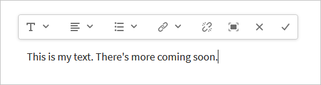

# 設定RTF編輯器 {#configure-the-rich-text-editor}

RTF編輯器(RTE)為作者提供編輯文字內容的廣泛功能。 提供圖示、選取方塊、工具列和選單以提供「所見即所得」文字編輯體驗。 管理員會設定RTE以啟用、停用及擴充編寫元件中可用的功能。 瞭解作者如何操作 [使用RTE進行製作](/help/sites-cloud/authoring/fundamentals/rich-text-editor.md) 網頁內容。

以下列出設定RTE所需的概念和步驟。

| 瞭解RTE概念 | 啟用必要功能 | 設定個別功能 |
|---|---|---|
| [瞭解介面](#understand-rte-ui) | [瞭解並設定設定位置](#understand-the-configuration-paths-and-locations) | [設定外掛程式](#enable-rte-functionalities-by-activating-plug-ins) |
| [編輯模式型別](#editingmodes) | [啟動外掛程式](/help/implementing/developing/extending/configure-rich-text-editor-plug-ins.md#activateplugin) | [設定功能屬性](#aboutplugins) |
| [關於外掛程式](#aboutplugins) | [設定RTE工具列](#dialogfullscreen) | [設定貼上模式](/help/implementing/developing/extending/configure-rich-text-editor-plug-ins.md#textstyles) |

## 瞭解作者可用的使用者介面 {#understand-rte-ui}

RTE介面提供 [回應式設計](/help/sites-cloud/authoring/features/responsive-layout.md) 用於製作環境。 此介面專為觸控和桌上型電腦裝置所設計。


*圖： RTF編輯器工具列，所有可用選項皆已啟用。*

工具列提供WYSIWYG編寫體驗的選項。 [!DNL Experience Manager] 管理員可以在介面的工具列中設定可用選項。 預設情況下，提供完整的編輯選項集於 [!DNL Experience Manager]. 開發人員可以自訂 [!DNL Experience Manager] 以新增更多編輯選項。

## 各種編輯模式 {#editingmodes}

作者可以在以下位置建立和編輯文字內容： [!DNL Experience Manager] 使用不同的元件模式。 製作和格式化內容的工具列選項，以及不同編輯模式下RTE啟用元件的使用者體驗，會因RTE設定而異。

| 編輯模式 | 編輯區域 | 建議啟用的功能 |
|--- |--- |--- |
| 內嵌 | 就地編輯以進行快速、次要的編輯；格式化而不開啟對話方塊。 | 最少的RTE功能。 |
| RTE全熒幕 | 涵蓋整個頁面。 | 所有必要的RTE功能。 |
| 對話方塊 | 對話方塊位於頁面內容上方，但不涵蓋整個頁面。 | 謹慎啟用功能。 |
| 全熒幕對話方塊 | 與全熒幕模式相同；包含對話方塊的欄位以及RTE。 | 所有必要的RTE功能。 |

>[!NOTE]
>
>來源編輯功能在內嵌編輯模式下無法使用。 您無法在全熒幕模式中拖曳影像。 所有其他功能在所有模式中皆可運作。

### 內嵌編輯 {#inline-editing}

若要編輯頁面中的內容，請以緩慢連按兩下來開啟內容。 隨即顯示包含基本選項的精簡工具列。



*圖：使用工具列中的基本選項進行內聯編輯。*

### 全熒幕編輯 {#full-screen-editing}

[!DNL Experience Manager] 元件可在隱藏頁面內容並佔用可用熒幕的全熒幕檢視中開啟。 請考慮使用全熒幕編輯內嵌編輯的詳細版本，因為它提供最多的編輯選項。 按一下「 」即可開啟 ，使用內聯編輯模式時可從壓縮工具列移除。

在對話方塊全熒幕模式中，連同詳細的RTE工具列，對話方塊中可用的選項和元件也可使用。 它僅適用於包含RTE以及其他元件的對話方塊。


*圖：在全熒幕模式下編輯時的詳細RTE工具列。*

### 對話方塊編輯 {#dialog-editing}

連按兩下元件時，會開啟對話方塊以編輯內容。 對話方塊會在現有頁面上方開啟。 在某些特定情況下，對話方塊會以快顯視窗開啟。 例如，當「文字」元件屬於多欄頁面配置中的欄時，可用於對話方塊的區域較少。


*圖：對話方塊編輯模式。*

## 關於RTE外掛程式和相關功能 {#aboutplugins}

此功能透過一系列外掛程式提供，每個外掛程式具有：

* A `features` 屬性是，

   * 用於啟動或停用該外掛程式的基本功能。
   * 使用標準化的程式設定。

* 適當時，需要專門設定的更多屬性和選項。

RTE的基本功能會由的值啟用或停用 `features` 屬性（在適當的外掛程式特定的節點上）。

下表列出目前的外掛程式，其中顯示：

* 包含API檔案連結的外掛程式ID。 ID在下列情況下會作為節點名稱使用： [啟用外掛程式](/help/implementing/developing/extending/configure-rich-text-editor-plug-ins.md#activateplugin).
* 允許的值 `features` 屬性。
* 外掛程式所提供功能的說明。

| 外掛程式ID | 功能 | 說明 |
|--- |--- |--- |
| 編輯 | `cut`, `copy`, `paste-default`, `paste-plaintext`, `paste-wordhtml` | [剪下、複製和三種貼上模式](/help/implementing/developing/extending/configure-rich-text-editor-plug-ins.md#textstyles). |
| findreplace | `find`、`replace` | 尋找和取代。 |
| 格式 | `bold`, `italic`, `underline` | [基本文字格式](configure-rich-text-editor-plug-ins.md#textstyles). |
| 影像 | `image` | 基本影像支援（從內容或內容尋找器拖曳）。 根據瀏覽器的不同，支援對作者有不同的行為 |
| 金鑰 | - | 若要定義此值，請參閱 [索引標籤大小](configure-rich-text-editor-plug-ins.md#tabsize). |
| 左右對齊 | `justifyleft`, `justifycenter`, `justifyright` | 段落對齊方式。 |
| 連結 | `modifylink`, `unlink`, `anchor` | [超連結和錨點](configure-rich-text-editor-plug-ins.md#linkstyles). |
| 清單 | `ordered`, `unordered`, `indent`, `outdent` | 此外掛程式會同時控制兩者 [縮排和清單](configure-rich-text-editor-plug-ins.md#indentmargin)；包括巢狀清單。 |
| misctools | `specialchars`、`sourceedit` | 其他工具可讓作者輸入 [特殊字元](configure-rich-text-editor-plug-ins.md#spchar) 或編輯HTML來源。 此外，您也可以新增 [特殊字元範圍](configure-rich-text-editor-plug-ins.md#definerangechar) 如果您想要定義自己的清單。 |
| 引數格式 | `paraformat` | 預設段落格式為段落、標題1、標題2和標題3 (`<p>`， `<h1>`， `<h2>`、和 `<h3>`)。 您可以 [新增更多段落格式](configure-rich-text-editor-plug-ins.md#paraformats) 或擴充清單。 |
| 拼字檢查 | `checktext` | [語言感知拼字檢查程式](configure-rich-text-editor-plug-ins.md#adddict). |
| 樣式 | `styles` | 支援使用CSS類別設定樣式。 [新增文字樣式](configure-rich-text-editor-plug-ins.md#textstyles) 如果您想要新增（或擴充）自己的樣式範圍，以便與文字搭配使用。 |
| 下標 | `subscript`、`superscript` | 新增子指令碼和超級指令碼以擴充基本格式。 |
| 表格 | `table`, `removetable`, `insertrow`, `removerow`, `insertcolumn`, `removecolumn`, `cellprops`, `mergecells`, `splitcell`, `selectrow`, `selectcolumns` | 另請參閱 [設定表格樣式](configure-rich-text-editor-plug-ins.md#tablestyles) 為整個表格或個別儲存格新增您自己的樣式。 |
| 復原 | `undo`、`redo` | 歷史記錄大小 [還原和重做](configure-rich-text-editor-plug-ins.md#undohistory) 作業。 |

>[!NOTE]
>
>對話方塊模式不支援全熒幕外掛程式。 使用 `dialogFullScreen` 設定以設定全熒幕模式的工具列。

## 瞭解設定路徑和位置 {#understand-the-configuration-paths-and-locations}

此 [RTE編輯模式和介面](#editingmodes) 由您提供給作者的資料，在您決定組態詳細資訊的位置 [啟用RTE外掛程式](configure-rich-text-editor-plug-ins.md#activateplugin). 位置包括：

* 內嵌模式： `cq:editConfig/cq:inplaceEditing`.
* 全熒幕模式： `cq:editConfig/cq:inplaceEditing`.
* 對話方塊模式： `cq:dialog`.
* 全熒幕對話方塊模式： `cq:dialog`.

>[!NOTE]
>
>不要將節點命名為 `cq:inplaceEditing` 作為 `config`. 開啟 `cq:inplaceEditing` 節點，定義下列屬性：
>
>* **名稱**: `configPath`
>* **型別**： `String`
>* **值**：包含實際設定的節點路徑
>
>不要將RTE設定節點命名為 `config`. 否則，RTE設定只會對管理員生效，而不會對群組中的使用者生效 `content-author`.

設定以下適用於對話方塊編輯模式的屬性：

* `useFixedInlineToolbar`：您可以將RTE工具列設為固定而非浮動。 使用sling：resourceType=設定此RTE節點上定義的布林值屬性 `cq/gui/components/authoring/dialog/richtext` 至 `True`. 當此屬性設定為 `True`，RTF編輯作業會於 `foundation-contentloaded` 事件。 若要防止此情況，請設定屬性 `customStart` 至 `True` 並觸發 `rte-start` 事件以開始RTE編輯。 當此屬性為 `true`，RTE不會從點按開始，此為預設行為。

* `customStart`：將此在RTE節點上定義的布林值屬性設定為 `True`，以透過觸發事件來控制何時開始RTE `rte-start`.

* `rte-start`：在上觸發此事件 `contenteditable-div` RTE時，開始編輯RTE的時間。 只有在 `customStart` 已設為 `true`.

在觸控式對話方塊中使用RTE時，請設定屬性 `useFixedInlineToolbar` 至 `true` 以避免發生問題。

## 透過啟用外掛程式來啟用RTE功能 {#enable-rte-functionalities-by-activating-plug-ins}

RTE功能可透過一系列外掛程式提供，每個外掛程式都具備功能屬性。 您可以設定features屬性，以啟用或停用每個外掛程式的各種功能。

如需RTE外掛程式的詳細設定，請參閱 [如何啟動和設定RTE外掛程式](configure-rich-text-editor-plug-ins.md).

<!-- TBD ENGREVIEW: To confirm if the sample works in CS or not?
**Sample**: Download [this sample configuration](/help/sites-administering/assets/rte-sample-all-features-enabled-10.zip) that illustrates how to configure RTE. In this package all the features are enabled. -->

此 [核心元件文字元件](https://experienceleague.adobe.com/docs/experience-manager-core-components/using/components/text.html#the-text-component-and-the-rich-text-editor) 可讓範本編輯器使用使用者介面作為內容原則來設定許多RTE外掛程式，而不需要技術設定。 內容原則可搭配使用RTE UI設定，如本檔案所述。 如需詳細資訊，請參閱 [建立頁面範本](/help/sites-cloud/authoring/features/templates.md) 和 [核心元件開發人員檔案](https://experienceleague.adobe.com/docs/experience-manager-core-components/using/developing/developing.html).

>為了方便參考，您可以在下列位置找到預設文字元件（作為標準安裝的一部分提供）：
>
>* `/libs/wcm/foundation/components/text`
>* `/libs/foundation/components/text`
>
>若要建立自己的文字元件，請複製上述元件，而非編輯這些元件。

## 設定RTE工具列 {#dialogfullscreen}

[!DNL Experience Manager] 可讓您針對不同的編輯模式，以不同方式設定RTF編輯器的介面。 以下提供預設設定。 您可以根據需求覆寫這些預設值。 您只需自訂要提供給作者的工具列功能。 您不需要指定所有工具列設定。

若要設定工具列 `dialogFullScreen`，使用下列範例設定。

```java
<uiSettings jcr:primaryType="nt:unstructured">
  <cui jcr:primaryType="nt:unstructured">
    <inline
      jcr:primaryType="nt:unstructured"
      toolbar="[format#bold,format#italic,format#underline,#justify,#lists,links#modifylink,links#unlink,#paraformat]">
      <popovers jcr:primaryType="nt:unstructured">
        <justify
          jcr:primaryType="nt:unstructured"
          items="[justify#justifyleft,justify#justifycenter,justify#justifyright,justify#justifyjustify]"
          ref="justify"/>
        <lists
          jcr:primaryType="nt:unstructured"
          items="[lists#unordered,lists#ordered,lists#outdent,lists#indent]"
          ref="lists"/>
        <paraformat
          jcr:primaryType="nt:unstructured"
          items="paraformat:getFormats:paraformat-pulldown"
          ref="paraformat"/>
      </popovers>
    </inline>
    <dialogFullScreen
      jcr:primaryType="nt:unstructured"
      toolbar="[format#bold,format#italic,format#underline,justify#justifyleft,justify#justifycenter,justify#justifyright,justify#justifyjustify,lists#unordered,lists#ordered,lists#outdent,lists#indent,links#modifylink,links#unlink,table#createoredit,#paraformat,image#imageProps]">
      <popovers jcr:primaryType="nt:unstructured">
        <paraformat
          jcr:primaryType="nt:unstructured"
          items="paraformat:getFormats:paraformat-pulldown"
          ref="paraformat"/>
      </popovers>
    </dialogFullScreen>
    <tableEditOptions
      jcr:primaryType="nt:unstructured"
      toolbar="[table#insertcolumn-before,table#insertcolumn-after,table#removecolumn,-,table#insertrow-before,table#insertrow-after,table#removerow,-,table#mergecells-right,table#mergecells-down,table#mergecells,table#splitcell-horizontal,table#splitcell-vertical,-,table#selectrow,table#selectcolumn,-,table#ensureparagraph,-,table#modifytableandcell,table#removetable,-,undo#undo,undo#redo,-,table#exitTableEditing,-]">
    </tableEditOptions>
  </cui>
</uiSettings>
```

內嵌模式和全熒幕模式會使用不同的使用者介面設定。 toolbar屬性指定工具列的選項。

例如，如果選項本身是特徵(例如， `Bold`)，則指定為 `PluginName#FeatureName` (例如， `links#modifylink`)。

如果選項是彈出視窗（包含外掛程式的部分功能），則會指定為 `#PluginName` (例如， `#format`)。

分隔符號(`|`)之間，可使用以下方式指定： `-`.

內嵌或全熒幕模式下的彈出式節點包含所使用的彈出式視窗清單。 下的每個子節點 `popovers` 節點會以外掛程式的名稱命名（例如format）。 其屬性「items」包含外掛程式的功能清單（例如format#bold）。

## RTE使用者介面設定和內容原則 {#rtecontentpolicies}

管理員可以使用內容原則來控制RTE選項，而不是如上所述進行設定。 內容原則在作為元件的一部分使用時，會定義元件的設計屬性 [可編輯的範本](/help/sites-cloud/authoring/features/templates.md). 例如，如果使用RTE的文字元件搭配可編輯的範本使用，則內容原則可定義粗體選項可供使用，而一些段落格式選項可供使用。 內容原則可重複使用，並可套用至多個範本。

RTE中可用的選項會從使用者介面設定向下流向內容原則。

* 使用者介面組態設定會定義哪些選項可供內容原則使用。
* 如果RTE的使用者介面設定已移除或未啟用專案，則內容原則無法進行設定。
* 作者只能存取使用者介面設定和內容原則所提供的功能。

例如，您可以看到 [文字核心元件檔案](https://experienceleague.adobe.com/docs/experience-manager-core-components/using/components/text.html#the-text-component-and-the-rich-text-editor).

## 自訂工具列圖示和命令之間的對應 {#iconstoolbar}

您可以自訂RTE工具列上顯示的Coral圖示與可用指令之間的對應。 除了Coral圖示以外，您無法使用任何其他圖示。

1. 建立名為的節點 `icons` 在 `uiSettings/cui`.

1. 為下方的個別圖示建立節點。
1. 在每個圖示節點上，指定Coral圖示和對應至圖示的命令。

以下是對映命令的範常式式碼片段 `Bold` 至名為的Coral圖示 `textItalic`.

```java
<text jcr:primaryType="nt:unstructured" sling:resourceType="cq/gui/components/authoring/dialog/richtext" name="./text" useFixedInlineToolbar="{Boolean}true">
    <rtePlugins jcr:primaryType="nt:unstructured">
        <format jcr:primaryType="nt:unstructured" features="bold,italic"/>
    </rtePlugins>
    <uiSettings jcr:primaryType="nt:unstructured">
        <cui jcr:primaryType="nt:unstructured">
            <inline jcr:primaryType="nt:unstructured"
                toolbar="[format#bold,format#italic,format#underline,links#modifylink,links#unlink]">
            </inline>
            <icons jcr:primaryType="nt:unstructured">
                <bold jcr:primaryType="nt:unstructured"
                    command="format#bold"
                    icon="textItalic"/>
            </icons>
        </cui>
    </uiSettings>
</text>
```

## 已知限制 {#known-limitations}

[!DNL Experience Manager] RTE功能有下列限制：

* 僅支援RTE功能 [!DNL Experience Manager] 元件對話方塊。 精靈或Foundation-forms不支援RTE。

* [!DNL Experience Manager] 無法在混合裝置上運作。 <!-- TBD: Check. This is not mentioned in Known Issue /help/release-notes/known-issues.md-->

* 不要命名RTE設定節點 `config`. 否則，RTE設定只會對管理員生效，而不會對群組中的使用者生效 `content-author`.

* RTE不支援內嵌內容在內嵌框架或iframe中。

## 最佳作法和秘訣 {#best-practices-and-tips}

* 對於浮動對話方塊，請僅啟用外掛程式，而不使用快顯對話方塊。 沒有快顯視窗的外掛程式尺寸較小，最適合用於浮動對話方塊。
* 透過較大的快顯視窗啟用外掛程式，例如 `Paste` 外掛程式，僅適用於全熒幕對話方塊模式或全熒幕模式。 具有大型快顯視窗的外掛程式需要更多熒幕空間，以提供良好的撰寫體驗。
* 如果您使用CoralUI3 RTE的自訂外掛程式，請使用 `rte.coralui3` 資料庫。

>[!MORELIKETHIS]
>
>* [設定RTE外掛程式](configure-rich-text-editor-plug-ins.md)
>* [使用RTF編輯器進行編寫](/help/sites-cloud/authoring/fundamentals/rich-text-editor.md)
>* [為可存取的網站設定RTE](rte-accessible-content.md)

