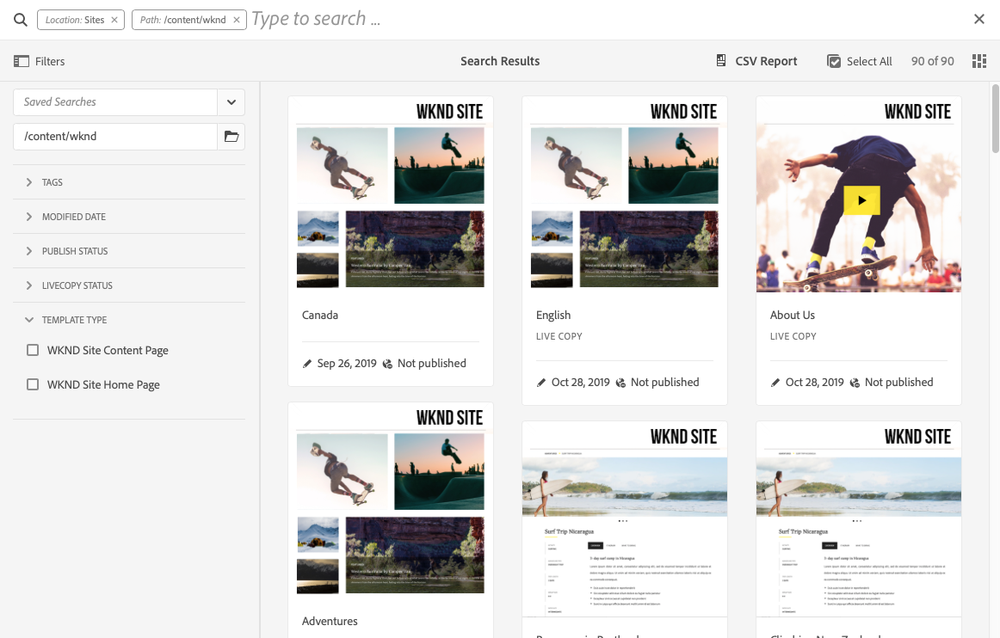

# 設定搜尋表單 {#configuring-search-forms}

Adobe Experience Manager as a Cloud Service擁有強大 [搜尋](/help/sites-cloud/authoring/getting-started/search.md) 機制。

此外，還有一組預先定義的選項可協助您篩選內容。 這些保留預先定義的刻面，例如 **修改日期**, **發佈狀態**，或 **Livecopy狀態** 幫助您快速深入鑽研到所需資源。

這些功能可協助您快速輕鬆地從以下位置找到內容：

* [搜尋與篩選](/help/sites-cloud/authoring/getting-started/search.md#search-and-filter)
* [邊欄選取器](/help/sites-cloud/authoring/getting-started/basic-handling.md#rail-selector)
* the [資產瀏覽器](/help/sites-cloud/authoring/fundamentals/environment-tools.md#assets-browser) （編輯頁面時）

>[!NOTE]
>
>您可以設定基礎 [內容搜尋與索引](/help/operations/indexing.md) 服務。

使用 **搜尋Forms**，您可以根據特定需求自訂和擴充這些面板。

此 **搜尋Forms** 提供現成可用的選取 [謂語](#predicates-and-their-settings) 來結合和定義。 此 [配置這些表單的對話框](#configuring-your-search-forms) 可透過下列方式存取：

* **工具**
   * **一般**
      * **搜尋表單**

## 預設Forms {#default-forms}

當您首次存取 **搜尋Forms** 控制台可以看到所有配置都有掛鎖符號。 這表示對應的設定是預設（現成）設定，且無法刪除。 自訂並儲存後，鎖定就會消失。 它會在你 [刪除自訂配置](#deleting-a-configuration-to-reinstate-the-default)，則會恢復預設值（和掛鎖指示器）。

可用的預設配置（按字母順序列出）有：

* **資產管理搜尋邊欄**
* **頁面編輯器 (文件搜尋)**
* **頁面編輯器 (體驗片段搜尋)**
* **頁面編輯器 (影像搜尋)**
* **頁面編輯器 (手稿搜尋)**
* **頁面編輯器 (頁面搜尋)**
* **頁面編輯器 (段落搜尋)**
* **頁面編輯器 (產品搜尋)**
* **頁面編輯器 (Scene7 搜尋)**
* **頁面編輯器 (視訊搜尋)**
* **專案管理搜尋邊欄**
* **專案翻譯搜尋邊欄**
* **網站管理搜尋邊欄**
* **代碼片段管理搜尋邊欄**
* **Stock 管理搜尋邊欄**
* **內容片段模型搜尋邊欄**
* **專案管理搜尋邊欄**
* **專案翻譯搜尋邊欄**

>[!NOTE]
>
>如需與資產相關的搜尋表單的詳細資訊，請參閱 [資產 — 搜尋Facet](/help/assets/search-facets.md)

## 謂語及其設定 {#predicates-and-their-settings}

### 謂語 {#predicates}

下列謂語可用，視設定而定：

<table>
 <tbody>
  <tr>
   <th>述詞</th>
   <th>用途</th>
   <th>設定</th>
  </tr>
  <tr>
   <td>分析</td>
   <td>顯示分析支援的資料時，在Sites瀏覽器中執行搜尋/篩選功能。 載入Analytics搜尋篩選器，以符合對應的自訂分析欄。</td>
   <td>
    <ul>
     <li>欄位標籤</li>
     <li>說明</li>
    </ul> </td>
  </tr>
  <tr>
   <td>核准狀態</td>
   <td>根據批准狀態進行搜索。</td>
   <td>
    <ul>
     <li>欄位標籤</li>
     <li>屬性名稱*</li>
     <li>說明</li>
    </ul> 
   </td>
  </tr>
  <tr>
   <td>作者</td>
   <td>根據作者進行搜尋。</td>
   <td>
    <ul>
     <li>預留位置</li>
     <li>屬性名稱*</li>
     <li>說明</li>
    </ul> 
   </td>
  </tr>
  <tr>
   <td>簽出者</td>
   <td>搜尋特定使用者結帳的資產。</td>
   <td>
    <ul>
     <li>欄位標籤</li>
     <li>預留位置</li>
     <li>說明</li>
    </ul> 
   </td>
  </tr>
  <tr>
   <td>簽出狀態</td>
   <td>搜尋具有特定結帳狀態的資產。</td>
   <td>
    <ul>
     <li>欄位標籤</li>
     <li>屬性名稱*</li>
     <li>說明</li>
    </ul> 
   </td>
  </tr>
  <tr>
   <td>元件</td>
   <td>可讓作者搜尋/篩選含有特定元件的頁面。 例如影像庫。  </td>
   <td>
    <ul>
     <li>預留位置</li>
     <li>屬性名稱*</li>
     <li>屬性深度</li>
     <li>說明</li>
    </ul> </td>
  </tr>
  <tr>
   <td>日期範圍</td>
   <td>搜尋在日期屬性的指定範圍內建立的資源。 在「搜尋」面板中，您可以指定「開始」和「結束」日期。</td>
   <td>
    <ul>
     <li>欄位標籤</li>
     <li>預留位置</li>
     <li>屬性名稱*</li>
     <li>範圍文本（從）*</li>
     <li>範圍文本（至）*</li>
     <li>說明</li>
    </ul> </td>
  </tr>
  <tr>
   <td>到期狀態</td>
   <td>根據到期狀態搜尋資源。</td>
   <td>
    <ul>
     <li>欄位標籤</li>
     <li>屬性名稱*</li>
     <li>說明</li>
    </ul> </td>
  </tr>
  <tr>
   <td>檔案大小</td>
   <td>根據資源的大小篩選資源。</td>
   <td>
    <ul>
     <li>欄位標籤</li>
     <li>屬性名稱*</li>
     <li>選項路徑</li>
     <li>說明</li>
    </ul> </td>
  </tr>
  <tr>
   <td>檔案類型</td>
   <td>根據檔案/mime類型搜尋資產。</td>
   <td>
    <ul>
     <li>欄位標籤</li> 
     <li>屬性名稱*</li>
     <li>MIME 類型路徑</li>
     <li>說明</li>
    </ul> 
   </td>
  </tr>
  <tr>
   <td>全文</td>
   <td>搜尋述詞以搜尋全文搜尋。 它與「jcr:contains」運算子映射。</td>
   <td>
    <ul>
     <li>預留位置</li>
     <li>屬性名稱</li>
     <li>說明</li>
    </ul> </td>
  </tr>
  <tr>
   <td>群組</td>
   <td>搜尋群組的述詞（僅用於前瞻分析述詞中）。</td>
   <td>
    <ul>
     <li>欄位標籤</li>
     <li>說明</li>
    </ul> </td>
  </tr>
  <tr>
   <td>隱藏的篩選器</td>
   <td>屬性和值的篩選器，使用者看不到。</td>
   <td>
    <ul>
     <li>屬性名稱*</li>
     <li>屬性值*</li>
     <li>說明</li>
    </ul> </td>
  </tr>
  <tr>
   <td>分析</td>
   <td>根據選取的前瞻分析參數進行搜尋。</td>
   <td>這是由多個謂語組成的複雜謂語：
    <ul>
     <li>群組</li>
     <li>範圍</li>
     <li>選項</li>
    </ul> 
   </td>
  </tr>
  <tr>
   <td>集合成員</td>
   <td>搜尋屬於集合成員的資產</td>
   <td>
    <ul>
     <li>說明</li>
    </ul> 
   </td>
  </tr>
  <tr>
   <td>多值屬性</td>
   <td>搜尋指定屬性的多個值。</td>
   <td>
    <ul>
     <li>欄位標籤</li>
     <li>預留位置</li>
     <li>屬性名稱*</li>
     <li>分隔符號支援</li>
     <li>輸入分隔字元</li>
     <li>忽略大小寫</li>
     <li>說明</li>
    </ul> 
   </td>
  </tr>
  <tr>
   <td>選項</td>
   <td>
選項是使用者建立的內容節點。
 
請參閱 <a href="#addinganoptionspredicate">新增選項述詞</a> 以取得更多資訊。
 </td>
   <td>
    <ul>
     <li>欄位標籤</li>
     <li>屬性名稱*</li>
     <li>單選</li>
     <li>新增選項</li>
     <li>手動</li>
     <li>說明</li>
    </ul> </td>
  </tr>
  <tr>
   <td>選項屬性</td>
   <td>搜尋選項的一或多個屬性。</td>
   <td>
    <ul>
     <li>欄位標籤</li>
     <li>屬性名稱*</li>
     <li>選項節點路徑</li>
     <li>屬性深度</li>
     <li>單選</li>
     <li>說明</li>
    </ul> </td>
  </tr>
  <tr>
   <td>頁面狀態</td>
   <td>根據頁面的狀態篩選頁面。</td>
   <td>
    <ul>
     <li>欄位標籤</li>
     <li>發佈屬性名稱*</li>
     <li>鎖定頁面屬性名稱*</li>
     <li>說明</li>
    </ul> </td>
  </tr>
  <tr>
   <td>路徑</td>
   <td>根據特定路徑篩選。 您可以指定多個路徑作為選項。</td>
   <td>
    <ul>
     <li>欄位標籤</li>
     <li>新增搜尋路徑</li>
     <li>說明</li>
    </ul> </td>
  </tr>
  <tr>
   <td>路徑瀏覽器</td>
   <td>提供路徑瀏覽器，以在預先定義的根路徑下進行搜尋。</td>
   <td>
    <ul>
     <li>預留位置</li>
     <li>根路徑</li>
     <li>說明</li>
    </ul> 
   </td>
  </tr>
  <tr>
   <td>路徑隱藏</td>
   <td>路徑上的篩選器，使用者看不到。</td>
   <td>
    <ul>
     <li>屬性名稱('path')</li>
     <li>屬性值(「/content/dam」)</li>
    </ul> 
   </td>
  </tr>
  <tr>
   <td>屬性</td>
   <td>在指定的屬性上搜索。</td>
   <td>
    <ul>
     <li>欄位標籤</li>
     <li>預留位置</li>
     <li>屬性名稱</li>
     <li>部分搜尋</li>
     <li>忽略大小寫</li>
     <li>說明</li>
    </ul> 
   </td>
  </tr>
  <tr>
   <td>發佈狀態</td>
   <td>根據資源的發佈狀態篩選資源。</td>
   <td>
    <ul>
     <li>欄位標籤</li>
     <li>屬性名稱*</li>
     <li>說明</li>
    </ul> </td>
  </tr>
  <tr>
   <td>範圍</td>
   <td>搜尋位於指定範圍內的資源。 在「搜尋」面板中，您可以指定範圍的最小值和最大值。</td>
   <td>
    <ul>
     <li>欄位標籤</li>
     <li>屬性名稱*</li>
     <li>說明</li>
    </ul> </td>
  </tr>
  <tr>
   <td>評等</td>
   <td>根據資源的平均評等來搜尋資源。  </td>
   <td>
    <ul>
     <li>欄位標籤</li>
     <li>屬性名稱*</li>
     <li>選項路徑</li>
     <li>說明</li>
    </ul> </td>
  </tr>
  <tr>
   <td>相對日期</td>
   <td>根據資源建立的相對日期篩選資源。 例如，1週前，1個月前。</td>
   <td>
    <ul>
     <li>欄位標籤</li>
     <li>屬性名稱*</li>
     <li>相對日期</li>
     <li>說明</li>
    </ul> </td>
  </tr>
  <tr>
   <td>滑桿範圍</td>
   <td>使用滑桿功能擴充範圍述詞的通用搜尋述詞。 所搜尋屬性的值必須介於滑桿限制之間。</td>
   <td>
    <ul>
     <li>欄位標籤</li>
     <li>屬性名稱*</li>
     <li>選項節點路徑</li>
     <li>說明</li>
    </ul> </td>
  </tr>
  <tr>
   <td>狀態</td>
   <td>根據核准和結帳狀態進行搜尋。</td>
   <td>這是由多個謂語組成的複雜謂語：
    <ul>
     <li>核准狀態</li>
     <li>簽出狀態</li>
    </ul> 
   </td>
  </tr>
  <tr>
   <td>標記</td>
   <td>根據標籤進行搜尋。</td>
   <td>
    <ul>
     <li>菲爾德拉韋爾</li>
     <li>預留位置</li>
     <li>屬性名稱*</li>
     <li>顯示配對所有標記選項</li>
     <li>根標籤路徑</li>
     <li>說明</li>
    </ul> </td>
  </tr>
  <tr>
   <td>範本</td>
   <td>根據所選範本進行搜尋。</td>
   <td>
    <ul>
     <li>預留位置</li>
     <li>屬性名稱*</li>
     <li>說明</li>
    </ul> 
   </td>
  </tr>
  <tr>
   <td>翻譯狀態</td>
   <td>根據翻譯狀態進行搜尋。</td>
   <td>
    <ul>
     <li>欄位標籤</li>
    </ul> 
   </td>
  </tr>
 </tbody>
</table>

<!--
  <tr>
   <td>Date ???</td>
   <td>Slider-based search of assets based on a date property.</td>
   <td>
    <ul>
     <li>Field Label</li>
     <li>Property Name*</li>
     <li>Description</li>
    </ul> </td>
  </tr>
  <tr>
   <td>Asset Last Modified ?????</td>
   <td>Date the asset was last modified.  </td>
   <td>A customized predicate, based on the Date Predicate.</td>
  </tr>
  <tr>
   <td>Range Options ???</td>
   <td>A specific search predicate for Assets and the same as common Slider Predicate. Is still available due to backward compatibilty issues.</td>
   <td>
    <ul>
     <li>Field Label</li>
     <li>Property Name*</li>
     <li>Option Path</li>
     <li>Description</li>
    </ul> </td>
  </tr>
  <tr>
   <td>Tag </td>
   <td>Search assets based on tags. You can configure the Path property to populate various tags in the Tags list.</td>
   <td>
    <ul>
     <li>Field Label</li>
     <li>Property Name*</li>
     <li>Option Path</li>
     <li>Description</li>
    </ul> </td>
  </tr>
-->

>[!NOTE]
>
>常見的搜尋述詞定義於：
>  `/libs/cq/gui/components/common/admin/customsearch/searchpredicates`
>
>此資訊僅供參考，您不得變更 `/libs`.

<!--
>* Search predicates related only to siteadmin (classic UI) are located under:
> `/libs/cq/gui/components/siteadmin/admin/searchpanel/searchpredicates`
>   * These are deprecated and only available for backward compatibility.
>
-->

### 謂詞設定 {#predicate-settings}

根據述詞，選擇的設定可用於配置，包括：

* **欄位標籤**

   將顯示為可折疊標題或謂語欄位標籤的標籤。

* **說明**

   使用者的描述性詳細資訊。

* **預留位置**

   空文本或謂語的位置保持符，以防未輸入篩選文本。

* **屬性名稱**

   要搜尋的屬性。 它會使用相對路徑和萬用字元 `*/*/*` 指定相對於 `jcr:content` 節點（每個星號代表一個節點級別）。

   如果您只想在具有 `x` 屬性 `jcr:content` 節點使用 `*/jcr:content/x`

* **屬性深度**

   在資源內搜尋該屬性的最大深度。 因此，可以對資源和遞歸子項執行對該屬性的搜索，直到子項的級別等於指定深度為止。

* **屬性值**

   屬性值作為絕對字串或作為表達式語言；例如， `cq:Page` 或

   `${empty requestPathInfo.suffix ? "/content" : requestPathInfo.suffix}`。

* **範圍文字**

   範圍欄位在 **日期範圍** 謂語。

* **選項路徑**

   用戶可以使用謂詞設定頁簽中的路徑瀏覽器選擇路徑。 選取 **+** 表徵圖用於將所選內容添加到有效選項清單(然後 **-** 圖示以移除（如果需要）。

   這些選項是用戶建立的內容節點，具有以下結構：

   `(jcr:primaryType = nt:unstructured, value (String), jcr:title (String))`

* **選項節點路徑**
實際上與 
**選項路徑**，只有此欄位在通用述詞欄位中，而另一個欄位是資產專屬欄位。

* **單選**
如果選中，則選項將呈現為僅允許單個選擇的複選框。 如果錯誤選取，則可取消選取核取方塊。

* **發佈和即時副本屬性名稱**
Sites特定述詞的發佈和即時副本核取方塊標籤。

* &amp;ast;在 **設定** 標籤表示欄位是必填欄位，如果保留為空白，則會顯示錯誤訊息。

## 設定您的搜尋Forms {#configuring-your-search-forms}

### 建立/開啟自訂設定 {#creating-opening-a-customized-configuration}

1. 導覽至 **工具**, **一般**, **搜尋Forms**.

1. 選取您要自訂的設定。
1. 使用 **編輯** 圖示以開啟要更新的設定。
1. 如果您想要新自訂 [新增謂語欄位並定義設定](#add-edit-a-predicate-field-and-define-field-settings) 視需要。 如果現有自訂，您可以選取現有欄位，並 [更新設定](#add-edit-a-predicate-field-and-define-field-settings).
1. 選擇 **完成** 以儲存設定。 下次使用設定時，就會看到您的變更。

   >[!NOTE]
   >
   >自訂設定會（視情況）儲存在：
   >
   >* `/apps/cq/gui/content/facets/<option>`
   >* `/apps/commerce/gui/content/facets/<option>`

### 新增/編輯述詞欄位和定義欄位設定 {#add-edit-a-predicate-field-and-define-field-settings}

您可以新增或編輯欄位，並定義/更新其設定：

1. [開啟自訂的設定](#creating-opening-a-customized-configuration) 以更新。
1. 如果要新增欄位，請開啟 **選擇謂詞** 標籤，並將所需謂語拖曳至所需位置。 例如， **日期範圍述詞**:

   

1. 取決於：

   * 正在添加新欄位：

      新增述詞後， **設定** 標籤，並顯示可定義的屬性。

   * 要更新現有謂詞：

      選取謂語欄位（位於右側），然後開啟 **設定** 標籤。
   例如， **日期範圍述詞**:

   

1. 視需要進行變更，並使用確認 **完成**. 下次使用設定時，就會看到您的變更。

### 預覽搜尋設定 {#previewing-the-search-configuration}

1. 選取「預覽」圖示：

   

1. 這樣，在適當控制台的「搜尋」欄中，搜尋表單就會顯示為（完全展開）。

   

1. **關閉** 預覽，返回並完成配置。

### 刪除謂詞欄位 {#deleting-a-predicate-field}

1. [開啟自訂的設定](#creating-opening-a-customized-configuration) 以更新。
1. 選取謂語欄位（位於右側），開啟 **設定** 標籤，然後選取 **刪除** 圖示（左下）。

   

1. 對話方塊會要求確認刪除動作。

1. 確認此項目，以及使用 **完成**.

### 刪除配置（恢復預設值） {#deleting-a-configuration-to-reinstate-the-default}

自訂設定後，這將覆寫預設值。 您可以刪除自訂設定，以重新設定預設設定。

>[!NOTE]
>
>您無法刪除預設配置。

從主控台刪除自訂設定：

1. 選取所需的設定(例如 **頁面編輯器（段落搜尋）**)，然後 **刪除** 圖示：

   

1. 將刪除自定義配置並恢復預設配置（這由控制台中的掛鎖符號的再現指示）。

### 添加選項謂語 {#adding-options-predicates}

選項謂語（選項、選項屬性）可讓您設定要搜尋的項目。 它們通常用於直接在頁面下方搜尋內容；例如，頁面節點上的屬性。

以下範例（根據用來建立頁面的範本進行搜尋）說明了相關步驟：

1. 建立定義要搜索的屬性的節點。

   您需要一個根節點，其中包含使用者可使用的個別選項定義。

   個別選項的節點需要屬性：

   * `jcr:title`  — 要在搜尋邊欄中顯示的欄位標籤
   * `value`  — 要搜尋的屬性值

   

   >[!NOTE]
   >
   >您 ***必須*** 不會變更 `/libs` 路徑。
   >
   >這是因為 `/libs` 下次升級執行個體時即會覆寫（而當您套用Hotfix或Feature Pack時，很可能會覆寫）。
   >
   >設定和其他變更的建議方法為：
   >
   >1. 重新建立所需項目，因為它存在於 `/libs`，在 `/apps`. 在此案例中，來源為：
   >1. `/libs/cq/gui/content/common/options/predicates`
   >1. 在內進行任何變更 `/apps.`

1. 開啟 **搜尋Forms** 主控台，然後選取您要更新的設定。 例如， **網站管理員搜尋邊欄**. 然後選取 **編輯**.

1. 視設定而定，新增 **選項** 或 **選項屬性** 至設定。
1. 更新欄位，尤其是：

   * **屬性名稱**

      在目標節點上指定要搜索的節點屬性。 例如：

      `jcr:content/cq:template`

   * **選項節點路徑**

      選取保留選項的路徑。 例如：

      `/apps/cq/gui/content/common/options/predicates/templatetype`
   

1. 選擇 **完成** 以儲存您的設定。
1. 導覽至適當的主控台(在此範例中， **網站**)並開啟 **搜尋 — 篩選器** 欄。 新定義的搜尋表單以及各種選項將會顯示。 選擇查看搜索結果所需的選項。

   

## 使用者權限 {#user-permissions}

下表列出在搜尋表單上執行編輯、刪除和預覽動作所需的權限。

<table>
 <thead>
  <tr>
   <td><strong>動作</strong></td>
   <td><strong>權限</strong></td>
  </tr>
 </thead>
 <tbody>
  <tr>
   <td>編輯 </td>
   <td>讀取、寫入 <code>/apps </code>節點。</td>
  </tr>
  <tr>
   <td>刪除</td>
   <td>讀取、寫入、刪除 <code>/apps</code> 節點</td>
  </tr>
  <tr>
   <td>預覽</td>
   <td>讀取、寫入、刪除 <code>/var/dam/content</code> 節點。  讀取、寫入 <code>/apps</code> 節點。</td>
  </tr>
 </tbody>
</table>
