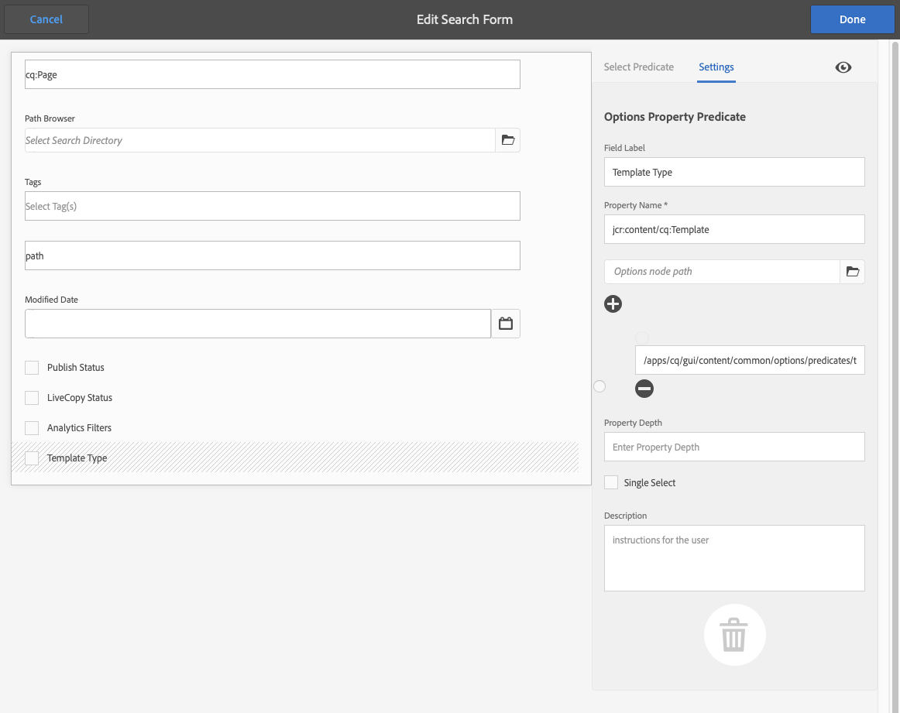

# 設定搜尋表單 {#configuring-search-forms}

Adobe Experience Manager as a Cloud Service隨附強大的功能 [搜尋](/help/sites-cloud/authoring/getting-started/search.md) 機制。

除此之外，還有一組預先定義的選項，可協助您篩選內容。 這些會保留預先定義的Facet，例如 **修改日期**， **發佈狀態**，或 **即時副本狀態** 協助您快速向下展開至所需的資源。

這些目標共同協助您快速輕鬆地從下列位置找到您的內容：

* [搜尋和篩選](/help/sites-cloud/authoring/getting-started/search.md#search-and-filter)
* [邊欄選擇器](/help/sites-cloud/authoring/getting-started/basic-handling.md#rail-selector)
* 此 [資產瀏覽器](/help/sites-cloud/authoring/fundamentals/environment-tools.md#assets-browser) （編輯頁面時）

>[!NOTE]
>
>您可以設定基礎 [內容搜尋與索引](/help/operations/indexing.md) 服務。

使用 **搜尋Forms**，您就可以根據自己的特定需求，自訂和擴充這些面板。

此 **搜尋Forms** 提供現成可用的 [述詞](#predicates-and-their-settings) 以組合和定義。 此 [用於設定這些表單的對話方塊](#configuring-your-search-forms) 可透過以下方式存取：

* **工具**
   * **一般**
      * **搜尋表單**

## 預設Forms {#default-forms}

當您第一次存取 **搜尋Forms** 控制檯您可以看到所有組態都有掛鎖符號。 這表示對應的設定是預設（現成可用）設定 — 無法刪除。 自訂並儲存設定後，鎖定將會消失。 當您 [刪除您的自訂設定](#deleting-a-configuration-to-reinstate-the-default)，則會恢復預設值（和掛鎖指示器）。

可用的預設設定（按字母順序列出）包括：

* **資產管理搜尋邊欄**
* **頁面編輯器 (文件搜尋)**
* **頁面編輯器 (體驗片段搜尋)**
* **頁面編輯器 (影像搜尋)**
* **頁面編輯器 (手稿搜尋)**
* **頁面編輯器 (頁面搜尋)**
* **頁面編輯器 (段落搜尋)**
* **頁面編輯器 (產品搜尋)**
* **頁面編輯器 (Scene7 搜尋)**
* **頁面編輯器 (視訊搜尋)**
* **專案管理搜尋邊欄**
* **專案翻譯搜尋邊欄**
* **網站管理搜尋邊欄**
* **代碼片段管理搜尋邊欄**
* **Stock 管理搜尋邊欄**
* **內容片段模型搜尋邊欄**
* **專案管理搜尋邊欄**
* **專案翻譯搜尋邊欄**

>[!NOTE]
>
>如需資產相關搜尋表單的詳細資訊，請參閱 [資產 — 搜尋Facet](/help/assets/search-facets.md)

## 述詞及其設定 {#predicates-and-their-settings}

### 述詞 {#predicates}

視設定而定，以下述詞可供使用：

<table>
 <tbody>
  <tr>
   <th>述詞</th>
   <th>用途</th>
   <th>設定</th>
  </tr>
  <tr>
   <td>分析</td>
   <td>顯示Analytics支援的資料時，可在Sites瀏覽器中搜尋/篩選功能。 Analytics搜尋篩選器會載入以符合對應的自訂分析欄。</td>
   <td>
    <ul>
     <li>欄位標籤</li>
     <li>說明</li>
    </ul> </td>
  </tr>
  <tr>
   <td>核准狀態</td>
   <td>根據核准狀態搜尋。</td>
   <td>
    <ul>
     <li>欄位標籤</li>
     <li>屬性名稱*</li>
     <li>說明</li>
    </ul> 
   </td>
  </tr>
  <tr>
   <td>作者</td>
   <td>根據作者搜尋。</td>
   <td>
    <ul>
     <li>預留位置</li>
     <li>屬性名稱*</li>
     <li>說明</li>
    </ul> 
   </td>
  </tr>
  <tr>
   <td>簽出者</td>
   <td>搜尋由特定使用者簽出的資產。</td>
   <td>
    <ul>
     <li>欄位標籤</li>
     <li>預留位置</li>
     <li>說明</li>
    </ul> 
   </td>
  </tr>
  <tr>
   <td>簽出狀態</td>
   <td>搜尋具有特定簽出狀態的資產。</td>
   <td>
    <ul>
     <li>欄位標籤</li>
     <li>屬性名稱*</li>
     <li>說明</li>
    </ul> 
   </td>
  </tr>
  <tr>
   <td>元件</td>
   <td>允許作者搜尋/篩選上面有特定元件的頁面。 例如，影像庫。  </td>
   <td>
    <ul>
     <li>預留位置</li>
     <li>屬性名稱*</li>
     <li>屬性深度</li>
     <li>說明</li>
    </ul> </td>
  </tr>
  <tr>
   <td>日期範圍</td>
   <td>搜尋在日期屬性的指定範圍內建立的資源。 在「搜尋」面板中，您可以指定「開始」和「結束」日期。</td>
   <td>
    <ul>
     <li>欄位標籤</li>
     <li>預留位置</li>
     <li>屬性名稱*</li>
     <li>範圍文字（從）*</li>
     <li>範圍文字（至）*</li>
     <li>說明</li>
    </ul> </td>
  </tr>
  <tr>
   <td>到期狀態</td>
   <td>根據到期狀態搜尋資源。</td>
   <td>
    <ul>
     <li>欄位標籤</li>
     <li>屬性名稱*</li>
     <li>說明</li>
    </ul> </td>
  </tr>
  <tr>
   <td>檔案大小</td>
   <td>根據資源的大小篩選資源。</td>
   <td>
    <ul>
     <li>欄位標籤</li>
     <li>屬性名稱*</li>
     <li>選項路徑</li>
     <li>說明</li>
    </ul> </td>
  </tr>
  <tr>
   <td>檔案類型</td>
   <td>根據檔案/mime型別搜尋資產。</td>
   <td>
    <ul>
     <li>欄位標籤</li> 
     <li>屬性名稱*</li>
     <li>MIME 類型路徑</li>
     <li>說明</li>
    </ul> 
   </td>
  </tr>
  <tr>
   <td>全文</td>
   <td>全文檢索搜尋的搜尋述詞。 它與jcr：contains運運算元對應。</td>
   <td>
    <ul>
     <li>預留位置</li>
     <li>屬性名稱</li>
     <li>說明</li>
    </ul> </td>
  </tr>
  <tr>
   <td>群組</td>
   <td>群組的搜尋述詞（僅用於見解述詞中）。</td>
   <td>
    <ul>
     <li>欄位標籤</li>
     <li>說明</li>
    </ul> </td>
  </tr>
  <tr>
   <td>隱藏的篩選器</td>
   <td>屬性與值的篩選器，使用者看不到。</td>
   <td>
    <ul>
     <li>屬性名稱*</li>
     <li>屬性值*</li>
     <li>說明</li>
    </ul> </td>
  </tr>
  <tr>
   <td>Insights</td>
   <td>根據選定的Insights引數搜尋。</td>
   <td>這是一個由多個述片語成的複雜述詞：
    <ul>
     <li>群組</li>
     <li>範圍</li>
     <li>選項</li>
    </ul> 
   </td>
  </tr>
  <tr>
   <td>集合成員</td>
   <td>搜尋屬於集合成員的資產</td>
   <td>
    <ul>
     <li>說明</li>
    </ul> 
   </td>
  </tr>
  <tr>
   <td>多值屬性</td>
   <td>搜尋指定屬性的多個值。</td>
   <td>
    <ul>
     <li>欄位標籤</li>
     <li>預留位置</li>
     <li>屬性名稱*</li>
     <li>分隔符號支援</li>
     <li>輸入分隔字元</li>
     <li>忽略大小寫</li>
     <li>說明</li>
    </ul> 
   </td>
  </tr>
  <tr>
   <td>選項</td>
   <td>
選項是由使用者建立的內容節點。
 
另請參閱 <a href="#addinganoptionspredicate">新增選項述詞</a> 以取得詳細資訊。
 </td>
   <td>
    <ul>
     <li>欄位標籤</li>
     <li>屬性名稱*</li>
     <li>單選</li>
     <li>新增選項</li>
     <li>手動</li>
     <li>說明</li>
    </ul> </td>
  </tr>
  <tr>
   <td>Options屬性</td>
   <td>搜尋選項的一或多個屬性。</td>
   <td>
    <ul>
     <li>欄位標籤</li>
     <li>屬性名稱*</li>
     <li>選項節點路徑</li>
     <li>屬性深度</li>
     <li>單選</li>
     <li>說明</li>
    </ul> </td>
  </tr>
  <tr>
   <td>頁面狀態</td>
   <td>根據頁面狀態來篩選頁面。</td>
   <td>
    <ul>
     <li>欄位標籤</li>
     <li>發佈屬性名稱*</li>
     <li>鎖定頁面屬性名稱*</li>
     <li>說明</li>
    </ul> </td>
  </tr>
  <tr>
   <td>路徑</td>
   <td>根據特定路徑篩選。 您可以將多個路徑指定為選項。</td>
   <td>
    <ul>
     <li>欄位標籤</li>
     <li>新增搜尋路徑</li>
     <li>說明</li>
    </ul> </td>
  </tr>
  <tr>
   <td>路徑瀏覽器</td>
   <td>提供路徑瀏覽器，以便在預先定義的根路徑下搜尋。</td>
   <td>
    <ul>
     <li>預留位置</li>
     <li>根路徑</li>
     <li>說明</li>
    </ul> 
   </td>
  </tr>
  <tr>
   <td>路徑已隱藏</td>
   <td>路徑上的篩選器，使用者看不到。</td>
   <td>
    <ul>
     <li>屬性名稱(「path」)</li>
     <li>屬性值('/content/dam')</li>
    </ul> 
   </td>
  </tr>
  <tr>
   <td>屬性</td>
   <td>搜尋指定的屬性。</td>
   <td>
    <ul>
     <li>欄位標籤</li>
     <li>預留位置</li>
     <li>屬性名稱</li>
     <li>部分搜尋</li>
     <li>忽略大小寫</li>
     <li>說明</li>
    </ul> 
   </td>
  </tr>
  <tr>
   <td>發佈狀態</td>
   <td>根據資源的發佈狀態篩選資源。</td>
   <td>
    <ul>
     <li>欄位標籤</li>
     <li>屬性名稱*</li>
     <li>說明</li>
    </ul> </td>
  </tr>
  <tr>
   <td>範圍</td>
   <td>搜尋位於指定範圍內的資源。 在「搜尋」面板中，您可以指定範圍的最小值和最大值。</td>
   <td>
    <ul>
     <li>欄位標籤</li>
     <li>屬性名稱*</li>
     <li>說明</li>
    </ul> </td>
  </tr>
  <tr>
   <td>評等</td>
   <td>根據資源的平均評等搜尋資源。  </td>
   <td>
    <ul>
     <li>欄位標籤</li>
     <li>屬性名稱*</li>
     <li>選項路徑</li>
     <li>說明</li>
    </ul> </td>
  </tr>
  <tr>
   <td>相對日期</td>
   <td>根據資源的相對建立日期篩選資源。 例如，1週前、1個月前。</td>
   <td>
    <ul>
     <li>欄位標籤</li>
     <li>屬性名稱*</li>
     <li>相對日期</li>
     <li>說明</li>
    </ul> </td>
  </tr>
  <tr>
   <td>滑桿範圍</td>
   <td>使用滑桿功能擴充範圍述詞的常見搜尋述詞。 搜尋的屬性值必須介於滑桿限制之間。</td>
   <td>
    <ul>
     <li>欄位標籤</li>
     <li>屬性名稱*</li>
     <li>選項節點路徑</li>
     <li>說明</li>
    </ul> </td>
  </tr>
  <tr>
   <td>狀態</td>
   <td>根據核准和結帳狀態進行搜尋。</td>
   <td>這是一個由多個述片語成的複雜述詞：
    <ul>
     <li>核准狀態</li>
     <li>簽出狀態</li>
    </ul> 
   </td>
  </tr>
  <tr>
   <td>標記</td>
   <td>根據標籤進行搜尋。</td>
   <td>
    <ul>
     <li>欄位層級</li>
     <li>預留位置</li>
     <li>屬性名稱*</li>
     <li>顯示配對所有標記選項</li>
     <li>根標籤路徑</li>
     <li>說明</li>
    </ul> </td>
  </tr>
  <tr>
   <td>範本</td>
   <td>根據選取的範本搜尋。</td>
   <td>
    <ul>
     <li>預留位置</li>
     <li>屬性名稱*</li>
     <li>說明</li>
    </ul> 
   </td>
  </tr>
  <tr>
   <td>翻譯狀態</td>
   <td>根據翻譯狀態進行搜尋。</td>
   <td>
    <ul>
     <li>欄位標籤</li>
    </ul> 
   </td>
  </tr>
 </tbody>
</table>

<!--
  <tr>
   <td>Date ???</td>
   <td>Slider-based search of assets based on a date property.</td>
   <td>
    <ul>
     <li>Field Label</li>
     <li>Property Name*</li>
     <li>Description</li>
    </ul> </td>
  </tr>
  <tr>
   <td>Asset Last Modified ?????</td>
   <td>Date the asset was last modified.  </td>
   <td>A customized predicate, based on the Date Predicate.</td>
  </tr>
  <tr>
   <td>Range Options ???</td>
   <td>A specific search predicate for Assets and the same as common Slider Predicate. Is still available due to backward compatibilty issues.</td>
   <td>
    <ul>
     <li>Field Label</li>
     <li>Property Name*</li>
     <li>Option Path</li>
     <li>Description</li>
    </ul> </td>
  </tr>
  <tr>
   <td>Tag </td>
   <td>Search assets based on tags. You can configure the Path property to populate various tags in the Tags list.</td>
   <td>
    <ul>
     <li>Field Label</li>
     <li>Property Name*</li>
     <li>Option Path</li>
     <li>Description</li>
    </ul> </td>
  </tr>
-->

>[!NOTE]
>
>常見的搜尋述詞定義於：
>  `/libs/cq/gui/components/common/admin/customsearch/searchpredicates`
>
>此資訊僅供參考，您不得對下列專案進行變更 `/libs`.

<!--
>* Search predicates related only to siteadmin (classic UI) are located under:
> `/libs/cq/gui/components/siteadmin/admin/searchpanel/searchpredicates`
>   * These are deprecated and only available for backward compatibility.
>
-->

### 述詞設定 {#predicate-settings}

視述詞而定，有多種設定可供設定，包括：

* **欄位標籤**

  將顯示為可摺疊標題或述詞欄位標籤的標籤。

* **說明**

  使用者的描述性詳細資料。

* **預留位置**

  空白文字或述詞的預留位置（若未輸入篩選文字）。

* **屬性名稱**

  要搜尋的屬性。 它使用相對路徑和萬用字元 `*/*/*` 指定屬性相對於的深度 `jcr:content` 節點（每個星號代表一個節點層級）。

  如果您只想搜尋具有下列專案的資源之第一層子節點： `x` 上的屬性 `jcr:content` 節點使用 `*/jcr:content/x`

* **屬性深度**

  在資源中搜尋該屬性的最大深度。 因此，可針對資源及遞回子系執行該屬性的搜尋，直到子系層級等於指定的深度為止。

* **屬性值**

  作為絕對字串或作為運算式語言的屬性值；例如， `cq:Page` 或

  `${empty requestPathInfo.suffix ? "/content" : requestPathInfo.suffix}`。

* **範圍文字**

  中範圍欄位的標籤 **日期範圍** 述詞。

* **選項路徑**

  使用者可以使用述詞設定索引標籤中的路徑瀏覽器來選取路徑。 選取 **+** 圖示可將選取專案新增至有效選項清單(然後 **-** 圖示以視需要移除)。

  選項是使用者建立的內容節點，結構如下：

  `(jcr:primaryType = nt:unstructured, value (String), jcr:title (String))`

* **選項節點路徑**
實際上與 **選項路徑**，只有這個在「通用述詞」欄位中，其他則專用於資產。

* **單選**
如果勾選，這些選項會呈現為僅允許單一選取的核取方塊。 若誤選，可取消選取核取方塊。

* **發佈和即時副本屬性名稱**
網站特定述詞的發佈和即時副本核取方塊的標籤。

* &amp;ast；在中的欄位標籤上 **設定** tab表示欄位是必填欄位，如果留空，將顯示錯誤訊息。

## 設定搜尋Forms {#configuring-your-search-forms}

### 建立/開啟自訂組態 {#creating-opening-a-customized-configuration}

1. 導覽至 **工具**， **一般**， **搜尋Forms**.

1. 選取您要自訂的設定。
1. 使用 **編輯** 圖示以開啟設定以進行更新。
1. 如果新的自訂專案，您可能想要 [新增述詞欄位並定義設定](#add-edit-a-predicate-field-and-define-field-settings) 視需要。 如果存在現有的自訂，您可以選取現有的欄位和 [更新設定](#add-edit-a-predicate-field-and-define-field-settings).
1. 選取 **完成** 以儲存設定。 下次使用設定時即可看到您的變更。

   >[!NOTE]
   >
   >自訂的設定會視情況儲存在：
   >
   >* `/apps/cq/gui/content/facets/<option>`
   >* `/apps/commerce/gui/content/facets/<option>`

### 新增/編輯述詞欄位和定義欄位設定 {#add-edit-a-predicate-field-and-define-field-settings}

您可以新增或編輯欄位，以及定義/更新其設定：

1. [開啟自訂設定](#creating-opening-a-customized-configuration) 以進行更新。
1. 如果您想要新增欄位，請開啟 **選取述詞** 定位並拖曳所需的述詞至所需的位置。 例如， **日期範圍述詞**：

   

1. 視以下情況而定：

   * 您正在新增欄位：

     新增述詞後 **設定** 標籤會開啟並顯示可定義的屬性。

   * 您要更新現有的述詞：

     選取述詞欄位（在右側），然後開啟 **設定** 標籤。

   例如， **日期範圍述詞**：

   

1. 視需要進行變更，並確認： **完成**. 下次使用設定時即可看到您的變更。

### 預覽搜尋組態 {#previewing-the-search-configuration}

1. 選取「預覽」圖示：

   

1. 顯示搜尋表單的方式（完全展開）顯示在適當主控台的「搜尋」欄中。

   

1. **關閉** 預覽以傳回並完成設定。

### 刪除述詞欄位 {#deleting-a-predicate-field}

1. [開啟自訂設定](#creating-opening-a-customized-configuration) 以進行更新。
1. 選取述詞欄位（在右側），開啟 **設定** 標籤，然後選取 **刪除** 圖示（左下方）。

   

1. 對話方塊會要求確認刪除動作。

1. 確認此變更和任何其他變更，透過 **完成**.

### 刪除組態（恢復預設值） {#deleting-a-configuration-to-reinstate-the-default}

自訂設定後，這將覆蓋預設值。 您可以刪除自訂的設定，以重新指出預設設定。

>[!NOTE]
>
>您無法刪除預設設定。

從主控台刪除自訂設定完成：

1. 選取所需的設定(例如， **頁面編輯器（段落搜尋）**)，然後按一下 **刪除** 圖示：

   

1. 自訂的組態會遭到刪除且預設會恢復（這由主控台中掛鎖符號的重新出現所指示）。

### 新增選項述詞 {#adding-options-predicates}

選項述詞（選項、選項屬性）可讓您設定要搜尋的專案。 它們通常用於搜尋頁面正下方的內容；例如，頁面節點上的屬性。

以下範例（根據用來建立頁面的範本進行搜尋）說明了相關步驟：

1. 建立定義要搜尋之屬性的節點。

   您需要一個根節點，其中包含使用者可用的個別選項定義。

   個別選項的節點需要屬性：

   * `jcr:title`  — 搜尋邊欄中顯示的欄位標籤
   * `value`  — 要搜尋的屬性值

   

   >[!NOTE]
   >
   >您 ***必須*** 不變更中的任何專案 `/libs` 路徑。
   >
   >這是因為 `/libs` 下次升級執行個體時會被覆寫（而您在套用hotfix或feature pack時很可能會被覆寫）。
   >
   >設定和其他變更的建議方法是：
   >
   >1. 重新建立必要專案，因為它存在於中 `/libs`，下 `/apps`. 在此範例中，來自：
   >1. `/libs/cq/gui/content/common/options/predicates`
   >1. 進行任何變更 `/apps.`

1. 開啟 **搜尋Forms** 控制檯並選取您要更新的設定。 例如， **網站管理搜尋邊欄**. 然後選取 **編輯**.

1. 視設定而定，新增 **選項** 或 **Options屬性** 至設定。
1. 更新欄位，特別是：

   * **屬性名稱**

     指定要在目標節點上搜尋的節點屬性。 例如：

     `jcr:content/cq:template`

   * **選項節點路徑**

     選取保留選項的路徑。 例如：

     `/apps/cq/gui/content/common/options/predicates/templatetype`

   

1. 選取 **完成** 以儲存您的設定。
1. 導覽至適當的主控台(在此範例中， **網站**)並開啟 **搜尋 — 篩選器** 邊欄。 會顯示新定義的搜尋表單以及各種選項。 選取必要選項以檢視搜尋結果。

   

## 使用者權限 {#user-permissions}

下表列出對搜尋表單執行編輯、刪除和預覽動作所需的許可權。

<table>
 <thead>
  <tr>
   <td><strong>動作</strong></td>
   <td><strong>權限</strong></td>
  </tr>
 </thead>
 <tbody>
  <tr>
   <td>編輯 </td>
   <td>的讀取、寫入許可權 <code>/apps </code>節點。</td>
  </tr>
  <tr>
   <td>刪除</td>
   <td>對的讀取、寫入、刪除許可權 <code>/apps</code> 節點</td>
  </tr>
  <tr>
   <td>預覽</td>
   <td>對的讀取、寫入、刪除許可權 <code>/var/dam/content</code> 節點。  的讀取、寫入許可權 <code>/apps</code> 節點。</td>
  </tr>
 </tbody>
</table>
