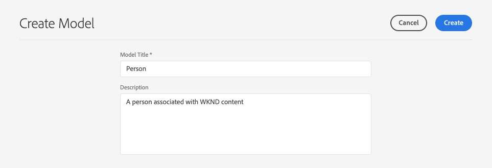
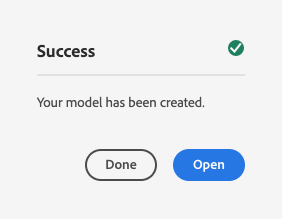

# 建立內容片段模型無頭快速入門手冊{#creating-content-fragment-models}

「內容片段模型」會使用AEM的無頭功能定義您要建立和提供的內容結構。

## 什麼是內容片段模型？{#what-are-content-fragment-models}

[現在您已建立設定，您可](create-configuration.md) 以用它來建立內容片段模型。

「內容片段模型」會定義您要在AEM中建立和管理的資料和內容結構。 它們是您內容的支架。 選擇建立內容時，您的作者會從您定義的「內容片段模型」中選取，以引導他們建立內容。

## 如何建立內容片段模型{#how-to-create-a-content-fragment-model}

資訊架構設計人員只會隨著需要新模型而偶爾執行這些工作。 為了本快速入門手冊的目的，我們只需要建立一個模型。

1. 以雲端服務的身分登入AEM，並從主功能表選取「**工具->資產->內容片段模型」**。
1. 點選或按一下建立您的設定所建立的資料夾。

   
1. 點選或按一下「建立&#x200B;**」。**
1. 提供&#x200B;**模型標題**、**標籤**&#x200B;和&#x200B;**說明**。 您也可以選取／取消選取「啟用model **」，以控制模型在建立時是否立即啟用。**

   
1. 在確認窗口中，按一下或按一下&#x200B;**Open**&#x200B;以配置型號。

   
1. 使用&#x200B;**內容片段模型編輯器**，從&#x200B;**資料類型**&#x200B;欄拖放欄位，建立內容片段模型。

   

1. 置入欄位後，您必須設定其屬性。 編輯器將自動切換到&#x200B;**屬性**&#x200B;頁籤，以查看添加的欄位，您可以在其中提供強制欄位。

   
1. 完成模型構建後，點選或按一下「保存」(Save)**。**&#x200B;新建立的模型以&#x200B;**Draft**&#x200B;模式保存。

   
1. 必須啟用模型才能使用它（如果尚未啟用）。 選擇剛建立的模型，然後按一下或按一下&#x200B;**啟用**。

   
1. 在確認對話方塊中點選或按一下「啟用&#x200B;****」，以確認啟用模型。

   
1. 模型現在已啟用並可供使用。

   

**內容片段模型編輯器**&#x200B;支援許多不同的資料類型，例如簡單文字欄位、資產參考、其他模型的參考和JSON資料。

您可以建立多個模型。 模型可參照其他內容片段。 使用[configurations](create-configuration.md)來組織您的模型。

## 後續步驟{#next-steps}

現在，您已透過建立模型來定義內容片段的結構，您可以移至快速入門手冊的第三部份，並[建立資料夾，以儲存片段本身。](create-assets-folder.md)

>[!TIP]
>
>如需內容片段模型的完整詳細資訊，請參閱[內容片段模型檔案](/help/assets/content-fragments/content-fragments-models.md)
