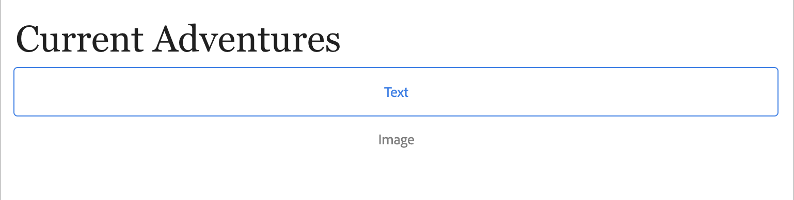

# 中的複合組SPA件 {#composite-components-in-spas}

複合元件通過將多個基AEM本元件組合到單個元件中而利用元件的模組化性質。 通用的複合元件使用案例是由影像和文本元件的組合構成的卡元件。

在「單頁應用程式(SPA)編輯器」框架中正確實現複合元件後，內容作者可以像拖放任何其他元件一樣拖放這些元件，但仍然能夠單獨編輯組成複合元件的每個元件。

本文演示如何將複合元件添加到單頁應用程式中，以便與編輯器無縫AEM地SPA工作。

## 用例 {#use-case}

本文將以典型的卡元件為實例。 卡是許多數字型驗的常用UI元素，通常由影像和相關文本或字幕組成。 作者希望能夠拖放整張卡片，但能夠單獨編輯卡片的影像並自定義相關文本。

## 必備條件 {#prerequisites}

支援複合元件使用情形的以下模型需要以下先決條件。

* 您的AEM開發實例正在埠4502上以示例項目本地運行。
* 您有一個正在工作的外部React應用 [已啟用，以在中編AEM輯。](editing-external-spa.md)
* React應用程式已載入到編AEM輯器 [使用RemotePage元件。](remote-page.md)

## 將複合元件添加到SPA {#adding-composite-components}

根據您在中的實施，有三種不同的組合元件SPA實施模AEM式。

* [項目中不存在該組AEM件。](#component-does-not-exist)
* [該元件存在於您的AEM項目中，但其所需內容不存在。](#content-does-not-exist)
* [元件及其所需內容都存在於項AEM目中。](#both-exist)

以下各節舉例說明如何以卡元件為例實現每種情況。

### 項目中不存在該組AEM件。 {#component-does-not-exist}

首先建立將組成複合元件的元件，即影像及其文本的元件。

1. 在項目中建立文AEM本元件。
1. 添加相應 `resourceType` 的 `editConfig` 的下界。

   ```text
    resourceType: 'wknd-spa/components/text' 
   ```

1. 使用 `withMappable` 幫助程式，以啟用元件的編輯。

   ```text
   export const AEMText = withMappable(Text, TextEditConfig); 
   ```

文本元件將類似於以下內容。

```javascript
import React from 'react';
import { withMappable } from '@adobe/aem-react-editable-components';

export const TextEditConfig = {
  emptyLabel: 'Text',
  isEmpty: function(props) {
    return !props || !props.text || props.text.trim().length < 1;
  },
  resourceType: 'wknd-spa/components/text'
};

export const Text = ({ cqPath, richText, text }) => {
  const richTextContent = () => (
    <div className="aem_text"
      id={cqPath.substr(cqPath.lastIndexOf('/') + 1)}
      data-rte-editelement
      dangerouslySetInnerHTML={{__html: text}} />
  );
  return richText ? richTextContent() : (
     <div className="aem_text">{text}</div>
  );
};

export const AEMText = withMappable(Text, TextEditConfig);
```

如果以類似的方式建立影像元件，則可以將其與 `AEMText` 將影像和文本元件用作子元件。

```javascript
import React from 'react';
import { AEMText } from './AEMText';
import { AEMImage } from './AEMImage';

export const AEMCard = ({ pagePath, itemPath}) => (
  <div>
    <AEMText
       pagePath={pagePath}
       itemPath={`text`} />
    <AEMImage
       pagePath={pagePath}
       itemPath={`image`} />
   </div>
);
```

現在，此生成的複合元件可以放置在應用程式的任何位置，並將在編輯器中為文本和影像元件添加佔位符SPA。 在下面的示例中，卡元件將添加到標題下的主元件中。

```javascript
function Home() {
  return (
    <div className="Home">
      <h2>Current Adventures</h2>
      <AEMCard
        pagePath='/content/wknd-spa/home' />
    </div>
  );
}
```

這將在編輯器中顯示文本和影像的空佔位符。 當使用編輯器輸入這些值時，這些值將儲存在指定的頁路徑中，即 `/content/wknd-spa/home`  在根級別上指定名稱 `itemPath`。



### 該元件存在於您的AEM項目中，但其所需內容不存在。 {#content-does-not-exist}

在這種情況下，卡元件已在包含標題和映AEM像節點的項目中建立。 子節點（文本和影像）具有相應的資源類型。


然後，可將其添加到SPA並檢索其內容。

1. 在中為此建立相SPA應的元件。 確保子元件映射到項目中AEM的相應資源SPA類型。 在此示例中，我們使用 `AEMText` 和 `AEMImage` 元件 [在前一個案例中。](#component-does-not-exist)

   ```javascript
   import React from 'react';
   import { Container, withMappable, MapTo } from '@adobe/aem-react-editable-components';
   import { Text, TextEditConfig } from './AEMText';
   import Image, { ImageEditConfig } from './AEMImage';
   
   export const AEMCard = withMappable(Container, {
     resourceType: 'wknd-spa/components/imagecard'
   });
   
   MapTo('wknd-spa/components/text')(Text, TextEditConfig);
   MapTo('wknd-spa/components/image')(Image, ImageEditConfig);
   ```

1. 因為沒有 `imagecard` 元件，將卡添加到頁面。 將現有容AEM器包含SPA。
   * 如果項目中已有容器，AEM則可以將其包含在SPA中，然後將元件從添加到容AEM器中。
   * 確保卡元件映射到中的相應資源類SPA型。

   ```javascript
   <ResponsiveGrid
    pagePath='/content/wknd-spa/home'
    itemPath='root/responsivegrid' />
   ```

1. 添加已建立的 `wknd-spa/components/imagecard` 元件到容器元件允許的元件 [的子菜單。](/help/sites-cloud/authoring/features/templates.md)

現在 `imagecard` 可以直接將元件添加到編輯器中的容AEM器中。


### 元件及其所需內容都存在於項AEM目中。 {#both-exist}

如果內容存在AEM於中，則可以通過提SPA供內容路徑直接包括在中。

```javascript
<AEMCard
    pagePath='/content/wknd-spa/home'
    itemPath='root/responsivegrid/imagecard' />
```


的 `AEMCard` 元件與定義的元件相同 [在上一個使用案例中。](#content-does-not-exist) 在此，項目中上述位置中定AEM義的內容包含在SPA中。
