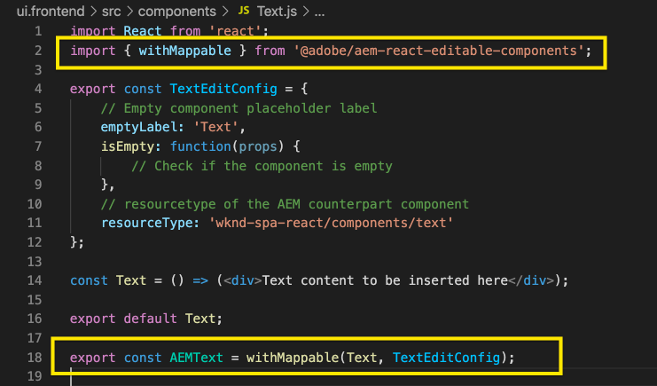
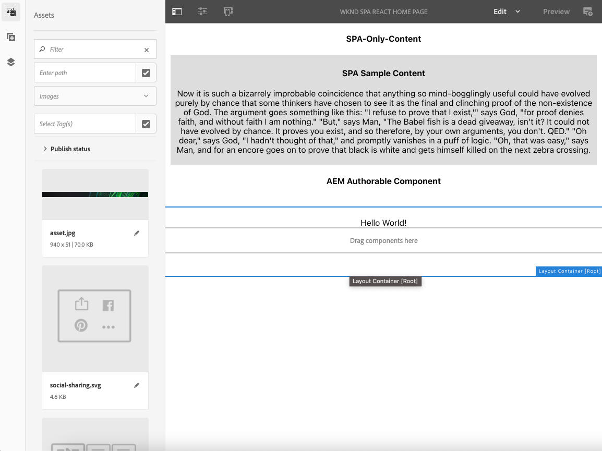
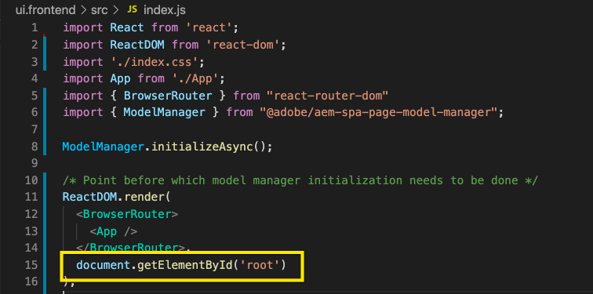

# 在AEM中編輯外部SPA {#editing-external-spa-within-aem}

決定 [整合的等級](/help/implementing/developing/headful-headless.md) 您想要在外部SPA和AEM之間，通常需要能夠在AEM中編輯和檢視SPA。

## 總覽 {#overview}

本檔案說明將獨立SPA上傳至AEM執行個體、新增可編輯的內容區段及啟用編寫的建議步驟。

## 必備條件 {#prerequisites}

先決條件很簡單。

* 確認AEM例項在本機執行。
* 建立基礎AEM SPA專案，使用 [AEM專案原型。](https://experienceleague.adobe.com/docs/experience-manager-core-components/using/developing/archetype/overview.html?#available-properties)
   * 這將成為AEM專案的基礎，並將更新以包含外部SPA。
   * 對於本文檔中的示例，我們使用 [WKND SPA專案。](https://experienceleague.adobe.com/docs/experience-manager-learn/sites/spa-editor/spa-editor-framework-feature-video-use.html#spa-editor)
* 讓您想要整合的可運作外部React SPA立即運作。

## 上傳SPA至AEM專案 {#upload-spa-to-aem-project}

首先，您需要將外部SPA上傳至AEM專案。

1. 取代 `src` 在 `/ui.frontend` 包含React應用程式的項目資料夾 `src` 檔案夾。
1. 在應用程式的 `package.json` 在 `/ui.frontend/package.json` 檔案。
   * 確認SPA SDK相依性為 [建議的版本。](/help/implementing/developing/hybrid/getting-started-react.md#dependencies)
1. 在 `/public` 檔案夾。
1. 納入 `/public/index.html` 檔案。

## 設定遠端SPA {#configure-remote-spa}

現在，外部SPA是AEM專案的一部分，需在AEM中設定。

### 包含AdobeSPA SDK套件 {#include-spa-sdk-packages}

若要運用AEM SPA功能，需仰賴下列三個套件。

* [`@adobe/aem-react-editable-components`](https://github.com/adobe/aem-react-editable-components)
* [`@adobe/aem-spa-component-mapping`](https://www.npmjs.com/package/@adobe/aem-spa-component-mapping)
* [`@adobe/aem-spa-page-model-manager`](https://www.npmjs.com/package/@adobe/aem-spa-model-manager)

`@adobe/aem-spa-page-model-manager` 提供API，用於初始化「模型管理器」並從AEM例項中擷取模型。 然後，此模型便可用來透過的API轉譯AEM元件 `@adobe/aem-react-editable-components` 和 `@adobe/aem-spa-component-mapping`.

#### 安裝 {#installation}

運行以下npm命令以安裝所需的包。

```shell
npm install --save @adobe/aem-spa-component-mapping @adobe/aem-spa-page-model-manager @adobe/aem-react-editable-components
```

### ModelManager初始化 {#model-manager-initialization}

應用程式轉譯前， [`ModelManager`](/help/implementing/developing/hybrid/blueprint.md#pagemodelmanager) 需要初始化才能處理AEM的建立 `ModelStore`.

這必須在 `src/index.js` 檔案或應用程式根目錄呈現的位置。

為此，我們可以 `initializationAsync` API由 `ModelManager`.

以下螢幕擷圖顯示如何啟用初始化 `ModelManager` 在簡單的React應用程式中。 唯一的限制是 `initializationAsync` 需要先呼叫 `ReactDOM.render()`.


在此範例中， `ModelManager` 已初始化，且為空 `ModelStore` 中所有規則的URL區段。

`initializationAsync` 可以選擇接受 `options` 物件作為參數：

* `path`  — 初始化時，會擷取定義路徑上的模型，並將其儲存在 `ModelStore`. 這可用來擷取 `rootModel` 在初始化時。
* `modelClient`  — 允許提供一個自定義客戶端，負責讀取模型。
* `model` - A `model` 物件，通常會在 [使用SSR。](/help/implementing/developing/hybrid/ssr.md)

### AEM可授權葉元件 {#authorable-leaf-components}

1. 建立/識別要建立可授權React元件的AEM元件。 在此示例中，我們使用WKND項目的文本元件。

   

1. 在SPA中建立簡單的React文字元件。 在此範例中，新檔案 `Text.js` 已使用下列內容建立。

   

1. 建立配置對象以指定啟用AEM編輯所需的屬性。

   

   * `resourceType` 在AEM編輯器中開啟時，必須將React元件對應至AEM元件並啟用編輯。

1. 使用包裝函式 `withMappable`.

   

   此包裝函式會將React元件對應至AEM `resourceType` 在設定中指定，並在AEM編輯器中開啟時啟用編輯功能。 對於獨立元件，也會擷取特定節點的模型內容。

   >[!NOTE]
   >
   >在此範例中，元件有不同版本：AEM包裝及解包React元件。 顯式使用元件時需要使用包裝版本。 當元件屬於頁面時，您可以繼續使用預設元件，如目前在SPA編輯器中所做。

1. 在元件中呈現內容。

   文本元件的JCR屬性在AEM中顯示如下。

   

   這些值會以屬性的形式傳遞至新建立的 `AEMText` React元件和可用來轉譯內容。

   ```javascript
   import React from 'react';
   import { withMappable } from '@adobe/aem-react-editable-components';
   
   export const TextEditConfig = {
       // Empty component placeholder label
       emptyLabel:'Text', 
       isEmpty:function(props) {
          return !props || !props.text || props.text.trim().length < 1;
       },
       // resourcetype of the AEM counterpart component
       resourceType:'wknd-spa-react/components/text'
   };
   
   const Text = ({ text }) => (<div>{text}</div>);
   
   export default Text;
   
   export const AEMText = withMappable(Text, TextEditConfig);
   ```

   完成AEM設定時，元件會以此顯示。

   ```javascript
   const Text = ({ cqPath, richText, text }) => {
      const richTextContent = () => (
         <div className="aem_text" id={cqPath.substr(cqPath.lastIndexOf('/') + 1)} data-rte-editelement dangerouslySetInnerHTML={{__html: text}}/>
      );
      return richText ? richTextContent() : (<div className="aem_text">{text}</div>);
   };
   ```

   >[!NOTE]
   >
   >在此範例中，我們已對呈現的元件進行進一步自訂，以符合現有的文字元件。 但這與在AEM中編寫無關。

#### 新增可授權元件至頁面 {#add-authorable-component-to-page}

建立可授權的React元件後，我們就可以在整個應用程式中使用這些元件。

以需要從WKND SPA專案新增文字的範例頁面為例。 在此範例中，我們要顯示「Hello World！」文字 於 `/content/wknd-spa-react/us/en/home.html`.

1. 確定要顯示的節點路徑。

   * `pagePath`:在範例中，包含節點的頁面 `/content/wknd-spa-react/us/en/home`
   * `itemPath`:在範例中，指向頁面內節點的路徑 `root/responsivegrid/text`
      * 這包含頁面上容納項目的名稱。

   

1. 在頁面的必要位置新增元件。

   

   此 `AEMText` 元件可新增至頁面內的必要位置，且具有 `pagePath` 和 `itemPath` 值設定為屬性。 `pagePath` 是強制屬性。

#### 驗證編輯AEM上的文字內容 {#verify-text-edit}

我們現在可以在執行中的AEM執行個體上測試元件。

1. 從 `aem-guides-wknd-spa` 建立專案並部署至AEM的目錄。

```shell
mvn clean install -PautoInstallSinglePackage
```

1. 在您的AEM例項上，導覽至 `http://<host>:<port>/editor.html/content/wknd-spa-react/us/en/home.html`.


此 `AEMText` 元件現在可在AEM上授權。

### AEM可授權頁面 {#aem-authorable-pages}

1. 識別要新增以在SPA中製作的頁面。 此範例使用 `/content/wknd-spa-react/us/en/home.html`.
1. 建立新檔案(例如 `Page.js`)（適用於可授權的頁面元件）。 在此，我們可以重複使用 `@adobe/cq-react-editable-components`.
1. 在區段中重複步驟4 [AEM可授權的葉元件。](#authorable-leaf-components) 使用包裝函式 `withMappable` 在元件上。
1. 如先前所述，套用 `MapTo` 至頁面內所有子元件的AEM資源類型。

   ```javascript
   import { Page, MapTo, withMappable } from '@adobe/aem-react-editable-components';
   import Text, { TextEditConfig } from './Text';
   
   export default withMappable(Page);
   
   MapTo('wknd-spa-react/components/text')(Text, TextEditConfig);
   ```

   >[!NOTE]
   >
   >在此範例中，我們使用未包裝的React文字元件，而非已包裝的 `AEMText` 先前建立。 這是因為當元件是頁面/容器的一部分，且不獨立時，容器會負責遞回對應元件並啟用編寫功能，而且每個子項不需要額外的包裝函式。

1. 若要在SPA中新增可授權頁面，請遵循區段中的相同步驟 [新增可授權元件至頁面。](#add-authorable-component-to-page) 在此，我們可以略過 `itemPath` 但屬性。

#### 驗證AEM上的頁面內容 {#verify-page-content}

若要確認頁面可以編輯，請依照區段中的相同步驟操作 [驗證編輯AEM上的文字內容。](#verify-text-edit)



現在可在具有版面容器和子文字元件的AEM上編輯頁面。

### 虛擬葉元件 {#virtual-leaf-components}

在先前的範例中，我們已將元件新增至SPA，並具備現有AEM內容。 不過，在某些情況下，AEM中尚未建立內容，但需由內容作者稍後新增。 為了適應這種情況，前端開發人員可以在SPA內的適當位置添加元件。 在AEM的編輯器中開啟這些元件時，會顯示預留位置。 內容作者將這些內容新增至這些預留位置後，節點就會在JCR結構中建立，且內容持續存在。 建立的元件將允許與獨立葉元件相同的操作集。

在此範例中，我們會重複使用 `AEMText` 先前建立的元件。 我們希望在WKND首頁的現有文字元件下方新增文字。 添加的元件與添加的常規葉元件相同。 不過， `itemPath` 可更新至需要新增元件的路徑。

由於新元件需要新增至現有文字下方，位於 `root/responsivegrid/text`，新路徑將是 `root/responsivegrid/{itemName}`.

```html
<AEMText
 pagePath='/content/wknd-spa-react/us/en/home'
 itemPath='root/responsivegrid/text_20' />
```

此 `TestPage` 新增虛擬元件後，元件看起來類似下列。


>[!NOTE]
>
>確保 `AEMText` 元件具有 `resourceType` 在設定中設定以啟用此功能。

您現在可以依照區段中的步驟，將變更部署至AEM [驗證編輯AEM上的文字內容。](#verify-text-edit) 將顯示當前非現有的 `text_20` 節點。


內容作者更新此元件時，會新增 `text_20` 節點建立於 `root/responsivegrid/text_20` in `/content/wknd-spa-react/us/en/home`.


#### 要求和限制 {#limitations}

添加虛擬葉元件有許多要求，也有一些限制。

* 此 `pagePath` 屬性是建立虛擬元件的必要屬性。
* 提供於 `pagePath` 必須存在於AEM專案中。
* 必須在 `itemPath`.
* 可在任何層級建立元件。
   * 如果我們提供 `itemPath='text_20'` 在上一個範例中，新節點將直接建立在頁面下，即 `/content/wknd-spa-react/us/en/home/jcr:content/text_20`
* 透過提供時，建立新節點的節點路徑必須有效 `itemPath`.
   * 在此範例中， `root/responsivegrid` 必須存在，才能使新節點 `text_20` 可在此建立。
* 僅支援建立葉元件。 未來版本將支援虛擬容器和頁面。

### 虛擬容器 {#virtual-containers}

支援新增容器的功能，即使尚未在AEM中建立對應的容器亦然。 概念和方法類似於 [虛擬葉元件。](#virtual-leaf-components)

前端開發人員可將容器元件新增至SPA內適當位置，當這些元件在AEM的編輯器中開啟時，會顯示預留位置。 然後，作者可將元件及其內容新增至容器，以便在JCR結構中建立所需的節點。

例如，如果容器已存在於 `/root/responsivegrid` 而開發人員想要新增子容器：


`newContainer` 尚未存在於AEM中。

在AEM中編輯包含此元件的頁面時，會顯示容器的空白預留位置，供作者新增內容。


一旦作者將子元件新增至容器，就會以JCR結構中的對應名稱建立新容器節點。


您現在可以根據作者的要求，將更多元件和內容新增至容器，而且這些變更將持續存在。

#### 要求和限制 {#container-limitations}

新增虛擬容器有許多需求，以及一些限制。

* 用於確定可添加的元件的策略將從父容器繼承。
* 要建立的容器的直接父項必須已存在於AEM中。
   * 如果容器 `root/responsivegrid` AEM容器中已存在，則可提供路徑以建立新容器 `root/responsivegrid/newContainer`.
   * 不過 `root/responsivegrid/newContainer/secondNewContainer` 不可能。
* 一次幾乎只能建立一個新層級的元件。

## 其他自訂 {#additional-customizations}

如果您按照先前的範例操作，您的外部SPA現在可在AEM中編輯。 不過，您可以進一步自訂外部SPA的其他方面。

### 根節點ID {#root-node-id}

依預設，我們假設React應用程式呈現在 `div` 元素ID的 `spa-root`. 如有需要，可自訂。

例如，假設我們有SPA，其中應用程式在 `div` 元素ID的 `root`. 這需要反映在三個檔案中。

1. 在 `index.js` React應用程式(或 `ReactDOM.render()` 中)

   

1. 在 `index.html` React應用程式

   

1. 透過兩個步驟，在AEM應用程式的頁面元件內文中：

   1. 建立新 `body.html` （適用於頁面元件）。

   

   1. 在新的 `body.html` 檔案。

   

### 使用路由編輯React SPA {#editing-react-spa-with-routing}

如果外部React SPA應用程式有多個頁面， [它可使用路由來決定要呈現的頁面/元件。](/help/implementing/developing/hybrid/routing.md) 基本使用案例是比對目前作用中的URL與為路由提供的路徑。 要啟用對此類具有路由功能的應用程式的編輯，需要轉換要匹配的路徑，以容納AEM特定的資訊。

在下列範例中，我們有一個簡單的React應用程式，包含兩個頁面。 要呈現的頁面取決於提供給路由器的路徑與活動URL的匹配。 例如，如果 `mydomain.com/test`, `TestPage` 即會呈現。


若要在AEM中啟用此範例SPA的編輯，需執行下列步驟。

1. 識別要作為AEM根的層級。

   * 針對我們的範例，我們考慮將wknd-spa-react/us/en作為SPA的根。 這表示該路徑之前的所有項目都只有AEM頁面/內容。

1. 在必要層級建立新頁面。

   * 在此範例中，要編輯的頁面為 `mydomain.com/test`. `test` 位於應用程式的根路徑中。 在AEM中建立頁面時，也需要保留此項目。 因此，我們可以在上一步驟中定義的根層級建立新頁面。
   * 建立的新頁面的名稱必須與要編輯的頁面相同。 在此範例中， `mydomain.com/test`，則必須建立新頁面 `/path/to/aem/root/test`.

1. 在SPA路由中添加幫手。

   * 新建立的頁面將無法在AEM中呈現預期的內容。 這是因為路由器預期路徑為 `/test` 而AEM作用中路徑為 `/wknd-spa-react/us/en/test`. 為了容納URL的AEM特定部分，我們需要在SPA端新增一些協助工具。

   

   * 此 `toAEMPath` 由 `@adobe/cq-spa-page-model-manager` 可用於此。 當應用程式在AEM例項上開啟時，它會轉換為路由提供的路徑，以包含AEM專屬部分。 它接受三個參數：
      * 路由所需的路徑
      * 編輯SPA的AEM例項的來源URL
      * AEM上的專案根，在第一步中決定
   * 這些值可設為環境變數，以提供更大的彈性。


1. 確認是否在AEM中編輯頁面。

   * 將專案部署至AEM，並導覽至新建立的 `test` 頁面。 現在會呈現頁面內容，且AEM元件可編輯。

## 其他資源 {#additional-resources}

下列參考資料有助於在AEM中了解SPA。

* [AEM中的Headful和Headless](/help/implementing/developing/headful-headless.md)
* [AEM專案原型](https://experienceleague.adobe.com/docs/experience-manager-core-components/using/developing/archetype/overview.html)
* [WKND SPA專案](https://experienceleague.adobe.com/docs/experience-manager-learn/sites/spa-editor/spa-editor-framework-feature-video-use.html)
* [AEM中使用React的SPA快速入門](/help/implementing/developing/hybrid/getting-started-react.md)
* [SPA參考資料（API參考）](/help/implementing/developing/hybrid/reference-materials.md)
* [SPA Blueprint和PageModelManager](/help/implementing/developing/hybrid/blueprint.md#pagemodelmanager)
* [SPA模型路由](/help/implementing/developing/hybrid/routing.md)
* [SPA和伺服器端轉譯](/help/implementing/developing/hybrid/ssr.md)
