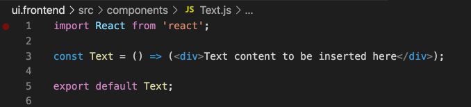

# 編輯SPA外部AEM {#editing-external-spa-within-aem}

在決定 [整合級別](/help/implementing/developing/headful-headless.md) 您希望在外部和SPAAEM之間，您通常需要能夠編輯和查看SPA內部AEM。

## 概覽 {#overview}

本文檔介紹了將獨立內容上載到實SPA例、添AEM加可編輯內容部分以及啟用創作的建議步驟。

## 必備條件 {#prerequisites}

先決條件很簡單。

* 確保的實例AEM在本地運行。
* 建立基AEM本SPA項目 [原型AEM計畫。](https://experienceleague.adobe.com/docs/experience-manager-core-components/using/developing/archetype/overview.html?#available-properties)
   * 這將構成項目的基礎，AEM並將更新以包括外部項SPA目。
   * 對於本文檔中的示例，我們使用 [WKND項SPA目。](https://experienceleague.adobe.com/docs/experience-manager-learn/sites/spa-editor/spa-editor-framework-feature-video-use.html#spa-editor)
* 讓您希望隨時集SPA成的工作、外部反應。

## 上載SPA到項AEM目 {#upload-spa-to-aem-project}

首先，您需要將外部SPA上載到AEM項目。

1. 替換 `src` 的 `/ui.frontend` 項目資料夾和您的React應用程式 `src` 的子菜單。
1. 在應用程式中包括任何其他依賴項 `package.json` 的 `/ui.frontend/package.json` 的子菜單。
   * 確保SPASDK依賴項 [推薦的版本。](/help/implementing/developing/hybrid/getting-started-react.md#dependencies)
1. 在 `/public` 的子菜單。
1. 包括添加到 `/public/index.html` 的子菜單。

## 配置遠程SPA {#configure-remote-spa}

現在，外SPA部是項AEM目的一部分，需要在中配AEM置。

### 包括AdobeSPA SDK包 {#include-spa-sdk-packages}

要利用功AEM能，SPA以下三個軟體包存在依賴項。

* [`@adobe/aem-react-editable-components`](https://github.com/adobe/aem-react-editable-components)
* [`@adobe/aem-spa-component-mapping`](https://www.npmjs.com/package/@adobe/aem-spa-component-mapping)
* [`@adobe/aem-spa-page-model-manager`](https://www.npmjs.com/package/@adobe/aem-spa-model-manager)

`@adobe/aem-spa-page-model-manager` 提供用於初始化模型管理器並從實例檢索模型的AEMAPI。 然後，此模型可用於使用AEMAPI呈現元件 `@adobe/aem-react-editable-components` 和 `@adobe/aem-spa-component-mapping`。

#### 安裝 {#installation}

運行以下npm命令以安裝所需的軟體包。

```shell
npm install --save @adobe/aem-spa-component-mapping @adobe/aem-spa-page-model-manager @adobe/aem-react-editable-components
```

### ModelManager初始化 {#model-manager-initialization}

在應用呈現之前， [`ModelManager`](/help/implementing/developing/hybrid/blueprint.md#pagemodelmanager) 需要初始化以處理創AEM建 `ModelStore`。

需要在 `src/index.js` 檔案或應用程式根所在的位置。

為此，我們可以 `initializationAsync` 由 `ModelManager`。

以下螢幕快照顯示如何啟用初始化 `ModelManager` 在簡單的React應用程式中。 唯一的限制是 `initializationAsync` 需要先打電話 `ReactDOM.render()`。


在此示例中， `ModelManager` 已初始化，並且為空 `ModelStore` 的子菜單。

`initializationAsync` 可以選擇接受 `options` 對象：

* `path`  — 初始化時，將讀取定義路徑上的模型並將其儲存在 `ModelStore`。 這可用於獲取 `rootModel` 初始化時。
* `modelClient`  — 允許提供負責獲取模型的自定義客戶端。
* `model` - A `model` 作為參數傳遞的對象通常在 [使用SSR。](/help/implementing/developing/hybrid/ssr.md)

### 可AEM授權葉元件 {#authorable-leaf-components}

1. 建立/標AEM識要為其建立授權React元件的元件。 在本示例中，我們使用WKND項目的文本元件。

   

1. 在中建立簡單的「反應」文本組SPA件。 在此示例中，新檔案 `Text.js` 已使用以下內容建立。

   

1. 建立配置對象以指定啟用編輯所需的AEM屬性。

   

   * `resourceType` 必須將Reacte元件映射到元件AEM並在編輯器中開啟時啟AEM用編輯。

1. 使用包裝函式 `withMappable`。

   

   此包裝函式將React元件映射到AEM `resourceType` 在配置中指定，並在編輯器中開啟時啟用編AEM輯功能。 對於獨立元件，它還將提取特定節點的模型內容。

   >[!NOTE]
   >
   >在本示例中，元件有不同的版本：包AEM裝和解封反應元件。 顯式使用元件時需要使用包裝的版本。 當元件是頁面的一部分時，可以繼續使用預設元件，如編輯器中當前所做的SPA那樣。

1. 呈現元件中的內容。

   文本元件的JCR屬性如下所示AEM。

   

   這些值作為屬性傳遞給新建立的 `AEMText` 反應元件，可用於呈現內容。

   ```javascript
   import React from 'react';
   import { withMappable } from '@adobe/aem-react-editable-components';
   
   export const TextEditConfig = {
       // Empty component placeholder label
       emptyLabel:'Text', 
       isEmpty:function(props) {
          return !props || !props.text || props.text.trim().length < 1;
       },
       // resourcetype of the AEM counterpart component
       resourceType:'wknd-spa-react/components/text'
   };
   
   const Text = ({ text }) => (<div>{text}</div>);
   
   export default Text;
   
   export const AEMText = withMappable(Text, TextEditConfig);
   ```

   這是配置完成時元件AEM的顯示方式。

   ```javascript
   const Text = ({ cqPath, richText, text }) => {
      const richTextContent = () => (
         <div className="aem_text" id={cqPath.substr(cqPath.lastIndexOf('/') + 1)} data-rte-editelement dangerouslySetInnerHTML={{__html: text}}/>
      );
      return richText ? richTextContent() : (<div className="aem_text">{text}</div>);
   };
   ```

   >[!NOTE]
   >
   >在本示例中，我們對已呈現的元件進行了進一步的自定義，以匹配現有文本元件。 但這與中的創作無關AEM。

#### 將可授權元件添加到頁面 {#add-authorable-component-to-page}

建立可授權的React元件後，我們可以在整個應用程式中使用它們。

讓我們舉一個示例頁，在該頁中需要添加WKND項目中的文SPA本。 在此示例中，我們要顯示文本「Hello World！」 於 `/content/wknd-spa-react/us/en/home.html`.

1. 確定要顯示的節點的路徑。

   * `pagePath`:包含節點的頁面，在示例中 `/content/wknd-spa-react/us/en/home`
   * `itemPath`:在本示例中，指向頁面中節點的路徑 `root/responsivegrid/text`
      * 這包括頁面上包含項的名稱。

   

1. 在頁面中的必需位置添加元件。

   

   的 `AEMText` 可將元件添加到頁面中的所需位置 `pagePath` 和 `itemPath` 值設定為屬性。 `pagePath` 是強制屬性。

#### 驗證上的文本內容的編AEM輯 {#verify-text-edit}

現在，我們可以test運行實例上的AEM元件。

1. 從 `aem-guides-wknd-spa` 將項目構建和部署到的目AEM錄。

```shell
mvn clean install -PautoInstallSinglePackage
```

1. 在實例AEM中，導航至 `http://<host>:<port>/editor.html/content/wknd-spa-react/us/en/home.html`。


的 `AEMText` 元件現在可在上授AEM權。

### 可AEM授權頁 {#aem-authorable-pages}

1. 標識要添加以在中創作的頁SPA面。 此示例使用 `/content/wknd-spa-react/us/en/home.html`。
1. 建立新檔案(例如 `Page.js`)。 在此，我們可以重新使用中提供的頁面元件 `@adobe/cq-react-editable-components`。
1. 在節中重複步驟4 [可授AEM權的葉元件。](#authorable-leaf-components) 使用包裝函式 `withMappable` 的上界。
1. 如以前所做，應用 `MapTo` 到該頁AEM中所有子元件的資源類型。

   ```javascript
   import { Page, MapTo, withMappable } from '@adobe/aem-react-editable-components';
   import Text, { TextEditConfig } from './Text';
   
   export default withMappable(Page);
   
   MapTo('wknd-spa-react/components/text')(Text, TextEditConfig);
   ```

   >[!NOTE]
   >
   >在本示例中，我們使用展開的「反應」(React)文本元件而不是展開的 `AEMText` 已建立。 這是因為當元件是頁面/容器的一部分而不是單獨時，容器將負責遞歸地映射元件並啟用創作功能，並且每個子級不需要附加包裝。

1. 要在中添加可授權的頁SPA面，請執行一節中的相同步驟 [將授權元件添加到頁面。](#add-authorable-component-to-page) 我們可以跳過 `itemPath` 但是。

#### 驗證頁面內AEM容 {#verify-page-content}

要驗證是否可以編輯頁面，請執行一節中的相同步驟 [驗證上的文本內容的編AEM輯。](#verify-text-edit)


現在，該頁面可以與布AEM局容器和子文本元件一起編輯。

### 虛擬葉元件 {#virtual-leaf-components}

在前面的示例中，我們將元件添加SPA到包含現AEM有內容。 但是，有些情況下，內容尚未在中創AEM建，但需要由內容作者稍後添加。 為了適應這一點，前端開發人員可以在中的適當位置添加組SPA件。 在中的編輯器中開啟時，這些元件將顯示佔位符AEM。 一旦內容作者將這些內容添加到這些佔位符中，就會在JCR結構中建立節點，並保留內容。 建立的元件將允許與獨立葉元件相同的一組操作。

在此示例中，我們將 `AEMText` 元件以前建立的。 我們希望在WKND首頁上現有文本元件下添加新文本。 添加的成分與普通葉片成分相同。 然而， `itemPath` 可以更新到需要添加新元件的路徑。

因為新元件需要添加到現有文本的下方， `root/responsivegrid/text`，新路徑是 `root/responsivegrid/{itemName}`。

```html
<AEMText
 pagePath='/content/wknd-spa-react/us/en/home'
 itemPath='root/responsivegrid/text_20' />
```

的 `TestPage` 添加虛擬元件後，該元件如下所示。


>[!NOTE]
>
>確保 `AEMText` 元件 `resourceType` 在配置中設定以啟用此功能。

現在，您可以部署更改AEM，以執行一節中的步驟 [驗證上的文本內容的編AEM輯。](#verify-text-edit) 將顯示當前不存在的佔位符 `text_20` 的下界。


當內容作者更新此元件時， `text_20` 節點建立於 `root/responsivegrid/text_20` 在 `/content/wknd-spa-react/us/en/home`。


#### 要求和限制 {#limitations}

添加虛擬葉元件有許多要求，也有一些限制。

* 的 `pagePath` 屬性是建立虛擬元件的必需屬性。
* 在中的路徑上提供的頁節點 `pagePath` 必須存在於項AEM目中。
* 必須在 `itemPath`。
* 可在任何級別建立元件。
   * 如果我們提供 `itemPath='text_20'` 在上一個示例中，新節點將直接在頁面(即 `/content/wknd-spa-react/us/en/home/jcr:content/text_20`
* 如果通過提供，則指向建立新節點的節點的路徑必須有效 `itemPath`。
   * 在本例中， `root/responsivegrid` 必須存在，以便新節點 `text_20` 可以建立。
* 僅支援葉元件建立。 未來版本將支援虛擬容器和頁面。

### 虛擬容器 {#virtual-containers}

支援添加容器的功能，即使在中尚未建立相應的容AEM器。 該概念和方法類似於 [虛擬葉元件。](#virtual-leaf-components)

前端開發人員可以將容器元件添加到中的適當位置SPA，這些元件在中的編輯器中開啟時將顯示佔位符AEM。 然後，作者可以將元件及其內容添加到容器中，該容器將在JCR結構中建立所需的節點。

例如，如果容器已存在於 `/root/responsivegrid` 開發人員希望添加新的子容器：


`newContainer` 中尚不存在AEM。

在中編輯包含此元件的頁AEM面時，將顯示一個容器的空佔位符，作者可以將內容添加到該佔位符中。


一旦作者將子元件添加到容器中，就會在JCR結構中使用相應名稱建立新容器節點。


現在，可以根據作者的要求將更多元件和內容添加到容器中，並且這些更改將被保留。

#### 要求和限制 {#container-limitations}

添加虛擬容器有許多要求，也存在一些限制。

* 用於確定可添加哪些元件的策略將從父容器繼承。
* 要建立的容器的直接父級必須已存在AEM。
   * 如果容器 `root/responsivegrid` 容器中已AEM存在，則可以通過提供路徑建立新容器 `root/responsivegrid/newContainer`。
   * 但是 `root/responsivegrid/newContainer/secondNewContainer` 不可能。
* 一次只能虛擬建立一個新級別的元件。

## 其他自定義項 {#additional-customizations}

如果按照前面的示例進行操作，則SPA現在可在中編輯外AEM部。 但是，您可以進一步定制SPA外部的其它方面。

### 根節點ID {#root-node-id}

預設情況下，我們假設React應用程式在 `div` 元素ID `spa-root`。 如果需要，可以自定義。

例如，假設我們SPA在 `div` 元素ID `root`。 這需要反映在三個檔案中。

1. 在 `index.js` 之應用程式(或 `ReactDOM.render()` 調用)

   

1. 在 `index.html` React應用程式

   

1. 在應AEM用的頁面元件主體中，分兩步進行：

   1. 新建 `body.html` 的子菜單。

   

   1. 在新元素中添加新根元素 `body.html` 的子菜單。

   

### 編輯對路由SPA的反應 {#editing-react-spa-with-routing}

如果外部React應SPA用程式具有多個頁， [它可以使用路由來確定要呈現的頁面/元件。](/help/implementing/developing/hybrid/routing.md) 基本使用情形是將當前活動的URL與為路由提供的路徑匹配。 要啟用對此類啟用路由的應用程式的編輯，需要轉換要與之匹配的路徑以適應AEM特定資訊。

在以下示例中，我們有一個帶兩頁的簡單React應用程式。 要呈現的頁面是通過將提供給路由器的路徑與活動URL匹配來確定的。 例如，如果我們 `mydomain.com/test`。 `TestPage` 將被呈現。


要在此示例中啟AEM用編SPA輯，需要執行以下步驟。

1. 確定將作為根的級別AEM。

   * 對於我們的樣本，我們考慮將wknd-spa-react/us/en作為根SPA。 這意味著該路徑之前的所有內容AEM都只是頁面/內容。

1. 在所需級別建立新頁面。

   * 在此示例中，要編輯的頁面 `mydomain.com/test`。 `test` 位於應用的根路徑中。 在中建立頁面時，也需要保AEM留此內容。 因此，我們可以在上一步中定義的根級別建立新頁面。
   * 建立的新頁面必須與要編輯的頁面具有相同的名稱。 在本示例中， `mydomain.com/test`，必須建立新頁面 `/path/to/aem/root/test`。

1. 在路由中添SPA加幫助程式。

   * 新建立的頁面尚未在中呈現預期的內AEM容。 這是因為路由器需要的路徑 `/test` 而活AEM動路徑 `/wknd-spa-react/us/en/test`。 要適AEM應URL的特定部分，需要在側面添加一些幫SPA助程式。

   

   * 的 `toAEMPath` 提供的幫助者 `@adobe/cq-spa-page-model-manager` 可以用於此。 當應用程式在實例上開啟時，它AEM將為路由提供的路徑轉換為包括特定AEM部分。 它接受三個參數：
      * 路由所需的路徑
      * 編輯實例AEM的源SPAURL
      * 項目根AEM於第一步中確定
   * 這些值可設定為環境變數，以便更靈活。


1. 驗證在中編輯頁AEM面。

   * 將項目部署AEM到新建立的 `test` 的子菜單。 現在將呈現頁面內容，AEM元件可編輯。

## 其他資源 {#additional-resources}

以下參考材料可能有助於SPA在上下文中了AEM解。

* [無頭AEM](/help/implementing/developing/headful-headless.md)
* [項AEM目原型](https://experienceleague.adobe.com/docs/experience-manager-core-components/using/developing/archetype/overview.html)
* [WKND項SPA目](https://experienceleague.adobe.com/docs/experience-manager-learn/sites/spa-editor/spa-editor-framework-feature-video-use.html)
* [使用SPA反AEM應](/help/implementing/developing/hybrid/getting-started-react.md)
* [參SPA考材料（API參考）](/help/implementing/developing/hybrid/reference-materials.md)
* [藍SPA圖和PageModelManager](/help/implementing/developing/hybrid/blueprint.md#pagemodelmanager)
* [模SPA型路由](/help/implementing/developing/hybrid/routing.md)
* [和SPA伺服器端呈現](/help/implementing/developing/hybrid/ssr.md)
