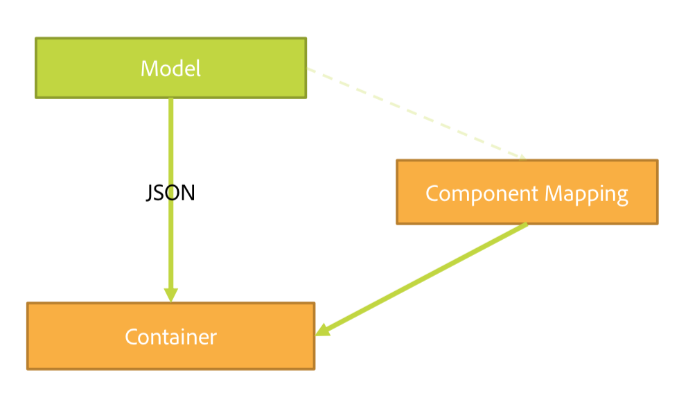

# SPA編輯器概述 {#spa-editor-overview}

單頁應用程式 (SPA) 可為網站使用者提供引人入勝的體驗。開發人員希望能使用SPA架構建立網站，而作者則想在AEM中為使用此架構建立的網站順暢地編輯內容。

SPA編輯器提供全方位的解決方案，可支援AEM中的SPA。 本頁概略說明AEM中SPA支援的結構、SPA編輯器的運作方式，以及SPA架構和AEM如何保持同步。

## 簡介 {#introduction}

使用通用SPA架構(例如React和Angular)建置的網站會透過動態JSON載入其內容，不提供AEM頁面編輯器必須的HTML結構才能放置編輯控制項。

若要啟用AEM內的SPA編輯功能，需要SPA的JSON輸出與AEM存放庫中的內容模型之間的對應，才能儲存內容的變更。

AEM中的SPA支援導入了精簡JS層，當載入頁面編輯器時，此層會與SPA JS程式碼互動，以便傳送事件，並啟用編輯控制項的位置以允許內容內編輯。 此功能以「內容服務API端點」概念為基礎，因為SPA的內容需透過「內容服務」載入。

如需AEM中SPA的詳細資訊，請參閱下列檔案：

* [SPA Blueprint](blueprint.md) 符合SPA的技術需求
* [AEM中使用React的SPA快速入門](getting-started-react.md) 快速導覽使用React的簡單SPA
* [AEM中使用SPA快速入門Angular](getting-started-angular.md) 快速導覽簡單的SPA，使用Angular

## Design {#design}

SPA的頁面元件不會透過JSP或HTL檔案提供其子元件的HTML元素。 此操作已委派給SPA架構。 子元件或模型的表示會從JCR以JSON資料結構的形式擷取。 接著會根據該結構將SPA元件新增至頁面。 此行為可區分頁面元件的初始內文組成，而非SPA對應。

### 頁面模型管理 {#page-model-management}

頁面模型的解析度及管理已委派給提供 `PageModel` 程式庫。 SPA必須使用頁面模型程式庫，才能初始化並由SPA編輯器製作。 透過間接提供給AEM頁面元件的頁面模型程式庫 `aem-react-editable-components` npm。 「頁面模型」是AEM與SPA之間的解譯器，因此必須始終存在。 製作頁面時，需額外的程式庫 `cq.authoring.pagemodel.messaging` 必須新增，才能啟用與頁面編輯器的通訊。

如果SPA頁面元件繼承自頁面核心元件，有兩個選項可讓 `cq.authoring.pagemodel.messaging` 客戶端庫類別可用：

* 如果模板是可編輯的，請將其添加到頁策略中。
* 或使用 `customfooterlibs.html`.

對於匯出模型中的每個資源，SPA會對應將執行轉譯的實際元件。 接著，系統會使用容器內的元件對應來轉譯模型（以JSON表示）。

>[!CAUTION]
>
>納入 `cq.authoring.pagemodel.messaging` 類別應限於SPA編輯器的內容。

### 通信資料類型 {#communication-data-type}

當 `cq.authoring.pagemodel.messaging` 類別新增至頁面，則會傳送訊息至頁面編輯器以建立JSON通訊資料類型。 當通訊資料類型設為JSON時，GET要求會與元件的Sling模型端點通訊。 在頁面編輯器中發生更新後，更新元件的JSON表示會傳送至頁面模型程式庫。 然後頁面模型程式庫會通知SPA更新。

## 工作流程 {#workflow}

您可以將SPA編輯器視為SPA與AEM之間的調解者，借此了解與之間互動的流程。

* 頁面編輯器與SPA之間的通訊是使用JSON而非HTML。
* 頁面編輯器會透過iframe和傳訊API，為SPA提供最新版本的頁面模型。
* 頁面模型管理員會通知編輯器已準備好進行編輯，並以JSON結構傳遞頁面模型。
* 編輯器不會變更或甚至存取所製作頁面的DOM結構，而是提供最新的頁面模型。

### 基本SPA編輯器工作流程 {#basic-spa-editor-workflow}

銘記SPA編輯器的關鍵元素，作者可在AEM中編輯SPA的高階工作流程如下所示。

1. SPA編輯器載入。
1. SPA會載入個別影格中。
1. SPA要求JSON內容並轉譯用戶端元件。
1. SPA編輯器會偵測轉譯的元件並產生覆蓋。
1. 製作按一下覆蓋圖，顯示元件的編輯工具列。
1. SPA編輯器會持續編輯並提出POST請求給伺服器。
1. SPA編輯器向SPA編輯器請求更新JSON，此編輯器會以DOM事件傳送至SPA。
1. SPA會重新轉譯相關元件，並更新其DOM。

>[!NOTE]
>
>請記住：
>
>* SPA一律負責顯示。
>* SPA編輯器與SPA本身隔離。
>* 在生產環境中（發佈），不會載入SPA編輯器。

### 客戶端 — 伺服器頁編輯工作流 {#client-server-page-editing-workflow}

這是編輯SPA時，用戶端與伺服器互動的更詳細概述。

1. SPA會自行初始化，並向Sling模型匯出器要求頁面模型。
1. Sling模型匯出工具會要求從存放庫組成頁面的資源。
1. 存放庫會傳回資源。
1. Sling模型匯出器會傳回頁面的模型。
1. SPA會根據頁面模型將元件實例化。
1. **6a** 內容會通知編輯器已可供編寫。

   **6b** 頁面編輯器會要求元件編寫設定。

   **6c** 頁面編輯器會接收元件設定。
1. 作者編輯元件時，頁面編輯器會向預設的POSTservlet發佈修改請求。
1. 資源會在存放庫中更新。
1. 更新的資源提供給POSTservlet。
1. 預設的POSTservlet會通知頁面編輯器資源已更新。
1. 頁面編輯器會要求新的頁面模型。
1. 系統會從存放庫請求組成頁面的資源。
1. 組成頁面的資源由存放庫提供給Sling模型匯出工具。
1. 更新的頁面模型會傳回至編輯器。
1. 頁面編輯器會更新SPA的頁面模型參考。
1. SPA會根據新的頁面模型參考來更新其元件。
1. 更新頁面編輯器的元件設定。

   **17a** SPA代表頁面編輯器內容已就緒。

   **17b** 頁面編輯器為SPA提供元件設定。

   **17c** SPA提供更新的元件設定。

### 製作工作流程 {#authoring-workflow}

此為更詳細的概述，著重於製作體驗。

1. SPA會擷取頁面模型。
1. **2a** 頁面模型為編輯器提供編寫所需的資料。

   **2b** 通知後，元件管理器將更新頁面的內容結構。
1. 元件Orchestrator會查詢AEM資源類型與SPA元件之間的映射。
1. 元件Orchestrator根據頁面模型和元件映射動態實例化SPA元件。
1. 頁面編輯器會更新頁面模型。
1. **6a** 頁面模型會向頁面編輯器提供更新的製作資料。

   **6b** 頁模型將更改分派到元件Orchestrator。
1. 元件Orchestrator會擷取元件對應。
1. 元件Orchestrator會更新頁面內容。
1. 當SPA完成更新頁面內容時，頁面編輯器會載入製作環境。

## 需求與限制 {#requirements-limitations}

若要讓作者能使用頁面編輯器來編輯SPA的內容，您必須實作SPA應用程式，才能與AEM SPA Editor SDK互動。 請參閱 [AEM中使用React的SPA快速入門](getting-started-react.md) 檔案，以便讓您執行。

### 支援的架構 {#supported-frameworks}

SPA Editor SDK支援下列最低版本：

* React 16.x及更新
* Angular6.x及更新版本

這些架構的舊版可與AEM SPA Editor SDK搭配使用，但不支援。

### 其他框架 {#additional-frameworks}

可實作其他SPA架構以搭配AEM SPA Editor SDK使用。 請參閱 [SPA Blueprint](blueprint.md) 說明框架必須滿足的要求，以便建立由模組、元件和服務組成的框架特定層，以便與AEM SPA Editor一起使用。

### 使用多個選取器 {#multiple-selectors}

其他自訂選取器可定義，並用於為AEM SPA SDK開發的SPA中。 但此支援需要 `model` 選取器是第一個選取器，擴充功能是 `.json` JSON匯出工具要求。

### 文字編輯器需求 {#text-editor-requirements}

如果要使用在SPA中建立之文字元件的就地編輯器，則需要其他設定。

1. 在包含文字HTML的容器包裝元素上設定屬性（可以是任何屬性）。 若為WKND SPA專案，此 `
` 元素和已使用的選取器 `data-rte-editelement`.
1. 設定 `editElementQuery` 對應AEM文字元件的 `cq:InplaceEditingConfig` 例如指向該選取器， `data-rte-editelement`. 這可讓編輯者知道哪個HTML元素會包裝HTML文字。

如需 `editElementQuery` rtf編輯器的屬性和設定，請參閱 [設定RTF編輯器。](/help/implementing/developing/extending/rich-text-editor.md)

### 限制 {#limitations}

AEM SPA Editor SDK已全面受到Adobe支援，並持續增強和擴充。 SPA Editor尚未支援下列AEM功能：

* 目標模式
* ContextHub
* 內嵌影像編輯
* 編輯設定(例如 偵聽器)
* 還原/重做
* 頁面差異和時間扭曲
* 執行HTML重新寫入伺服器端的功能，例如連結檢查程式、CDN重新寫入程式服務、URL縮短等。
* 開發人員模式
* AEM啟動
