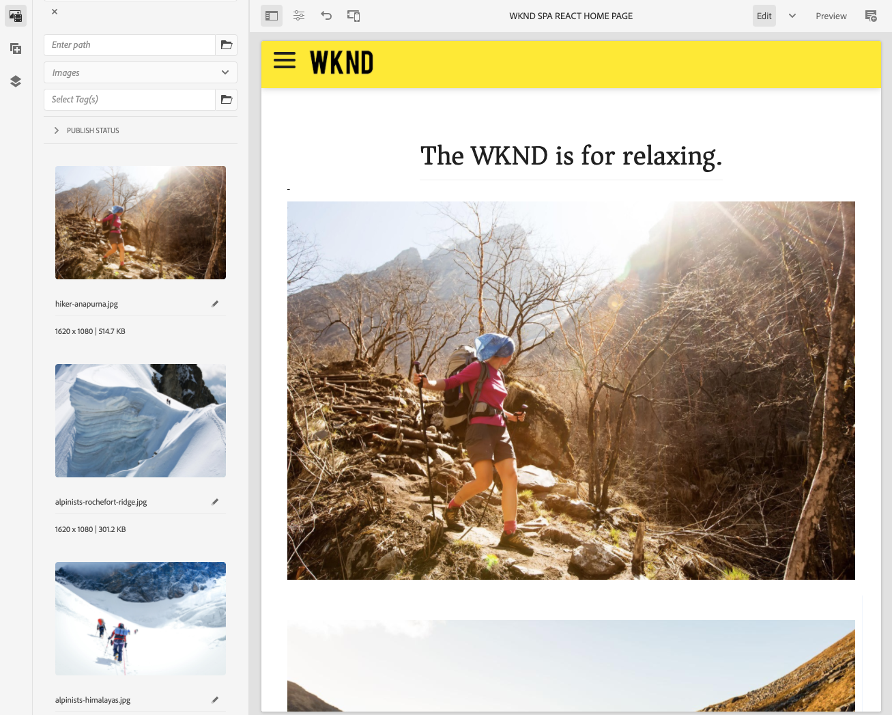

# 介SPA紹和漫遊 {#spa-introduction}

單頁應用程式 (SPA) 可為網站使用者提供引人入勝的體驗。開發人員希望能夠使用框架構建站SPA點，而作者希望無縫地編輯使用這AEM種框架構建的站點的內容。

編輯SPA器提供了一個全面的解決方案，用於SPA支援內AEM部。 本文介紹了如何使用基SPA本應用程式進行創作，並說明它與底層編AEM輯器SPA的關係。

## 簡介 {#introduction}

### 目標 {#article-objective}

本文介紹了在引導讀者SPA瀏覽編輯器之前，用一個簡單的應用程式SPA演示基本內容編SPA輯的基本概念。 然後，它深入到頁面的構建以及應用程式與SPA編輯器的關聯和AEM交互SPA。

本介紹和演示的目的是向開發人員演示為什麼相關SPA、它們通常如何工作、SPAAEM Editor如何處理SPA，以及它與標準應用程式有何不同AEM。

該演練基於標準功AEM能和示例WKND項SPA目應用。 請跟進 [從GitHub下載並安SPA裝示例WKND Project應用。](https://github.com/adobe/aem-guides-wknd-spa)

>[!CAUTION]
>
>此文檔使用 [WKND項SPA目應用](https://github.com/adobe/aem-guides-wknd-spa) 僅供演示之用。 不應用於任何項目工作。

>[!TIP]
>
>任何AEM項目都應利用 [項AEM目原型](https://experienceleague.adobe.com/docs/experience-manager-core-components/using/developing/archetype/overview.html)，它支SPA持使用React或Angular的項目，並利SPA用SDK。

### 什麼SPA? {#what-is-a-spa}

單頁應用程SPA序(1)與常規頁不同，其是呈現客戶端，並且主要是Javascript驅動的，依靠Ajax調用載入資料並動態更新頁面。 大多數或所有內容在單個頁面負載中檢索一次，並根據用戶與頁面的交互情況根據需要非同步載入其他資源。

這減少了頁面刷新的需要，並為用戶提供了無縫、快速且更像本地應用程式體驗的體驗。

前AEM端開發SPA人員可建立可SPA整合到站點的內容，使內容作者能夠像任何其他內容一樣SPA輕鬆地編輯內容。

### 為什麼SPA? {#why-a-spa}

通過更快、更流暢和更像本地應用程式，SPA不僅對網頁訪問者，而且由於工作方式的性質，對營銷人員和開發人員來說，都成為非常有吸引力的體SPA驗。

#### 訪客 {#visitors}

* 訪問者在與內容交互時，希望獲得類似本地的體驗。
* 資料清楚表明，頁面越快，轉換的可能性就越大。

#### 營銷人員 {#marketers}

* 營銷人員希望提供豐富的本土體驗，以吸引訪客充分參與內容。
* 個性化可以使這些體驗更加引人注目。

#### 開發人員 {#developers}

* 開發人員希望內容和演示之間能夠徹底地分離關注點。
* 清潔分離使系統更加可擴展，並允許獨立的前端開發。

### 如何工SPA作？ {#how-does-a-spa-work}

a背後的主要SPA思想是減少對伺服器的調用和對伺服器的依賴，以最小化由伺服器延遲引起的延遲，SPA從而接近本機應用程式的響應。

在傳統的順序網頁中，只載入立即頁面所需的資料。 這意味著當訪問者移動到另一頁時，將調用伺服器來獲取附加資源。 當訪問者與頁面上的元素交互時，可能需要進行其他呼叫。 由於頁面必須跟上訪問者的請求，因此這些多次呼叫會產生延遲或延遲感。

要獲得更流暢的體驗，即訪問者從移動本機應用中期望的體驗，SPA首先載入訪問者的所有必要資料。 雖然這一過程最初可能需要較長時間，但隨後就不再需要額外的伺服器呼叫。

通過在客戶端進行渲染，頁面元素會更快地反應，訪問者與頁面的交互是即時的。 可能需要的任何附加資料都將被非同步調用，以最大化頁面速度。

>[!TIP]
>
>有關如何工作的SPA技術詳AEM細資訊，請參閱：
>* [使用SPA反AEM應](getting-started-react.md)
>* [使用AngularSPA入門AEM](getting-started-angular.md)
>
>有關編輯器的設計、體系結構和技術工作流的詳細SPA瞭解，請參閱文章：
>* [編SPA輯器概述](editor-overview.md)。

## 內容編輯體驗SPA {#content-editing-experience-with-spa}

構建SPA以利用編輯AEM器時，SPA內容作者在編輯和建立內容時沒有發現任何差異。 通AEM用功能可用，不需要更改作者的工作流。

1. 在中編輯SPAWKND項目應AEM用。

   `http://localhost:4502/editor.html/content/wknd-spa-react/us/en/home.html`

   

1. 選擇文本元件，並注意工具欄顯示與任何其他元件類似。 選擇 **編輯**。

   

1. 按正常方式編輯內AEM容，並注意更改已保留。

   

1. 使用資產瀏覽器將新影像拖放到影像元件中。

   

1. 該更改被保留。

   

與任何非應用程式一樣，支援其他創作工具，如在頁面上拖放附加元件、重新排列元件和修改佈局SPAAEM。

>[!NOTE]
>
>編SPA輯器不修改應用程式的DOM。 DOMSPA由它自己負責。
>
>要瞭解此操作的工作原理，請繼續閱讀本文的下一節 [應SPA用和編AEM輯SPA器](#spa-apps-and-the-aem-spa-editor)。

## 應SPA用和編AEM輯SPA器 {#spa-apps-and-the-aem-spa-editor}

體驗最終SPA用戶的行為，然後檢查該頁SPA有助於更好地瞭解SAP應用與中的編輯器SPA的工作AEM方式。

### 使用應SPA用程式 {#using-an-spa-application}

1. 將WKND Project應SPA用程式載入到發佈伺服器上或使用選項 **查看為已發佈** 從 **頁面資訊** 的子菜單。

   `http://<host>:<port>/content/wknd-spa-react/us/en/home.html`

   

   請注意頁面結構，包括子頁面、菜單和文章卡的導航。

1. 使用菜單導航到子頁，並查看該頁立即載入而不需要刷新。

   

1. 在瀏覽子頁時開啟瀏覽器的內置開發工具並監視網路活動。

   

   在應用中，從頁面到頁面的流量非常少。 未重新載入頁面，只請求新映像。

   在客SPA戶端完全管理內容和路由。

如果在子頁面中導航時未重新載入頁面，則如何載入頁面？

下一節， [載入應SPA用程式](#loading-a-spa-application)，深入瞭解載入的機制以及如何SPA同步和非同步載入內容。

### 載入應SPA用程式 {#loading-a-spa-application}

1. 如果尚未載入，請在發佈服SPA務器上載入WKND Project應用或使用選項 **查看為已發佈** 從 **頁面資訊** 的子菜單。

   `http://<host>:<port>/content/wknd-spa-react/us/en/home.html`

   

1. 使用瀏覽器的內置工具查看頁面的源。
1. 請注意，源的內容有限。
   * 該頁面的正文中沒有任何內容。 它主要由樣式表和對各種指令碼(如 `clientlib-react.min.js`。
   * 這些指令碼是此應用程式的主要驅動程式，負責呈現所有內容。

1. 使用瀏覽器的內置工具檢查頁面。 查看已完全載入的DOM的內容。

   

1. 切換到「檢查器」中的「網路」頁籤並重新載入頁面。

   忽略映像請求，請注意為頁面載入的主要資源是頁面本身、CSS、React Javascript、其依賴項以及頁面的JSON資料。

   

1. 載入 `home.model.json` 的子菜單。

   `http://<host>:<port>/content/wknd-spa-react/us/en/home.model.json`

   

   編AEM輯器SPA利用 [內AEM容服務](/help/sites-cloud/administering/content-fragments/content-fragments.md) 以JSON模型的形式傳遞頁面的整個內容。

   通過實現特定的介面，Sling Models為Sling Models提供所需的信SPA息。 JSON資料的傳遞向下委託給每個元件（從頁面、段落、元件等）。

   每個元件都選擇它公開的內容和呈現方式(伺服器端帶HTL或客戶端帶React或Angular)。 本文重點介紹使用React進行客戶端渲染。

1. 該模型還可以將頁面分組在一起，以便它們被同步載入，從而減少了需要重新載入的頁面數。

   在WKND項目應SPA用示例中， `home`。 `page-1`。 `page-2`, `page-3` 頁面被同步載入，因為訪問者通常訪問所有這些頁面。

   此行為不是強制的，完全可定義。

   

1. 要查看行為上的差異，請重新載入 `home` 並清除檢查器的網路活動。 導航到 `page-1` 的子目錄，並查看唯一的網路活動是 `page-1`。 `page-1` 它本身不需要裝載。

   

### 與編輯器交SPA互 {#interaction-with-the-spa-editor}

使用WKND SPA Project應用程式示例，可以清楚地看到應用在發佈時的行為和載入方式，利用內容服務提供JSON內容以及非同步載入資源。

此外，對於內容作者，使用編輯器創SPA建內容在內部是無縫AEM的。

在以下部分中，我們將探討允許編輯SPA器將元件與元件SPA關AEM聯並實現無縫編輯體驗的合同。

1. 將WKND Project應SPA用程式載入到編輯器中，並切換到 **預覽** 的子菜單。

   `http://<host>:<port>/editor.html/content/wknd-spa-react/us/en/home.html`

1. 使用瀏覽器的內置開發人員工具檢查頁面內容。 使用選擇工具，在頁面上選擇一個可編輯元件並查看元素詳細資訊。

   請注意，元件具有新的資料屬性 `data-cq-data-path`。

   

   例如

   `data-cq-data-path="/content/wknd-spa-react/us/en/home/jcr:content/root/responsivegrid/text`

   此路徑允許檢索和關聯每個元件的編輯上下文配置對象。

   這是編輯器將其識別為中的可編輯元件所需的唯一標籤屬SPA性。 根據此屬性，編SPA輯器將確定與元件關聯的可編輯配置，以便正確的框架、工具欄等。 已載入。

   還會添加一些特定類名以標籤佔位符和用於資產拖放功能。

   >[!NOTE]
   >
   >此行為與中的伺服器端呈現的頁AEM面不同，其中 `cq` 為每個可編輯元件插入的元素。
   >
   >編輯器中的SPA此方法無需注入自定義元素，而僅依賴附加的資料屬性，從而使前端開發人員的標注更簡單。

## 無頭AEM {#headful-headless}

可SPA以在外部開發和維AEM護SPA靈活的整合級AEM別 此外，SPA還可在內部利AEM用，AEM同時還可以無頭地向附加端點提供內容。

>[!TIP]
>
>查看文檔 [無頭AEM](/help/implementing/developing/headful-headless.md) 的子菜單。

## 後續步驟 {#next-steps}

現在，您瞭解SPA了編AEM輯體SPA驗和與編輯的關SPA系，請更深入地瞭解如何構SPA建編輯。

* [使用反SPA應入AEM門](getting-started-react.md) 顯示如何SPA構建基本檔案以使用SPAReactAEM與編輯器
* [使用AngularSPA入門AEM](getting-started-angular.md) 顯示如何構SPA建基本，以在使SPA用AngularAEM中與編輯器
* [編SPA輯器概述](editor-overview.md) 更深入地瞭解和之間AEM的通SPA信。
* [開SPA發AEM](developing.md) 介紹如何讓前端開發人員開發SPA，以AEM及如何與體SPA系結構AEM交互
