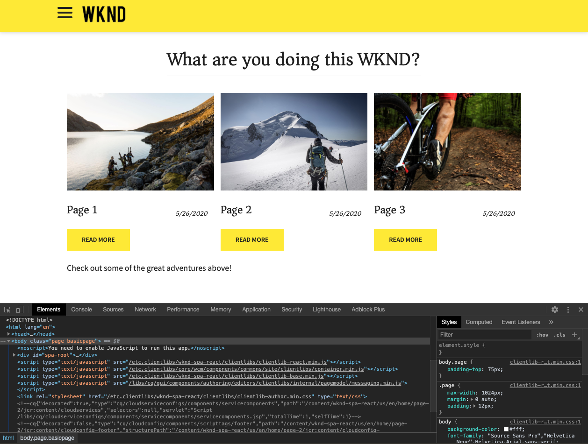

# SPA 簡介和逐步解說 {#spa-introduction}

單頁應用程式 (SPA) 可為網站使用者提供引人入勝的體驗。開發人員希望能使用 SPA 框架建立網站，而作者則想在 AEM 中為使用這類框架建立網站，順暢地編輯內容。

SPA 編輯器提供了一個全面的解決方案來支援在 AEM 中使用 SPA。本文章逐步解說如何使用基本 SPA 應用程式進行編寫，並說明它與基礎 AEM SPA 編輯器的關係。

{{ue-over-spa}}

## 簡介 {#introduction}

### 文章目標 {#article-objective}

本文章介紹 SPA 的基本概念，然後透過使用簡單 SPA 應用程式來示範基本的內容編輯，逐步引導讀者了解 SPA 編輯器。然後深入探討頁面的結構以及 SPA 應用程式如何與 AEM SPA 編輯器相關及互動。

此簡介和逐步解說的目的是向 AEM 開發人員示範 SPA 為何相關、其一般運作方式、AEM SPA 編輯器如何處理 SPA，以及它與標準 AEM 應用程式有何不同。

## 要求 {#requirements}

逐步解說是以標準 AEM 功能和範例 WKND SPA 專案應用程式為基礎。若要依此逐步解說操作，您必須具備以下項目。

* [AEMaaCS 最新開發 SDK](/help/release-notes/release-notes-cloud/release-notes-current.md)
   * 它應該作為本機開發環境。
   * 您必須擁有系統的管理員權限。
* [GitHub 提供的範例 WKND SPA 專案應用程式](https://github.com/adobe/aem-guides-wknd-spa)
   * 下載[最新版本的 React 應用程式](https://github.com/adobe/aem-guides-wknd-spa/releases)，名稱類似於 `wknd-spa-react.all-X.Y.Z-SNAPSHOT.zip`。
   * 下載[應用程式的最新範例影像](https://github.com/adobe/aem-guides-wknd-spa/releases)，名稱類似於 `wknd-spa-sample-images-X.Y.Z.zip`。
   * [使用封裝管理員](/help/implementing/developing/tools/package-manager.md)安裝這兩個套件，就像在 AEM 中安裝任何其他套件一樣。
   * 出於本逐步解說的目的，應用程式不需要使用 Maven 安裝。

>[!CAUTION]
>
>本文件使用 [WKND SPA 專案應用程式](https://github.com/adobe/aem-guides-wknd-spa)僅用於示範目的。請勿用於任何專案工作。

>[!TIP]
>
>任何 AEM 專案都應使用 [AEM 專案原型](https://experienceleague.adobe.com/docs/experience-manager-core-components/using/developing/archetype/overview.html?lang=zh-Hant)，它支援使用 React 或 Angular 的 SPA 專案並使用 SPA SDK。

### 什麼是 SPA？ {#what-is-a-spa}

單頁應用程式 (SPA) 與傳統頁面的不同之處在於它是在用戶端呈現並且主要由 JavaScript 驅動，依賴 Ajax 呼叫來載入資料和動態更新頁面。在單頁載入時一次擷取大部分或所有內容，並根據使用者與頁面的互動，視需要非同步載入其他資源。

這減少了頁面重新整理的需要，讓使用者擁有順暢、快速且像是使用原生應用程式的體驗。

AEM SPA 編輯器允許前端開發人員建立可整合到 AEM 網站的 SPA，從而允許內容作者輕鬆編輯 SPA 內容，像編輯任何其他 AEM 內容一樣輕鬆。

### 為什麼是 SPA？ {#why-a-spa}

由於 SPA 的運作本質，SPA 可以更流暢、快速且像是原生應用程式，不僅對網頁訪客而且對行銷人員和開發人員來說都是一種極具吸引力的體驗。

#### 訪客 {#visitors}

* 訪客在與內容互動時希望獲得類似原生的體驗。
* 有明確資料代表頁面生成越快，就越可能發生轉換。

#### 行銷人員 {#marketers}

* 行銷人員希望提供豐富的、類似原生的體驗，以吸引訪客與內容完全互動。
* 個人化可以使這些體驗更具吸引力。

#### 開發人員 {#developers}

* 開發人員希望清楚分開內容和展示之間的考量點。
* 清楚分開使系統更具可擴展性，並允許獨立的前端開發。

### SPA 如何運作？ {#how-does-a-spa-work}

SPA 背後的主要概念是減少對伺服器呼叫和依賴，以儘量減少伺服器延遲造成的作業耽擱，從而使 SPA 接近原生應用程式的回應能力。

在傳統的循序網頁中，僅載入即時頁面所需的資料。這表示當訪客移至另一個頁面時，將呼叫伺服器以取得額外資源。當訪客與頁面上的元素互動時，可能需要額外的呼叫。由於頁面必須趕上訪客的要求，因此這些多次呼叫可能會讓人產生延滯或延遲的感覺。

為了獲得更流暢的體驗，接近訪客對行動原生應用程式的期望，SPA 會在第一次載入時為訪客載入所有必要的資料。雖然這在開始時可能需要較長的時間，但之後就不需要額外呼叫伺服器。

透過在用戶端呈現，頁面元素回應更快，且訪客與頁面的互動是即時的。任何可能需要的額外資料會以非同步方式呼叫，以儘量提高頁面速度。

>[!TIP]
>
>如需 SPA 如何在 AEM 中運作的詳細技術資訊，請參閱文章：
>
>* [開始在 AEM 中使用 React 建立 SPA](getting-started-react.md)
>* [開始在 AEM 中使用 Angular 建立 SPA](getting-started-angular.md)
>
>如需詳細了解 SPA 編輯器的設計、架構和技術工作流程，請參閱文章：
>
>* [SPA 編輯器概觀](editor-overview.md)。

## SPA 的內容編輯體驗 {#content-editing-experience-with-spa}

當建置 SPA 以使用 AEM SPA 編輯器時，內容作者在編輯和建立內容時不會注意到任何差異。可以使用常用的 AEM 功能，作者的工作流程無需變更。

1. 在 AEM 編輯 WKND SPA 專案應用程式。

   `http://localhost:4502/editor.html/content/wknd-spa-react/us/en/home.html`

   

1. 選取文字元件，並注意工具列看起來像任何其他元件。選取&#x200B;**編輯**。

   

1. 在 AEM 中正常編輯內容，並注意變更已保留。

   

1. 使用資產瀏覽器將新影像拖放到影像元件中。

   

1. 變更已保留。

   

如同任何非 SPA AEM 應用程式，支援其他編寫工具，例如在頁面上拖放其他元件、重新排列元件和修改版面。

>[!NOTE]
>
>SPA 編輯器不會修改應用程式的 DOM。SPA 自行負責 DOM。
>
>若要了解其運作原理，請繼續閱讀本文的下一章節：[SPA 應用程式和 AEM SPA 編輯器](#spa-apps-and-the-aem-spa-editor)。

## SPA 應用程式和 AEM SPA 編輯器 {#spa-apps-and-the-aem-spa-editor}

體驗SPA如何為使用者運作，然後檢查SPA頁面，有助於更清楚瞭解SAP應用程式如何在AEM中搭配SPA Editor運作。

### 使用 SPA 應用程式 {#using-an-spa-application}

1. 將 WKND SPA 專案應用程式載入到發佈伺服器，或使用頁面編輯器&#x200B;**頁面資訊**&#x200B;選單的&#x200B;**如發佈時檢視**&#x200B;選項。

   `http://<host>:<port>/content/wknd-spa-react/us/en/home.html`

   

   請注意頁面結構，包括導覽到子頁面、選單和文章卡片。

1. 使用選單導覽到子頁面，可以看到頁面立即載入，無需重新整理。

   

1. 開啟瀏覽器內建的開發人員工具，並在您瀏覽子頁面時監控網路活動。

   

   當您在應用程式中從一個頁面移動到另一個頁面時，流量非常小。該頁面不會重新載入，只會要求新影像。

   SPA 完全在用戶端管理內容和路由。

那麼如果在子頁面間瀏覽時頁面沒有重新載入，它是如何載入？

下一章節[載入 SPA 應用程式](#loading-a-spa-application)，將深入探討 SPA 載入機制，以及如何以同步和非同步方式載入內容。

### 載入 SPA 應用程式 {#loading-a-spa-application}

1. 如果尚未載入，請將 WKND SPA 專案應用程式載入至發佈伺服器，或使用頁面編輯器&#x200B;**頁面資訊**&#x200B;選單的&#x200B;**如發佈時檢視**&#x200B;選項。

   `http://<host>:<port>/content/wknd-spa-react/us/en/home.html`

   

1. 使用瀏覽器的內建工具檢視頁面的來源。
1. 來源的內容有限。
   * 頁面的內文中沒有任何內容。它主要由樣式表和對各種指令碼 (例如 `clientlib-react.min.js`) 的呼叫所組成。
   * 這些指令碼是此應用程式的主要驅動程式，負責呈現所有內容。

1. 使用瀏覽器的內建工具檢查頁面。查看完全載入之 DOM 的內容。

   

1. 切換到檢查器中的「網路」索引標籤並重新載入頁面。

   忽略影像要求，注意為頁面載入的主要資源是頁面本身、CSS、React JavaScript、其相依性，以及頁面的 JSON 資料。

   

1. 在新索引標籤中載入 `home.model.json`。

   `http://<host>:<port>/content/wknd-spa-react/us/en/home.model.json`

   

   AEM SPA 編輯器使用 [AEM 內容服務](/help/sites-cloud/administering/content-fragments/overview.md#content-fragments-and-content-services)將頁面的全部內容以 JSON 模型傳遞。

   透過實作特定的介面，Sling 模型為 SPA 提供必要的資訊。JSON 資料的傳遞工作向下委派給每個元件 (從頁面到段落到元件等)。

   每個元件選擇它公開的內容以及呈現方式 (伺服器端使用 HTL 或用戶端使用 React 或 Angular)。本文章重點介紹使用 React 進行用戶端呈現。

1. 此模型還可以將頁面群組在一起，以便同步載入，從而減少所需的頁面重新載入次數。

   在 WKND SPA 專案應用程式範例中，`home`、`page-1`、`page-2` 和 `page-3` 頁面是同步載入的，因為訪客通常會造訪所有這些頁面。

   此行為不是強制性的，而且完全可定義的。

   

1. 若要檢視此行為差異，請重新載入 `home` 頁面並清除檢查器的網路活動。導覽到頁面選單中的 `page-1`，可以看到唯一的網路活動是要求 `page-1` 的影像。`page-1` 本身不需要載入。

   

### 與 SPA 編輯器的互動 {#interaction-with-the-spa-editor}

使用範例WKND SPA Project應用程式，可清楚瞭解應用程式在發佈時的行為和載入方式，使用內容服務進行JSON內容傳送和非同步載入資源。

此外，對於內容作者，使用SPA編輯器在AEM中無縫建立內容。

在下一章節中，我們將探討允許 SPA 編輯器將 SPA 元件與 AEM 元件相關聯並實現此無縫編輯體驗的合約。

1. 在編輯器中載入 WKND SPA 專案應用程式，並切換到&#x200B;**預覽**&#x200B;模式。

   `http://<host>:<port>/editor.html/content/wknd-spa-react/us/en/home.html`

1. 使用瀏覽器的內建開發人員工具，檢查頁面的內容。使用選取工具，在頁面上選取一個可編輯的元件並查看元素詳細資料。

   元件有新的資料屬性`data-cq-data-path`。

   

   例如

   `data-cq-data-path="/content/wknd-spa-react/us/en/home/jcr:content/root/responsivegrid/text`

   此路徑允許擷取和關聯每個元件的編輯情境設定物件。

   這是編輯器將其識別為 SPA 中的可編輯元件所需的唯一標記屬性。根據此屬性，SPA編輯器將決定與元件相關聯的可編輯設定，以便載入正確的框架、工具列等。

   也會新增一些特定類別名稱，用於標記預留位置和資產拖放功能。

   >[!NOTE]
   >
   >此行為不同於 AEM 中伺服器端呈現的頁面，其中為每個可編輯元件插入 `cq` 元素。
   >
   >使用 SPA 編輯器的這種方法，就不需要插入自訂元素，僅依賴於一個額外的資料屬性，使前端開發人員可輕鬆進行標記。

## AEM Headful 和 Headless 技術 {#headful-headless}

可以透過 AEM 內靈活的整合層級啟用 SPA，包括在 AEM 外部開發和維護的 SPA。此外，SPA可用於AEM，也可使用AEM將內容無頭傳送至其他端點。

>[!TIP]
>
>如需詳細資訊，請參閱 [AEM Headful 和 Headless 技術](/help/implementing/developing/headful-headless.md)文件。

## 後續步驟 {#next-steps}

現在您已經了解 AEM 中的 SPA 編輯體驗，以及 SPA 與 SPA 編輯器的關係，接下來要更深入地了解如何建立 SPA。

* [開始在 AEM 中使用 React 建立 SPA](getting-started-react.md)展示如何在 AEM 中使用 React 建立基本 SPA 以與 SPA 編輯器搭配運作
* [開始在 AEM 中使用 Angular 建立 SPA](getting-started-angular.md)展示如何在 AEM 中使用 Angular 建立基本 SPA 以與 SPA 編輯器搭配運作
* [SPA 編輯器概觀](editor-overview.md)更深入地介紹 AEM 和 SPA 之間的通訊模型。
* [為 AEM 開發 SPA](developing.md) 介紹如何讓前端開發人員為 AEM 開發 SPA，以及 SPA 如何與 AEM 架構互動。
