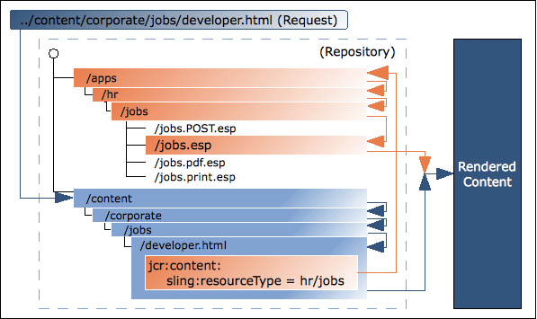

# AEM 技術基礎 {#aem-technical-foundations}

AEM是建構在經驗證、可擴充且彈性技術上的強大平台。 本檔案提供構成AEM的各種部分的詳細概述，旨在作為完整棧疊AEM開發人員的技術附錄。 本指南並非旨在作為快速入門手冊。 如果您不熟悉AEM開發，請參閱 [開發AEM Sites快速入門 — WKND教學課程](develop-wknd-tutorial.md) 作為第一步。

>[!TIP]
>
>在深入探討AEM的核心技術之前，Adobe建議完成 [開發AEM Sites快速入門 — WKND教學課程。](develop-wknd-tutorial.md)

## 基礎知識 {#fundamentals}

作為現代的內容管理系統，AEM仰賴標準的網頁技術：

* request-response (XMLHttpRequest / XMLHttpResponse)週期
* HTML
* CSS
* JavaScript

基礎內容存放庫和業務邏輯層是圍繞Java技術建立的：

* JCR
* Sling
* osgi

## Java內容存放庫 {#java-content-repository}

Java Content Repository (JCR)標準、 [JSR 283](https://www.adobe.io/experience-manager/reference-materials/spec/jcr/2.0/index.html)，會指定獨立於廠商和實作的方式，在內容存放庫內的精細層級上雙向存取內容。 規格領先者為Adobe Research （瑞士） AG。

此 [JCR API 2.0](https://www.adobe.io/experience-manager/reference-materials/spec/javax.jcr/javadocs/jcr-2.0/index.html) 封裝， `javax.jcr.*` 用於直接存取及操控存放庫內容。

AEM是以JCR為基礎。

## Apache Jackrabbit Oak {#jackrabbit-oak}

[Apache Jackrabbit Oak](https://jackrabbit.apache.org/oak/) 是可擴充且高效能的階層式內容存放庫實作，以作為現代世界級網站和其他要求嚴格的內容應用程式的基礎，並符合JCR標準。

Jackrabbit Oak （也簡稱為Oak）是實施JCR標準，AEM就是依據此標準建置的。

## Sling請求處理 {#sling-request-processing}

AEM建置方式 [Sling](https://sling.apache.org/site/index.html)，此網頁應用程式架構以REST原則為基礎，可輕鬆開發內容導向的應用程式。 Sling使用JCR存放庫（例如Apache Jackrabbit Oak）作為其資料存放區。 Sling已對Apache Software Foundation有所貢獻 — 如需進一步資訊，請參閱Apache 。

### Sling簡介 {#introduction-to-sling}

使用Sling時，要呈現的內容型別不是第一個處理考量。 主要考量是URL是否解析為內容物件，然後可以找到指令碼以執行轉譯。 這為網頁內容作者提供絕佳支援，協助他們建立可輕鬆根據需求自訂的頁面。

在包含各種不同內容元素的應用程式中，或是在您需要可輕鬆自訂的頁面時，此彈性優勢顯而易見。 特別是實作AEM之類的網頁內容管理系統時。

另請參閱 [在15分鐘內探索Sling](https://sling.apache.org/documentation/getting-started/discover-sling-in-15-minutes.html) 開始使用Sling進行開發的步驟。

下圖說明Sling指令碼解析：它說明如何從HTTP請求取得內容節點、從內容節點取得資源型別、從資源型別取得指令碼，以及有哪些指令碼變數可用。


下圖說明所有隱藏但功能強大的要求引數，以供您用於處理 `SlingPostServlet`，此元件為所有POST要求的預設處理常式，提供您建立、修改、刪除、複製和移動存放庫中節點的無限選項。


### Sling以內容為中心 {#sling-is-content-centric}

Sling是 *以內容為中心*. 這表示處理著重於內容，因為每個(HTTP)請求都會對應到JCR資源（存放庫節點）形式的內容：

* 第一個目標是儲存內容的資源（JCR節點）
* 其次，表示或指令碼會與請求的某些部分（例如，選取器和/或擴充功能）結合，從資源屬性中找到

### RESTful Sling {#restful-sling}

由於其以內容為中心的理念，Sling實作了REST導向的伺服器，因此在Web應用程式架構中有了新概念。 優點包括：

* 非常RESTful，而不只是在曲面上；資源和表示在伺服器內正確建模
* 移除一或多個資料模型
   * 其他內容管理架構可能需要URL結構、業務物件、DB結構描述才能存取資源。
   * 使用Sling時，這會縮減為： URL =資源= JCR結構

### URL分解 {#url-decomposition}

在Sling中，處理是由使用者請求的URL驅動。 這會定義適當的指令碼要顯示的內容。 為此，會從URL擷取資訊。

如果我們分析下列URL：

```text
https://myhost/tools/spy.printable.a4.html/a/b?x=12
```

我們可以將其細分為複合零件：

| 通訊協定 | 主機 |  | 內容路徑 | 選擇器 | 擴充功能 |  | 字尾 |  | 引數 |
|---|---|---|---|---|---|---|---|---|---|
| `https://` | `myhost` | `/` | `tools/spy` | `.printable.a4.` | `html` | `/` | `a/b` | `?` | `x=12` |

* **通訊協定** - HTTPS
* **主機**  — 網站的網域
* **內容路徑**  — 指定要轉譯的內容並與副檔名結合使用的路徑；在此範例中，它們會轉譯為 `tools/spy.html`
* **選擇器**  — 用於轉譯內容的替代方法；在此範例中為A4格式的印表機易記版本
* **擴充功能**  — 內容格式；也會指定要用於轉譯的指令碼
* **字尾**  — 可用於指定其他資訊
* **引數**  — 動態內容所需的任何引數

#### 從URL到內容和指令碼 {#from-url-to-content-and-scripts}

使用URL分解原則：

* 對應會使用從請求中擷取的內容路徑來尋找資源。
* 找到適當的資源時，就會擷取sling資源型別，並用來找出要用於轉譯內容的指令碼。

下圖說明了所使用的機制，將在以下各節中更詳細地討論。



使用Sling時，您可以指定哪個指令碼會轉譯特定實體(透過設定 `sling:resourceType` 屬性)。 此機制提供的自由度比指令碼存取資料實體的自由度更大（PHP指令碼中的SQL陳述式就是如此），因為資源可以有多個轉譯。

#### 將請求對應至資源 {#mapping-requests-to-resources}

系統會劃分請求，並擷取必要資訊。 系統會搜尋存放庫中的請求資源（內容節點）：

* 第一個Sling會檢查請求中指定的位置是否存在節點；例如， `../content/corporate/jobs/developer.html`
* 如果找不到任何節點，則會捨棄擴充功能並重複搜尋；例如， `../content/corporate/jobs/developer`
* 如果找不到任何節點，則Sling將傳回http代碼404 （找不到）。

Sling也可讓JCR節點以外的專案成為資源，但這是進階功能。

### 找到指令碼 {#locating-the-script}

找到適當的資源（內容節點）時， **sling資源型別** 「 」已擷取。 這是路徑，可找出要用於轉譯內容的指令碼。

指定的路徑 `sling:resourceType` 可以是：

* 絕對
* 相對於設定引數

>[!TIP]
>
>由於相對路徑會增加可移植性，因此Adobe會建議使用相對路徑。

所有Sling指令碼都儲存在下列任一專案的子資料夾中： `/apps` （可變，使用者指令碼）或 `/libs` （不可變，系統指令碼），將依此順序搜尋。

其他需要注意的要點包括：

* 當需要方法(GET、POST)時，會根據HTTP規格以大寫指定，例如 `jobs.POST.esp`
* 支援各種指令碼引擎，但常見的建議指令碼是HTL和JavaScript。

Felix管理主控台會列出指定AEM執行個體支援的指令碼引擎清單( `http://<host>:<port>/system/console/slingscripting`)。

使用上一個範例，如果 `sling:resourceType` 是 `hr/jobs` 然後針對：

* 以「 」結尾的GET/HEAD請求和URL `.html` （預設請求型別、預設格式）
   * 指令碼會是 `/apps/hr/jobs/jobs.esp`；的最後一個區段 `sling:resourceType` 形成檔案名稱。
* POST請求(除GET/HEAD以外的所有請求型別，方法名稱必須為大寫)
   * 指令碼名稱中將使用POST。
   * 指令碼會是 `/apps/hr/jobs/jobs.POST.esp`.
* 其他格式的URL，結尾不是 `.html`
   * 例如 `../content/corporate/jobs/developer.pdf`
   * 指令碼會是 `/apps/hr/jobs/jobs.pdf.esp`；字尾會新增至指令碼名稱。
* 具有選取器的URL
   * 選取器可用來以替代格式顯示相同的內容。 例如，適合印表機的版本、RSS摘要或摘要。
   * 如果檢視印表機易記版本，選擇器可能是 `print`；如在 `../content/corporate/jobs/developer.print.html`
   * 指令碼會是 `/apps/hr/jobs/jobs.print.esp`；選取器會新增至指令碼名稱。
* 若否 `sling:resourceType` 已定義，則：
   * 內容路徑將用於搜尋適當的指令碼(如果路徑以 `ResourceTypeProvider` （非作用中）。
   * 例如，的指令碼 `../content/corporate/jobs/developer.html` 會在下列位置產生搜尋： `/apps/content/corporate/jobs/`.
   * 將使用主要節點型別。
* 如果完全找不到指令碼，則會使用預設指令碼。
   * 目前支援以純文字格式呈現預設轉譯(`.txt`)，HTML(`.html`)和JSON (`.json`)，所有引數都會列出節點的屬性（格式適當）。 擴充功能的預設轉譯 `.res`（或沒有請求擴充功能的請求）會多工緩衝資源（可能的話）。
* 若為http錯誤處理（程式碼403或404），Sling會在以下其中一個位置尋找指令碼：
   * 位置 `/apps/sling/servlet/errorhandler` 用於自訂指令碼
   * 或標準指令碼的位置 `/libs/sling/servlet/errorhandler/404.jsp`

如果特定請求套用多個指令碼，則會選取最符合的指令碼。 相符專案越具體，越好；換言之，相符的選擇器越多，相符效果越好，無論是否有任何相符的要求副檔名或方法名稱。

例如，考慮存取資源的請求

* `/content/corporate/jobs/developer.print.a4.html`

型別

* `sling:resourceType="hr/jobs"`

假設我們在正確位置有下列指令碼清單：

1. `GET.esp`
1. `jobs.esp`
1. `html.esp`
1. `print.esp`
1. `print.html.esp`
1. `print/a4.esp`
1. `print/a4/html.esp`
1. `print/a4.html.esp`

偏好設定順序為(8) - (7) - (6) - (5) - (4) - (3) - (2) - (1)。

除了資源型別(主要由 `sling:resourceType` 屬性)還有資源超級型別。 這通常表示為 `sling:resourceSuperType` 屬性。 嘗試尋找指令碼時，也會考慮這些超級型別。 資源超級型別的優點在於，它們可以在預設資源型別處形成資源的階層 `sling/servlet/default` （用於預設servlet）實際上是根。

資源的資源超級型別可透過兩種方式定義：

* 依據 `sling:resourceSuperType` 資源的屬性。
* 依據 `sling:resourceSuperType` 節點的屬性，該節點的 `sling:resourceType` 點。

例如：

* `/`
   * `a`
   * `b`
      * `sling:resourceSuperType = a`
   * `c`
      * `sling:resourceSuperType = b`
   * `x`
      * `sling:resourceType = c`
   * `y`
      * `sling:resourceType = c`
      * `sling:resourceSuperType = a`

型別階層：

* `/x`
   * 是 `[ c, b, a, <default>]`
* 當用於 `/y`
   * 階層為 `[ c, a, <default>]`

這是因為 `/y` 具有 `sling:resourceSuperType` 屬性，而 `/x` 不會，因此其超型別會取自其資源型別。

#### 無法直接呼叫Sling指令碼 {#sling-scripts-cannot-be-called-directly}

在Sling中，無法直接呼叫指令碼，因為這會破壞REST伺服器的嚴格概念；您可以混合資源和表示法。

如果您直接呼叫表示法（指令碼），會在指令碼內隱藏資源，讓框架(Sling)不知道該資源。 因此，您會遺失某些功能：

* 自動處理GET以外的http方法，包括：
   * 以sling預設實作處理的POST、PUT、DELETE
   * 此 `POST.jsp` 指令碼在您的 `sling:resourceType` 位置
* 您的程式碼架構不再像過去一樣乾淨和結構清晰；這對於大規模開發至關重要

### Sling API {#sling-api}

這會使用Sling API套件， `org.apache.sling.*`和標籤程式庫。

### 使用sling：include參照現有元素 {#referencing-existing-elements-using-sling-include}

最後考量是需要參考指令碼中的現有元素。

更複雜的指令碼（彙總指令碼）可能需要存取多個資源（例如導覽、側欄、頁尾、清單元素），並加入 *資源*.

若要這麼做，您可以使用 `sling:include("/<path>/<resource>")` 命令。 這會有效地包含參考資源的定義。

## osgi {#osgi}

OSGi (Open Services Gateway Initiative)定義了用於開發和部署模組化應用程式和程式庫（也稱為Java動態模組系統）的架構。 OSGi容器可讓您將應用程式分成個別模組（是含有其他中繼資訊的jar檔案，在OSGi術語中稱為套裝），並透過以下方式管理它們之間的交叉相依性：

* 在容器中實作的服務
* 容器與應用程式之間的合約

這些服務與合約提供的架構，可讓個別元素動態地互相探索，以便共同作業。

接著OSGi架構會提供這些套裝的動態載入/解除安裝、設定和控制，而不需要重新啟動。

>[!NOTE]
>
>有關OSGi技術的完整資訊，請參閱 [OSGi網站](https://www.osgi.org).
>
>特別值得一提的是，他們的「基礎教育」頁面包含一系列簡報和教學課程。

此架構可讓您使用應用程式特定模組來擴充Sling。 Sling和AEM使用 [Apache Felix](https://felix.apache.org/) OSGi實作。 兩者都是在OSGi架構中執行的OSGi套件組合集合。

這可讓您對安裝內的任何套件執行下列動作：

* 安裝
* 啟動
* 停止
* 更新
* 解除安裝
* 檢視目前狀態
* 存取有關特定套裝的更詳細資訊（例如，符號名稱、版本、位置等）

另請參閱 [為AEMas a Cloud Service設定OSGi](/help/implementing/deploying/configuring-osgi.md) 以取得詳細資訊。

## 存放庫內的結構 {#structure-within-the-repository}

下列清單提供您在存放庫中看到的結構概覽。

* `/apps`  — 與應用程式相關；包含您網站專用的元件定義。 您開發的元件可以依據以下位置提供的現成可用元件： `/libs/core/wcm/components`.
* `/content`  — 為您的網站建立的內容。
* `/etc`
* `/home`  — 使用者和群組資訊。
* `/libs` - AEM核心的程式庫和定義。 中的子資料夾 `/libs` 代表現成可用的AEM功能。 中的內容 `/libs` 不可修改。 您網站的特定功能應建立在 `/apps`.
* `/tmp`  — 臨時工作區。
* `/var`  — 系統變更和更新的檔案；例如稽核記錄、統計資料、事件處理。

>[!CAUTION]
>
>變更此結構或其中的檔案時，應謹慎進行。 請確定您完全瞭解所做任何變更的影響。
>
>您不得變更 `/libs` 路徑。 針對設定和其他變更，複製專案來源 `/libs` 至 `/apps` 並在中進行任何變更 `/apps`.
