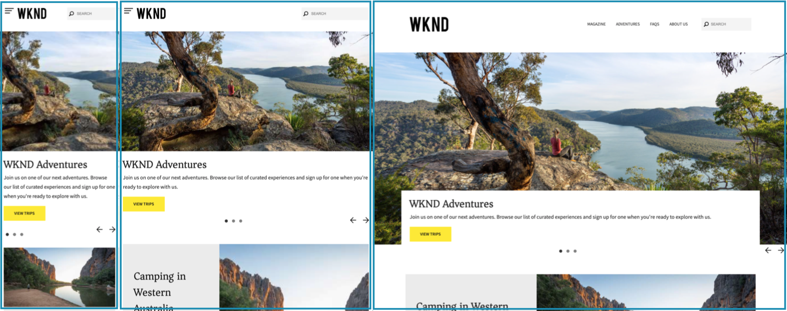

# 回應式設計 {#responsive-design}

透過回應式設計，相同的體驗能夠有效地以多個方向顯示在多個裝置上。

>[!TIP]
>
>本檔案概述適用於開發人員的回應式設計，以及如何在AEM中實現功能。 其他資源可供使用：
>
>* 對於內容作者，檔案[回應式佈局](/help/sites-cloud/authoring/page-editor/responsive-layout.md)中提供了如何在內容頁面上使用回應式設計功能的詳細資訊。
>* 對於網站管理員，在[設定配置容器和配置模式檔案中會說明如何設定網站的配置容器的詳細資訊。](/help/sites-cloud/administering/responsive-layout.md)

## 概觀 {#overview}

設計您的體驗，使其適應顯示它們的使用者端檢視區。 透過回應式設計，相同的頁面可以有效的在兩個方向的多個裝置上顯示。 下圖示範頁面回應檢視區大小變更的一些方式：

* 配置：對較小的檢視區使用單欄配置，對較大的檢視區使用多欄配置。
* 文字大小：在較大的檢視區中使用較大的文字大小（如標題）。
* 內容：在較小裝置上顯示時，僅包含最重要的內容。
* 導覽：裝置專用的工具可供存取其他頁面。
* 影像：根據視窗尺寸提供適合使用者端檢視區的影像轉譯。



開發可產生HTML5且能適應多種視窗大小和方向的Adobe Experience Manager (AEM)應用程式。 例如，下列檢視區寬度範圍會與各種裝置型別和方向相對應

* 最大寬度480畫素（手機、直向）
* 最大寬度767畫素（手機、橫向）
* 介於768畫素和979畫素之間的寬度（平板電腦，縱向）
* 介於980畫素和1199畫素之間的寬度（平板電腦，橫向）
* 寬度1200px或更高（桌上型電腦）

請參閱下列主題，以取得關於實作回應式設計行為的資訊：

* [媒體查詢](#using-media-queries)
* [流動格線](#developing-a-fluid-grid)
* [最適化影像](#using-adaptive-images)

在設計時，請使用&#x200B;**模擬器**&#x200B;工具列來預覽您各種熒幕大小的頁面。

## 開發之前 {#before-you-develop}

在開發支援網頁的AEM應用程式之前，您應該先做出數個設計決策。 例如，您需要具備下列資訊：

* 您正在定位的裝置
* 目標檢視區大小
* 每個目標檢視區大小的頁面配置

### 應用程式結構 {#application-structure}

典型的AEM應用程式結構支援所有回應式設計實施：

* 頁面元件位於`/apps/<application_name>/components`下方
* 範本位於`/apps/<application_name>/templates`之下

## 使用媒體查詢 {#using-media-queries}

媒體查詢可讓您在頁面轉譯時選擇性使用CSS樣式。 AEM開發工具和功能可讓您在應用程式中有效率地實作媒體查詢。

W3C群組提供說明此CSS3功能與語法的[媒體查詢](https://www.w3.org/TR/css3-mediaqueries/)建議。

### 建立CSS檔案 {#creating-the-css-file}

在CSS檔案中，根據您鎖定目標的裝置屬性定義媒體查詢。 下列實作策略可有效管理每個媒體查詢的樣式：

* 使用[Client Library資料夾](clientlibs.md)來定義轉譯頁面時組合的CSS。
* 在不同的CSS檔案中定義每個媒體查詢和相關樣式。 使用代表媒體查詢之裝置功能的檔案名稱會很有用。
* 定義個別CSS檔案中所有裝置通用的樣式。
* 在Client Library資料夾的css.txt檔案中，依組合的CSS檔案的必要順序排列CSS檔案。

[WKND教學課程](develop-wknd-tutorial.md)使用此策略來定義網站設計中的樣式。 WKND使用的CSS檔案位於`/apps/wknd/clientlibs/clientlib-grid/less/grid.less`。

### 搭配AEM頁面使用媒體查詢 {#using-media-queries-with-aem-pages}

[WKND範例專案](/help/implementing/developing/introduction/develop-wknd-tutorial.md)和[AEM專案原型](https://experienceleague.adobe.com/docs/experience-manager-core-components/using/developing/archetype/overview.html)使用[頁面核心元件](https://experienceleague.adobe.com/docs/experience-manager-core-components/using/wcm-components/page.html)，其中包含透過頁面原則的clientlibs。

如果您自己的頁面元件並非以頁面核心元件為基礎，您也可以將使用者端程式庫資料夾包含在其的HTL或JSP指令碼中。 這麼做將產生並參照CSS檔案，其中包含回應式格線運作所需的媒體查詢。

#### HTL {#htl}

```html
<sly data-sly-use.clientlib="${'/libs/granite/sightly/templates/clientlib.html'}">
<sly data-sly-call="${clientlib.all @ categories='apps.weretail.all'}"/>
```

#### JSP {#jsp}

```xml
<ui:includeClientLib categories="apps.weretail.all"/>
```

JSP指令碼會產生下列HTML程式碼，這些程式碼會參考樣式表：

```xml
<link rel="stylesheet" href="/etc/designs/weretail/clientlibs-all.css" type="text/css">
<link href="/etc/designs/weretail.css" rel="stylesheet" type="text/css">
```

## 預覽特定裝置 {#previewing-for-specific-devices}

模擬器可讓您預覽不同檢視區大小的頁面，以便測試回應式設計的行為。 在Sites主控台中編輯頁面時，您可以點選或按一下&#x200B;**模擬器**&#x200B;圖示以顯示模擬器。


在模擬器工具列中，您可以點選或按一下&#x200B;**裝置**&#x200B;圖示，以顯示下拉式功能表，讓您在其中選取裝置。 選取裝置時，頁面會隨著檢視區大小而改變。


### 指定裝置群組 {#specifying-device-groups}

若要指定出現在&#x200B;**裝置**&#x200B;清單中的裝置群組，請新增`cq:deviceGroups`屬性至您網站範本頁面的`jcr:content`節點。 屬性的值是裝置群組節點的路徑陣列。

例如，WKND網站的範本頁面為`/conf/wknd/settings/wcm/template-types/empty-page/structure`。 其下方的`jcr:content`節點包含下列屬性：

* 名稱：`cq:deviceGroups`
* 類型：`String[]`
* 值： `mobile/groups/responsive`

裝置群組節點位於`/etc/mobile/groups`資料夾中。

## 回應式影像 {#responsive-images}

回應式頁面會動態調整以適合其轉譯的裝置，為使用者提供更好的體驗。 不過，將資產最佳化成中斷點和裝置以縮短頁面載入時間也是很重要的一點。

[核心元件影像元件](https://experienceleague.adobe.com/docs/experience-manager-core-components/using/wcm-components/image.html)具備最適化影像選取範圍等功能。

* 依預設，影像元件會使用[最適化影像Servlet](https://experienceleague.adobe.com/docs/experience-manager-core-components/using/developing/adaptive-image-servlet.html)來提供適當的轉譯。
* [網頁最佳化的影像傳送](https://experienceleague.adobe.com/docs/experience-manager-core-components/using/developing/web-optimized-image-delivery.html?lang=zh-Hant)也可透過其原則中的簡單核取方塊取得，該核取方塊會以WebP格式從DAM傳送影像資產，平均可將影像的下載大小減少約25%。

## 配置容器 {#layout-container}

AEM的「版面容器」可讓您有效率且有效地實作回應式版面，以根據使用者端檢視區調整頁面尺寸。

>[回應式格線的GitHub檔案](https://adobe-marketing-cloud.github.io/aem-responsivegrid/)可供前端開發人員參考，讓他們能夠在AEM之外使用AEM格線，例如為未來的AEM網站建立靜態HTML模型時。

>[!TIP]
>
>請參閱檔案[設定配置容器和配置模式](/help/sites-cloud/administering/responsive-layout.md)，以取得配置容器如何運作以及如何啟用內容的回應式配置的詳細資訊。

## 巢狀回應式格點 {#nested-responsive-grids}

在某些情況下，您可能會發現有必要巢狀內嵌回應式格線以支援專案的需求。 不過請記住，Adobe建議的最佳實務是儘可能保持平坦的結構。

當您無法避免使用巢狀回應式格點時，請確定：

* 所有容器（容器、標籤、摺疊式功能表等）都有屬性`layout = responsiveGrid`。
* 請勿在容器階層中混合屬性`layout = simple`。

這包括頁面範本中的所有結構容器。

內部容器的欄位編號絕不可大於外部容器的欄位編號。 下列範例符合此條件。 雖然在預設的（案頭）畫面中，外部容器的欄位編號為8，但內部容器的欄位編號為4。

>[!BEGINTABS]

>[!TAB 範例節點結構]

```text
container
  @layout = responsiveGrid
  cq:responsive
    default
      @offset = 0
      @width = 8
  container
  @layout = responsiveGrid
    cq:responsive
      default
        @offset = 0
        @width = 4
    text
      @text =" Text Column 1"
```

>[!TAB 產生的HTML範例]

```html
<div class="container responsivegrid aem-GridColumn--default--none aem-GridColumn aem-GridColumn--default--8 aem-GridColumn--offset--default--0">
  <div id="container-c9955c233c" class="cmp-container">
    <div class="aem-Grid aem-Grid--8 aem-Grid--default--8 ">
      <div class="container responsivegrid aem-GridColumn--default--none aem-GridColumn aem-GridColumn--offset--default--0 aem-GridColumn--default--4">
        <div id="container-8414e95866" class="cmp-container">
          <div class="aem-Grid aem-Grid--4 aem-Grid--default--4 ">
            <div class="text aem-GridColumn aem-GridColumn--default--4">
              <div data-cmp-data-layer="..." id="text-1234567890" class="cmp-text">
                <p>Text Column 1</p>
              </div>
            </div>
          </div>
        </div>
      </div>
    </div>
  </div>
</div>
```

>[!ENDTABS]
