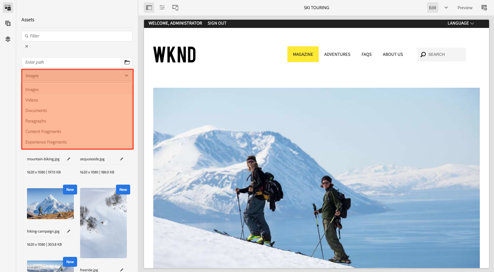

# UI的結AEM構 {#structure-of-the-aem-ui}

UIAEM有幾個基本原則，由幾個關鍵元素組成：

## 控制台 {#consoles}

### 基本佈局和調整大小 {#basic-layout-and-resizing}

UI既適用於移動設備，也適用於台式機設備，但不是建立兩種樣式，而AEM是使用一種適用於所有螢幕和設備的樣式。

所有模組使用相同的基本佈局，AEM在這裡可以看作：

佈局遵循響應性設計樣式，並會根據您所使用的設備/窗口的大小來調整自身。

例如，當解析度低於1024px（如在移動設備上）時，將相應地調整顯示器：

### 標題列 {#header-bar}

標題欄顯示全局元素，包括：

* 您當前使用的徽標和特定產品/解決方案；也AEM會形成到全局導航的連結
* 搜尋
* 用於訪問幫助資源的表徵圖
* 用於訪問其他解決方案的表徵圖
* 等待您的任何警報或收件箱項的指示器（和訪問權限）
* 用戶表徵圖，以及指向您的配置檔案管理的連結

### 工具列 {#toolbar}

工具欄與您的位置和曲面工具上下文相關，這些工具與控制下面頁面中的視圖或資產相關。 工具欄是特定於產品的，但是這些元素有一些通用性。

在任何位置，工具欄都顯示當前可用的操作：

還取決於當前是否選擇了資源：

### 左側邊欄 {#left-rail}

左滑軌可根據需要開啟/隱藏，以顯示：

* **僅限內容**
* **內容樹**
* **時間軸**
* **引用**
* **篩選**

預設值為 **僅內容** （隱藏欄）。

## 頁面創作 {#page-authoring}

創作頁面時，結構區域如下所示。

### 內容框架 {#content-frame}

在內容框架中呈現頁面內容。 內容框架完全獨立於編輯器 — 以確保不會因CSS或javascript而發生衝突。

內容框架位於窗口的右側部分，位於工具欄下。

### 編輯器框架 {#editor-frame}

編輯器框架啟用編輯功能。

編輯器框架是所有頁面創作元素的容器（抽象）。 它位於內容框架的頂部，包括：

* 頂部工具欄
* 側面板
* 所有的疊加
* 任何其他頁面創作元素；例如，元件工具欄

### 側面板 {#side-panel}

這包含三個預設頁籤。 的 **資產** 和 **元件** 頁籤允許您選擇這些元素，並將它們從面板中拖動，然後將它們放到頁面上。 的 **內容樹** 頁籤，用於檢查頁面上的內容層次結構。

預設情況下，側面板是隱藏的。 選中後，將顯示在左側，或當窗口大小低於1024像素時，將滑過以覆蓋整個窗口；例如，在移動設備上。

### 側面板 — 資產 {#side-panel-assets}

在「資產」標籤中，您可以從資產範圍中進行選擇。 您還可以篩選特定術語或選擇組。

### 側面板 — 資產組 {#side-panel-asset-groups}

在「資產」標籤中，您可以使用一個下拉清單來選擇特定資產組。

### 側面板 — 元件 {#side-panel-components}

在「元件」(Components)頁籤中，可以從元件範圍中進行選擇。 您還可以篩選特定術語或選擇組。

### 側面板 — 內容樹 {#side-panel-content-tree}

在「內容樹」頁籤中，可以查看頁面上內容的層次結構。 按一下頁籤中的條目會跳轉到編輯器中頁面上的項目，並選擇該項目。

### 覆蓋 {#overlays}

這些內容覆蓋內容框架，並由 [層](#layer) 瞭解如何與元件及其內容進行交互（完全透明）的機制。

疊加將在編輯器框架中（與所有其它頁面創作元素一起），儘管它們實際上會疊加內容框架中的相應元件。

### 層 {#layer}

層是可以激活的獨立功能組，用於：

* 提供頁面的其他視圖
* 允許您操作和/或與頁面交互

這些層為整個頁面提供了複雜的功能，而不是對單個元件執行特定操作。

AEM具有已實現的頁面創作層；例如，編輯、預覽和注釋層。

>[!NOTE]
>
>圖層是一個功能強大的概念，它影響用戶對頁面內容的視圖以及與頁面內容的交互。 在開發您自己的層時，需要確保層在退出時進行清理。

### 層切換器 {#layer-switcher}

層切換器允許您選擇要使用的層。 關閉時，它表示當前正在使用的層。

層切換器可作為工具欄（位於窗口頂部，在編輯器框架內）的下拉菜單。

### 元件工具欄 {#component-toolbar}

按一下元件的每個實例將顯示其工具欄（一次或按兩下慢）。 工具欄包含頁面上元件實例可用的特定操作（如複製、貼上、開啟編輯器）。

根據可用空間的不同，元件工具欄位於相應元件的右上角或右下角。

## 更多資訊 {#further-information}

<!--For more details about the concepts around the touch-enabled UI, continue to the article [Concepts of the AEM Touch-Enabled UI](/help/sites-developing/touch-ui-concepts.md).-->

有關更多技術資訊，請參閱 [JS文檔集](https://helpx.adobe.com/experience-manager/6-5/sites/developing/using/reference-materials/jsdoc/ui-touch/editor-core/index.html) 的子菜單。
