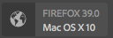

# ContextHub UI模組型別範例 {#sample-contexthub-ui-module-types}

ContextHub提供數個範例UI模組，供您在解決方案中使用。 下列資訊已提供：

* UI模組的主要功能。
* 在何處尋找原始程式碼，以方便您開啟它以供學習。
* 如何設定UI模組。

如需有關將UI模組新增至ContextHub的資訊，請參閱[新增UI模組](configuring-contexthub.md#adding-a-ui-module)。 如需有關開發UI模組的資訊，請參閱[建立ContextHub UI模組型別](extending-contexthub.md#creating-contexthub-ui-module-types)。

## contexthub.base UI模組型別 {#contexthub-base-ui-module-type}

contexthub.base UI模組型別是其他所有UI模組型別的基底型別。 因此，它為呈現存放區資料提供了一般功能。

下列功能可供使用：

* **標題和圖示：**&#x200B;指定UI模組的標題和圖示。 可使用URL或從Coral UI圖示資料庫參照圖示。
* **存放區資料：**&#x200B;識別一或多個要擷取資料的存放區。
* **內容：**&#x200B;指定顯示在ContextHub工具列中之UI模組中的內容。
* **彈出視窗內容：**&#x200B;指定按下或點選UI模組時彈出視窗中顯示的內容。
* **全熒幕模式：**&#x200B;控制是否允許全熒幕模式。

原始程式碼位於`/libs/granite/contexthub/code/ui/container/js/ContextHub.UI.BaseModuleRenderer.js`。

### 設定 {#configuration}

使用JSON格式的JavaScript物件來設定contexthub.base UI模組。 納入以下任何屬性以設定UI模組功能：

* **影像：**&#x200B;要顯示為圖示的影像URL。
* **圖示：** [Coral UI圖示](https://opensource.adobe.com/coral-spectrum/examples/#icon)類別的名稱。 如果您同時指定圖示和影像屬性的值，則會使用影像。
* **標題：** UI模組的標題。 當指標暫停在UI模組圖示上方時，標題就會顯示。
* **全熒幕：**&#x200B;表示使用者介面模組是否支援全熒幕模式的布林值。 使用`true`支援全熒幕，使用`false`防止全熒幕模式。
* **範本：**&#x200B;指定要在ContextHub工具列中呈現內容的[Handlebars](https://handlebarsjs.com/)範本。 最多使用兩個`<p>`標籤。
* **storeMapping：**&#x200B;金鑰/存放區對應。 使用把手範本中的索引鍵來存取相關聯的ContextHub存放區資料。
* **清單：**&#x200B;按一下UI模組時，在彈出視窗中顯示為清單的專案陣列。 如果您包含此專案，請勿包含poverTemplate。 值是一個物件陣列，內含下列索引鍵：
   * title：為此專案顯示的文字
   * 影像： （選用）應在左側顯示的影像URL
   * 圖示： （選用）應在左側顯示的CUI圖示類別；如果已指定影像，則會忽略此類別
   * selected： （選用）布林值，指定此專案是否應顯示為selected (true=selected)。 依預設，選取的專案會以粗體字型顯示。 使用`listType`屬性來設定其他外觀（請參閱下文）。
* **listType：**&#x200B;用於彈出視窗清單專案的樣式。 使用下列其中一個值：
   * 核取記號
   * 核取方塊
   * 無線電
* **popoverTemplate：**&#x200B;指定當按一下UI模組時，在彈出視窗中呈現內容的Handlebars範本。 如果您包含此專案，請勿包含`list`專案。

### 範例 {#example}

下列範例會設定c`ontexthub.base` UI模組，以顯示來自[contexthub.emulators](sample-stores.md#granite-emulators-sample-store-candidate)存放區的資訊。 `template`專案示範如何使用`storeMapping`專案建立的索引鍵從存放區取得資料。

```javascript
{
   "icon": "coral-Icon--move",
    "title": "Screen Resolution",
    "storeMapping": {
      "emulator": "emulators"
    },
    "template": "<p>{{{ i18n \"Resolution\"}}}</p><p>{{{emulator.currentDevice.width}}} x {{{emulator.currentDevice.height}}}</p>"
}
```


## contexthub.browserinfo UI模組型別 {#contexthub-browserinfo-ui-module-type}

`contexthub.browserinfo` UI模組會顯示使用者端Web瀏覽器和作業系統的相關資訊。 根據[contexthub.surferinfo](sample-stores.md#contexthub-surferinfo-sample-store-candidate)存放區候選專案，從surferinfo存放區取得資訊。



UI模組的原始碼位於`/libs/granite/contexthub/components/modules/browserinfo`。 雖然`contexthub.browserinfo`已擴充`contexthub.base` UI模組，但是它不會覆寫或提供其他功能。 實作提供呈現瀏覽器資訊的預設設定。

### 設定 {#configuration-1}

contexthub.browserinfo UI模組的執行個體不需要詳細資料設定的值。 以下JSON文字代表模組的預設設定。

```javascript
{
   "icon":"coral-Icon--globe",
   "title":"Browser/OS Information",
   "storeMapping":{"surferinfo":"surferinfo"},
   "template":"<p>{{surferinfo.browser.family}} {{surferinfo.browser.version}}</p><p>{{surferinfo.os.name}} {{surferinfo.os.version}}</p>"
}
```

## contexthub.datetime UI模組型別 {#contexthub-datetime-ui-module-type}

`contexthub.datetime` UI模組顯示儲存在名為datetime （以`contexthub.datetime`存放區候選為基礎）之存放區的日期和時間。


此模組提供彈出表單，可讓您變更商店中的日期和時間。

`contexthub.datetime` UI模組的來源位於`/libs/granite/contexthub/components/modules/datetime`。

### 設定 {#configuration-2}

contexthub.datetime UI模組的例項不需要詳細資料設定的值。 以下JSON文字代表模組的預設設定。

```javascript
{
   "icon":"coral-Icon--clock",
   "title":"DATE&TIME",
   "clickable":true,
   "storeMapping":{"d":"datetime"},
   "template":"<p class=\"contexthub-module-line1\">{{i18n \"Date&Time\"}}</p><p class=\"contexthub-module-line2\">{{d.formatted.locale.date}} {{d.formatted.locale.time}}</p>",
   "popoverTemplate":"<div class=\"datetime center\"><div class=\"coral-DatePicker-calendar\" data-init=\"datepicker\"><input class=\"coral-Textfield\" type=\"datetime\" value=\"{{d.formatted.iso}}\"><button class=\"coral-Button coral-Button--secondary coral-Button--square\" title=\"{{i18n \"Datetime picker\"}}\"><i class=\"coral-Icon coral-Icon--calendar coral-Icon--sizeS\"></i></button></div></div>"
}
```

## contexthub.location UI模組型別 {#contexthub-location-ui-module-type}

`contexthub.location` UI模組會顯示使用者端的經度和緯度。 此模組會提供一個彈出視窗，其中顯示Google地圖，您可以按一下該視窗來變更目前位置。 模組會從名為geolocation的ContextHub存放區取得資訊，此存放區是以[contexthub.geolocation](sample-stores.md#contexthub-geolocation-sample-store-candidate)存放區候選專案為基礎。


UI模組的來源位於`/etc/cloudsettings/default/contexthub/geolocation`。

### 設定 {#configuration-4}

contexthub.location UI模組的例項不需要詳細資料設定的值。 以下JSON文字代表模組的預設設定。

```javascript
{
 "icon":"coral-Icon--compass",
 "title":"Location",
 "clickable":true,
 "editable":{"key":"/geolocation","disabled":[],"hidden":["/geolocation/generatedThumbnail","/geolocation/city","/geolocation/country"]},
 "fullscreen":true,
 "storeMapping":{"g":"geolocation"},
 "template":"<p>{{i18n \"Location\"}}</p><p>{{g.address.postalCode}} {{g.address.city}}{{#if g.address.city}}{{#if g.address.region}},{{/if}}{{/if}} {{g.address.region}}</p>",
 "list":[
  {"title":"Basel, Switzerland",
  "data":{"longitude":7.58929,"latitude":47.554746,"city":"Basel","country":"Switzerland"}},
  {"title":"Melbourne, Australia",
  "data":{"longitude":144.96328,"latitude":-37.814107,"city":"Melbourne","country":"Australia"}},
  {"title":"Beijing, China",
  "data":{"longitude":116.407526,"latitude":39.90403,"city":"Beijing","country":"China"}},
  {"title":"New York, NY, USA",
  "data":{"longitude":-74.005973,"latitude":40.714353,"city":"New York","country":"United States"}},
  {"title":"Paris, France",
  "data":{"longitude":2.352222,"latitude":48.856614,"city":"Paris","country":"France"}},
  {"title":"Rio de Janeiro, Brazil",
  "data":{"longitude":-43.20071,"latitude":-22.913395,"city":"Rio","country":"Brazil"}},
  {"title":"San Jose, CA, USA",
  "data":{"longitude":-121.894955,"latitude":37.339386,"city":"San Jose","country":"United States"}},
  {"title":"Tokyo, Japan",
  "data":{"longitude":139.691706,"latitude":35.689487,"city":"Shinjuku","country":"Japan"}}
 ],
 "listType":"checkmark"
}
```

## contexthub.screen-orientation UI模組型別 {#contexthub-screen-orientation-ui-module-type}

`contexthub.screen-orientation` UI模組顯示使用者端目前的畫面方向。 雖然預設為停用，但模組會提供一個彈出視窗，讓您選取方向。 此模組會從名為emulator的ContextHub存放區取得資訊，該存放區是以[granite.emulators](sample-stores.md#granite-emulators-sample-store-candidate)存放區候選為基礎。


UI模組的來源位於`/libs/granite/contexthub/components/modules/screen-orientation`。

### 設定 {#configuration-5}

`contexthub.screen-orientation` UI模組的執行個體不需要詳細組態的值。 以下JSON文字代表模組的預設設定。 `clickable`屬性預設為`false`。 如果您覆寫預設設定以將`clickable`設為`true`，按一下模組會顯示快顯視窗，供您選取方向。

```javascript
{
   "icon":"coral-Icon--rotateRight",
   "title":"Screen Orientation",
   "clickable":false,
   "storeMapping":{"emulator":"emulators"},
   "template":"<p>{{{ i18n \"Screen Orientation\" }}}</p><p>{{{ emulator.currentDevice.orientation }}}",
   "listReference":"/emulators/orientations",
   "listType":"checkmark"
}
```

## contexthub.tagcloud UI模組型別 {#contexthub-tagcloud-ui-module-type}

`contexthub.tagcloud` UI模組顯示關於標籤的資訊。 在工具列上，UI模組顯示標籤數量。 快顯視窗會顯示Tagcloud和用於新增標籤的文字方塊。 UI模組從名為tagcloud的ContextHub存放區取得資訊，其基礎為`contexthub.tagcloud`存放區候選專案。


UI模組的來源位於`/libs/granite/contexthub/components/modules/tagcloud`。

### 設定 {#configuration-6}

`contexthub.tagcloud` UI模組的執行個體不需要詳細組態的值。 以下JSON文字代表模組的預設設定。

```javascript
{
   "icon":"coral-Icon--tag",
   "title":"TagCloud",
   "clickable":true,
   "storeMapping":{"t":"tagcloud"},
   "maxTags":20,
   "template":"<p class=\"contexthub-module-line1\">{{i18n \"TagCloud\"}}</p><p class=\"contexthub-module-line2\">{{stats.total}} {{i18n \"Tags\"}}</p>",
   "popoverTemplate":"<div class=\"contexthub-popover-content center\"><p class=\"stats\">{{stats.total}} {{i18n \"Tags\"}} | {{stats.hits}} {{i18n \"Hits\"}} | {{i18n \"Last tag\"}}: {{#if stats.recent}}{{stats.recent}}{{else}}{{i18n \"Unknown\"}}{{/if}}</p><p class=\"tagcloud\">{{#each tags}}<span class=\"tag{{this.weight}}\">{{this.name}}</span> {{/each}}</p><div class=\"coral-InputGroup\"><input type=\"text\" class=\"coral-InputGroup-input coral-Textfield tag-name\" placeholder=\"{{i18n \"Add a namespace:my/tag\"}}\" pattern=\"^[A-Za-z0-9_\\-]+(:[A-Za-z0-9_\\-\\/]+)?$\" title=\"{{i18n \"namespace:my/tag\"}}\"><span class=\"coral-InputGroup-button\"><button class=\"coral-Button coral-Button--secondary coral-Button--square contexthub-new-tag\" type=\"button\" title=\"{{i18n \"increment\"}}\"><i class=\"coral-Icon coral-Icon--sizeS coral-Icon--add\"></i></button></span></div></div>"
}
```

## granite.profile UI模組型別 {#granite-profile-ui-module-type}

`granite.profile` ContextHub UI模組顯示目前使用者的顯示名稱。 快顯視窗會顯示使用者的登入名稱，並可讓您變更顯示名稱的值。 UI模組從名為profile的ContextHub存放區取得資訊，該存放區是以[granite.profile](sample-stores.md#granite-profile-sample-store-candidate)存放區候選專案為基礎。


UI模組的來源位於`/libs/granite/contexthub/components/modules/profile`。

### 設定 {#configuration-7}

`granite.profile` UI模組的執行個體不需要詳細組態的值。 以下JSON文字代表模組的預設設定。

```javascript
{
   "icon":"coral-Icon--user",
   "title":"Profile",
   "clickable":true,
   "editable":{
      "key":"/profile",
      "disabled":["/profile/authorizableId"],
      "hidden":["/profile/avatar","/profile/path"]},
   "storeMapping":{"p":"profile"},
   "template":"<p class=\"contexthub-module-line1\">{{i18n \"Persona\"}}</p><p class=\"contexthub-module-line2\">{{p.displayName}}</p>",
   "listType":"checkmark"
}
```
