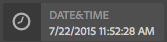

# 範例ContextHub UI模組類型 {#sample-contexthub-ui-module-types}

ContextHub提供幾個可在解決方案中使用的範例UI模組。 提供下列資訊：

* UI模組的主要功能。
* 在何處尋找原始碼，以便您開啟它以用於學習。
* 如何配置UI模組。

如需將UI模組新增至ContextHub的詳細資訊，請 [參閱新增UI模組](configuring-contexthub.md#adding-a-ui-module)。 如需開發UI模組的詳細資訊，請參 [閱建立ContextHub UI模組類型](extending-contexthub.md#creating-contexthub-ui-module-types)。

## contexthub.base UI模組類型 {#contexthub-base-ui-module-type}

contexthub.base UI模組類型是所有其他UI模組類型的基本類型。 因此，它提供了用於呈現儲存資料的通用功能。

提供下列功能：

* **標題和圖示：** 指定UI模組的標題和圖示。 您可使用URL或Coral UI圖示庫來參考圖示。
* **儲存資料：** 標識要從中檢索資料的一個或多個儲存。
* **內容：** 指定UI模組中顯示的內容，如同ContextHub工具列中顯示的內容。
* **快顯內容：** 指定在按一下或點選UI模組時，在快顯視窗中顯示的內容。
* **全螢幕模式：** 控制是否允許全螢幕模式。

原始碼位於 `/libs/granite/contexthub/code/ui/container/js/ContextHub.UI.BaseModuleRenderer.js`。

### 設定 {#configuration}

使用JSON格式的Javascript物件，設定contexthub.base UI模組。 包含下列任何屬性以設定UI模組功能：

* **影像：** 影像的URL，以顯示為圖示。
* **表徵圖：** Coral UI圖 [示類的名稱](https://helpx.adobe.com/experience-manager/6-4/sites/developing/using/reference-materials/coral-ui/coralui3/Coral.Icon.html) 。 如果您同時為圖示和影像屬性指定值，則會使用影像。
* **標題：** UI模組的標題。 當指針暫停在UI模組表徵圖上時，標題將出現。
* **全螢幕：** 一個布爾值，指示UI模組是否支援全屏模式。 使用 `true` 支援全螢幕，並 `false` 防止全螢幕模式。
* **範本：** Handlebars [範本](https://handlebarsjs.com/) ，指定要在ContextHub工具列中演算的內容。 最多使用兩個 `<p>` 標籤。
* **storeMapping:** 金鑰／商店對應。 使用Handlebar範本中的索引鍵，存取相關的ContextHub儲存資料。
* **清單：** 在按一下UI模組時，要在快顯視窗中顯示為清單的項目陣列。 如果您包含此項目，請勿包含poverTemplate。 該值是具有以下鍵的對象陣列：
   * 標題：此項目要顯示的文本
   * 影像：（選用）應顯示在左側影像的URL
   * 表徵圖：（可選）應顯示在左側的CUI表徵圖類；如果指定影像，則忽略
   * 選取：（可選）一個布林值，它指定是否應將此項目顯示為選定項(true=selected)。 依預設，選取的項目會使用粗體顯示。 使用屬 `listType` 性來設定其他外觀（請參閱下面）。
* **listType:** 用於快顯清單項目的樣式。 請使用下列其中一個值：
   * checkmark
   * 核取方塊
   * 無線電
* **快顯範本：** Handlebars範本，指定在按下UI模組時，要在快顯視窗中演算的內容。 如果您包含此項目，請勿包含該 `list` 項目。

### 範例 {#example}

以下示例將c`ontexthub.base` UI模組配置為顯示來自 [contexthub.emulators儲存的資訊](sample-stores.md#granite-emulators-sample-store-candidate) 。 項目 `template` 示範如何使用項目建立的索引鍵從商店取得 `storeMapping` 資料。

```javascript
{
   "icon": "coral-Icon--move",
    "title": "Screen Resolution",
    "storeMapping": {
      "emulator": "emulators"
    },
    "template": "<p>{{{ i18n \"Resolution\"}}}</p><p>{{{emulator.currentDevice.width}}} x {{{emulator.currentDevice.height}}}</p>"
}
```


## contexthub.browserinfo UI模組類型 {#contexthub-browserinfo-ui-module-type}

UI模 `contexthub.browserinfo` 塊顯示有關客戶端Web瀏覽器和作業系統的資訊。 根據contexthub.surferinfo儲存庫候選項，從surferinfo [儲存中獲取資訊](sample-stores.md#contexthub-surferinfo-sample-store-candidate) 。


UI模組的原始碼位於 `/libs/granite/contexthub/components/modules/browserinfo`。 雖然 `contexthub.browserinfo` 擴充 `contexthub.base` UI模組，但不會覆寫或提供其他功能。 實作提供預設設定，以呈現瀏覽器資訊。

### 設定 {#configuration-1}

contexthub.browserinfo UI模組的實例不需要「詳細配置」的值。 下列JSON文字代表模組的預設設定。

```javascript
{
   "icon":"coral-Icon--globe",
   "title":"Browser/OS Information",
   "storeMapping":{"surferinfo":"surferinfo"},
   "template":"<p>{{surferinfo.browser.family}} {{surferinfo.browser.version}}</p><p>{{surferinfo.os.name}} {{surferinfo.os.version}}</p>"
}
```

## contexthub.datetime UI模組類型 {#contexthub-datetime-ui-module-type}

UI `contexthub.datetime` 模組顯示儲存在基於儲存候選項的名為datetime的儲存中的日期和 `contexthub.datetime` 時間。



此模組提供快顯表格，讓您變更商店中的日期和時間。

UI模組的 `contexthub.datetime` 源位於 `/libs/granite/contexthub/components/modules/datetime`。

### 設定 {#configuration-2}

contexthub.datetime UI模組的實例不需要「詳細配置」的值。 下列JSON文字代表模組的預設設定。

```javascript
{
   "icon":"coral-Icon--clock",
   "title":"DATE&TIME",
   "clickable":true,
   "storeMapping":{"d":"datetime"},
   "template":"<p class=\"contexthub-module-line1\">{{i18n \"Date&Time\"}}</p><p class=\"contexthub-module-line2\">{{d.formatted.locale.date}} {{d.formatted.locale.time}}</p>",
   "popoverTemplate":"<div class=\"datetime center\"><div class=\"coral-DatePicker-calendar\" data-init=\"datepicker\"><input class=\"coral-Textfield\" type=\"datetime\" value=\"{{d.formatted.iso}}\"><button class=\"coral-Button coral-Button--secondary coral-Button--square\" title=\"{{i18n \"Datetime picker\"}}\"><i class=\"coral-Icon coral-Icon--calendar coral-Icon--sizeS\"></i></button></div></div>"
}
```

## contexthub.location UI模組類型 {#contexthub-location-ui-module-type}

UI `contexthub.location` 模組會顯示用戶端的經度和緯度。 此模組提供一個快顯視窗，可顯示您按一下以變更目前位置的Google地圖。 該模組從名為geolocation的ContextHub儲存器獲取資訊，該geolocation基於 [contexthub.geolocation儲存候選器](sample-stores.md#contexthub-geolocation-sample-store-candidate) 。


UI模組的源位於 `/etc/cloudsettings/default/contexthub/geolocation`。

### 設定 {#configuration-4}

contexthub.location UI模組的例項不需要詳細資料設定的值。 下列JSON文字代表模組的預設設定。

```javascript
{
 "icon":"coral-Icon--compass",
 "title":"Location",
 "clickable":true,
 "editable":{"key":"/geolocation","disabled":[],"hidden":["/geolocation/generatedThumbnail","/geolocation/city","/geolocation/country"]},
 "fullscreen":true,
 "storeMapping":{"g":"geolocation"},
 "template":"<p>{{i18n \"Location\"}}</p><p>{{g.address.postalCode}} {{g.address.city}}{{#if g.address.city}}{{#if g.address.region}},{{/if}}{{/if}} {{g.address.region}}</p>",
 "list":[
  {"title":"Basel, Switzerland",
  "data":{"longitude":7.58929,"latitude":47.554746,"city":"Basel","country":"Switzerland"}},
  {"title":"Melbourne, Australia",
  "data":{"longitude":144.96328,"latitude":-37.814107,"city":"Melbourne","country":"Australia"}},
  {"title":"Beijing, China",
  "data":{"longitude":116.407526,"latitude":39.90403,"city":"Beijing","country":"China"}},
  {"title":"New York, NY, USA",
  "data":{"longitude":-74.005973,"latitude":40.714353,"city":"New York","country":"United States"}},
  {"title":"Paris, France",
  "data":{"longitude":2.352222,"latitude":48.856614,"city":"Paris","country":"France"}},
  {"title":"Rio de Janeiro, Brazil",
  "data":{"longitude":-43.20071,"latitude":-22.913395,"city":"Rio","country":"Brazil"}},
  {"title":"San Jose, CA, USA",
  "data":{"longitude":-121.894955,"latitude":37.339386,"city":"San Jose","country":"United States"}},
  {"title":"Tokyo, Japan",
  "data":{"longitude":139.691706,"latitude":35.689487,"city":"Shinjuku","country":"Japan"}}
 ],
 "listType":"checkmark"
}
```

## contexthub.screen-orientation UI模組類型 {#contexthub-screen-orientation-ui-module-type}

UI `contexthub.screen-orientation` 模組會顯示用戶端的目前畫面方向。 雖然依預設會停用，但模組會提供一個快顯視窗，讓您選取方向。 該模組從ContextHub儲存器獲取基於granite.emulators儲存候選 [符的命名模擬器](sample-stores.md#granite-emulators-sample-store-candidate) 。


UI模組的源位於 `/libs/granite/contexthub/components/modules/screen-orientation`。

### 設定 {#configuration-5}

UI模組 `contexthub.screen-orientation` 的例項不需要詳細資料設定的值。 下列JSON文字代表模組的預設設定。 請注意， `clickable` 屬性預 `false` 設為。 如果您覆寫預設設定以設 `clickable` 為， `true`按一下模組會顯示彈出畫面，您可在其中選取方向。

```javascript
{
   "icon":"coral-Icon--rotateRight",
   "title":"Screen Orientation",
   "clickable":false,
   "storeMapping":{"emulator":"emulators"},
   "template":"<p>{{{ i18n \"Screen Orientation\" }}}</p><p>{{{ emulator.currentDevice.orientation }}}",
   "listReference":"/emulators/orientations",
   "listType":"checkmark"
}
```

## contexthub.tagcloud UI模組類型 {#contexthub-tagcloud-ui-module-type}

UI模 `contexthub.tagcloud` 組會顯示有關標籤的資訊。 在工具列上，UI模組會顯示標籤數。 此快顯視窗會顯示用於新增標籤的標籤和文字方塊。 UI模組從名為tagcloud的ContextHub儲存器獲取資訊，該tagcloud基於儲存候選 `contexthub.tagcloud` 器。


UI模組的源位於 `/libs/granite/contexthub/components/modules/tagcloud`。

### 設定 {#configuration-6}

UI模組 `contexthub.tagcloud` 的例項不需要詳細資料設定的值。 下列JSON文字代表模組的預設設定。

```javascript
{
   "icon":"coral-Icon--tag",
   "title":"TagCloud",
   "clickable":true,
   "storeMapping":{"t":"tagcloud"},
   "maxTags":20,
   "template":"<p class=\"contexthub-module-line1\">{{i18n \"TagCloud\"}}</p><p class=\"contexthub-module-line2\">{{stats.total}} {{i18n \"Tags\"}}</p>",
   "popoverTemplate":"<div class=\"contexthub-popover-content center\"><p class=\"stats\">{{stats.total}} {{i18n \"Tags\"}} | {{stats.hits}} {{i18n \"Hits\"}} | {{i18n \"Last tag\"}}: {{#if stats.recent}}{{stats.recent}}{{else}}{{i18n \"Unknown\"}}{{/if}}</p><p class=\"tagcloud\">{{#each tags}}<span class=\"tag{{this.weight}}\">{{this.name}}</span> {{/each}}</p><div class=\"coral-InputGroup\"><input type=\"text\" class=\"coral-InputGroup-input coral-Textfield tag-name\" placeholder=\"{{i18n \"Add a namespace:my/tag\"}}\" pattern=\"^[A-Za-z0-9_\\-]+(:[A-Za-z0-9_\\-\\/]+)?$\" title=\"{{i18n \"namespace:my/tag\"}}\"><span class=\"coral-InputGroup-button\"><button class=\"coral-Button coral-Button--secondary coral-Button--square contexthub-new-tag\" type=\"button\" title=\"{{i18n \"increment\"}}\"><i class=\"coral-Icon coral-Icon--sizeS coral-Icon--add\"></i></button></span></div></div>"
}
```

## granite.profile UI模組類型 {#granite-profile-ui-module-type}

ContextHub `granite.profile` UI模組會顯示目前使用者的顯示名稱。 彈出式功能表會顯示使用者的登入名稱，並讓您變更顯示名稱的值。 UI模組從ContextHub儲存基於granite.profile儲存候選項的命名 [配置檔案獲取資訊](sample-stores.md#granite-profile-sample-store-candidate) 。


UI模組的源位置為 `/libs/granite/contexthub/components/modules/profile`。

### 設定 {#configuration-7}

UI模組 `granite.profile` 的例項不需要詳細資料設定的值。 下列JSON文字代表模組的預設設定。

```javascript
{
   "icon":"coral-Icon--user",
   "title":"Profile",
   "clickable":true,
   "editable":{
      "key":"/profile",
      "disabled":["/profile/authorizableId"],
      "hidden":["/profile/avatar","/profile/path"]},
   "storeMapping":{"p":"profile"},
   "template":"<p class=\"contexthub-module-line1\">{{i18n \"Persona\"}}</p><p class=\"contexthub-module-line2\">{{p.displayName}}</p>",
   "listType":"checkmark"
}
```
