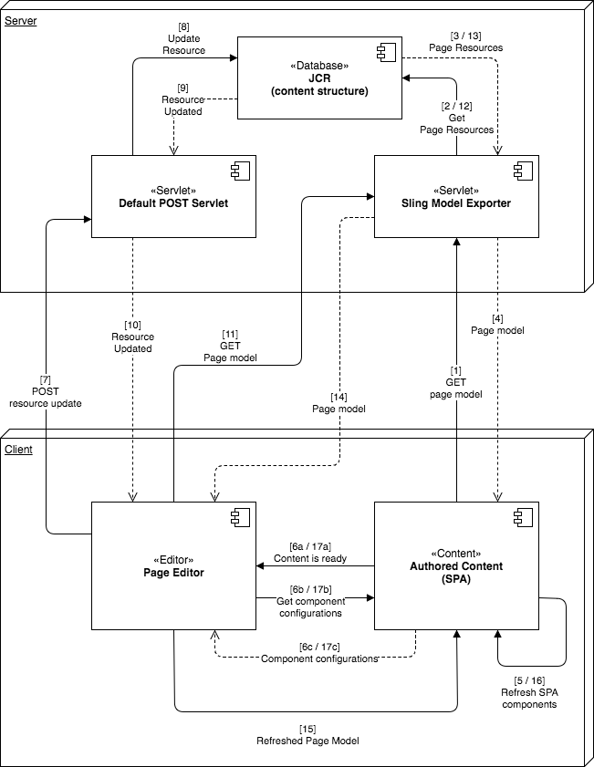

# SPA編輯器概述 {#spa-editor-overview}

單頁應用程式(SPA)可為網站使用者提供引人入勝的體驗。 開發人員希望能夠使用SPA架構建立網站，而作者則想在AEM中順暢地編輯內容，以供使用此類架構建立的網站使用。

SPA Editor提供完整的解決方案，以支援AEM中的SPA。 本頁概述SPA支援在AEM中的結構、SPA編輯器的運作方式，以及SPA架構和AEM如何保持同步。

## 簡介 {#introduction}

使用常見SPA架構（例如Reacte和Angular）建立的網站會透過動態JSON載入其內容，而且不提供AEM頁面編輯器必須的HTML結構，才能放置編輯控制項。

若要在AEM中啟用SPA的編輯，需要SPA的JSON輸出與AEM儲存庫中的內容模型之間的對應，才能儲存對內容所做的變更。

AEM中的SPA支援提供精簡的JS層，當載入頁面編輯器時，此層會與SPA JS程式碼互動，可透過此層傳送事件，並啟動編輯控制項的位置，以允許內容內容編輯。 此功能以Content Services API Endpoint概念為基礎，因為SPA中的內容必須透過Content Services載入。

如需AEM中SPA的詳細資訊，請參閱下列檔案：

* [SPA藍圖](blueprint.md) ，以滿足SPA的技術需求
* [使用React在AEM中開始使用SPA](getting-started-react.md) ，以快速導覽使用React的簡單SPA
* [使用Angular快速入門AEM中的SPA](getting-started-angular.md) ，以快速導覽使用Angular的簡單SPA

## 設計 {#design}

SPA的頁面元件不會透過JSP或HTL檔案提供其子元件的HTML元素。 此操作委託給SPA框架。 子元件或模型的表示方式會從JCR擷取為JSON資料結構。 然後，SPA元件會根據該結構添加到頁面中。 此行為可區分頁面元件的初始主體構成與非SPA對應項。

### 頁面模型管理 {#page-model-management}

頁面模型的解析度和管理被委託給提供的庫 `PageModel` 。 SPA必須使用「頁面模型」庫，才能初始化並由SPA編輯器編寫。 透過npm間接提供給AEM Page元件的頁面模型 `aem-react-editable-components` 庫。 「頁面模型」是AEM和SPA之間的解譯器，因此必須始終存在。 編寫頁面時，必須新增其 `cq.authoring.pagemodel.messaging` 他程式庫，才能與頁面編輯器通訊。

如果SPA頁元件繼承自頁核心元件，則有兩個選項可使客戶端庫 `cq.authoring.pagemodel.messaging` 類別可用：

* 如果範本是可編輯的，請將其新增至頁面原則。
* 或者，使用新增類別 `customfooterlibs.html`。

對於導出模型中的每個資源，SPA將映射將執行渲染的實際元件。 然後，會使用容器內的元件映射來呈現模型（表示為JSON）。

>[!CAUTION]
>
>應將類別的 `cq.authoring.pagemodel.messaging` 納入限制在SPA編輯器的內容上。

### 通信資料類型 {#communication-data-type}

當類 `cq.authoring.pagemodel.messaging` 別新增至頁面時，會傳送訊息至頁面編輯器以建立JSON通訊資料類型。 當通訊資料類型設為JSON時，GET請求會與元件的Sling Model端點通訊。 在頁面編輯器中發生更新後，更新元件的JSON表示法會傳送至頁面模型程式庫。 接著頁面模型程式庫會通知SPA更新。

## 工作流程 {#workflow}

您可以將SPA編輯器視為SPA和AEM之間的中介者，借此瞭解SPA和AEM之間的互動流程。

* 頁面編輯器與SPA之間的通訊是使用JSON而非HTML進行。
* 頁面編輯器透過iframe和傳訊API將頁面模型的最新版本提供給SPA。
* 頁面模型管理員會通知編輯器已準備好進行編輯，並將頁面模型傳遞為JSON結構。
* 編輯器不會變更或甚至存取所創作頁面的DOM結構，而是提供最新的頁面模型。

### 基本SPA編輯器工作流程 {#basic-spa-editor-workflow}

請記住SPA編輯器的關鍵元素，作者會看到在AEM中編輯SPA的高階工作流程，如下所示。

1. 載入SPA編輯器。
1. SPA會載入個別影格中。
1. SPA會要求JSON內容並轉譯用戶端元件。
1. SPA編輯器會偵測轉譯的元件並產生覆蓋。
1. 製作點按覆蓋，顯示元件的編輯工具列。
1. SPA編輯器會持續對伺服器進行POST要求的編輯。
1. SPA編輯器會要求將JSON更新至SPA編輯器，此編輯器會以DOM事件傳送至SPA。
1. SPA會重新呈現相關元件，並更新其DOM。

>[!NOTE]
>
>請記住：
>
>* SPA總是負責其展示。
>* SPA編輯器與SPA本身隔離。
>* 在生產（發佈）中，SPA編輯器從未載入。

### 用戶端——伺服器頁面編輯工作流程 {#client-server-page-editing-workflow}

這是編輯SPA時主從式互動的更詳細概述。

1. SPA會自行初始化，並從Sling Model Exporter要求頁面模型。
1. Sling Model Exporter會要求從儲存庫中構成頁面的資源。
1. 儲存庫返回資源。
1. Sling Model Exporter會傳回頁面的模型。
1. SPA會根據頁面模型執行個體化其元件。
1. **6a內容會通知編輯器** ，內容已可供編寫。

   **6b頁面編輯器** ，會要求元件編寫設定。

   **6c** Page Editor接收元件配置。
1. 當作者編輯元件時，頁面編輯器會將修改請求張貼至預設的POST servlet。
1. 資源在儲存庫中更新。
1. 更新的資源將提供給POST Servlet。
1. 預設的POST servlet通知頁面編輯器資源已更新。
1. 頁面編輯器會要求新的頁面模型。
1. 系統會從儲存庫請求構成該頁面的資源。
1. 構成頁面的資源由儲存庫提供給Sling Model Exporter。
1. 更新的頁面模型會傳回至編輯器。
1. 頁面編輯器會更新SPA的頁面模型參考。
1. SPA會根據新的頁面模型參考來更新其元件。
1. 頁面編輯器的元件組態會更新。

   **17a** SPA會傳訊頁面編輯器內容已就緒。

   **17b頁面編輯器** ，為SPA提供元件配置。

   **17c** SPA提供更新的元件組態。

### 編寫工作流程 {#authoring-workflow}

這是更詳細的概述，主要針對製作體驗。

1. SPA讀取頁面模型。
1. **2a頁面模型** ，為編輯者提供製作所需的資料。

   **2b通知時** ，元件管理器會更新頁面的內容結構。
1. The component orchestrator queries the mapping between an AEM resource type and a SPA component.
1. 該元件管理器基於頁面模型和元件映射動態實例化SPA元件。
1. 頁面編輯器會更新頁面模型。
1. **6a頁面模型** ，可為頁面編輯器提供更新的編寫資料。

   **6b** ，頁面模型將更改派單到元件Orchestrator。
1. 元件Orchestrator讀取元件映射。
1. Component orchestrator會更新頁面內容。
1. 當SPA完成頁面內容更新時，頁面編輯器會載入編寫環境。

## 需求與限制 {#requirements-limitations}

若要讓作者使用頁面編輯器來編輯SPA的內容，您的SPA應用程式必須實作，才能與AEM SPA編輯器SDK互動。 請參閱「使 [用React](getting-started-react.md) 」檔案在AEM中開始使用SPA」，以取得執行所需知識的最低限度。

### 支援的架構 {#supported-frameworks}

SPA編輯器SDK支援下列最低版本：

* React 16.x和更高版本
* 6.x和更高角度

這些架構的舊版可能與AEM SPA Editor SDK搭配使用，但不受支援。

### 其他架構 {#additional-frameworks}

您可建置其他SPA架構，以搭配AEM SPA Editor SDK使用。 請參閱 [SPA Blueprint](blueprint.md) 檔案，瞭解架構建立由模組、元件和服務組成的架構特定層，以便與AEM SPA編輯器搭配使用時必須滿足的需求。

### 使用多個選擇器 {#multiple-selectors}

您可以定義其他自訂選擇器，並將其用作為AEM SPA SDK所開發的SPA的一部分。 不過，這項支援需要選 `model` 擇器是第一個選擇器，而副檔名 `.json` 則需視JSON匯出器的要求而定。

### 文字編輯器需求 {#text-editor-requirements}

如果要使用在SPA中建立的文本元件的就地編輯器，則需要進行其他配置。

1. 在包含文字HTML的容器包裝函式元素上設定屬性（可以是任何屬性）。 如果是WKND SPA專案，它是元素， `
` 且已使用的選擇器 `data-rte-editelement`。
1. 設定對 `editElementQuery` 應AEM文字元件上指向該選 `cq:InplaceEditingConfig` 取器的設定，例如 `data-rte-editelement`. 這可讓編輯者知道哪些HTML元素會包住HTML文字。

有關屬性和富格文 `editElementQuery` 字編輯器配置的其他資訊，請參 [閱配置富格文本編輯器。](/help/implementing/developing/extending/rich-text-editor.md)

### 限制 {#limitations}

Adobe完全支援AEM SPA Editor SDK，並將繼續加強和擴充AEM SPA Editor SDK的新功能。 SPA編輯器尚未支援下列AEM功能：

* 目標模式
* ContextHub
* 內嵌影像編輯
* 編輯設定(例如 偵聽器)
* 樣式系統
* 還原／重做
* 頁面差異與時間彎曲
* 執行HTML重寫伺服器端的功能，例如連結檢查器、CDN重寫器服務、URL縮短等。
* 開發人員模式
* AEM啟動
