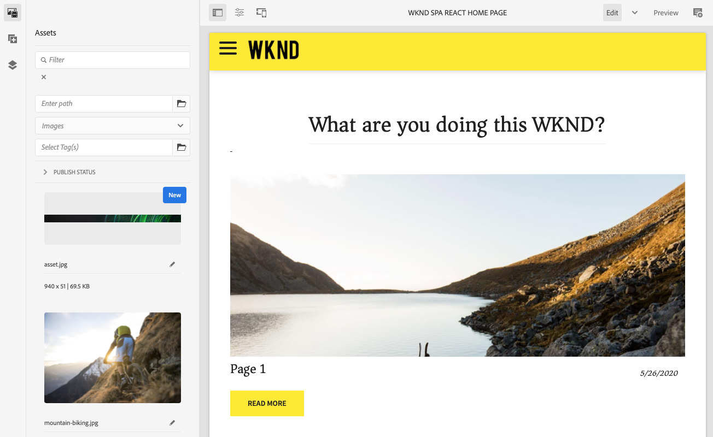
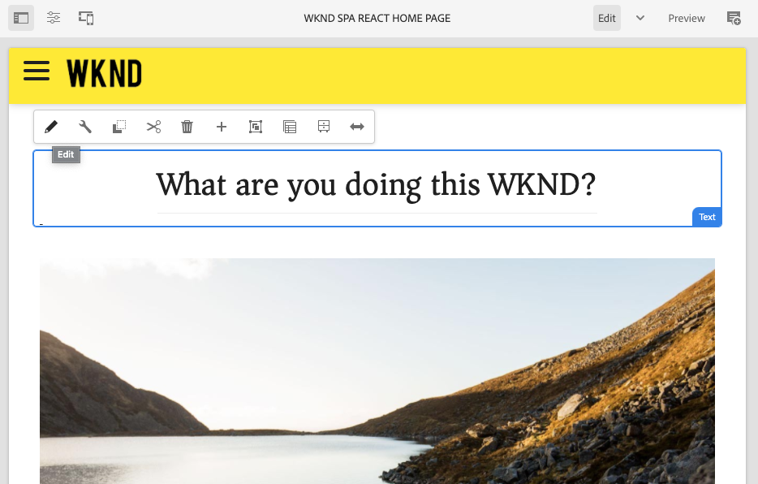

# SPA簡介與逐步說明 {#spa-introduction}

單頁應用程式(SPA)可為網站使用者提供引人入勝的體驗。 開發人員希望能夠使用SPA架構建立網站，而作者則想在AEM中順暢地編輯內容，以供使用此類架構建立的網站使用。

SPA Editor提供完整的解決方案，以支援AEM中的SPA。 本文逐步說明如何使用基本的SPA應用程式來製作內容，並說明它與基礎的AEM SPA編輯器有何關聯。

## 簡介 {#introduction}

### 文章目標 {#article-objective}

介紹了SPA的基本概念，並以簡單的SPA應用程式來演示基本內容編輯，引導讀者閱讀SPA編輯器的逐步介紹。 接著深入探討頁面的建構，以及SPA應用程式與AEM SPA編輯器的關聯與互動方式。

本簡介和逐步說明的目的，在於向AEM開發人員示範SPA的相關性、SPA的一般運作方式、AEM SPA編輯器如何處理SPA，以及它與標準AEM應用程式有何不同。

此逐步說明以標準AEM功能和範例WKND SPA專案應用程式為基礎。 如要繼續，請 [從GitHub下載並安裝範例WKND SPA專案應用程式。](https://github.com/adobe/aem-guides-wknd-spa)

>[!CAUTION]
>
>本檔案僅將 [WKND SPA Project應用程式用於展示用途](https://github.com/adobe/aem-guides-wknd-spa) 。 它不應用於任何項目工作。

>[!TIP]
>
>任何AEM專案都應運用 [AEM Project Archetype](https://docs.adobe.com/content/help/en/experience-manager-core-components/using/developing/archetype/overview.html)，它支援使用React或Angular的SPA專案，並運用SPA SDK。

### 什麼是SPA? {#what-is-a-spa}

單頁應用程式(SPA)與傳統頁面不同，它是由用戶端轉譯，主要是Javascript導向，依賴Ajax呼叫來載入資料並動態更新頁面。 大部分或所有內容在單一頁面載入時都會擷取一次，並根據使用者與頁面的互動，視需要以非同步方式載入其他資源。

這可降低頁面重新整理的需求，並為使用者呈現順暢、快速且更像原生應用程式體驗的體驗。

AEM SPA編輯器可讓前端開發人員建立可整合至AEM網站的SPA，讓內容製作者編輯SPA內容就像編輯其他AEM內容一樣輕鬆。

### 為什麼選擇SPA? {#why-a-spa}

SPA就像原生應用程式，不但對網頁的訪客，而且由於SPA的運作方式，對行銷人員和開發人員而言，都是極具吸引力的體驗。


#### 訪客 {#visitors}

* 訪客在與內容互動時，需要類似原生的體驗。
* 有清楚的資料顯示，頁面越快，轉換的可能性就越大。

#### 行銷人員 {#marketers}

* 行銷人員想要提供豐富、原生的體驗，以吸引訪客充份參與內容。
* 個人化可讓這些體驗更吸引人。

#### 開發人員 {#developers}

* 開發人員希望將內容與簡報之間的顧慮完全分開。
* 清潔分離使系統更具可擴充性，並允許獨立的前端開發。

### SPA如何運作？ {#how-does-a-spa-work}

SPA的主要思想是減少對伺服器的呼叫和依賴，以將伺服器延遲所造成的延遲降至最低，讓SPA接近原生應用程式的回應速度。

在傳統的循序網頁中，只會載入立即頁面所需的資料。 這表示當訪客移至另一個頁面時，會呼叫伺服器以取得其他資源。 當訪客與頁面上的元素互動時，可能需要額外的呼叫。 這些多次呼叫可能會延遲或延遲，因為頁面必須趕上訪客的要求。


SPA會在第一次載入時載入訪客的所有必要資料，以提供更流暢的體驗，接近訪客從行動裝置、原生應用程式所預期的效果。 雖然這一步可能需要稍長的時間，但卻不需要額外的伺服器呼叫。

透過在用戶端上演算，頁面元素的反應更快，而訪客與頁面的互動也會立即生效。 可能需要的任何額外資料都會以非同步方式呼叫，以最大化頁面速度。

>[!TIP]
>
>如需SPA在AEM中運作的技術詳細資訊，請參閱文章：
>* [在AEM中使用React快速入門SPA](getting-started-react.md)
>* [AEM中的SPA使用Angular快速入門](getting-started-angular.md)

>
>
如需詳細瞭解SPA編輯器的設計、架構和技術工作流程，請參閱文章：
>* [SPA編輯器概述](editor-overview.md)。


## SPA的內容編輯體驗 {#content-editing-experience-with-spa}

當建立SPA以運用AEM SPA編輯器時，內容作者在編輯和建立內容時不會察覺任何差異。 共同的AEM功能可供使用，而且不需要變更作者的工作流程。

1. 在AEM中編輯WKND SPA專案應用程式。

   `http://localhost:4502/editor.html/content/wknd-spa-react/us/en/home.html`

   

1. 選取文字元件，並注意工具列會像其他元件一樣顯示。 選擇 **編輯**。

   

1. 在AEM中編輯內容時，請注意這些變更會持續存在。

   

1. 使用「資產瀏覽器」將新影像拖放至影像元件。

   

1. 此變更會持續存在。

   

其他製作工具（例如在頁面上拖放其他元件、重新排列元件以及修改版面）都支援，就像任何非SPA AEM應用程式一樣。

>[!NOTE]
>
>SPA編輯器不會修改應用程式的DOM。 SPA本身負責DOM。
>
>若要瞭解其運作方式，請繼續閱讀本文章「 [SPA應用程式」和「AEM SPA編輯器」的下一節](#spa-apps-and-the-aem-spa-editor)。

## SPA應用程式與AEM SPA編輯器 {#spa-apps-and-the-aem-spa-editor}

體驗SPA對一般使用者的運作方式，然後檢查SPA頁面，有助於進一步瞭解SAP應用程式如何與AEM中的SPA編輯器搭配運作。

### 使用SPA應用程式 {#using-an-spa-application}

1. 在發佈伺服器上或使用頁面編輯器的「頁面資訊」選單中的「檢視為已發佈 ******** 」選項，載入WKND SPA專案應用程式。

   `http://<host>:<port>/content/wknd-spa-react/us/en/home.html`

   

   請注意頁面結構，包括導覽至子頁面、選單和文章卡片。

1. 使用功能表導覽至子頁面，並查看頁面會立即載入，而不需重新整理。

   

1. 當您導覽子頁面時，開啟瀏覽器的內建開發人員工具並監控網路活動。

   

   當您在應用程式中從頁面移至頁面時，流量很少。 不會重新載入頁面，只會要求新影像。

   SPA完全在用戶端管理內容和路由。

因此，如果頁面在子頁面導覽時未重新載入，該頁面的載入方式為何？

下一節「載 [](#loading-a-spa-application)入SPA應用程式」深入探討載入SPA的機制，以及如何同步和非同步載入內容。

### 載入SPA應用程式 {#loading-a-spa-application}

1. 如果尚未載入，請在發佈伺服器上載入We.Retail Journal應用程式，或使用頁面編輯器中「頁面資訊」選單的「檢視為已發佈 ******** 」選項來載入。

   `http://<host>:<port>/content/wknd-spa-react/us/en/home.html`

   

1. 使用瀏覽器的內建工具來檢視頁面來源。
1. 請注意，來源的內容有限。

   ```html
    <!DOCTYPE html>
    <html lang="en">
    <head>
        <meta charset="UTF-8"/>
        <title>WKND SPA React Home Page</title>
   
        <meta name="template" content="spa-page-template"/>
        <meta name="viewport" content="width=device-width, initial-scale=1"/>
   
    <link rel="stylesheet" href="/etc.clientlibs/wknd-spa-react/clientlibs/clientlib-base.min.css" type="text/css">
   
    <meta name="theme-color" content="#000000"/>
    <link rel="icon" href="/etc.clientlibs/wknd-spa-react/clientlibs/clientlib-react/resources/favicon.ico"/>
    <link rel="apple-touch-icon" href="/etc.clientlibs/wknd-spa-react/clientlibs/clientlib-react/resources/logo192.png"/>
    <link rel="manifest" href="/etc.clientlibs/wknd-spa-react/clientlibs/clientlib-react/resources/manifest.json"/>
   
    <!-- AEM page model -->
    <meta property="cq:pagemodel_root_url" content="/content/wknd-spa-react/us/en.model.json"/>
    <link href="//fonts.googleapis.com/css?family=Source+Sans+Pro:400,600|Asar&display=swap" rel="stylesheet"/>
    <meta property="cq:datatype" content="JSON"/>
    <meta property="cq:wcmmode" content="edit"/>
   
    <link rel="stylesheet" href="/libs/cq/gui/components/authoring/editors/clientlibs/internal/page.min.css" type="text/css">
    <link rel="stylesheet" href="/etc.clientlibs/wcm/foundation/clientlibs/main.min.css" type="text/css">
    <script type="text/javascript" src="/libs/cq/gui/components/authoring/editors/clientlibs/internal/messaging.min.js"></script>
    <script type="text/javascript" src="/libs/cq/gui/components/authoring/editors/clientlibs/utils.min.js"></script>
    <script type="text/javascript" src="/libs/granite/author/deviceemulator/clientlibs.min.js"></script>
    <script type="text/javascript" src="/libs/cq/gui/components/authoring/editors/clientlibs/internal/page.min.js"></script>
    <script type="text/javascript" src="/etc.clientlibs/wcm/foundation/clientlibs/main.min.js"></script>
    <script type="text/javascript" src="/etc.clientlibs/clientlibs/granite/jquery.min.js"></script>
    <script type="text/javascript" src="/etc.clientlibs/clientlibs/granite/utils.min.js"></script>
    <script type="text/javascript" src="/etc.clientlibs/clientlibs/granite/jquery/granite.min.js"></script>
    <script type="text/javascript" src="/etc.clientlibs/foundation/clientlibs/jquery.min.js"></script>
    <script type="text/javascript" src="/etc.clientlibs/foundation/clientlibs/shared.min.js"></script>
   
    <!--cq{"decorated":false,"type":"cq/cloudconfig/components/scripttags/header","path":"/content/wknd-spa-react/us/en/home/jcr:content/cloudconfig-header","structurePath":"/content/wknd-spa-react/us/en/home/jcr:content/cloudconfig-header","selectors":null,"servlet":"Script /libs/cq/cloudconfig/components/scripttags/header/header.html","totalTime":2,"selfTime":2}-->
   
    <link rel="stylesheet" href="/etc.clientlibs/wknd-spa-react/clientlibs/clientlib-react.min.css" type="text/css">
   
    </head>
   
    <body class="page basicpage">
        <noscript>You need to enable JavaScript to run this app.</noscript>
    <div id="spa-root"></div>
   
    <script type="text/javascript" src="/etc.clientlibs/wknd-spa-react/clientlibs/clientlib-react.min.js"></script>
   
    <script type="text/javascript" src="/etc.clientlibs/core/wcm/components/commons/site/clientlibs/container.min.js"></script>
    <script type="text/javascript" src="/etc.clientlibs/wknd-spa-react/clientlibs/clientlib-base.min.js"></script>
   
    <script type="text/javascript" src="/libs/cq/gui/components/authoring/editors/clientlibs/internal/pagemodel/messaging.min.js"></script>
   
    <link rel="stylesheet" href="/etc.clientlibs/wknd-spa-react/clientlibs/clientlib-author.min.css" type="text/css">
   
    <!--cq{"decorated":true,"type":"cq/cloudserviceconfigs/components/servicecomponents","path":"/content/wknd-spa-react/us/en/home/jcr:content/cloudservices","selectors":null,"servlet":"Script /libs/cq/cloudserviceconfigs/components/servicecomponents/servicecomponents.jsp","totalTime":2,"selfTime":2}-->
   
    <!--cq{"decorated":false,"type":"cq/cloudconfig/components/scripttags/footer","path":"/content/wknd-spa-react/us/en/home/jcr:content/cloudconfig-footer","structurePath":"/content/wknd-spa-react/us/en/home/jcr:content/cloudconfig-footer","selectors":null,"servlet":"Script /libs/cq/cloudconfig/components/scripttags/footer/footer.html","totalTime":2,"selfTime":2}-->
   
    </body>
    </html>
    <!--cq{"decorated":false,"type":"wknd-spa-react/components/page","path":"/content/wknd-spa-react/us/en/home/jcr:content","selectors":null,"servlet":"Script /apps/spa-project-core/components/page/page.html","totalTime":39,"selfTime":33}-->
   ```

   頁面的內文中沒有任何內容。 它主要由樣式表和對各種指令碼的調用組成，如 `clientlib-react.min.js`。

   這些指令碼是此應用程式的主要驅動程式，負責轉譯所有內容。

1. 使用瀏覽器的內建工具來檢查頁面。 檢視已完全載入的DOM內容。

   

1. 切換到「檢查器」中的「網路」頁籤並重新載入該頁。

   忽略影像要求時，請注意，載入頁面的主要資源是頁面本身、CSS、React Javascript、其相依性，以及頁面的JSON資料。

   

1. 在新標 `home.model.json` 簽中載入。

   `http://<host>:<port>/content/wknd-spa-react/us/en/home.model.json`

   

   AEM SPA編輯器運用 [AEM Content Services](/help/assets/content-fragments/content-fragments.md) ，以JSON模型的形式提供頁面的完整內容。

   透過實施特定介面，Sling Models提供SPA所需的資訊。 JSON資料的傳送會下放至每個元件（從頁面、段落、到元件等）。

   每個元件都會選擇它公開的內容及呈現方式（伺服器端使用HTL，用戶端使用React或Angular）。 本文著重討論使用React進行用戶端轉換。

1. 模型也可將頁面群組在一起，以便同步載入，以減少所需的頁面重新載入次數。

   在We.Retail Journal的範例中，由於訪客通常會 `home`瀏覽所有這 `page-1`些頁面，因此會同步載入、、 `page-2``page-3` 和頁面。

   此行為並非強制性，且完全可定義。

   

1. 要查看此行為差異，請重新載入 `home` 頁面並清除檢查器的網路活動。 導覽至 `page-1` 頁面功能表，並查看唯一的網路活動是對的影像要求 `page-1`。 `page-1` 本身不需要載入。

   

### 與SPA編輯器互動 {#interaction-with-the-spa-editor}

使用範例WKND SPA Project應用程式，您就可清楚看出應用程式的運作方式和發佈時的載入方式，並運用內容服務來傳送JSON內容以及非同步載入資源。

此外，對於內容作者，使用SPA編輯器建立內容在AEM中十分順暢。

在下節中，我們將探索讓SPA編輯器將SPA中的元件與AEM元件建立關聯的合約，並獲得順暢的編輯體驗。

1. 在編輯器中載入WKND SPA項目應用程式並切換到「 **預覽** 」模式。

   `http://<host>:<port>/editor.html/content/wknd-spa-react/us/en/home.html`

1. 使用瀏覽器的內建開發人員工具，檢查頁面內容。 使用選取工具，在頁面上選取可編輯的元件並檢視元素詳細資訊。

   請注意，元件有新的資料屬性 `data-cq-data-path`。

   

   例如

   `data-cq-data-path="/content/wknd-spa-react/us/en/home/jcr:content/root/responsivegrid/text`

   此路徑允許檢索和關聯每個元件的編輯上下文配置對象。

   這是編輯器將其識別為SPA中可編輯的元件所需的唯一標籤屬性。 根據此屬性，SPA編輯器將確定與元件關聯的可編輯配置，以便正確的框架、工具欄等。 已載入。

   此外，還新增了某些特定類別名稱，以標籤預留位置和資產拖放功能。

   >[!NOTE]
   >
   >此行為與AEM中伺服器端轉譯的頁面不同，AEM中每個可編輯元件都 `cq` 會插入元素。
   >
   >SPA編輯器中的此方法不需要插入自訂元素，只需額外的資料屬性，讓前端開發人員更容易進行標籤。

## 後續步驟 {#next-steps}

現在，您已瞭解AEM的SPA編輯體驗，以及SPA與SPA編輯器的關係，深入瞭解如何建立SPA。

* [使用React開始使用AEM中的SPA](getting-started-react.md) ，說明如何建立基本SPA來搭配AEM中的SPA編輯器使用React
* [使用Angular](getting-started-angular.md) AEM中的SPA快速入門說明如何建立基本SPA來搭配AEM中的SPA編輯器使用Angular
* [SPA編輯器概觀](editor-overview.md) (SPA Editor Overview)深入探討AEM與SPA之間的通訊模型。
* [針對AEM開發SPA](developing.md) ，說明如何吸引前端開發人員來開發AEM的SPA，以及SPA如何與AEM的架構互動。
