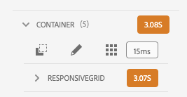
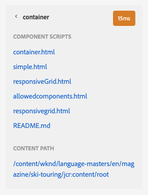

# 開發人員模式 {#developer-mode}

在中編輯頁AEM面時 [模式](/help/sites-cloud/authoring/fundamentals/environment-tools.md#page-modes) 可用，包括開發人員模式。 開發者模式開啟帶有多個頁籤的側面板，這些頁籤為開發者提供有關當前頁面的技術資訊。

有兩個頁籤：

* **[元件](#components)** 查看結構和效能資訊。
* **[錯誤](#errors)** 看到任何問題。

這些幫助開發人員：

* **發現** 頁面的構成。
* **調試：** 在何處何時發生什麼，這反過來又有助於解決問題。

>[!NOTE]
>
>開發人員模式：
>
>* 移動設備或案頭上的小窗口上不可用（由於空間限制）。
>  * 當寬度小於1024px時出現此情況。
>* 僅適用於 `administrators` 組。

## 開啟開發人員模式 {#opening-developer-mode}

開發者模式被實現為頁面編輯器的側面板。 要開啟面板，請選擇 **開發人員** 從頁面編輯器工具欄中的模式選擇器：

該面板分為兩個頁籤：

* **[元件](#components)**  — 顯示與 [內容樹](/help/sites-cloud/authoring/fundamentals/environment-tools.md#content-tree) 作者
* **[錯誤](#errors)**  — 出現問題時，將顯示每個元件的詳細資訊。

### 元件頁籤 {#components}

這顯示一個元件樹，它：

* 概述在頁面上呈現的元件和模板鏈。 樹可以展開，以在層次中顯示上下文。
* 顯示呈現元件所需的伺服器端計算時間。
* 允許您展開樹並在樹中選取特定元件。 選擇提供對元件詳細資訊的訪問；例如：
   * 儲存庫路徑
   * 指向指令碼的連結(在CRXDE Lite中訪問)
   * 元件詳細資訊，如 [元件控制台](/help/sites-cloud/authoring/features/components-console.md)
* 樹中選定的元件由編輯器中的藍色邊框指示。

此元件頁籤有助於：

* 確定並比較每個元件的渲染時間。
* 查看並瞭解層次結構。
* 通過查找慢速元件瞭解並改進頁面載入時間。

每個元件條目可能具有以下選項：

* **查看詳細資訊：** 指向清單的連結，其中顯示：
   * 用於呈現該元件的所有元件指令碼。
   * 此特定元件的儲存庫內容路徑。

      

* **編輯指令碼：** 在CRXDE Lite中開啟元件指令碼的連結。

* **查看元件詳細資訊：** 在 [元件控制台。](/help/sites-cloud/authoring/features/components-console.md)

通過輕擊或按一下Chevron展開元件條目還可顯示：

    *選定元件內的層次結構。
    *將選定元件的呈現時間、嵌套在其中的任何單個元件以及組合總數。

### 「錯誤」頁籤 {#errors}

但願 **錯誤** 頁籤將始終為空（如上所示），但當出現問題時，可能會為每個元件顯示以下詳細資訊：

* 如果元件將條目寫入錯誤日誌，以及錯誤的詳細資訊，並直接連結到CRXDE Lite中的相應代碼，則會出現警告。
* 如果元件開啟管理會話，則出現警告。

例如，如果調用了未定義的方法，將在 **錯誤** 的子目錄中 **元件** 頁籤將在出錯時用指示符標籤。
