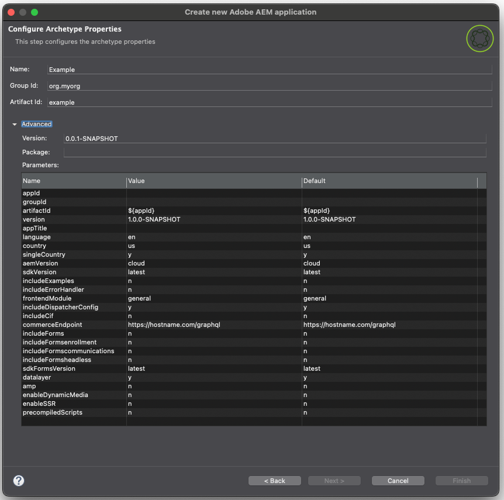

# AEM Developer Tools for Eclipse{#aem-developer-tools-for-eclipse}


## 總覽 {#overview}

AEM Developer Tools for Eclipse是以 [適用於Apache Sling的Eclipse外掛程式](https://sling.apache.org/documentation/development/ide-tooling.html) 依Apache授權2發行。

它提供數種可讓AEM開發更輕鬆的功能：

* 透過Eclipse Server Connector與AEM執行個體緊密整合
* 內容和OSGi套件組合的同步
* 具有程式碼熱交換功能的除錯支援
* 透過特定專案建立精靈簡單引導AEM專案
* 輕鬆編輯JCR屬性

## 需求 {#requirements}

使用AEM開發人員工具之前，您需要：

* 下載並安裝 [適用於企業Java開發人員的Eclipse IDE](https://www.eclipse.org/downloads/packages/).
* 通過編輯您的 `eclipse.ini` 組態檔，如 [Eclipse常見問題集](https://wiki.eclipse.org/FAQ_How_do_I_increase_the_heap_size_available_to_Eclipse).

>[!NOTE]
>
>在macOS上，您需要以滑鼠右鍵按一下 **Eclipse.app** 然後選取 **顯示包內容** 以便找到 `eclipse.ini`**.**

## 如何安裝AEM Developer Tools for Eclipse {#how-to-install-the-aem-developer-tools-for-eclipse}

當您完成 [需求](#requirements) 如上所述，您可以依照下列方式安裝外掛程式：

1. 開啟 [AEM開發人員工具網站](https://eclipse.adobe.com/aem/dev-tools/).

1. 複製 **安裝連結**.

   請注意，您也可以下載封存檔，而不是使用安裝連結。 這允許離線安裝，但您會以這種方式遺漏自動更新通知。

1. 在Eclipse中，開啟 **說明** 功能表。
1. 按一下 **安裝新軟體**.
1. 按一下 **添加……**.
1. 在 **名稱** 輸入 `AEM Developer Tools`.
1. 在 **位置** 複製安裝URL。
1. 按一下&#x200B;**「新增」**。
1. 檢查兩者 **AEM** 和 **Sling** 外掛程式。
1. 按一下&#x200B;**下一步**。
1. 在 **安裝詳細資訊** 按一下 **下一個** 。
1. 接受許可協定，然後按一下 **完成**.
1. 按一下 **RestartNow** 以重新啟動Eclipse。

## AEM透視 {#the-aem-perspective}

在Eclipse中，透視可決定視窗中可用的動作和檢視，並啟用以任務為導向的與Eclipse中的資源互動。 如需「透視」的詳細資訊，請參閱 [Eclipse檔案。](https://help.eclipse.org)

AEM Development Tools for Eclipse提供AEM Perspective，讓您能完整控制AEM專案和例項。 要開啟AEM透視：

1. 從Eclipse功能表列中選取 **視窗** -> **透視** -> **開放透視** -> **其他**.
1. 選擇 **AEM** 在對話方塊中，然後按一下 **開啟**.


## 多模組專案範例 {#sample-multi-module-project}

AEM Developer Tools for Eclipse隨附範例多模組專案，可協助您快速上手設定Eclipse中的專案，並提供數種AEM功能的最佳實務指南。 [深入了解專案原型](https://github.com/Adobe-Marketing-Cloud/aem-project-archetype).

請依照下列步驟建立範例專案：

1. 在 **檔案** > **新增** > **專案** 菜單，瀏覽到 **AEM** 區段，然後選取 **AEM範例多模組專案**.

   

1. 按一下&#x200B;**下一步**。

   >[!NOTE]
   >
   >此步驟可能需要一些時間，因為m2eclipse需要掃描原型目錄。

1. 選擇 `com.adobe.granite.archetypes : sample-project-archetype : <highest-number>` 按一下功能表中的 **下一個**.

   

1. 為範例專案提供下列欄位：

   * **名稱**
   * **群組Id**
   * **工件ID**
   * **appId**  — 您可能需要將 **進階** 設定此值的選項。
   * **appTitle**  — 您可能需要將 **進階** 設定此值的選項。
   * **套件**  — 您可能需要將 **進階** 設定此值的選項。

   

1. 按一下&#x200B;**下一步**。

1. 接著，您可以設定AEM伺服器，讓Eclipse連線至該伺服器。

   若要使用除錯程式功能，您必須以除錯模式啟動AEM — 這可以透過將下列項目新增至命令列來達成：

   ```text
       -nofork -agentlib:jdwp=transport=dt_socket,server=y,suspend=n,address=10123
   ```

   

1. 按一下 **完成**. 項目結構隨即建立。

   >[!NOTE]
   >
   >在全新安裝中（更具體地說，當從未下載過maven相依性時），您可能會收到建立有錯誤的專案。 在此情況下，請依照 [解決無效的項目定義](#resolving-invalid-project-definition).

## 如何匯入現有專案 {#how-to-import-existing-projects}

您可以使用 **新增專案** 為您建立正確結構的功能：

1. 依照指示建立 [多模組專案範例](#sample-multi-module-project) 您將為您建立下列專案，以便妥善分離關注點：

   * `PROJECT.ui.apps` for `/apps` 和 `/etc` 內容
   * `PROJECT.ui.content` for `/content` 由
   * `PROJECT.core` （當您想新增Java程式碼時，這些套件就會變得有趣）
   * `PROJECT.it.launcher` 和 `PROJECT.it.tests` 整合測試

1. 取代 `PROJECT.ui.apps` 專案 `apps` 和 `etc` 包的資料夾：

   1. 在「項目資源管理器」面板中，展開 `PROJECT.ui.apps` > `src` > `main` > `content` > `jcr_root` > `apps`.
   1. 以滑鼠右鍵按一下 `apps` 資料夾和選擇 **顯示於** > **系統資源管理器**.
   1. 刪除 `apps` 和 `etc` 您現在應該看到的資料夾，並放置在此處 `apps` 和 `etc` 內容包的資料夾。
   1. 在Eclipse中，以滑鼠右鍵按一下 `PROJECT.ui.apps` 專案和選擇 **重新整理**.

1. 然後對 `PROJECT.ui.content` 並將其內容資料夾取代為您的其中一個套件：

   1. 在「項目資源管理器」面板中，展開 `PROJECT.ui.content` > `src` > `main` > `content` > `jcr_root` > `content`.
   1. 以滑鼠右鍵按一下較深的內容資料夾，然後選擇 **顯示於** -> **系統資源管理器**.
   1. 刪除您現在應該看到的內容資料夾，並將其放置在內容套件的內容資料夾中。
   1. 在Eclipse中，以滑鼠右鍵按一下 `PROJECT.ui.content` 專案和選擇 **重新整理**.

1. 現在，您必須更新 `filter.xml` 這兩個專案的檔案，以對應至您內容套件的內容。 為此，請開啟 `META-INF/vault/filter.xml` 檔案（在個別的文字/程式碼編輯器中）。

   * 以下範例說明 `filter.xml` 檔案可以看到：

   ```xml
   <?xml version="1.0" encoding="UTF-8"?>
   <workspaceFilter version="1.0">
       <filter root="/apps/foo"/>
       <filter root="/apps/foundation/components/bar"/>
       <filter root="/etc/designs/foo"/>
       <filter root="/content/foo"/>
       <filter root="/content/dam/foo"/>
       <filter root="/content/usergenerated/content/foo"/>
   </workspaceFilter>
   ```

1. 至於分割為兩個專案的套件內容，您也必須將這些篩選規則分割為兩個，並據此更新 `filter.xml` 兩個項目的檔案。

   1. 在Eclipse中，開啟 `PROJECT.ui.apps/src/main/content/META-INF/filter.xml`.
   1. 取代 `<workspaceFilter>` 元素，且包的規則以 `/apps` 和 `/etc`
      * 例如：

         ```xml
         <?xml version="1.0" encoding="UTF-8"?>
         <workspaceFilter version="1.0">
            <filter root="/apps/foo"/>
            <filter root="/apps/foundation/components/bar"/>
            <filter root="/etc/designs/foo"/>
         </workspaceFilter>
         ```
   1. 然後開啟 `PROJECT.ui.content/src/main/content/META-INF/filter.xml`.
   1. 將規則取代為以開頭的套件 `/content`.
      * 例如：

         ```xml
         <?xml version="1.0" encoding="UTF-8"?>
         <workspaceFilter version="1.0">
            <filter root="/content/foo"/>
            <filter root="/content/dam/foo"/>
            <filter root="/content/usergenerated/content/foo"/>
         </workspaceFilter>
         ```


1. 請務必儲存所有變更。 您現在可以將新內容同步至您的AEM例項。

1. 在「伺服器」面板中，確定已啟動連接，如果未啟動連接。
1. 按一下 **清除並發佈** 表徵圖。

完成後，您的套件應該會在執行個體上執行，而儲存時，任何變更都會自動同步至執行個體。

如果您想從專案中重新建置套件，請以滑鼠右鍵按一下 `PROJECT.ui.apps` 或 `PROJECT.ui.content` 選擇 **執行方式** -> **Maven安裝**.

您現在有一個目標資料夾，該資料夾已隨您的套件建立在內(例如 `PROJECT.ui.apps-0.0.1-SNAPSHOT.zip`)。

## 疑難排解 {#troubleshooting}

### 解決無效的項目定義 {#resolving-invalid-project-definition}

要解析無效的依賴項，項目定義將按以下步驟進行：

1. 選取所有已建立的專案。
1. 按一下右鍵。
1. 在上下文功能表中，選取 **馬文** -> **更新專案**.
1. 檢查 **強制更新快照/版本**.
1. 按一下&#x200B;**「確定」**。

Eclipse下載所需的相依性。 這可能需要一些時間。

## 詳細資訊 {#more-information}

適用於Eclipse網站的官方Apache Sling IDE工具可提供您實用的資訊：

* 此 [**適用於Eclipse的Apache Sling IDE工具** 使用手冊](https://sling.apache.org/documentation/development/ide-tooling.html)，本檔案將引導您了解AEM開發工具支援的整體概念、伺服器整合和部署功能。
* 此 [疑難排解區段](https://sling.apache.org/documentation/development/ide-tooling.html#troubleshooting).
* 此 [已知問題清單](https://sling.apache.org/documentation/development/ide-tooling.html#known-issues).

以下官員 [Eclipse](https://eclipse.org/) 說明檔案可協助您設定環境：

* [Eclipse快速入門](https://eclipse.org/users/)
* [Eclipse Luna幫助系統](https://help.eclipse.org/luna/index.jsp)
* [Maven整合(m2eclipse)](https://www.eclipse.org/m2e/)
